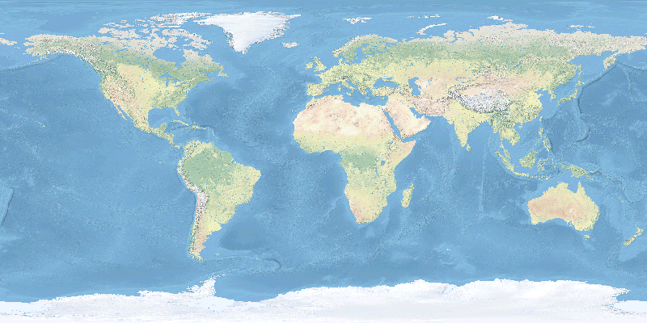
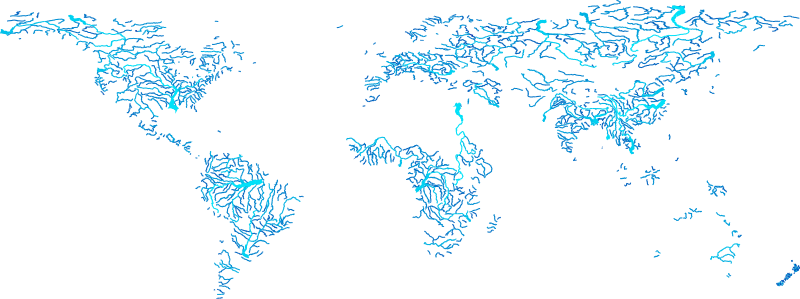

This is a very short introduction to installing GRASS distributed via 
[Conda](https://grass.osgeo.org/download/conda/).
With the Conda distribution of GRASS, 
you can install GRASS
and the rest of the Python stack for data science
with a single command. 
This means that you can easily integrate GRASS
into data science workflows 
using the Python scientific ecosystem. 
This brief tutorial covers:

* Installing the Conda package and environment manager
* Creating a GRASS environment with Conda
* Running GRASS in a Jupyter notebook

## Manager

Conda is an open source package and environment manager.
Many open source projects
use Conda to publish their software.
With Conda, you can easily install
collections of these packages
in isolated environments
to avoid conflicting software dependencies. 
With Conda, packages are distributed via channels,
remote repositories that host packages.
GRASS is distributed via conda-forge, 
a community smithy and repository
[@condaforge].
There are several different distributions of Conda.
For this tutorial, 
install [Miniforge](https://conda-forge.org/download/), 
a minimal distribution of Conda
that uses conda-forge as its default channel
[@Miniforge]. 
We recommend Miniforge 
because it is the easiest, cleanest way to 
install the GRASS Conda Package.
Other distributions may be incompatible with conda-forge, 
requiring proper 
[configuration](https://conda-forge.org/docs/user/transitioning_from_defaults/)
to work.

::: {.callout-note title="Unix"}
On Unix-like platforms - 
including  Linux, 
 MacOS, 
and 
Windows Subsystem for Linux -  
download the installation shell script
and then run it in a terminal: 
```{bash}
bash Miniforge3-$(uname)-$(uname -m).sh
```
:::

::: {.callout-note title="Windows"}
For  Windows, 
download and run the binary installer. 
See [here](https://github.com/conda-forge/miniforge#install)
for more detailed instructions.
:::

## Environment

Now that Conda is installed, 
let's use it to create an environment for GRASS.
In this environment, 
we will install the following Python packages 
complete with their dependencies: 
GRASS, Jupyter Lab, and requests.
In a terminal, 
run 
to create an environment named `grass`.
Then use  
to install the GRASS package.
Next, run 
to start the environment. 

```{bash}
conda create --name grass
conda activate grass
conda install grass jupyterlab requests
```

You can do this with just one line of code:
```{bash}
conda create -n grass grass jupyterlab requests && conda activate grass
```

If you use a Conda distribution other than Miniforge,
you will need to specify the conda-forge channel
when creating the environment with
`-c conda-forge`.
You may also need to override your default channel settings
with `--override-channels` to prevent conflicts.

## Notebook

Let's try the newly installed GRASS Conda package 
in a Jupyter notebook.
We will use scripting to display maps
from a sample dataset. 
We will download the dataset,
start a GRASS session,
and then display raster and vector maps
from the dataset. 
Let's begin by launching Jupyter Lab from the terminal.
This will open a new Jupyter notebook
in a web browser window.

```{bash}
jupyter lab
```

### Start GRASS

To start a GRASS session, 
we need to define a project 
and its coordinate reference system. 
For this demonstration, 
we will use the Natural Earth Dataset for GRASS [@NaturalEarth].
This dataset is a GRASS project
with a collection of global raster and vector data
in the World Geodetic System 1984. 
In your Jupyter notebook,
use Python to download and unarchive the dataset.
Then start a GRASS session using the dataset as a project. 
Read more about  in GRASS here. 
Since the dataset is approximately 120MB,
it may take a couple of minutes to download.
As a test that GRASS started correctly,
run  with flag `g` 
to print the current projection.

```{python}
# Import libraries
import os
import sys
import subprocess
from pathlib import Path
import requests
from zipfile import ZipFile

# Find GRASS Python packages
sys.path.append(
  subprocess.check_output(
    ["grass", "--config", "python_path"],
    text=True
    ).strip()
  )

# Import GRASS packages
import grass.jupyter as gj
from grass.tools import Tools

# Download dataset
url = "https://zenodo.org/records/13370131/files/natural_earth_dataset.zip?download=1"
filepath = Path.cwd() / "natural_earth_dataset.zip"
request = requests.get(url, allow_redirects=True)
if request.status_code != 200:
    raise ConnectionError(f"Error downloading file: {request.status_code}")
filepath.write_bytes(request.content)

# Unarchive dataset
with ZipFile(filepath, 'r') as archive:
    archive.extractall()

# Delete archive
os.remove(filepath)

# Start GRASS in project
home = Path.cwd()
project = "natural_earth_dataset"
session = gj.init(home, project)
tools = Tools()

# Print projection information
tools.g_proj(format="shell", flags="p")
```

### Display raster map

The Natural Earth raster is a global basemap
with land cover and shaded relief
rendered with a natural color scheme. 
Display the Natural Earth raster map 
with .

```{python}
# Display natural earth raster
m = gj.Map(width=800)
m.d_rast(map="natural_earth")
m.show()
```



### Display vector map

Now display a vector map of global rivers.
First apply a thematic color gradient to the rivers
based on their stream order
with .
Then display the map with 
,
scaling the line width by stream order. 

```{python}
# Display rivers
m = gj.Map(width=800)
tools.v_colors(map="rivers", use="attr", column="scalerank", color="water")
m.d_vect(map="rivers", width_column="strokeweig", width_scale=2)
m.show()
```



## Reproducibility

Conda environments can also be created 
from an environment definition file
that specifies the environment name, channel, and packages. 
This is an easy way to share and reproduce your environment.
While you can specify versions for given packages,
this example just installs the latest compatible versions
for simplicity's sake.
To do this, first use a text editor to create 
a YAML file named `environment.yml` 
with the following contents:

```yaml
# environment.yml
name: grass
channels:
  - conda-forge
dependencies:
  - grass
  - jupyterlab
  - requests
```

Then run 
using `--file` to specify your path to the environment definition file:

```bash
conda env create --file environment.yml
```