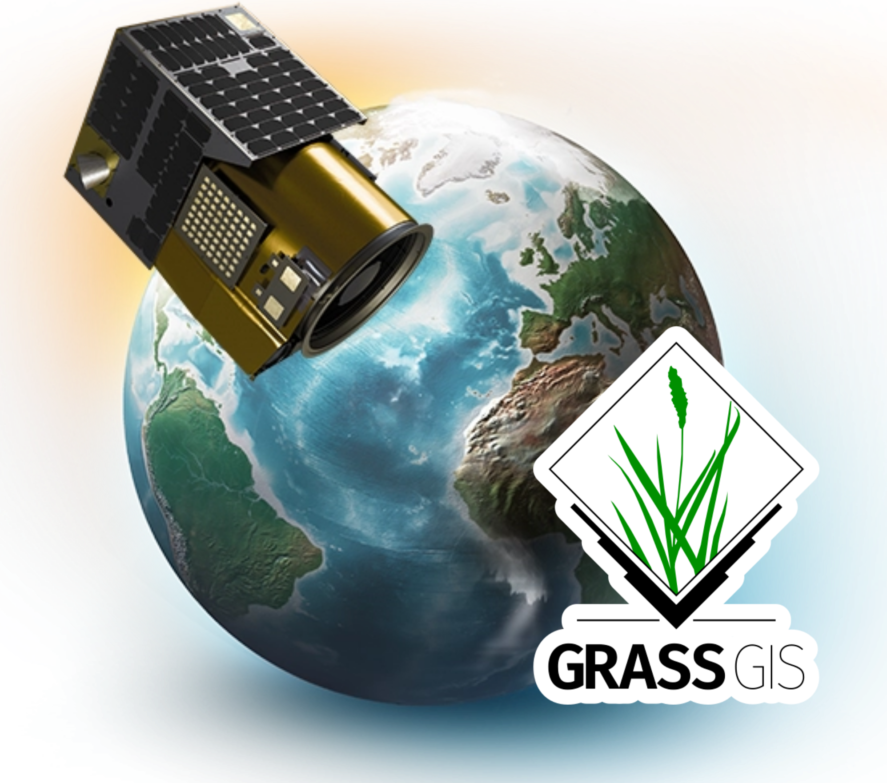

## GRASS for Earth Observation data processing with Jupyter notebooks

The workshop showcases GRASS tools for satellite imagery processing and analysis,
covering workflows from data acquisition to supervised classification and visualization. 
It is all contained in a Jupyter Notebook using GRASS Python interface and can be run
in Google Colab, so no local software installation is required.

<https://github.com/veroandreo/foss4g2024_grass4rs>

Special acknowledgements to Markus Neteler and Maris Nartiss who were part of an earlier
edition of this workshop and also prepared the Sentinel-2 dataset 🙌

{width=40% fig-align="center" .preview-image}

