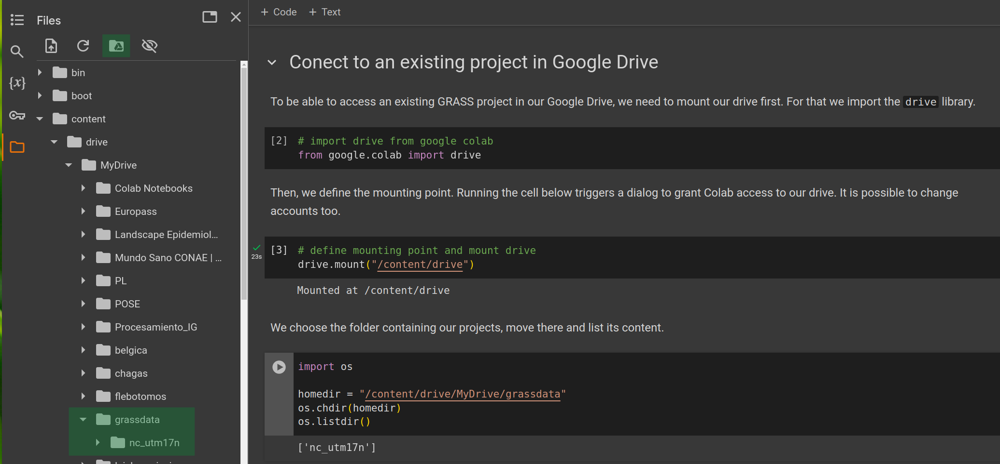

# What is Colab?

Perhaps you have heard of Google Colaboratory or simply Colab. This is a hosted
Jupyter Notebook service that requires no setup or configuration to use and
provides free access to computing resources, including GPUs and TPUs.
Colab is especially well suited to machine learning, data science, and education.
Furthermore, it allows easy sharing of workflows which facilitates reproducibility.

Colab notebooks allow you to combine executable code and rich text in a single
document, along with images, HTML, LaTeX and more. When you create your own
Colab notebooks, they are stored in your Google Drive account. You can easily
share your Colab notebooks with co-workers or friends, allowing them to comment
on your notebooks or even edit them.

::: {.callout-note}
See Colab's FAQ for more details: <https://research.google.com/colaboratory/faq.html>
and follow the Google Colab blog in Medium at <https://medium.com/google-colab>.
:::

# Why GRASS in Colab?

Since Colab offers Jupyter notebooks in a Linux environment
**it is really easy to install or even compile GRASS there**.
Also, because of the integration with Google Drive, it is a great resource to
run our workflows in the cloud and export the results or keep our GRASS
projects and code there. This clearly facilitates teaching workshops or courses
since attendants do not need to install or download anything on their own
machines.

There are a couple of things to consider when working with GRASS within
Colab though. Users will need to
*install GRASS every time they start a new working session or notebook*.
Furthermore, whatever files users download within Colab
*will last only during the current session*.
If the runtime gets disconnected because of inactivity, downloaded data and
outputs created within Colab, will be lost too.
If users instead, mount their own Google drive, download data and create their
GRASS projects there, those will be preserved even if the runtime is
disconnected or the session closed.

# Install GRASS in Colab

Start at <https://colab.research.google.com/> and create a new notebook. Let's first print system description to know where are we. The exclamation mark is used for executing commands from the underlying operating system:

```{python}
!lsb_release -a
```

At the time of writing this tutorial, Colab has Linux
[Ubuntu 22.04 LTS](https://medium.com/google-colab/colab-updated-to-ubuntu-22-04-lts-709a91555b3c).
So we add the ppa:ubuntugis repository, update and install GRASS. It might
take a couple of minutes according to the resources available.

```{python}
!add-apt-repository -y ppa:ubuntugis/ubuntugis-unstable
!apt update
!apt-get install -y grass-core grass-dev
```

Check that GRASS is installed by asking which version is there.

```{python}
!grass --version
```

To import the `grass.script` and `grass.jupyter` modules, you need to tell
Python where the GRASS Python package is:

```{python}
# Import standard Python packages we need
import sys
import subprocess

# Ask GRASS where its Python packages are to be able to run it from the notebook
sys.path.append(
    subprocess.check_output(["grass", "--config", "python_path"], text=True).strip()
)
```

```{python}
# Import the GRASS packages
import grass.script as gs
import grass.jupyter as gj
```

:::{.callout-note}
By default we have access to the `/content` folder within Colab, and any data we
create and download will be placed there. We can change that of course, it is just a Linux
file system. In any case, we should bear in mind that whatever data we download
within Colab, will disappear if the runtime gets disconnected because of inactivity
or once we close the Colab session.
:::

::: {.callout-important title="Pick one path from here on"}
Installing GRASS as shown above is needed in every new session or notebook. The
sections that follow are **alternatives, not consecutive steps**:

* **Option A** -- create a new, empty project and import your own data.
* **Option B** -- start from a ready-made sample GRASS project (recommended if you are
  learning GRASS).
* **Option C** -- either of the above, but with the project stored in your Google
  Drive so that it survives the end of the session.
:::

# Option A: Create a new GRASS project

A GRASS project is a directory that holds data in a single coordinate reference
system. See
[GRASS projects](https://grass.osgeo.org/grass-stable/manuals/grass_projects.html)
in the manual for details.

To create a new project we can use the `create_project` function from the
grass.script library.
Let's, for example, create a project with the EPSG code
 32617 (UTM zone 17N):

```{python}
gs.create_project("nc_sentinel", epsg="32617")
```

Now we can start GRASS in the created project:

```{python}
# Start GRASS in default project mapset
session = gj.init("nc_sentinel")
```

Now you can import data and start your analysis, following the
[GRASS and Python tutorial, part A](fast_track_grass_and_python.qmd#a.-use-grass-tools-within-your-python-spatial-workflows).

# Option B: Start from an existing sample GRASS project

If you want to learn data analysis with GRASS, instead of creating a new project from scratch,
you can download a ready-to-use sample GRASS project to play with.

## Download sample data

Let's get the Raleigh, North Carolina sample project into Colab to show a data
download workflow.

```{python}
!wget -c https://grass.osgeo.org/sampledata/raleigh_northcarolina_usa_epsg6542.zip -O nc.zip
```

We unzip the downloaded file in /content

```{python}
!unzip nc.zip
```

and finally check it is indeed there:

```{python}
import os

# List files and directories
os.listdir()
```

You should see the *raleigh_northcarolina_usa_epsg6542* directory, which is a GRASS project.

## Start GRASS

We have GRASS installed and a sample project to play around, so we are ready
to start GRASS within the Raleigh, North Carolina project.

::: {.callout-note}
If you already started a session in Option A, end it with `session.finish()` before
starting a new one. Calling `gj.init()` again switches the active session, so any
tool you run afterwards operates in the new project.
:::

```{python}
# Start GRASS in default project mapset
session = gj.init("raleigh_northcarolina_usa_epsg6542")
```

Just as an example, we will list the raster maps and display one of them using
the InteractiveMap class.

```{python}
gs.list_grouped(type="raster")
```

```{python}
m = gj.InteractiveMap()
m.add_raster("elevation")
m.show()
```

You can continue exploring the dataset in [GRASS and Python tutorial, part B](fast_track_grass_and_python.qmd#b.-use-python-tools-within-grass-workflows).

# Option C: Keep your project in Google Drive

Whichever of the two options above we follow, the project is created in `/content`
and is lost once the runtime gets disconnected.
If we do not want to loose our GRASS projects when closing the Colab notebook,
we can connect Colab with our Google Drive and upload, download or create our
projects there. To be able to do any of that, we need to mount our drive first
(i.e., similar to what we do with external drives).
We first import the `drive` library.

```{python}
from google.colab import drive 
```

Then, we define the mounting point. Running the cell below triggers a dialog to
grant Colab access to our drive. It is possible to change accounts, too. Once
that is complete, we will have access to everything we have in our GDrive folders
and we can browse the content either with commands or from the left panel in
the Colab notebook.

```{python}
drive.mount("/content/drive")
```

We can also mount our drive directly from the Colab interface as shown below:

{.preview-image}

Once the GDrive is mounted, we can place our project there instead of in `/content`.
To stay organized, GRASS projects are often saved under `grassdata` folder.

```{python}
# Option A, but persistent: create a new project in Google Drive
gs.create_project("/content/drive/MyDrive/grassdata/nc_sentinel", epsg="32617")
session = gj.init("/content/drive/MyDrive/grassdata/nc_sentinel")

# Option B, but persistent: unpack the sample project into Google Drive
# !unzip nc.zip -d /content/drive/MyDrive/grassdata
# session = gj.init("/content/drive/MyDrive/grassdata/raleigh_northcarolina_usa_epsg6542")
```

::: {.callout-tip}
Reading and writing in the mounted Google Drive is considerably slower than in
`/content`, so unzipping the sample project there takes noticeably longer.
:::

Importantly, we can then process and analyse our data so that our data
will remain in GDrive for the next time.

**Cool, ah?! Enjoy!** 

***

:::{.smaller}
The development of this tutorial was funded by the US
[National Science Foundation (NSF)](https://www.nsf.gov/),
award [2303651](https://www.nsf.gov/awardsearch/showAward?AWD_ID=2303651).
:::
