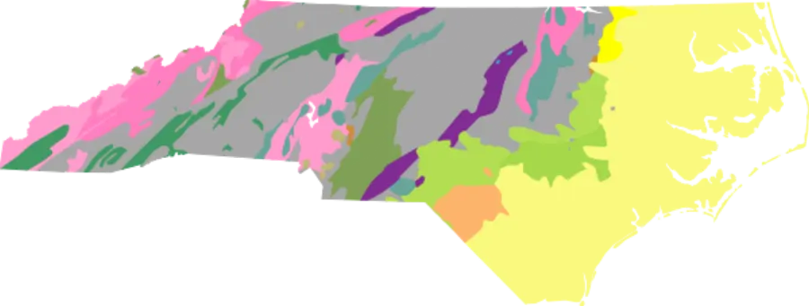
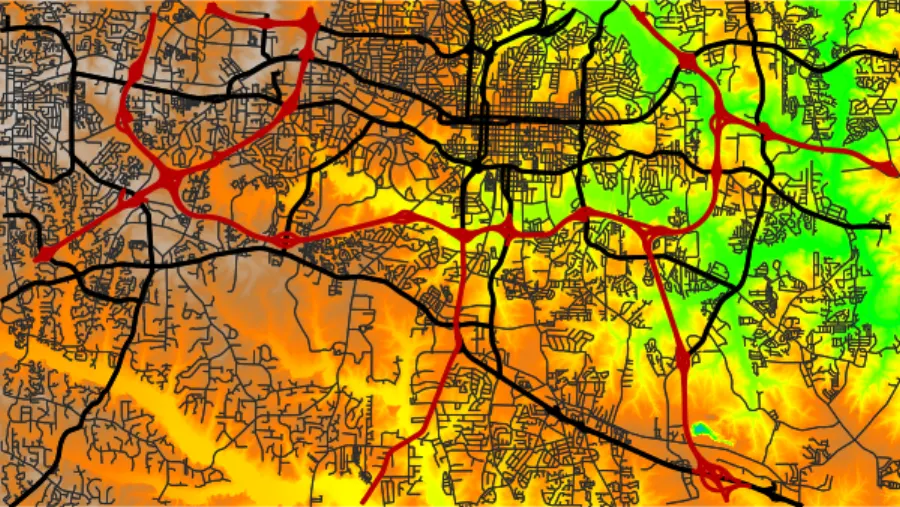
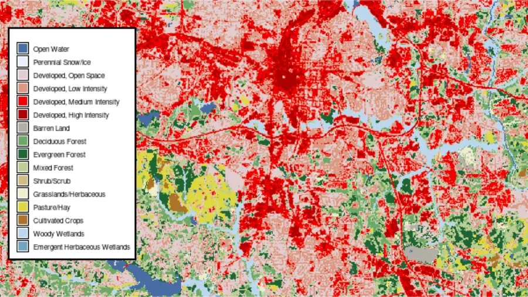
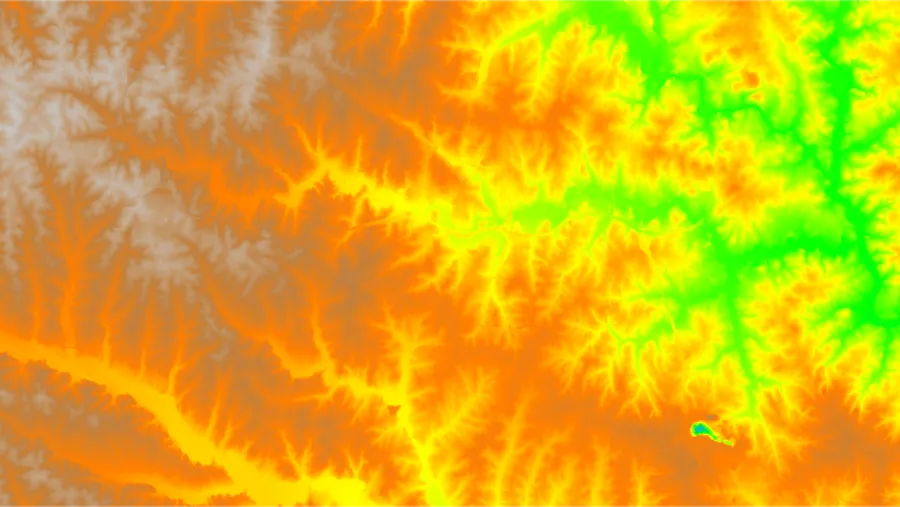
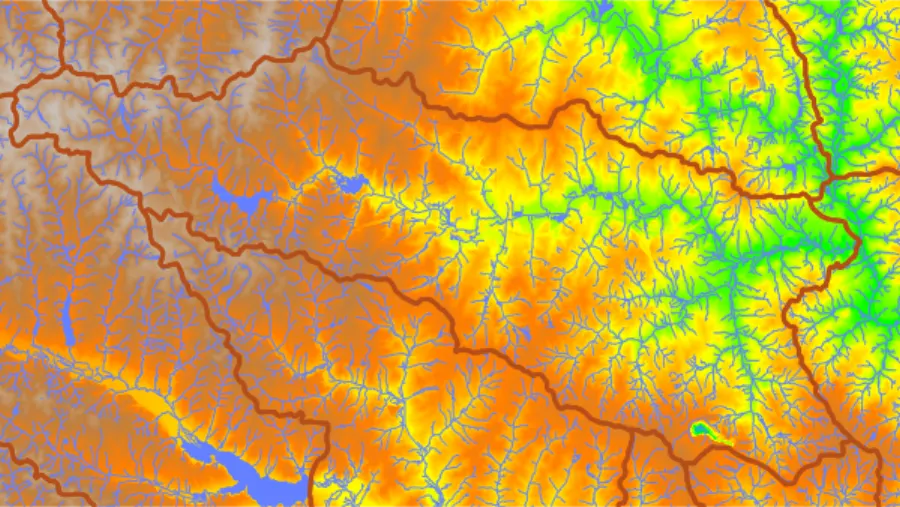
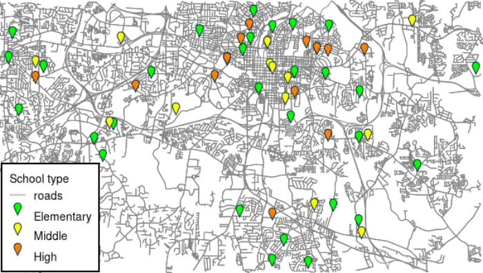
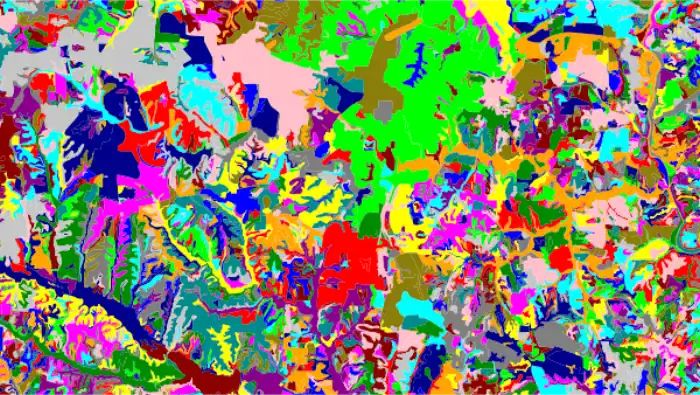
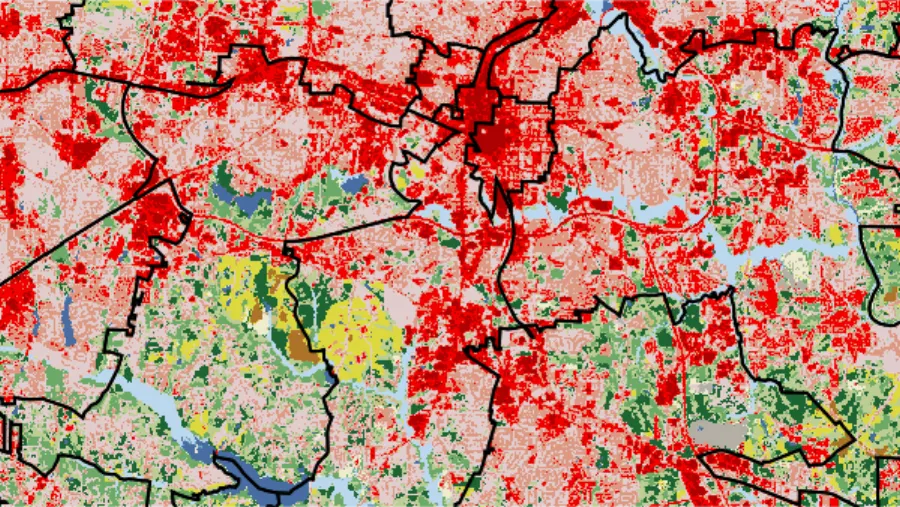
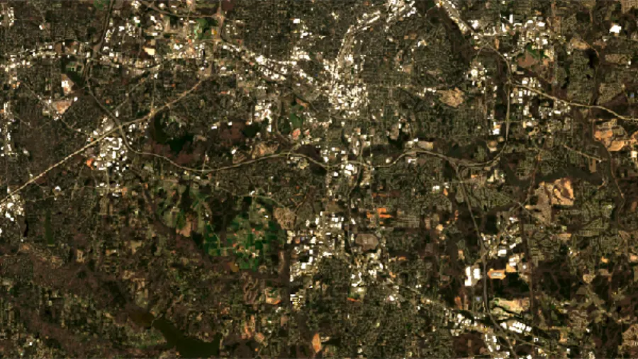

# Introduction

This tutorial is a tour of the ways data gets into a GRASS project. The example
is the recipe used to build the **new North Carolina sample dataset** for the Raleigh
area: *elevation*, *land cover*, *Landsat imagery*, *roads*, *schools*, *hospitals*, *census
geographies*, *geology*, *soils*, *watersheds*, *lakes* and *streams*.
It is a tour, not a reference: GRASS has more import tools than we can cover here.

This is also a **template** for assembling an equivalent dataset for another area.
Use this recipe with another area's sources to get the same set of layers for a different place.
Keeping the names (such as `elevation` and `roads`) will allow you to reuse tutorials
and other materials prepared for the Raleigh, North Carolina dataset with little to no modifications.
Using this as a template to create datasets with localized names (e.g. in Spanish),
but same set of layers (such as a digital elevation model layer, roads layer),
will allow almost one-to-one correspondence when creating a localized tutorial
based on an existing tutorial in English. To see all the layers,
download the [notebook](raleigh_northcarolina_usa_epsg6542.ipynb)
or the finished dataset itself, published on Zenodo as
[10.5281/zenodo.22129931](https://doi.org/10.5281/zenodo.22129931).
An existing example of a dataset for a different area which follows this template is the
[Flagstaff, Arizona sample dataset](https://grass.osgeo.org/sampledata/flagstaff_az_usa_epsg6341.zip).

::: {.callout-important title="The case study is US-specific"}
Because the dataset is for North Carolina, most of the *sources* here are United States
only: the `r.in.usgs` and `r.in.ssurgo` add-ons, and the pygris package (US Census).
Narrower still are NC OneMap and Wake County GIS, which are state and county level and
have no national equivalent even within the US.

The *methods* transfer anywhere, and so do the tools doing the actual importing:
`r.import`, `v.import`, `r.external`, `r.proj`, and `v.in.ags`.
:::

::: {.callout-note title="How to run this tutorial"}
The code uses the GRASS Python API in a Jupyter notebook, with the
[grass.tools](https://grass.osgeo.org/grass-stable/manuals/python_intro.html) API
(the `Tools` class) introduced in GRASS 8.5. On earlier versions run the same tools
with `gs.run_command("r.import", ...)`. If you are new to running GRASS from Python,
start with
[Get started with GRASS & Python](https://grass-tutorials.osgeo.org/content/tutorials/get_started/fast_track_grass_and_python.html).

Every step also works from the GUI or the command line, use the tool name
(for example `r.import`) with the same parameters.

The [notebook](raleigh_northcarolina_usa_epsg6542.ipynb)
that actually built the sample dataset, start to finish and without the
commentary, is linked in the sidebar as **Dataset notebook**.
:::

# The project and the region

Two decisions come first, and everything else follows from them.

**The project's coordinate reference system.** A GRASS project holds data in exactly
one CRS, and import tools reproject into it on the fly. For the Raleigh dataset we use
[EPSG:6542](https://spatialreference.org/ref/epsg/6542/),
NAD83(2011) / North Carolina State Plane in meters -
the projection North Carolina agencies publish in.

```{python}
import sys
import subprocess

sys.path.append(
    subprocess.check_output(["grass", "--config", "python_path"], text=True).strip()
)

import grass.script as gs
import grass.jupyter as gj
from grass.tools import Tools

epsg = "6542"
project = f"raleigh_northcarolina_usa_epsg{epsg}"
gs.create_project(project, epsg=epsg)

session = gj.init(project)
tools = Tools()
```

**The computational region.**  The region is
not just a display window: most of the tools below use it as the *download footprint*
and the *target resolution* for raster data. Set it once, and the rest of the tutorial
inherits it. Here it is a 24 x 13.5 km window over Raleigh at 10 m resolution. The
`-s` flag saves it as the project's default region, so new mapsets start from it.

```{python}
tools.g_region(n=228500, s=215000, w=629000, e=653000, res=10, flags="s")
```

These particular numbers represent just an extent over Raleigh that we
picked. Typing coordinates is only one way to set the region, and rarely the most
convenient one: `g.region` accepts a `raster=` or `vector=` map and takes its extent,
and a raster's resolution along with it.

Several data sources want that footprint in latitude and longitude instead. GRASS will
convert it for you with the `-b` flag, so we write one small helper and reuse it
throughout:

```{python}
def bbox_latlon():
    """Current computational region as a WGS84 (west, south, east, north) tuple."""
    b = tools.g_region(flags="b", format="json")
    return (b["ll_w"], b["ll_s"], b["ll_e"], b["ll_n"])
```

# Method 1: import a file

Tools [r.import](https://grass.osgeo.org/grass-stable/manuals/r.import.html)
and [v.import](https://grass.osgeo.org/grass-stable/manuals/v.import.html) read
anything GDAL/OGR can read and reproject it into the project's CRS if needed.

## Roads, via OSMnx

We downloaded OSM road network with the [OSMnx](https://osmnx.readthedocs.io/) package
and let `v.import` do its job.
OSMnx downloads and cleans OpenStreetMap street networks and
we added a bit of post-processing
to reduce OSM's multiple road classes to one:

```{python}
# !pip install osmnx
import osmnx as ox

G = ox.graph_from_bbox(bbox=bbox_latlon(), network_type="drive")
nodes, edges = ox.graph_to_gdfs(G)

# OSM allows several road classes per way; keep the most important one
rank = {
    "motorway": 0, "trunk": 1, "primary": 2, "secondary": 3,
    "tertiary": 4, "unclassified": 5, "residential": 6,
    "living_street": 7, "crossing": 8,
    "motorway_link": 0, "trunk_link": 1, "primary_link": 2,
    "secondary_link": 3, "tertiary_link": 4,
}
edges["highway"] = edges["highway"].apply(
    lambda v: min(v, key=lambda t: rank.get(t, 99)) if isinstance(v, list) else v
)

edges.to_file("roads.gpkg")
```

```{python}
tools.v_import(input="roads.gpkg", output="roads", snap=1e-8)
```

Two things worth noting. OSMnx returns data in WGS84; `v.import` reprojects it to
EPSG:6542. And `snap=1e-8` handles the vertex-level slivers that
appear when line work is reprojected. GRASS builds a real topological vector, so
endpoints that should coincide need to actually coincide.

Import brings along whatever attributes the source had, including ones you might not
want. [v.db.dropcolumn](https://grass.osgeo.org/grass-stable/manuals/v.db.dropcolumn.html)
cleans it up:

```{python}
tools.v_db_dropcolumn(map="roads", columns=["u", "v", "key"])
```

It is worth checking the result;
[v.info](https://grass.osgeo.org/grass-stable/manuals/v.info.html) reports the geometry, and
[v.db.select](https://grass.osgeo.org/grass-stable/manuals/v.db.select.html) returns the
attribute table as JSON, which pandas reads directly:

```{python}
import pandas as pd

tools.v_info(map="roads")
pd.DataFrame(tools.v_db_select(map="roads", format="json")["records"])
```

Those attributes are useful for display as well: `d.vect` takes a `where=` clause, so
the same map can be drawn once per road class, with the more important classes wider
and darker:

```{python}
road_map = gj.Map()
road_map.d_vect(map="roads", color="#272A2C", width=1)
road_map.d_vect(map="roads", where="highway IN ('secondary', 'secondary_link')",
                color="black", width=2)
road_map.d_vect(map="roads", where="highway IN ('primary', 'primary_link')",
                color="black", width=3)
road_map.d_vect(map="roads", where="highway IN ('trunk', 'motorway', 'trunk_link', 'motorway_link')",
                color="#b70003", width=3)
road_map.show()
```



# Method 2: link, then reproject

The 2024 Annual NLCD land cover product is distributed as a single conterminous-US raster at 30 m,
while our study area is 24 km across. We could point `r.import` at it, but reprojecting
a national raster to read one small portion out of it is more work than the job needs.

A better approach is a **second project in the data's own CRS**, where the file is
*linked* rather than copied with
[r.external](https://grass.osgeo.org/grass-stable/manuals/r.external.html), and then
[r.proj](https://grass.osgeo.org/grass-stable/manuals/r.proj.html) pulls only the
region we care about.

```{python}
import os
import urllib.request
import zipfile
from pathlib import Path

url = "https://www.mrlc.gov/downloads/sciweb1/shared/mrlc/data-bundles/Annual_NLCD_LndCov_2024_CU_C1V1.zip"
nlcd_zip, headers = urllib.request.urlretrieve(url)
with zipfile.ZipFile(nlcd_zip, "r") as zip_ref:
    zip_ref.extractall()
os.remove(nlcd_zip)
nlcd_filename = Path(url).with_suffix(".tif").name
```

`gs.create_project` can take the file itself instead of an EPSG code and read the CRS
from it:

```{python}
gs.create_project("nlcd", filename=nlcd_filename)

with gs.setup.init("nlcd", env=os.environ.copy()) as nlcd_session:
    # r.external registers the file as a GRASS raster without copying any pixels
    Tools(session=nlcd_session).r_external(input=nlcd_filename, output="nlcd")
```

Back in the Raleigh project, `r.proj` reads across from the other project. Because it
respects the computational region, only cells inside it are ever reprojected.
The `r.proj` tool `method` parameter defaults to nearest-neighbor,
which is exactly right for categorical land cover.
For other data, such as elevation, bilinear or bicubic interpolation method would be appropriate.
The `resolution` parameter is worth setting too: left out, the output would take the
region's 10 m, resampling a 30 m product to a cell size it does not have, so we pin it
to the native 30 m.


```{python}
tools.r_proj(project="nlcd", mapset="PERMANENT", input="nlcd",
             output="landuse", resolution=30)
```

::: {.callout-tip title="r.external vs r.import"}
`r.external` links; `r.import` copies. Linking is fast and costs no disk space, but
the raster is only as available as the file behind it; move or delete the file and the
map breaks. It is ideal for large rasters you
read occasionally and only in smaller parts.
Use `r.import` (or `r.in.gdal`) when the data should belong to the
project permanently.
:::



The class labels and colors in that figure are not automatic, we add them in
[the last section](#finishing-the-job-metadata-and-styling).

# Method 3: add-ons that fetch data for you

For several major data providers, contributors already created GRASS tools. These
typically live in the [add-on repository](https://grass.osgeo.org/grass-stable/manuals/addons/)
from where they can be installed:

```{python}
tools.g_extension(extension="r.in.usgs")
```

The nice property they typically share: when the extent of the source dataset is large,
they take the computational region as the area of
interest, so there is no bounding box to type.

## Elevation from the USGS National Map

[r.in.usgs](https://grass.osgeo.org/grass-stable/manuals/addons/r.in.usgs.html)
downloads, mosaics, reprojects and clips 3DEP elevation in one step. `ned13sec` selects
the 1/3 arc-second product, roughly 10 m. Run it
with `-i` first to see which tiles it would fetch and how large they are:

```{python}
tools.r_in_usgs(product="ned", ned_dataset="ned13sec", output_name="elevation",
                flags="i", verbose=True)
```

```{python}
tools.r_in_usgs(product="ned", ned_dataset="ned13sec", output_name="elevation")
```



## ArcGIS REST services

Some government data is published as ArcGIS MapServer and
FeatureServer endpoints.
[v.in.ags](https://grass.osgeo.org/grass-stable/manuals/addons/v.in.ags.html) queries
them directly, and `extent="region"` sends the region as a spatial filter so the server
returns only what you need:

```{python}
tools.g_extension(extension="v.in.ags")

# Public schools, from NC OneMap
tools.v_in_ags(
    url="https://services.nconemap.gov/secure/rest/services/NC1Map_Education/MapServer/3",
    output="schools", extent="region")

# Hospitals, from NC OneMap
tools.v_in_ags(
    url="https://services.nconemap.gov/secure/rest/services/NC1Map_Health/MapServer/0",
    output="hospitals", extent="region")

# HUC12 subwatersheds, from the USGS Watershed Boundary Dataset
tools.v_in_ags(
    url="https://hydro.nationalmap.gov/arcgis/rest/services/wbd/MapServer/6/",
    output="watersheds", extent="region", snap=1e-8)

# Streams and lakes, from Wake County GIS
tools.v_in_ags(
    url="https://services1.arcgis.com/a7CWfuGP5ZnLYE7I/arcgis/rest/services/Hydrolines/FeatureServer/0/",
    output="streams", extent="region")
tools.v_in_ags(
    url="https://services1.arcgis.com/a7CWfuGP5ZnLYE7I/arcgis/rest/services/WaterBodies/FeatureServer/0",
    output="lakes_all", extent="region", snap=1e-8)
```

Finding the right URL is the only fiddly part: browse the agency's REST services
directory in a web browser, drill down to the layer you want, and copy the URL of the
numbered layer (the trailing `/3`, `/0`) rather than the service.

The water bodies layer mixes lakes with canals and swamps,
so we could go back and filter with v.in.ags options directly or alternatively, filter with
[v.extract](https://grass.osgeo.org/grass-stable/manuals/v.extract.html):

```{python}
tools.v_extract(input="lakes_all",
                where="HYDRO_TYPE IN ('LAKE/POND', 'RESERVOIR')",
                output="lakes")
tools.g_remove(name="lakes_all", flags="f", type="vector")
```

```{python}
m = gj.Map()
m.d_rast(map="elevation")
m.d_vect(map="lakes", fill_color="aqua", color="none")
m.d_vect(map="streams", color="aqua")
m.d_vect(map="watersheds", fill_color="none", color="brown", width=3)
m.show()
```



```{python}
school_map = gj.Map()
school_map.d_vect(map="roads", color="gray")
school_map.d_vect(map="schools", where="elem = 'yes'", size=15, icon="basic/pin",
                  fill_color="green", legend_label="Elementary")
school_map.d_vect(map="schools", where="middle = 'yes'", size=15, icon="basic/pin",
                  fill_color="yellow", legend_label="Middle")
school_map.d_vect(map="schools", where="high = 'yes'", size=15, icon="basic/pin",
                  fill_color="orange", legend_label="High")
school_map.d_legend_vect(title="School type", flags="b", at=[2, 40])
school_map.show()
```



## Soils from SSURGO

[r.in.ssurgo](https://grass.osgeo.org/grass-stable/manuals/addons/r.in.ssurgo.html)
queries the USDA soil survey for the current region:

```{python}
tools.g_extension(extension="r.in.ssurgo")
tools.r_in_ssurgo(soils="soils_")
```

SSURGO comes as survey-area polygons that spill well beyond our region extent. To trim them
to the region exactly, [v.clip](https://grass.osgeo.org/grass-stable/manuals/v.clip.html)
with the `-r` flag clips against the current region, and the soil attributes come
across unchanged:

```{python}
tools.v_clip(input="soils_", output="soils", flags="r")
tools.g_remove(name="soils_", flags="f", type="vector")
```



# Method 4: Python packages and plain APIs

Here we use convenient Python packages to download the data we need:

## A package for census geographies

[pygris](https://walker-data.com/pygris/) downloads US Census TIGER/Line files and can
subset them by bounding box while downloading, so we hand it `bbox_latlon()`:

```{python}
# !pip install pygris
import pygris

# Census blocks for Wake County (state 37, county 183)
blocks = pygris.blocks(state="37", county="183", year=2025, subset_by=bbox_latlon())
blocks.to_file("census_blocks.gpkg", driver="GPKG")
tools.v_import(input="census_blocks.gpkg", output="census_blocks")

# ZIP Code Tabulation Areas - by state only for 2000 and 2010
zctas = pygris.zctas(state="37", year=2010, subset_by=bbox_latlon())
zctas.to_file("zipcodes.gpkg", driver="GPKG")
tools.v_import(input="zipcodes.gpkg", output="zipcodes")

# Raleigh's municipal boundary - filtered by attribute rather than extent
raleigh = pygris.places(state="37", year=2025).query("NAME == 'Raleigh'")
raleigh.to_file("raleigh.gpkg", driver="GPKG")
tools.v_import(input="raleigh.gpkg", output="municipal_boundary")
```

Note the `year` on each call. Most TIGER/Line layers are published yearly, but
the pygris package supports downloading the ZIP Code
Tabulation Areas only for 2000 and 2010, due to the way zipcodes are distributed.



## A STAC catalog: Landsat from Microsoft Planetary Computer

Satellite imagery is increasingly published through
[STAC](https://stacspec.org/) catalogs, which you query by area, time and metadata.
Here we ask the Planetary Computer for Landsat 8 Collection 2 Level-2 scenes over our
region in spring 2025 with less than 10% cloud cover, and take the clearest:

```{python}
# !pip install pystac_client planetary_computer
from pystac_client import Client

catalog = Client.open("https://planetarycomputer.microsoft.com/api/stac/v1")
search = catalog.search(
    collections=["landsat-c2-l2"],
    bbox=bbox_latlon(),
    datetime="2025-03-01/2025-07-01",
    query={"eo:cloud_cover": {"lt": 10},
           "platform": {"eq": "landsat-8"}},
)
items = search.item_collection()
selected_item = min(items, key=lambda item: item.properties["eo:cloud_cover"])
```

The assets are cloud-optimized GeoTIFFs. Planetary Computer needs the URLs signed
before download:

```{python}
import requests
import planetary_computer

keys = ("coastal", "blue", "green", "red", "nir08", "swir16", "swir22")
for k in keys:
    url = planetary_computer.sign(selected_item).assets[k].href
    r = requests.get(url, stream=True)
    r.raise_for_status()
    with open(f"{k}.tif", "wb") as f:
        for chunk in r.iter_content(chunk_size=8192):
            f.write(chunk)
```

Now the import.
Left to its defaults, `r.import` brings in the whole file and estimates the cell size
from the reprojected source. Here that means the entire Landsat scene, far larger than
our study area, at some value near 30 m. We want neither: `extent="region"` clips each
band to the computational region, and `resolution="value"` with `resolution_value=30`
pins the cell size to a round 30 m.

While we are here we attach the metadata that makes imagery usable later: a
[semantic label](https://grass.osgeo.org/grass-stable/manuals/r.semantic.label.html)
identifying which sensor band each raster is, and the acquisition timestamp:

```{python}
from datetime import datetime

def grass_timestamp(iso_string):
    """Convert an ISO timestamp to the format r.timestamp expects."""
    dt = datetime.fromisoformat(iso_string.replace("Z", "+00:00"))
    return dt.strftime("%d %b %Y %H:%M:%S %z").strip()

timestamp = grass_timestamp(selected_item.properties["datetime"])

for band, k in enumerate(keys, start=1):
    name = f"landsat8_2025_B{band}"
    tools.r_import(input=f"{k}.tif", output=name, extent="region",
                   resolution="value", resolution_value=30)
    tools.r_semantic_label(map=name, semantic_label=f"L8_{band}")
    tools.r_support(map=name, title=selected_item.assets[k].description)
    tools.r_timestamp(map=name, date=timestamp)
```

```{python}
tools.i_colors_enhance(blue="landsat8_2025_B2", green="landsat8_2025_B3",
                       red="landsat8_2025_B4", strength=98, flags="p")
landsat_map = gj.Map()
landsat_map.d_rgb(red="landsat8_2025_B4", green="landsat8_2025_B3",
                  blue="landsat8_2025_B2")
landsat_map.show()
```



## A bare REST API: geology from Macrostrat

When there is no package at all, `requests` plus
[GeoPandas](https://geopandas.org/) still gets you to a file. The
[Macrostrat](https://macrostrat.org/) API takes a WKT shape and returns GeoJSON:

```{python}
import geopandas as gpd
import requests
from shapely.geometry import box

nc = pygris.states(year=2020).query("STATEFP == '37'")

response = requests.get(
    "https://macrostrat.org/api/v2/carto/small",
    params={"shape": box(*nc.total_bounds).wkt, "format": "geojson"},
)
response.raise_for_status()
features = response.json()["success"]["data"]["features"]

gdf = gpd.GeoDataFrame.from_features(features, crs="EPSG:4326")
gdf.to_file("geology.gpkg", driver="GPKG")
```

The API answers for a rectangle, so the result overhangs the state. We trim it to the
state boundary with the same `v.clip` used for the soils, this time with an explicit
`clip` map rather than the region, and color it from the RGB column the service
provides:

```{python}
nc.to_file("nc.gpkg", driver="GPKG")
tools.v_import(input="nc.gpkg", output="nc")
tools.v_import(input="geology.gpkg", output="geology_")

tools.v_clip(input="geology_", output="geology", clip="nc")
tools.g_remove(name="nc,geology_", flags="f", type="vector")

tools.v_colors(map="geology", rgb_column="color", flags="c")
```


# Finishing the job: metadata and styling

To make the dataset more useful, we need to add metadata and styling.

**Describe the map.**
[r.support](https://grass.osgeo.org/grass-stable/manuals/r.support.html) and
[v.support](https://grass.osgeo.org/grass-stable/manuals/v.support.html) write into the
metadata that `r.info` and `v.info` report:

```{python}
tools.r_support(map="elevation", title="USGS 3DEP elevation (1/3 arc second)",
                source1="USGS")
tools.v_support(map="schools", map_name="Public schools",
                organization="NC OneMap", person="NC OneMap")
tools.v_support(map="roads", map_name="OSM roads",
                comment="OSM roads downloaded using the OSMnx Python package",
                map_date=grass_timestamp(datetime.today().isoformat()))
```

**Label the categories.** A land cover raster of bare numbers means nothing to a reader.
[r.category](https://grass.osgeo.org/grass-stable/manuals/r.category.html) attaches
labels, and rules can be read straight from a string with `StringIO` instead of a
temporary file:

```{python}
import io

categories = """
0:Unclassified
11:Open Water
12:Perennial Snow/Ice
21:Developed, Open Space
22:Developed, Low Intensity
23:Developed, Medium Intensity
24:Developed, High Intensity
31:Barren Land
41:Deciduous Forest
42:Evergreen Forest
43:Mixed Forest
52:Shrub/Scrub
71:Grasslands/Herbaceous
81:Pasture/Hay
82:Cultivated Crops
90:Woody Wetlands
95:Emergent Herbaceous Wetlands
"""
tools.r_category(map="landuse", rules=io.StringIO(categories), separator=":")
tools.r_support(map="landuse", title="USGS National Land Cover Data 2024", source1="USGS")
```

**Give it colors.** GRASS ships color tables for common datasets, including NLCD:

```{python}
tools.r_colors(map="landuse", color="nlcd")

nlcd_map = gj.Map()
nlcd_map.d_rast(map="landuse")
nlcd_map.d_legend(raster="landuse", flags="ncb")
nlcd_map.show()
```

Check the result with
[r.info](https://grass.osgeo.org/grass-stable/manuals/r.info.html) - the raster
counterpart of the `v.info` we ran on the roads - and read back any vector's attribute
table with `v.db.select`:

```{python}
tools.r_info(map="landuse")
pd.DataFrame(tools.v_db_select(map="schools", format="json")["records"])
```

Finally, a dataset meant to be shared usually keeps its imported layers in PERMANENT
and gives users a mapset of their own to work in:

```{python}
gs.create_mapset(name="mapset_1")
```

::: {.callout-note title="Version note"}
`gs.create_mapset` ships with GRASS 8.6. On earlier versions, create the mapset with
[g.mapset](https://grass.osgeo.org/grass-stable/manuals/g.mapset.html) and its `-c`
flag instead.
:::

# Sources

Every layer here comes from someone else's work, published under its own terms.
The [published dataset](https://doi.org/10.5281/zenodo.22129931) ships a LICENSE file
with the per-layer terms.

| Layer | Source | Terms and documentation |
|---|---|---|
| `elevation` | [USGS 3DEP](https://www.usgs.gov/3d-elevation-program), via The National Map | US federal public domain |
| `landuse` | [Annual NLCD 2024, USGS/MRLC](https://www.mrlc.gov/) | [ScienceBase catalog record](https://www.sciencebase.gov/catalog/item/655ceb8ad34ee4b6e05cc51a) |
| `landsat8_2025_B*` | [Landsat Collection 2 Level-2, USGS](https://www.usgs.gov/landsat-missions) | [Restrictions on use or redistribution of Landsat data](https://www.usgs.gov/faqs/are-there-any-restrictions-use-or-redistribution-landsat-data) |
| `roads` | [OpenStreetMap](https://www.openstreetmap.org/) contributors | [OSM copyright and licence](https://www.openstreetmap.org/copyright), [OSMF Collective Database Guideline](https://osmfoundation.org/wiki/Licence/Community_Guidelines/Collective_Database_Guideline_Guideline) |
| `schools`, `hospitals` | [NC OneMap](https://www.nconemap.gov/), NC Center for Geographic Information and Analysis | [GICC NC OneMap disclaimer](https://it.nc.gov/documents/gicc/gicc-nconemap-disclaimer-20220511pdf/open) |
| `census_blocks`, `municipal_boundary` | [TIGER/Line 2025, US Census Bureau](https://www.census.gov/geographies/mapping-files/time-series/geo/tiger-line-file.html) | [TIGER/Line 2025 technical documentation](https://www2.census.gov/geo/pdfs/maps-data/data/tiger/tgrshp2025/TGRSHP2025_TechDoc_Ch1.pdf) |
| `zipcodes` | [TIGER/Line 2010, US Census Bureau](https://www.census.gov/geographies/mapping-files/time-series/geo/tiger-line-file.html) | [TIGER/Line 2010 technical documentation](https://www2.census.gov/geo/pdfs/maps-data/data/tiger/tgrshp2010/TGRSHP10SF1CH1.pdf) |
| `geology` | [Macrostrat](https://macrostrat.org/) | [macrostrat.org](https://macrostrat.org/) |
| `soils` | [SSURGO, USDA NRCS](https://www.nrcs.usda.gov/resources/data-and-reports/soil-survey-geographic-database-ssurgo) | [SSURGO on data.gov](https://catalog.data.gov/dataset/soil-survey-geographic-database-ssurgo) |
| `watersheds` | [USGS Watershed Boundary Dataset](https://www.usgs.gov/national-hydrography/watershed-boundary-dataset) | US federal public domain |
| `lakes`, `streams` | [Wake County GIS](https://www.wakegov.com/departments-government/geographic-information-services-gis) | [Wake County GIS terms of use](http://maps.wakegov.com/agso/OpenData/TermsOfUse.html) |

***

:::{.smaller}
The development of this tutorial was funded by the US
[National Science Foundation (NSF)](https://www.nsf.gov/),
award [2303651](https://www.nsf.gov/awardsearch/showAward?AWD_ID=2303651).
:::
