GRASS cuenta con herramientas sofisticadas para modelar el movimiento a través del terreno, incluyendo [r.cost](https://grass.osgeo.org/grass-stable/manuals/r.cost.html), [r.walk](https://grass.osgeo.org/grass-stable/manuals/r.walk.html), [r.drain](https://grass.osgeo.org/grass-stable/manuals/r.drain.html) y [r.path](https://grass.osgeo.org/grass-stable/manuals/r.path.html). En este tutorial, utilizaremos ***r.walk*** y ***r.path*** para determinar la mejor ruta a pie para llegar a un destino, como un hospital.

::: {.callout-note title="Dataset"}
Este tutorial utiliza uno de los conjuntos de datos de muestra estándar de GRASS: [flagstaff_arizona_usa](https://grass.osgeo.org/sampledata/flagstaff_az_usa_epsg6341.zip).
Nos referiremos a los nombres de los lugares en ese conjunto de datos, pero se puede completar con cualquiera de los [conjuntos de datos de muestra estándar](https://grass.osgeo.org/download/data/) para cualquier región; por ejemplo, el [conjunto de datos de Carolina del Norte](https://grass.osgeo.org/sampledata/raleigh_northcarolina_usa_epsg6542.zip). Utilizaremos el modelo digital de *elevación* (elevation)(MDE) de Flagstaff, el archivo de puntos vectoriales de los *hospitales* (hospitals) (cualquier otro archivo de puntos vectoriales servirá) y el mapa ráster de *uso del suelo* (landuse).

Este tutorial está diseñado para que puedas completarlo utilizando la **interfaz gráfica de usuario de GRASS**, comandos de GRASS desde la **consola o terminal**, o utilizando comandos de GRASS en un entorno de **Jupyter Notebook**.
:::

::: {.callout-note title="Don't know how to get started?"}
Si no está seguro de cómo empezar a usar GRASS con su interfaz gráfica de usuario o con Python, consulte los tutoriales [Get started with GRASS GIS GUI](../get_started/fast_track.qmd) y [Get started with GRASS & Python in Jupyter Notebooks](../get_started/fast_track_grass_and_python.qmd)..
:::

## ¿Qué es una superficie de costos?

::::: grid
::: g-col-6

-   Una **superficie de costes** (cost surface) es una cuadrícula en la que cada celda representa el “coste” o la dificultad de desplazarse por el terreno.

-   Una **superficie de costo acumulado** (accumulated cost surface) muestra el costo total acumulado de desplazarse desde un punto de partida hasta una ubicación. Las superficies de costo acumulado también se utilizan para encontrar la **ruta de menor costo** (lowest cost route) entre una ubicación y el punto de partida.

-   La herramienta GRASS [r.walk](https://grass.osgeo.org/grass-stable/manuals/r.walk.html) genera una superficie de costo acumulativo utilizando la regla de Naismith para tiempos de caminata donde cada celda tiene el valor en **segundos** (seconds) del tiempo que se tarda en caminar desde el punto de inicio hasta esa celda.
:::

::: g-col-6
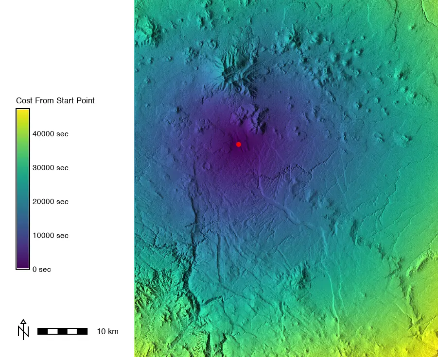{fig-align="right" width="100%"}
:::
:::::

# Modelado del movimiento con una superficie de costo acumulativo

## Descripción general

::::: grid
::: g-col-6

1.  Comience con un **modelo digital de elevación** (digital elevation model) para determinar los costos de movimiento.

2. Cree un **mapa de fricción** (friction map) con un valor de 0 (u otros valores para costos de movimiento adicionales).

3. Seleccione el/los **punto(s) de inicio** (starting point(s)).

4. Cree una **superficie de costos** (cost surface).

5. A continuación, se puede calcular la ruta de **menor costo** (least cost) entre cualquier punto de la superficie de costos y el punto de inicio.
:::

::: g-col-6
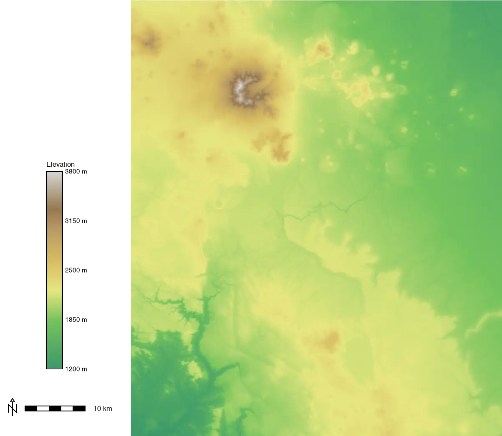
:::
:::::

## Mapa de fricción

-   La calculadora de mapas de GRASS (https://grass.osgeo.org/grass-stable/manuals/r.mapcalc.html) permite crear, modificar o combinar mapas mediante álgebra cartográfica. Puede utilizarse desde la interfaz gráfica o como comando.

- Antes de crear un mapa de fricción, asegúrese de que la región de cálculo coincida con el mapa de elevación.

- Cree el mapa *friction0* con un valor de 0 en cada celda.

:::::: {.panel-tabset group="language"}

#### GUI

::::: grid
::: g-col-6

1.  Agregue el ráster de *elevación* (elevation) al Administrador de capas.

2. Haga clic derecho en *elevación* (elevation) en el Administrador de capas.

3. Seleccione **Establecer región de cálculo a partir del mapa seleccionado** (Set calculation region based on the selected map).

4. Abra la **Calculadora de mapas ráster** (Raster map calculator) desde la barra de herramientas superior (icono de "ábaco").

5. Ingrese el nombre del mapa de salida como *fricción0* e introduzca 0 en el campo de expresión.

6. Pulse Ejecutar.
:::

::: g-col-6
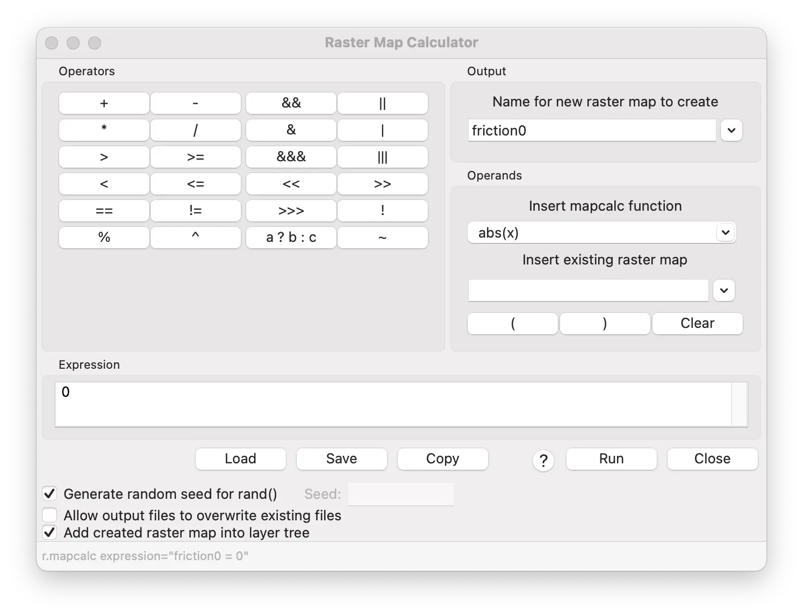
:::
:::::

#### Command line

1. Configure la región para que coincida con el mapa de elevación.

2. Cree un mapa de fricción con un valor de 0 en todas las celdas, que coincida con la extensión y la resolución del mapa de elevación.

```{python}
g.region raster=elevation
r.mapcalc "friction0 = 0"
```

#### Python

1. Configure la región para que coincida con el mapa de elevación.

2. Cree un mapa de fricción con un valor de 0 en todas las celdas, que coincida con la extensión y la resolución del mapa de elevación.

```{python}
gs.run_command("g.region", raster="elevation")
gs.mapcalc("friction0 = 0")
```
::::::

## Elige un punto de partida

-   Ahora que tenemos un mapa DEM del terreno y un mapa de fricción, para crear una superficie de costos acumulativos solo necesitamos un punto de partida: el punto desde el cual calcular los costos de movimiento.

- Un punto de partida puede ser un vector, una celda ráster o incluso un par de coordenadas.

- Una superficie de costos en *r.walk* puede tener varios puntos de partida.

- Tomaremos como punto de partida el Centro Médico de Flagstaff, que se encuentra en el archivo de vectores *hospitales* (hospitals).

:::::: {.panel-tabset group="language"}

#### GUI

::::: grid
::: g-col-6
Utilice el **Administrador de tablas de atributos** (Attribute table manager) para *hospitales* (hospitals):

1.  Visualiza el mapa de hospitales añadiéndolo al Administrador de capas desde el Catálogo de datos.

2. Haz clic derecho y abre el Administrador de tablas de atributos.

3. Selecciona el registro "Flagstaff Medical Center".

4. Haz clic derecho y selecciona **Extraer entidades seleccionadas** (Extract selected entities) en el menú contextual.

5. Nombra el nuevo mapa como *FMC*.
:::

::: g-col-6
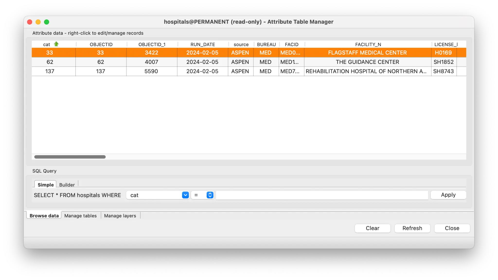

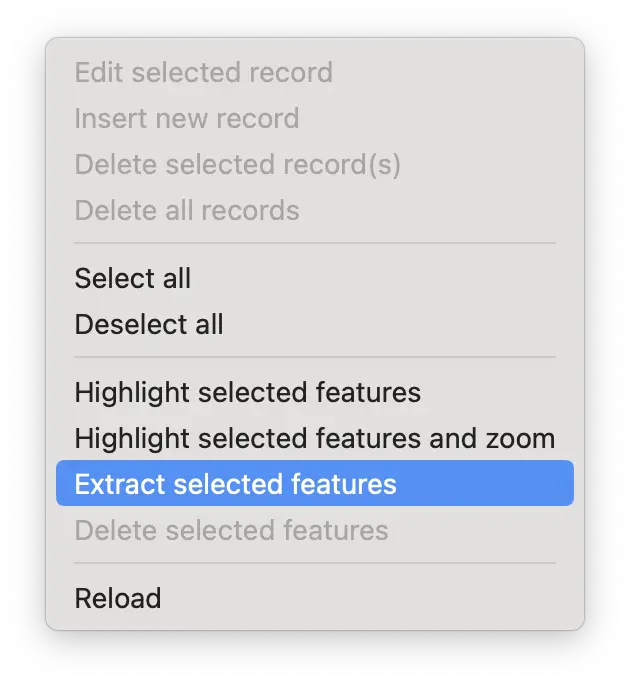{width="60%"}
:::
:::::

#### Command line

Utilice la herramienta v.extract para crear un mapa de puntos vectoriales llamado *FMC* a partir del mapa *hospitales* (hospitals).

```{python}
v.extract input=hospitals type=point where="FACILITY_N = 'FLAGSTAFF MEDICAL CENTER'" output=FMC
```

#### Python

Utilice la herramienta v.extract para crear un mapa de puntos vectoriales llamado *FMC* a partir del mapa *hospitales* (hospitals).

```{python}
gs.run_command("v.extract", input="hospitals", type="point", where="FACILITY_N = 'FLAGSTAFF MEDICAL CENTER'", output="FMC")
```
::::::

-   Utilice la herramienta *d.vect* haciendo doble clic en FMC en el administrador de capas para mostrar el punto con un color y un tamaño para verlo mejor.

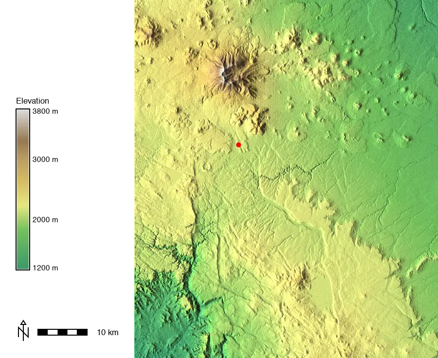

## Generar la superficie de costo acumulado {#generate-cumulative-cost-surface}

::::::::::::: {.panel-tabset group="language"}

#### GUI

-   Utilice la herramienta *r.walk* del menú **Análisis ráster/terreno** (Raster/terrain analysis).

::::: grid
::: g-col-6

1.  Introduzca el **mapa de elevación** (elevation map) ( *elevación* (elevation)), el **mapa de fricción** (friction map) (*friction0*) y el **nombre de la superficie de coste** (name of the cost surface) que se va a crear (FMC_cost_seconds).

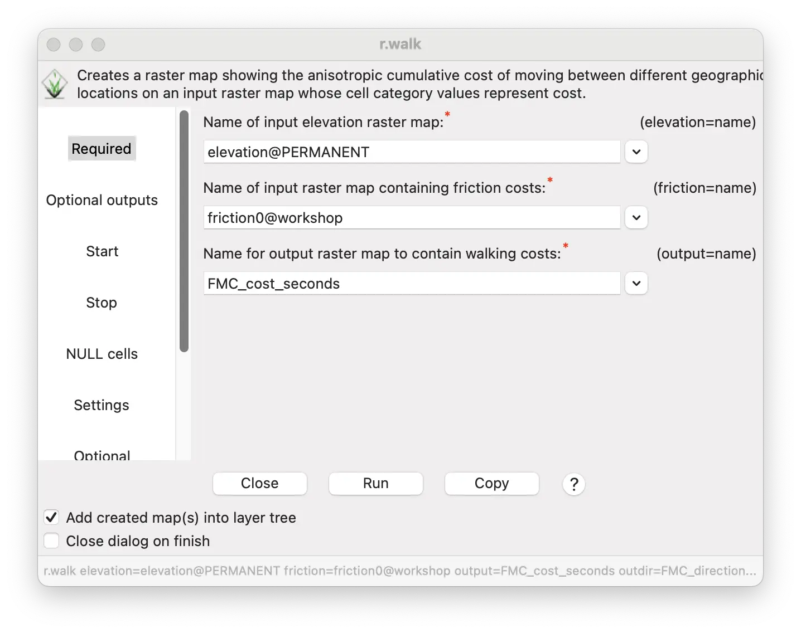{fig-align="left" width="100%"}
:::

::: g-col-6
2.  Introduzca el nombre de un **mapa de direcciones** (direction map) ( *FMC_directions* ) que se utilizará para crear una ruta de menor coste.

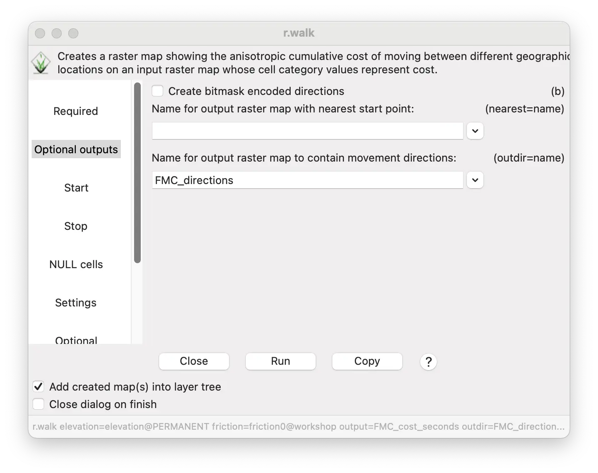{fig-align="left" width="100%"}
:::
:::::

::::: grid
::: g-col-6
3.  Introduzca el **punto de inicio** (starting point) ( *FMC* ).

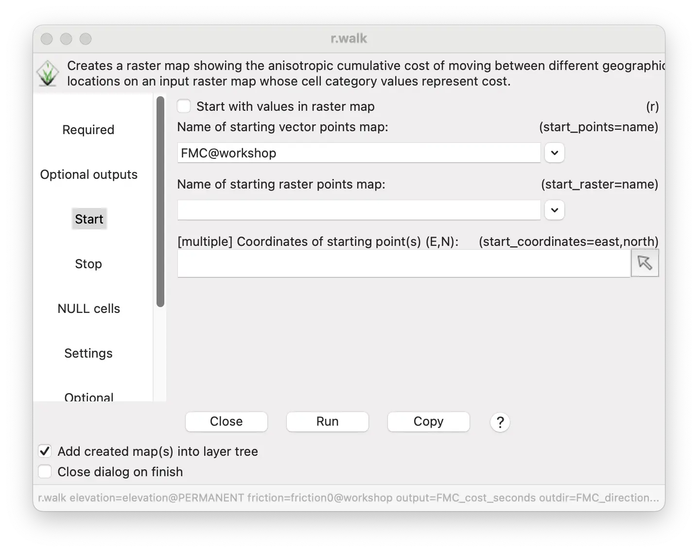{fig-align="left" width="100%"}
:::

::: g-col-6
4.  Opcional: controlar la **extensión espacial** (spatial extent)  de la superficie de costos.

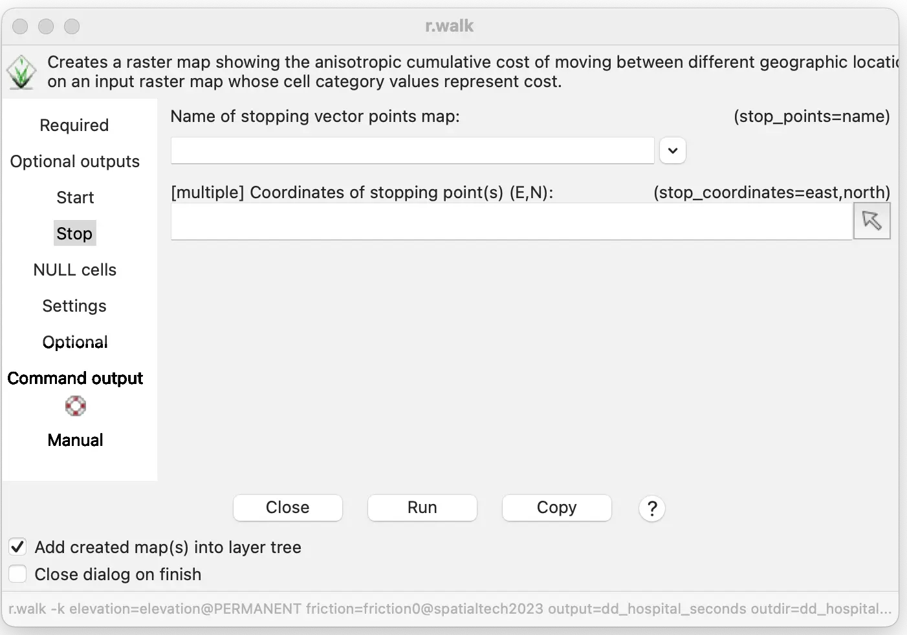
:::
:::::

::::: grid
::: g-col-6
5.  Opcional: ajuste la configuración de **Parámetro de movimiento** (Movement parameter).

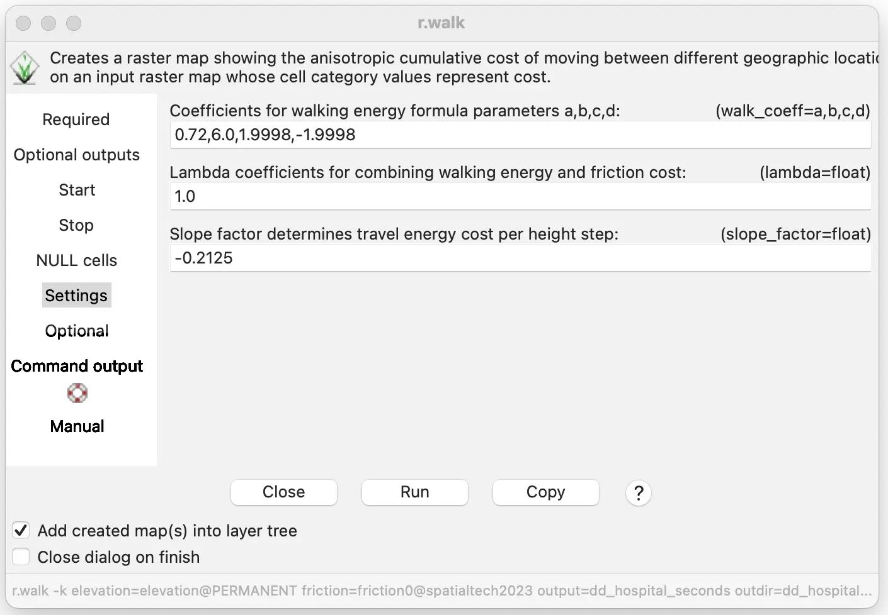{fig-align="left" width="100%"}
:::

::: g-col-6
6.  Recomendado: seleccione **movimiento de caballero** (knight's move) para calcular el costo y la dirección.

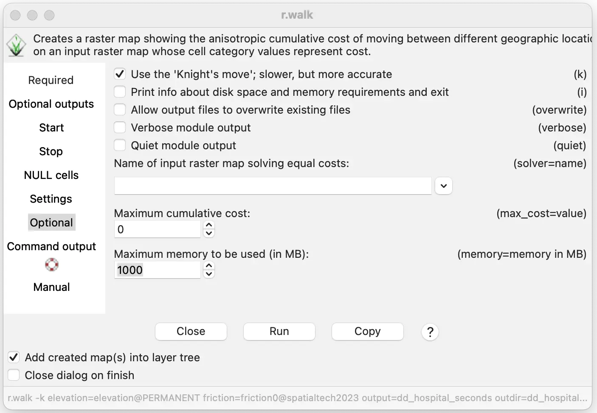{fig-align="left" width="100%"}
:::
:::::

::: {.callout-note title="Tip"}
Haz clic en el botón "Copiar" para copiar el comando GRASS. Puedes guardarlo en un archivo de texto para usarlo posteriormente o para documentar tu trabajo.
:::

#### Command line

-   Utilice el comando r.walk para generar la superficie de costo acumulado.

```{python}
r.walk elevation=elevation friction=friction0 output=FMC_cost_seconds outdir=FMC_directions start_points=FMC -k
```

#### Python

-   Utilice el comando r.walk para generar la superficie de costo acumulado.

```{python}
gs.run_command("r.walk",
               elevation="elevation",
               friction="friction0",
               output="FMC_cost_seconds",
               outdir="FMC_directions",
               start_points="FMC",
               flags="k")
```
:::::::::::::

## Mapa de superficie de costos acumulados

-   Cada valor de celda ráster en la superficie de costos representa el tiempo en segundos que se tarda en caminar desde FMC hasta esa celda sobre el terreno del modelo digital de elevación (DEM) de Flagstaff.


::: {.callout-note title="Tip"}
Consejo: Puede mostrar la superficie de costo acumulado sobre un mapa de relieve sombreado en el **administrador de capas** utilizando la herramienta [d.shade](https://grass.osgeo.org/grass-stable/manuals/d.shade.html) y un mapa de relieve de *elevación* (elevation) creado con [r.relief](https://grass.osgeo.org/grass-stable/manuals/d.shade.html).
:::

## Movimiento a través de una superficie de costo acumulativo {#movement-across-cost-surface}

-   Puedes convertir el tiempo de caminata de segundos a horas dividiendo el mapa por 3600 usando la calculadora de mapas.

:::::: {.panel-tabset group="language"}

#### GUI

::::: grid
::: g-col-6

1.  Abre la calculadora de mapas.

2. Introduce el nombre del nuevo mapa de tiempo de caminata en horas: *FMC_cost_hours*.

3. Introduce FMC_cost_seconds / 3600 en el campo de expresiones.

4. Pulsa Ejecutar.
:::

::: g-col-6
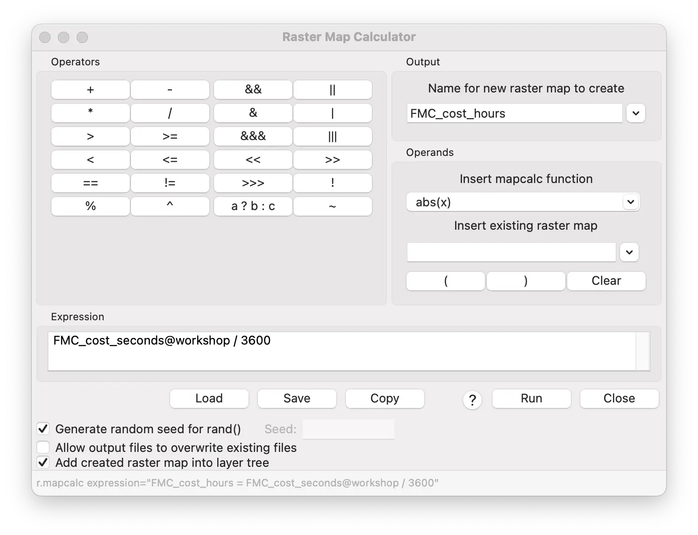{fig-align="left" width="100%"}
:::
:::::

#### Command line

```{python}
r.mapcalc "FMC_cost_hours = FMC_cost_seconds / 3600"
```

#### Python

```{python}
gs.mapcalc("FMC_cost_hours = FMC_cost_seconds / 3600")
```
::::::

------------------------------------------------------------------------

::::: grid
::: g-col-6

-   Podemos consultar o filtrar esta superficie de coste acumulado por hora para mostrar áreas con un tiempo de caminata equivalente.

- Por ejemplo, en el **administrador de capas** podemos usar la herramienta *d.rast* para mostrar el área dentro de un radio de 2 horas de caminata desde FMC y luego ajustar la opacidad de la superficie de coste al 50 % para ver el terreno subyacente.
:::

::: g-col-6
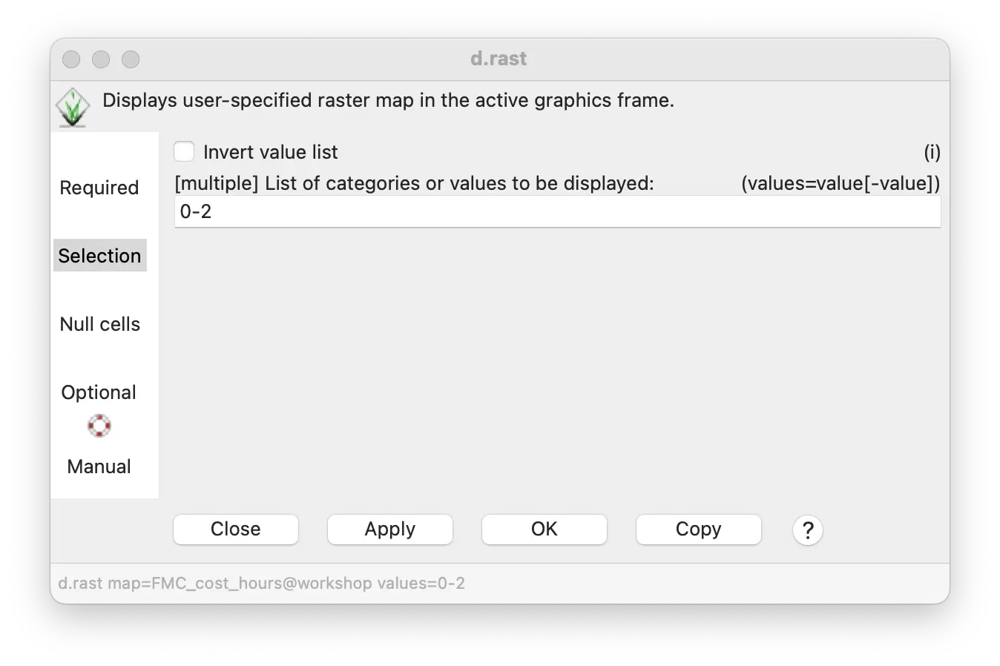
:::
:::::

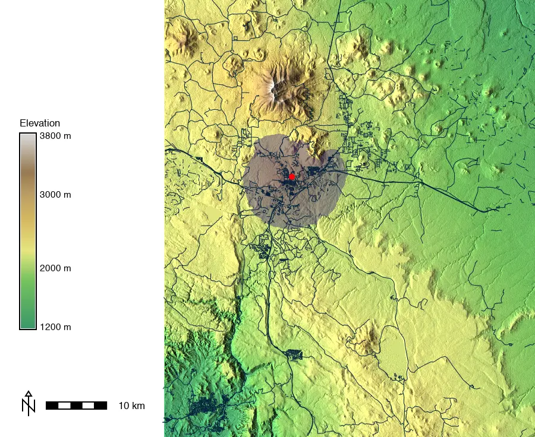

# Rutas de menor coste {#least-cost-path}

## Descripción general

-   También podemos trazar una **ruta de menor costo** (least cost path) (LCP), que es la ruta menos costosa (de menor tiempo) entre cualquier punto de la superficie de costo acumulado y FMC.

- Imaginemos a un excursionista varado al noreste de Flagstaff que tiene que caminar hasta FMC.

- ¿Qué ruta le tomaría menos tiempo?

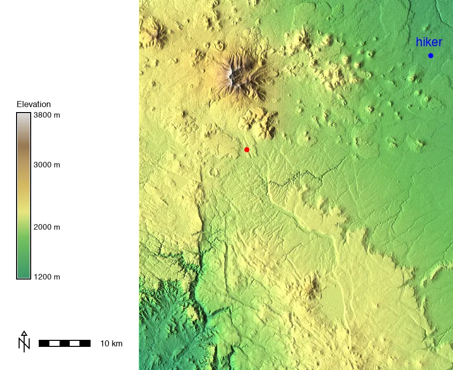

## Generar la ruta de menor coste

Para crear un LCP en GRASS, utilizaremos [r.path](https://grass.osgeo.org/grass-stable/manuals/r.path.html) (también en el menú de análisis de ráster/terreno).

:::::::: {.panel-tabset group="language"}

#### GUI

::::: grid
::: g-col-6

1.  Introduzca el **mapa de direcciones** (direction map) (*FMC_directions*) que también creamos cuando generamos la superficie de costos acumulados.\
    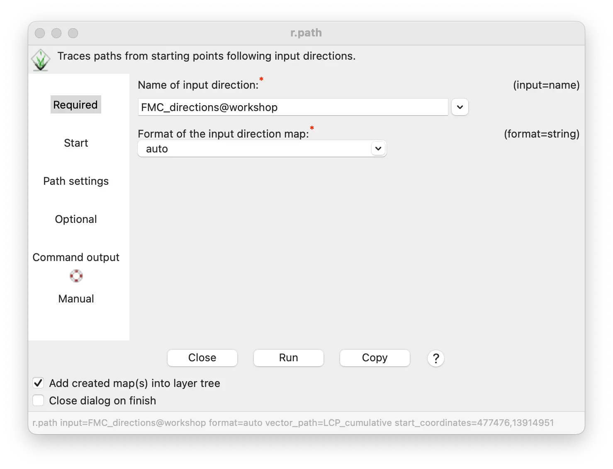
:::

::: g-col-6
2.  Introduce las **coordenadas del excursionista** (477476,3914951) como punto de partida para el LCP. (También podríamos usar un punto vectorial predefinido).

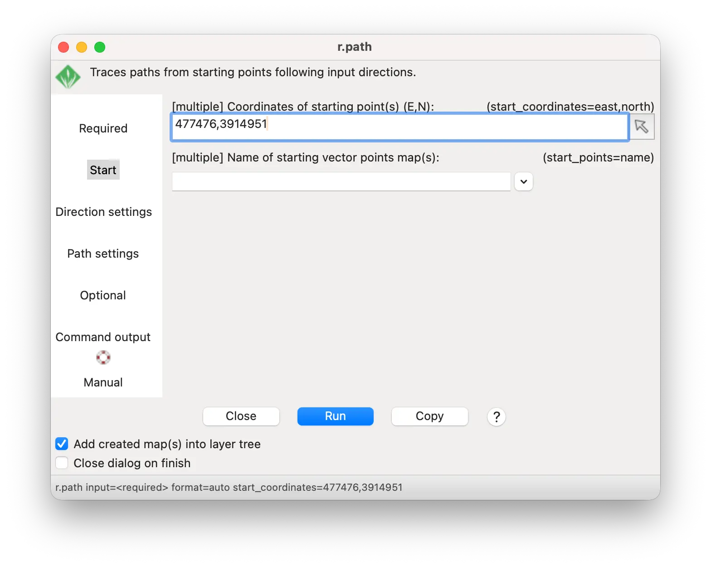
:::
:::::

:::: grid
::: g-col-6
3.  Especifique el **nombre del mapa de ruta del vector de salida** (output vector route map name) (*LCP_cumulative*).

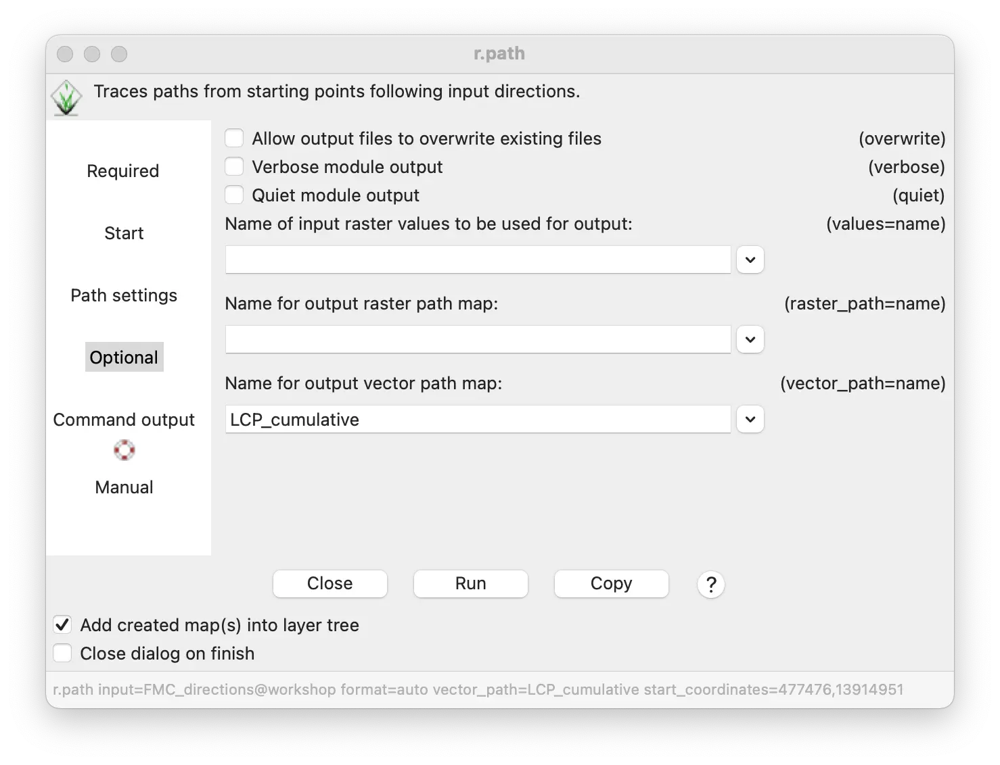
:::
::::

#### Command line

```{python}
r.path input=FMC_directions format=auto vector_path=LCP_cumulative start_coordinates=477476,3914951
```

#### Python

```{python}
gs.run_command("r.path",
               input="FMC_directions",
               format="auto",
               vector_path="LCP_cumulative",
               start_coordinates=[477476, 3914951])
```
::::::::

## Ruta de menor coste generada

-   Aquí está el resultado de LCP.

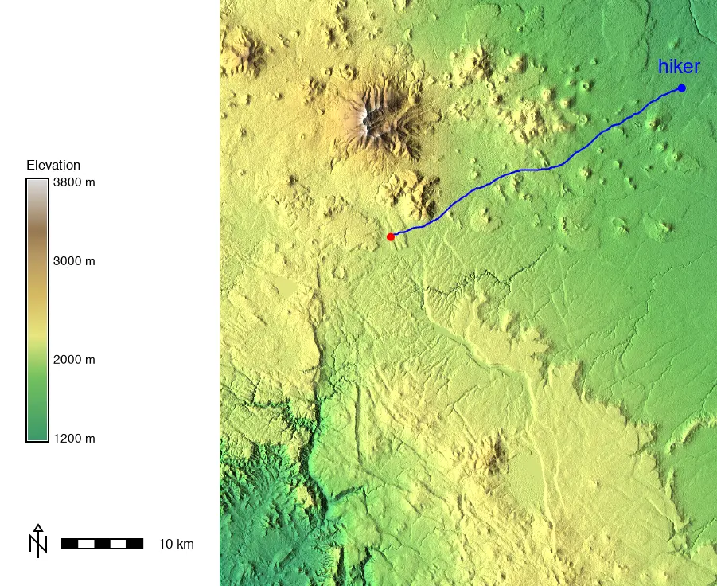

# Agregar un mapa de fricción a los costos de movimiento

## Descripción general

-   Un **mapa de fricción** (friction map) puede utilizarse para incorporar otros factores además del terreno al crear una superficie de costo acumulativo y modelar el movimiento.

- El valor de cada celda en un ráster de mapa de fricción representa el tiempo de caminata, en segundos/metro, *además del* tiempo necesario debido al terreno.

- Podemos **reclasificar** (reclassify) el mapa de *uso del suelo* (landuse) para crear un mapa de fricción que muestre el tiempo adicional que se tardaría en caminar a través de diferentes tipos de cobertura del suelo.

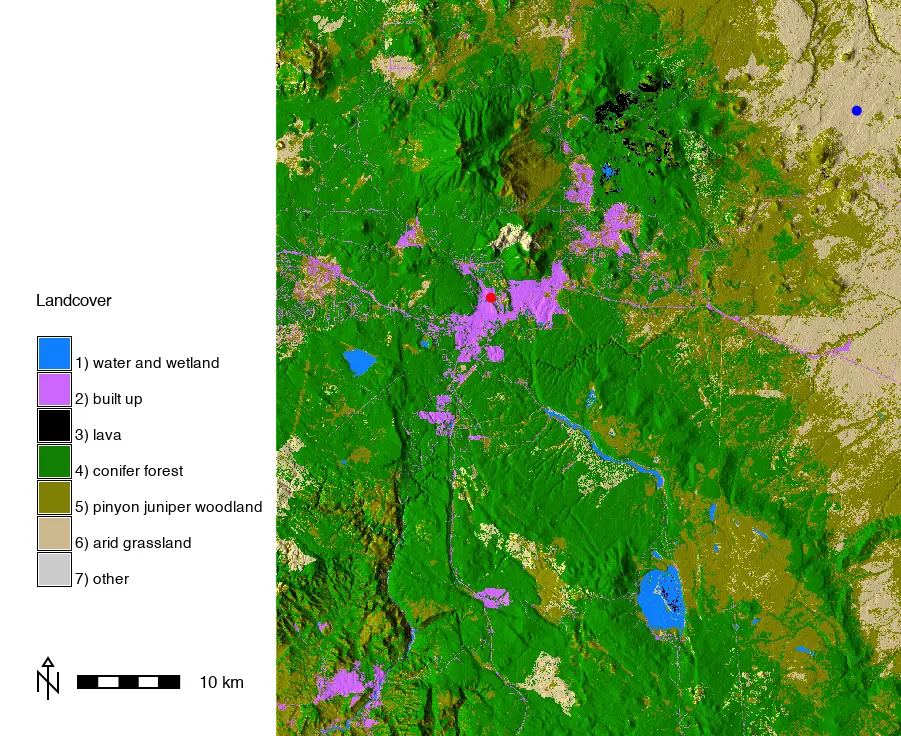

## Reclasificación del *uso del suelo* (landuse) para crear un mapa de fricción

Una velocidad de marcha estándar en terreno llano es de aproximadamente 5 km/h = 0,72 s/m.

Podríamos estimar que se necesitaría un tiempo adicional:

- 3 s/m para caminar por un denso bosque de piñones y enebros

- 1 s/m para cruzar un bosque de coníferas

- 2 s/m para recorrer la zona urbana de Flagstaff

- 5 s/m para trepar por campos de lava

- 10 s/m para intentar cruzar un cuerpo de agua

Podemos crear este mapa de fricción reclasificando el mapa de *uso del suelo* (landuse) usando [*r.reclass*](https://grass.osgeo.org/grass-stable/manuals/r.reclass.html) para asignar nuevos valores de fricción a las categorías de cobertura del suelo existentes.  

:::::: {.panel-tabset group="language"}

## GUI

La herramienta [r.reclass](https://grass.osgeo.org/grass-stable/manuals/r.reclass.html) se encuentra en el menú de la categoría Raster/Change….

::::: grid
::: g-col-6

1.  Introduzca *uso del suelo* (landuse) para el ráster que se va a reclasificar.

2. Introduzca *friction_reclassified* para el mapa reclasificado resultante.

3. Introduzca las reglas de reclasificación directamente en el cuadro de texto o desde un archivo de texto guardado. Utilice el símbolo * para representar todo lo que no esté cubierto por las reglas de reclasificación específicas.

  > 11 90 95 = 10 water  
  > 21 thru 24 = 2 urban  
  > 31 = 5 lava  
  > 41 thru 43 = 1 conifer forest  
  > 52 = 3 pinyon juniper woodland  
  > \* = 0 no friction  
  
:::

::: g-col-6

-   Esto crea un nuevo mapa de fricción llamado *friction_landcover*.

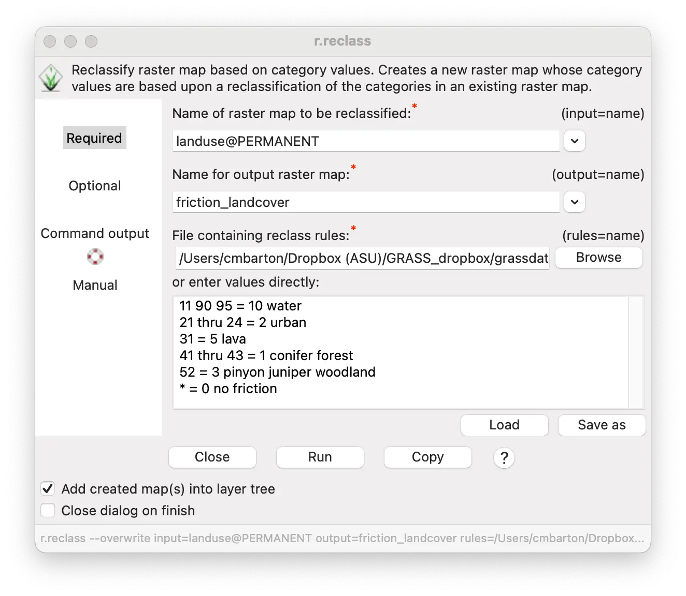
:::
:::::

## Command line

```{python}
r.reclass input=landuse output=friction_landcover rules=- << EOF
11 90 95 = 10 water
21 thru 24 = 2 urban
31 = 5 lava
41 thru 43 = 1 conifer forest
52 = 3 pinyon juniper woodland
* = 0 no friction
EOF
```

## Python

```{python}
rules = """\
11 90 95 = 10 water
21 thru 24 = 2 urban
31 = 5 lava
41 thru 43 = 1 conifer forest
52 = 3 pinyon juniper woodland
* = 0 no friction
"""
gs.write_command("r.reclass",
                 input="landuse",
                 output="friction_landcover",
                 rules="-",
                 stdin=rules)
```
::::::

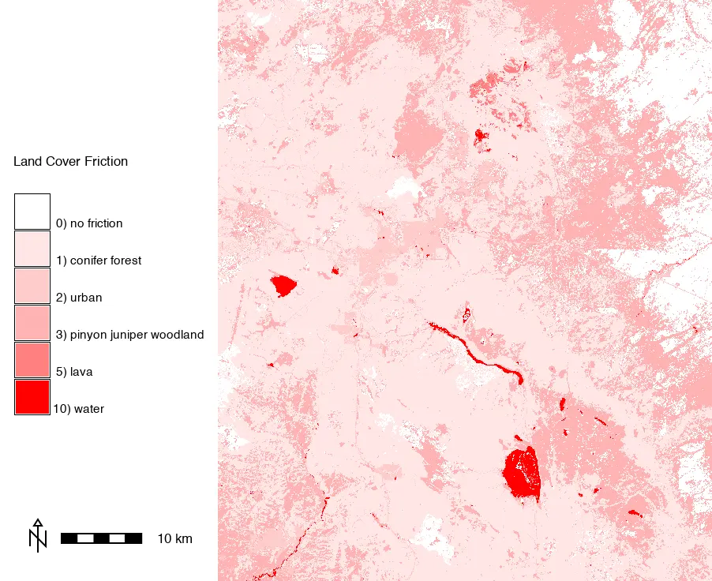

## Modificación de una superficie de coste acumulativo con un mapa de fricción

Ahora podemos crear una nueva superficie de costo acumulado utilizando este nuevo mapa de fricción y convertirla de segundos a horas, como lo hicimos anteriormente.:

::: {.panel-tabset group="language"}

#### GUI

1. Siga los procedimientos de la sección [Generar la superficie de costo acumulado](#generate-cumulative-cost-surface) y sustituya el mapa *friction_landcover* utilizado anteriormente por el nuevo mapa *friction0*.

2. Convierta la superficie de costo acumulado a horas en lugar de segundos siguiendo los procedimientos de la sección [Movimiento a través de una superficie de costo acumulado]({#movement-across-cost-surface}).

#### Command line

```{python}
r.walk elevation=elevation friction=friction_landcover output=FMC_vegcost_seconds outdir=FMC_vegcost_directions start_points=FMC -k
r.mapcalc "FMC_vegcost_hours = FMC_vegcost_seconds / 3600"
```

#### Python

```{python}
gs.run_command("r.walk",
               elevation="elevation",
               friction="friction_landcover",
               output="FMC_vegcost_seconds",
               outdir="FMC_vegcost_directions",
               start_points="FMC",
               flags="k")
gs.mapcalc("FMC_vegcost_hours = FMC_vegcost_seconds / 3600")
```
:::

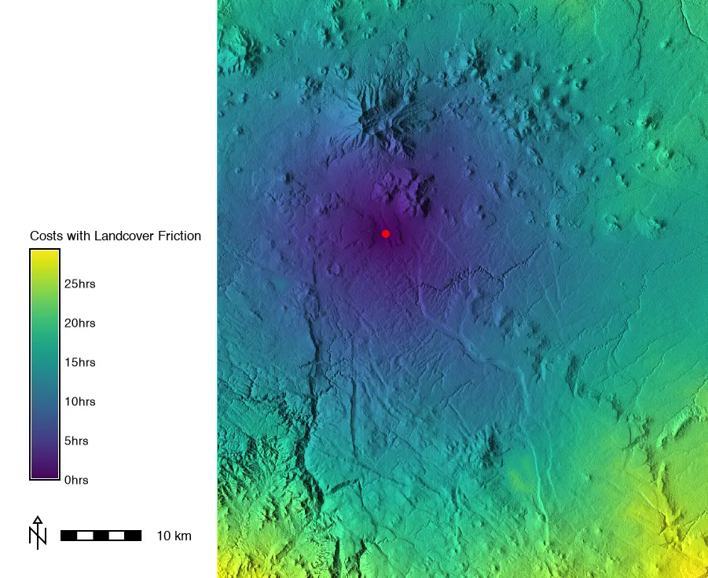

## Rutas de menor coste y fricción

-   Podemos crear un nuevo LCP desde el excursionista varado hasta FMC en un terreno donde la cobertura del suelo también afecta el costo del movimiento.

::: {.panel-tabset group="language"}

#### GUI

1. Siga los procedimientos descritos en la sección [Ruta de menor coste](#least-cost-path), sustituyendo el nuevo mapa de direcciones generado junto con la superficie de coste acumulado por el mapa de fricción de la cobertura del suelo.

2. Asigne a esta nueva ruta de menor coste el nombre *LCP_vegcost* para distinguirla de la anterior.

#### Command line

```{python}
r.path input=FMC_vegcost_directions format=auto vector_path=LCP_vegcost start_coordinates=477476,3914951
```

#### Python

```{python}
gs.run_command("r.path",
               input="FMC_vegcost_directions",
               format="auto",
               vector_path="LCP_vegcost",
               start_coordinates=[477476, 3914951])
```
:::

-   Se tarda más en llegar a FMC si el excursionista tiene que atravesar vegetación densa y terreno accidentado.

- En el mapa inferior, donde el terreno está coloreado según la cobertura vegetal, la ruta LCP original, que solo muestra el terreno, se representa con la línea azul. La ruta LCP, que incluye un mapa de fricción de la cobertura vegetal, se representa con la línea amarilla más gruesa.

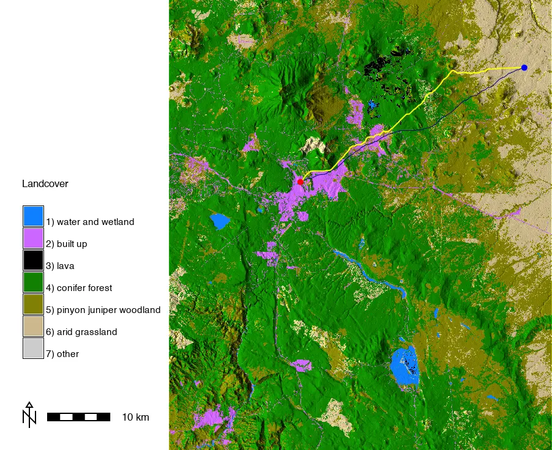

---

:::{.smaller}
*© Michael Barton, Anna Petrasova, y Eunice Villaseñor Iribe*
*El desarrollo de este tutorial fue financiado en parte por la Fundación Nacional de Ciencias de EE. UU. [NSF](https://www.nsf.gov/), premio [2303651](https://www.nsf.gov/awardsearch/showAward?AWD_ID=2303651)*
:::

