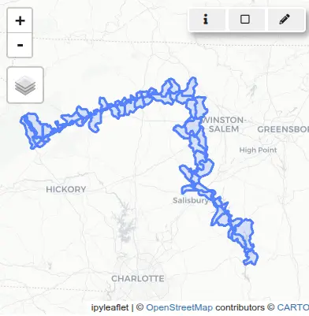
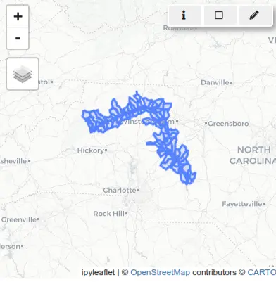
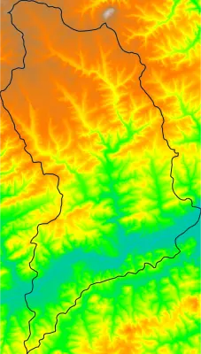
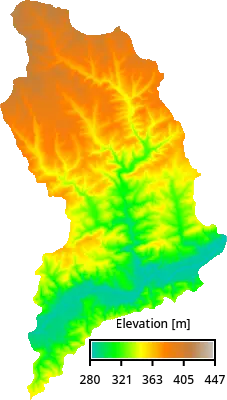
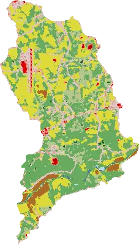
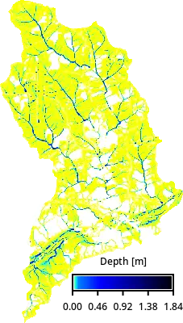
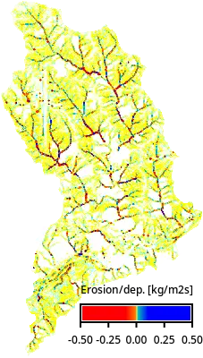
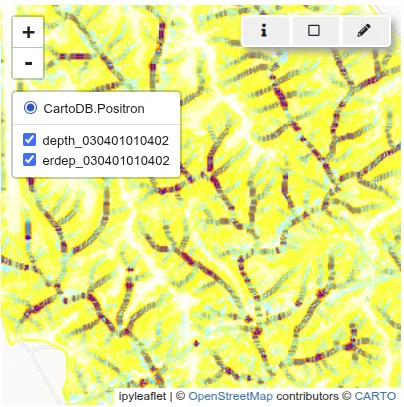
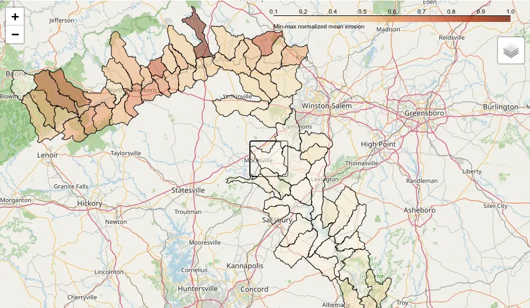

# Introduction

In this tutorial, we will model overland water flow as well as erosion and
deposition patterns along the Yadkin River in North Carolina, USA.
Subwatersheds that have larger erosion values are potentially
the source of increased sediment loads downstream,
contributing to water quality degradation and habitat disruption.

To simulate these processes, we will use the SIMWE model, with simplified
runoff inputs derived from the
[National Land Cover Dataset (NLCD)](https://www.mrlc.gov/data).

To enable parallel processing and improve computational efficiency, we will
divide the study area into hydrologic units
([HUC 12](https://www.usgs.gov/national-hydrography/access-national-hydrography-products)
subwatersheds, each approximately 100 km² in size) and run simulations
independently for each unit.

This approach demonstrates how to leverage new Python API features introduced
in GRASS 8.5—specifically, the [Tools API](https://grass.osgeo.org/grass-devel/manuals/libpython/grass.tools.html#)
and the [MaskManager](https://grass.osgeo.org/grass-devel/manuals/libpython/grass.script.html#grass.script.MaskManager)
and [RegionManager](https://grass.osgeo.org/grass-devel/manuals/libpython/grass.script.html#grass.script.RegionManager)
context managers—which simplify region and mask handling
and are especially useful in parallel workflows.

The terrain data used for modeling will come from the
[National Elevation Dataset (NED)](https://www.usgs.gov/publications/national-elevation-dataset)
at 1/3 arc-second (~10 m) resolution.

Additional concepts covered in this tutorial:

* Data download and ingestion
* Creating GRASS projects
* Data reprojection
* Basic vector and raster data processing
* Computational region
* Using mask to mask out subwatershed area
* Parallelization of a computational workflow
* Overland water flow and sediment transport simulation

::: {.callout-note title="How to run this tutorial?"}
This tutorial is prepared to be run in a Jupyter notebook locally
or using services such as Google Colab. You can [download the notebook here](SIMWE_parallelization.ipynb).

If you are not sure how to get started with GRASS, checkout the tutorials [Get started with GRASS & Python in Jupyter Notebooks](../get_started/fast_track_grass_and_python.qmd)
and [Get started with GRASS in Google Colab](../get_started/grass_gis_in_google_colab.qmd).
:::

# Setup

Start with importing Python packages.
To import the _grass_ package, you need to tell Python where the GRASS Python package is
(can be skipped for some environments).

```{python}
# import standard Python packages
import os
import sys
import subprocess

sys.path.append(
    subprocess.check_output(["grass", "--config", "python_path"], text=True).strip()
)
# import GRASS Python packages
import grass.script as gs
import grass.jupyter as gj
from grass.tools import Tools
```

We will switch our working directory to a directory with enough space, this is where we will download the datasets.
With that, we will be able to use shorter, relative paths.

```{python}
os.chdir("path/to/data")
```

We will create a temporary folder, that will store our GRASS projects, since we don't need to retain them after we are done with the analysis.

```{python}
import tempfile

tempdir = tempfile.TemporaryDirectory()
path = tempdir.name
```

# Input data download and processing

## Download and link NLCD data

Up-to-date download link to the NLCD data can be found at [mrlc.gov/data](https://www.mrlc.gov/data). We will download and unzip it to the current working directory.

```{python}
import urllib.request
import zipfile
from pathlib import Path

url = "https://www.mrlc.gov/downloads/sciweb1/shared/mrlc/data-bundles/Annual_NLCD_LndCov_2024_CU_C1V1.zip"
nlcd_filename, headers = urllib.request.urlretrieve(url)
with zipfile.ZipFile(nlcd_filename, "r") as zip_ref:
    zip_ref.extractall()
os.remove(nlcd_filename)
nlcd_filename = Path(url).with_suffix(".tif").name
```

Create a GRASS project using the coordinate reference system (CRS) of the NLCD dataset.

```{python}
nlcd_project = Path(path, "nlcd")
# create a project
gs.create_project(nlcd_project, filename=nlcd_filename)
# initialize GRASS session in that project
session = gj.init(nlcd_project)
```

Link the NLCD raster with [r.external](https://grass.osgeo.org/grass-devel/manuals/r.external.html). This command creates a virtual raster without importing the full dataset, allowing us to work with just the small sections needed from the larger, nationwide NLCD file.

```{python}
tools = Tools()
tools.r_external(input=nlcd_filename, output="nlcd")
```

We will use NLCD data later, now we process hydrography dataset.

## Download and process NC hydrography dataset

We will download and unzip [National Hydrography Dataset](https://www.usgs.gov/national-hydrography/access-national-hydrography-products) for North Carolina and create a GRASS project, in which we will extract the river and adjacent subwatersheds.

```{python}
url = "https://prd-tnm.s3.amazonaws.com/StagedProducts/Hydrography/NHD/State/GPKG/NHD_H_North_Carolina_State_GPKG.zip"
hydro_filename, headers = urllib.request.urlretrieve(url)
with zipfile.ZipFile(hydro_filename, "r") as zip_ref:
    zip_ref.extractall()
os.remove(hydro_filename)
hydro_filename = Path(url).with_suffix(".gpkg").name
```
We will create another project, called "hydro", to do the initial processing
of the hydrography data in the original CRS of the data
(latitude-longitude CRS).

```{python}
hydro_project = Path(path, "hydro")

gs.create_project(hydro_project, filename=hydro_filename)
session = gj.init(hydro_project)
```

First, let's list the layers available:

```{python}
print(tools.v_in_ogr(input=hydro_filename, flags="l").text)
```

```text
NHDArea
NHDAreaEventFC
NHDFlowline
NHDLine
NHDLineEventFC
NHDPoint
NHDPointEventFC
NHDWaterbody
WBDHU10
WBDHU12
WBDHU14
WBDHU16
WBDHU2
WBDHU4
WBDHU6
WBDHU8
WBDLine
ExternalCrosswalk
NHDFCode
NHDFeatureToMetadata
NHDFlow
NHDFlowlineVAA
NHDMetadata
NHDProcessingParameters
NHDReachCodeMaintenance
NHDReachCrossReference
NHDSourceCitation
NHDStatus
NHDVerticalRelationship
```

Now we will import hydrography boundaries HUC12 (_WBDHU12_) to get the subwatersheds and the flow lines (_NHDFlowline_) to extract the specific river.

```{python}
tools.v_in_ogr(input=hydro_filename, layer="WBDHU12")
tools.v_in_ogr(
    input=hydro_filename,
    layer="NHDFlowline",
    where="gnis_name == 'Yadkin River'",
    output="river",
)
```

Next, we want to extract the subwatersheds along the river.
If we simply overlap (with [v.select](https://grass.osgeo.org/grass-devel/manuals/v.select.html))
the river and the subwatersheds, we will miss some of them
because the river data don't always overlap or touch the subwatersheds.

```{python}
tools.v_select(
    ainput="WBDHU12",
    binput="river",
    output="river_basins",
    operator="overlap",
)

basin_map = gj.InteractiveMap()
basin_map.add_vector("river_basins")
basin_map.add_vector("river")
basin_map.show()
```



So instead we will [buffer](https://grass.osgeo.org/grass-devel/manuals/v.buffer.html) the river first:

```{python}
tools.v_buffer(input="river", output="river_buffer", distance=0.01)
tools.v_select(
    ainput="WBDHU12",
    binput="river_buffer",
    output="river_basins",
    operator="overlap",
)

basin_map = gj.InteractiveMap()
basin_map.add_vector("river_basins")
basin_map.add_vector("river")
basin_map.show()
```



The rest of the workflow will be done in a CRS used in North Carolina (EPSG 3358).

## Reprojecting vector data to a CRS used in North Carolina

Since we want our project to use a different CRS more suitable for our study area (EPSG:3358 for North Carolina), we will create it now:

```{python}
nc_project = Path(path) / "NC"
gs.create_project(nc_project, epsg="3358")
session = gj.init(nc_project)
```

We will reproject the river subwatersheds vector with [v.proj]((https://grass.osgeo.org/grass-devel/manuals/v.proj.html)):

```{python}
tools.v_proj(input="river_basins", project="hydro")
```

## Downloading NED elevation data

We will use GRASS addon [r.in.usgs](https://grass.osgeo.org/grass-devel/manuals/addons/r.in.usgs.html) to download and import NED layer using [USGS TNM Access API](https://apps.nationalmap.gov/tnmaccess/).

```{python}
tools.g_extension(extension="r.in.usgs")
```

First, we will set the computational region to match the river subwatersheds and then list available datasets
for that region (the output at the time of creating this tutorial, it may vary later on):

```{python}
tools.g_region(vector="river_basins")
print(
    tools.r_in_usgs(
        product="ned",
        ned_dataset="ned13sec",
        flags="i",
        output_directory=os.getcwd(),
    ).text
)
```

```text
USGS file(s) to download:
-------------------------
Total download size:	5.32 GB
Tile count:	17
USGS SRS:	wgs84
USGS tile titles:
USGS 1/3 Arc Second n36w080 20240611
USGS 1/3 Arc Second n36w081 20240611
USGS 1/3 Arc Second n36w082 20220504
USGS 1/3 Arc Second n36w082 20220512
USGS 1/3 Arc Second n36w082 20240611
USGS 1/3 Arc Second n37w080 20210305
USGS 1/3 Arc Second n37w081 20210305
USGS 1/3 Arc Second n37w081 20240611
USGS 1/3 Arc Second n37w082 20210305
USGS 1/3 Arc Second n37w082 20220512
USGS 1/3 Arc Second n37w082 20240611
USGS 13 arc-second n36w080 1 x 1 degree
USGS 13 arc-second n36w081 1 x 1 degree
USGS 13 arc-second n36w082 1 x 1 degree
USGS 13 arc-second n37w080 1 x 1 degree
USGS 13 arc-second n37w081 1 x 1 degree
USGS 13 arc-second n37w082 1 x 1 degree
-------------------------
```

We will select the 2024 data and use the `title_filter` option to filter them.
We will download and import the datasets.

```{python}
tools.r_in_usgs(
    product="ned",
    ned_dataset="ned13sec",
    output_directory=os.getcwd(),
    title_filter="20240611",
    output_name="ned",
)
```

Let's now compute the erosion/deposition for one of the subwatersheds.

# Flow and erosion modeling for a single subwatershed

We begin our analysis by selecting a single HUC12 subwatershed from the set of intersected basins. This subset will be used to test the erosion and deposition simulation workflow. For all outputs, we will use unique names with the subwatershed code as a prefix. That will help us with parallelization later on.

Use [v.db.select](https://grass.osgeo.org/grass-devel/manuals/v.db.select.html) to retrieve the list of HUC12 codes from the attribute table that has "areasqkm" and "huc12" attributes.
Extract the smallest HUC12 polygon using [v.extract](https://grass.osgeo.org/grass-devel/manuals/v.extract.html).

```{python}
# Select for example the smallest huc12
subwatersheds = tools.v_db_select(map="river_basins", format="json")["records"]
huc12 = min(subwatersheds, key=lambda x: x["areasqkm"])["huc12"]
tools.v_extract(
    input="river_basins",
    output=f"basin_{huc12}",
    where=f"huc12 == '{huc12}'",
    flags="t",
)
```

Set the computational region with [g.region](https://grass.osgeo.org/grass-devel/manuals/g.region.html) to match the bounds of the selected subwatershed.

```{python}
tools.g_region(vector=f"basin_{huc12}")
```

Display the NED data for that region:

```{python}
basin_map = gj.Map(use_region=True)
basin_map.d_rast(map="ned")
basin_map.d_vect(map=f"basin_{huc12}", fill_color="none")
basin_map.show()
```



Set the region to match the extent of the basin and align resolution with the elevation raster.
Convert the selected vector to a raster using [v.to.rast](https://grass.osgeo.org/grass-devel/manuals/v.to.rast.html).

```{python}
tools.g_region(raster="ned", vector=f"basin_{huc12}")
tools.v_to_rast(input=f"basin_{huc12}", output=f"basin_{huc12}", use="val")
```

Apply a raster mask with [MaskManager](https://grass.osgeo.org/grass-devel/manuals/libpython/grass.script.html#grass.script.MaskManager) to restrict all subsequent raster operations to this subwatershed.
MaskManager is new in GRASS version 8.5. Alternatively, you can use [r.mask](https://grass.osgeo.org/grass-devel/manuals/r.mask.html) to set a mask.

```{python}
mask = gs.MaskManager(mask_name=f"basin_{huc12}")
mask.activate()

basin_map = gj.Map(use_region=True)
basin_map.d_rast(map="ned")
basin_map.d_legend(
    raster="ned",
    flags="t",
    at=[10, 15, 40, 95],
    title="Elevation [m]",
    fontsize=12,
)
basin_map.show()
```



Reproject NLCD from a "nlcd" project to this project (see [NLCD legend](https://www.usgs.gov/media/images/annual-nlcd-land-cover-change-legend)):

```{python}
tools.r_proj(project="nlcd", mapset="PERMANENT", input="nlcd", output=f"nlcd_{huc12}")

basin_map = gj.Map()
basin_map.d_rast(map=f"nlcd_{huc12}")
basin_map.show()
```



Next, we will estimate Manning's roughness coefficient from the NLCD landcover
using [r.manning](https://grass.osgeo.org/grass-stable/manuals/addons/r.manning.html) addon tool.
Specifically, we will use [@kalyanapu2009] lookup table that is more suitable for shallow flow.

```{python}
tools.g_extension(extension="r.manning")
tools.r_manning(input=f"nlcd_{huc12}", output=f"mannings_{huc12}", landcover="nlcd", source="kalyanapu")

basin_map = gj.Map()
basin_map.d_rast(map=f"mannings_{huc12}")
basin_map.d_legend(
    raster=f"mannings_{huc12}",
    flags="t",
    at=[10, 15, 40, 95],
    title="Roughness",
    fontsize=12,
)
basin_map.show()
```

Then we will estimate rainfall excess and to do that we will first process
soil data for our area using [r.in.ssurgo](https://grass.osgeo.org/grass-stable/manuals/addons/r.in.ssurgo.html) addon tool.
Since we need a fairly large area, we will first download the soil data itself for North Carolina
from [Gridded Soil Survey Geographic (gSSURGO) Database](https://www.nrcs.usda.gov/resources/data-and-reports/gridded-soil-survey-geographic-gssurgo-database)
and then have r.in.ssurgo extract Hydrologic Soil Group for our area.

::: {.callout-note title="What is Hydrologic Soil Group?"}
Hydrologic Soil Group (HSG) classifies soils based on their minimum
infiltration rate and potential for rainfall runoff.
For smaller areas, r.in.ssurgo can download the data directly using the
[Soil Data Access (SDA) API](https://sdmdataaccess.nrcs.usda.gov/).
:::

```{python}
tools.g_extension(extension="r.in.ssurgo")
tools.r_in_ssurgo(ssurgo_path=f"", soils=f"soils_{huc12}", hydgrp=f"hydgrp_{huc12}", nprocs=1)

soil_map = gj.Map()
soil_map.d_rast(map=f"hydgrp_{huc12}")
soil_map.d_legend(
    raster=f"hydgrp_{huc12}",
    at=[10, 15, 40, 95],
    title="HSG",
    fontsize=12,
)
soil_map.show()
```

With the soil and landcover data available, we will generate Curve Number,
which is an empirical parameter to estimate surface runoff.

```{python}
tools.g_extension(extension="r.curvenumber")
tools.r_curvenumber(landcover=f"nlcd_{huc12}", landcover_source="nlcd", soil=f"hydgrp_{huc12}",
                    output=f"curvenumber_{huc12}")

cn_map = gj.Map()
cn_map.d_rast(map=f"curvenumber_{huc12}")
cn_map.d_legend(
    raster=f"curvenumber_{huc12}",
    at=[10, 15, 40, 95],
    flags="t",
    title="CN",
    fontsize=12,
)
cn_map.show()
```

We will model a 50-year storm event that lasts 3 hours, using data from
[NOAA Atlas 14](https://hdsc.nws.noaa.gov/pfds/) Precipitation Frequency Data Server.

```{python}
tools.g_extension(extension="r.noaa.atlas14")
duration = 3
depths = tools.r_noaa_atlas14(mode="point", statistic="depth", units="metric", format="json")
depth = [row["values"] for row in depth["table"]["rows"] if row["duration"] == f"{duration}-hr"]["50"]
print(depth)
```

We will then create an input rainfall depth raster:

```
tools.r_mapcalc(expression=f"rainfall_{huc12} = {depth}")
```

With that we estimate runoff (rainfall excess):

```{python}
tools.g_extension(extension="r.runoff")
tools.r_runoff(rainfall=f"rainfall_{huc12}", duration=duration, curve_number=f"curvenumber_{huc12}",
               runoff_depth=f"runoff_depth_{huc12}")
tools.r_mapcalc(expression=f"runoff_{huc12} = runoff_depth_{huc12} / {duration}")

runoff_map = gj.Map()
runoff_map.d_rast(map=f"runoff_{huc12}")
runoff_map.d_legend(
    raster=f"runoff_{huc12}",
    at=[10, 15, 40, 95],
    flags="t",
    title="Runoff [mm/h]",
    fontsize=12,
)
runoff_map.show()
```

Run hydrologic and sediment simulations for the selected subwatershed.
First, simulate overland flow using [r.sim.water](https://grass.osgeo.org/grass-devel/manuals/r.sim.water.html)
with inputs for topography, Manning’s coefficients, and rainfall intensity.
Running the simulation may take a while.

```{python}
simulation_time = 180
tools.r_sim_water(
    elevation="ned",
    depth=f"depth_{huc12}",
    niterations=simulation_time,
    man=f"mannings_{huc12}",
    rain=f"runoff_{huc12}",
)

basin_map = gj.Map()
basin_map.d_rast(map=f"depth_{huc12}")
basin_map.d_legend(
    raster=f"depth_{huc12}",
    flags="t",
    at=[10, 15, 40, 95],
    title="Depth [m]",
    fontsize=12,
)
basin_map.show()
```



Then, define parameters for sediment transport and run [r.sim.sediment](https://grass.osgeo.org/grass-devel/manuals/r.sim.sediment.html)
to compute erosion and deposition patterns. We will trim the resulting raster's edges to avoid extreme values at the edge.
The additional parameters for sediment erosion modeling are based on [WEPP](https://www.ars.usda.gov/midwest-area/west-lafayette-in/national-soil-erosion-research/docs/wepp/research/) model, here we use just a single-value estimate.

```{python}
tools.r_mapcalc(expression=f"transport_capacity_{huc12} = 0.001")
tools.r_mapcalc(expression=f"detachment_coef_{huc12} = 0.001")
tools.r_mapcalc(expression=f"shear_stress_{huc12} = 0.01")
tools.r_sim_sediment(
    elevation="ned",
    water_depth=f"depth_{huc12}",
    detachment_coeff=f"detachment_coef_{huc12}",
    transport_coeff=f"transport_capacity_{huc12}",
    shear_stress=f"shear_stress_{huc12}",
    niterations=simulation_time,
    erosion_deposition=f"erdep_tmp_{huc12}",
    nwalkers=5 * gs.region()["cells"],
)
tools.r_grow(input=f"erdep_tmp_{huc12}", output=f"erdep_{huc12}", radius=-2.01)

basin_map = gj.Map()
basin_map.d_rast(map=f"erdep_{huc12}")
basin_map.d_legend(
    raster=f"erdep_{huc12}",
    flags="t",
    at=[10, 15, 40, 95],
    range=[-0.5, 0.5],
    digits=2,
    title="Erosion/dep. [kg/m2s]",
    fontsize=12,
)
basin_map.show()
```



Calculate total erosion for the subwatershed.
Negative values from [r.sim.sediment](https://grass.osgeo.org/grass-devel/manuals/r.sim.sediment.html)
output are treated as erosion and converted to sediment mass.
Summary statistics are computed using [r.univar](https://grass.osgeo.org/grass-devel/manuals/r.univar.html).

```{python}
# Erosion: extract negative values and convert to positive mass [kg/m^2]
tools.r_mapcalc(
    f"erosion_{huc12} = if(erdep_{huc12} < 0, abs(erdep_{huc12}) * {simulation_time * 60}, null())"
)
erosion = tools.r_univar(map=f"erosion_{huc12}", format="json")
print(erosion["mean"])
```

Deactivate the active raster mask, restoring operations to apply across the full computational region.

```{python}
mask.deactivate()
```

Display water depth (`depth`) and erosion-deposition (`erdep`) rasters for the selected subwatershed.

```{python}
basin_map = gj.InteractiveMap()
basin_map.add_raster(f"depth_{huc12}")
basin_map.add_raster(f"erdep_{huc12}")
basin_map.show()
```



# Parallelized hydrologic and sediment modeling

To efficiently model erosion and deposition across a large number of HUC12 subwatersheds,
we will use the workflow we just ran and create a
script that uses Python's `multiprocessing` module to parallelize the workflow.
Each subwatershed is processed independently in its own environment, which allows computations to run concurrently without interference.

Each subwatershed needs to set different computational region and mask.
However those setting are usually global for each mapset.
So, to use different regions and masks for each parallel process, we will use the region and mask context managers.

* Computational region is handled using `RegionManager`, a [context manager for setting and managing computational region](https://grass.osgeo.org/grass-devel/manuals/libpython/grass.script.html#grass.script.RegionManager),
making it possible to have custom region for the current process. This feature is available only since GRASS 8.5.

    ```python
    with gs.RegionManager(vector=f"basin_{huc12}"):
        # Run actual computation in the specified region.
        tools.r_sim_water(...)
    ```

* Masking is handled using `MaskManager`, a [context manager for setting and managing raster mask](https://grass.osgeo.org/grass-devel/manuals/libpython/grass.script.html#grass.script.MaskManager),
making it possible to have custom mask for the current process. This feature is available only since GRASS 8.5.

    ```python
    with gs.MaskManager(mask_name=f"basin_{huc12}"):
        # Run actual computation with active mask.
        tools.r_sim_water(...)
    ```

## Putting it all together

We will put all the pieces together into a script that runs each subwatershed in parallel.
The resulting statistics for each subwatershed are collected and stored in a JSON file for further analysis.

```{python}
%%writefile script.py
import os
import json
from multiprocessing import Pool, cpu_count
from tqdm import tqdm

import grass.script as gs
from grass.tools import Tools


def compute(huc12):
    simulation_time = 180
    # set overwrite to True to rerun the workflow
    tools = Tools(overwrite=True, quiet=True)
    tools.v_extract(
        input="river_basins",
        output=f"basin_{huc12}",
        where=f"huc12 == '{huc12}'",
        flags="t",
    )
    # Set the computational region to match the basin
    # while using the NED raster cell size and alignment
    with gs.RegionManager(vector=f"basin_{huc12}", raster="ned"):
        tools.v_to_rast(
            input=f"basin_{huc12}",
            output=f"basin_{huc12}",
            use="val",
        )
        tools.r_proj(
            project="nlcd",
            mapset="PERMANENT",
            input="nlcd",
            output=f"nlcd_{huc12}",
        )
        tools.r_recode(
            input=f"nlcd_{huc12}",
            output=f"mannings_{huc12}",
            rules="mannings.txt",
        )
        tools.r_recode(
            input=f"nlcd_{huc12}",
            output=f"runoff_{huc12}",
            rules="runoff.txt",
        )
        with gs.MaskManager(mask_name=f"basin_{huc12}"):
            # Run actual computation with active mask.
            tools.r_recode(
                input=f"nlcd_{huc12}",
                output=f"mannings_{huc12}",
                rules="mannings.txt",
            )
            tools.r_recode(
                input=f"nlcd_{huc12}",
                output=f"runoff_{huc12}",
                rules="runoff.txt",
            )
            tools.r_sim_water(
                elevation="ned",
                depth=f"depth_{huc12}",
                niterations=simulation_time,
                man=f"mannings_{huc12}",
                rain=f"runoff_{huc12}",
            )
            tools.r_mapcalc(expression=f"transport_capacity_{huc12} = 0.001")
            tools.r_mapcalc(expression=f"detachment_coef_{huc12} = 0.001")
            tools.r_mapcalc(expression=f"shear_stress_{huc12} = 0.01")
            region = tools.g_region(flags="p", format="json")
            tools.r_sim_sediment(
                elevation="ned",
                water_depth=f"depth_{huc12}",
                detachment_coeff=f"detachment_coef_{huc12}",
                transport_coeff=f"transport_capacity_{huc12}",
                shear_stress=f"shear_stress_{huc12}",
                niterations=simulation_time,
                erosion_deposition=f"erdep_tmp_{huc12}",
                nwalkers=5 * region["cells"],
            )
            tools.r_grow(
                input=f"erdep_tmp_{huc12}",
                output=f"erdep_{huc12}",
                radius=-2.01,
            )
            # Erosion: extract negative values and convert to positive mass [kg/m^2]
            tools.r_mapcalc(
                expression=f"erosion_{huc12} = if(erdep_{huc12} < 0, abs(erdep_{huc12}) * {simulation_time * 60}, 0)",
            )
            erosion = tools.r_univar(map=f"erosion_{huc12}", format="json", flags="e")
            return {
                "huc12": huc12,
                "erosion_mean": erosion["mean"],
                "erosion_median": erosion["median"],
                "erosion_total": erosion["sum"] * region["nsres"] * region["ewres"],
            }


if __name__ == "__main__":
    tools = Tools()
    # The entire workflow will run in parallel,
    # so this limits the number of threads each individual tool can use to 1.
    tools.g_gisenv(set="NPROCS=1")
    basins = tools.v_db_select(format="json", map="river_basins")["records"]
    huc12s = [basin["huc12"] for basin in basins]
    # set the number of processes to be used for the computation in total
    with Pool(processes=cpu_count()) as pool:
        result = list(tqdm(pool.imap(compute, huc12s), total=len(huc12s)))
        with open("result.json", "w") as fp:
            json.dump(result, fp)
```

Now execute the script, it will take some time.

```{python}
%run script.py
```

Load the resulting JSON file into a pandas dataframe and normalize the results, so that we can easily compare the subwatersheds.

```{python}
import pandas as pd
import json

with open("result.json") as f:
    stats = json.load(f)

df = pd.DataFrame(stats)
df["normalized_erosion"] = df.erosion_mean / max(df.erosion_mean)
df
```

Load the subwatershed layers into geopandas for visualization.
Join the dataframe with the simulation values using the _huc12_ key
and from all NC subwatersheds filter only those we initially selected
that have now computed erosion values.

```{python}
import geopandas as gpd

gdf = gpd.read_file(hydro_filename, layer="WBDHU12")
gdf = gdf.merge(df, on="huc12", how="left")
# drop loaddate column because it's timestamp type
# not supported by JSON, would later fail
gdf = gdf.drop(columns=["loaddate"])
# keep only subwatersheds with computed values
gdf = gdf[gdf["erosion_total"].notna()]
```

Let's visualize the data with folium:

```{python}
import folium
import branca.colormap as cm

metric = "normalized_erosion"
color_scale = cm.linear.OrRd_09.scale(min(gdf[metric]), max(gdf[metric]))
color_scale.caption = "Min-max normalized mean erosion"
# get region center as latitude, longitude
region = tools.g_region(vector="river_basins", format="json", flags="b")
m = folium.Map(location=[region["ll_clat"], region["ll_clon"]], zoom_start=9)

tooltip = folium.GeoJsonTooltip(
    fields=["huc12", metric],
    aliases=["HUC12", "Normalized mean erosion:"],
    localize=True,
    sticky=False,
    labels=True,
    style="""
        background-color: #F0EFEF;
        border: 2px solid black;
        border-radius: 3px;
        box-shadow: 3px;
    """,
    max_width=800,
)

g = folium.GeoJson(
    gdf,
    style_function=lambda x: {
        "fillColor": color_scale(x["properties"][metric]),
        "color": "black", "weight": 1,
        "fillOpacity": 0.5,
    },
    tooltip=tooltip,
).add_to(m)
color_scale.add_to(m)
folium.LayerControl().add_to(m)
m
```



We can now identify subwatersheds that have larger erosion values and are potentially
the source of increased sediment loads downstream, contributing to water quality degradation and habitat disruption.


## Acknowledgements

The development of this tutorial was supported by NSF Award #2322073, granted to Natrx, Inc. and USDA NRCS award NR233A750023C043.
