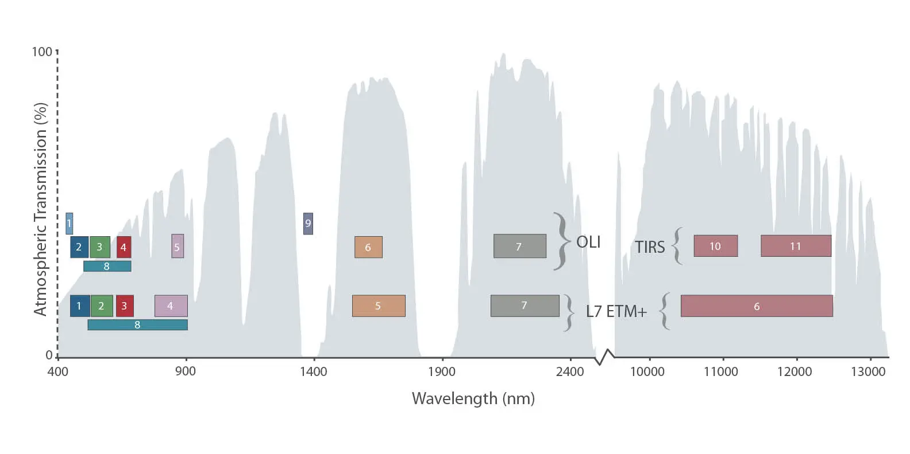

::::: grid
::: g-col-4

-   GRASS has many tools for processing and visualizing remote sensing imagery. This tutorial only scratches the surface of GRASS's extensive capacity for image processing.

-   Hopefully, it will give you some sense of the potential for analysis and visualization of remote sensing imagery in GRASS and the potential to combine remote sensing analysis with raster and vector GIS processing.

-   We will start with a quick overview of multi-band satellite imagery.
:::

::: g-col-8

:::
:::::

::: {.callout-note title="Dataset"}
This tutorial uses one of the standard GRASS sample data sets for Flagstaff, Arizona, USA: ***flagstaff_arizona_usa***. We will refer to place names in that data set, but it can be completed with any of the [standard sample data sets](https://grass.osgeo.org/download/data/) for any region--for example, the [North Carolina data set](https://grass.osgeo.org/sampledata/north_carolina/nc_spm_08_grass7.zip).

We will use a set of images from the **LandSat 8 satellite** and the *elevation* DEM raster map. However, this tutorial can also be used with other multi-band imagery, such as Sentinel or Terra/ASTER. With other satellite imagery than LandSat 8, the band numbers may differ from those described in this tutorial.
:::

::: {.callout-note title="GRASS environment"}
This tutorial is designed so that you can complete it using the **GRASS GUI**, GRASS commands from the **console or terminal**, or using GRASS commands in a **Jupyter Notebook** environment.
:::

::: {.callout-note title="Don't know how to get started?"}
If you are not sure how to get started with GRASS using its graphical user interface or using Python, checkout the tutorials [Get started with GRASS GIS GUI](../get_started/fast_track.qmd) and [Get started with GRASS & Python in Jupyter Notebooks](../get_started/fast_track_grass_and_python.qmd).
:::

# Remote sensing basics

## Many Forms of Remote Sensing

:::::: grid
::: g-col-4
{style="width: 100%"}
:::

::: g-col-4
{style="width: 100%"}
:::

::: g-col-4
{style="width: 100%"}
:::
::::::

This tutorial will use space-based remote sensing platforms.

## Space-based platforms

::::: grid
::: g-col-5

-   These satellites have sensors to capture the reflectance of solar **electromagnetic (EM) radiation** that reaches the earth–including the EM we see as visible light.

-   Different materials absorb, emit, and reflect EM radiation in different frequencies.

-   Space based sensors capture images across multiple EM frequencies in different “**bands**” or “**channels**” to enable the identification of different materials or features.

-   Sensor band images as rasters can be combined mathematically in different ways to enable visualization or identification of features or materials.
:::

::: g-col-7


:::
:::::

# Visualization of multi-band remote sensing imagery in GRASS

::::: grid
::: g-col-4

-   GRASS has many tools for combining and analyzing single and multi-band imagery.

-   In this tutorial, we will explore a few of these analytical tools using images of the Flagstaff region from the **LandSat 8** satellite.
:::

::: g-col-8



:::
:::::

## Landsat bands to analyze

The following LandSat 8 bands are provided with the Flagstaff data set:

-   *landsat8_2024_B1* : high frequency visible blue for cirrus clouds\
-   *landsat8_2024_B2* : visible blue\
-   *landsat8_2024_B3* : visible green\
-   *landsat8_2024_B4* : visible red\
-   *landsat8_2024_B5* : near infrared\
-   *landsat8_2024_B6* : mid infrared (higher freq)\
-   *landsat8_2024_B7* : mid infrared (lower freq)

In this tutorial, we will use LandSat 8 bands 2-7

## Visualize individual Landsat bands

::::: grid
::: g-col-6

-   Load **bands 2-7** into the layer manager but not band 1 (*landsat8_2024_B1*).

-   Notice how dark each of the images is.

-   That is because, although each cell could be one of 65,536 values, nearly all are within a very narrow range.


:::

::: g-col-6

:::
:::::

## Histogram equalization

::::: grid
::: g-col-6

-   The range of grey shades can be remapped across the cell values, so that they fully span a black to white continuum.

-   This can be done in [r.colors](https://grass.osgeo.org/grass-stable/manuals/r.colors.html) by “equalizing” the color histogram of the cells.
:::

::: g-col-6

:::
:::::

## Histogram equalization with [r.colors](https://grass.osgeo.org/grass-stable/manuals/r.colors.html) in GRASS

-   Using *r.colors* for histogram equalization will enhance the visibility of the image but will not change its cell values

::::::::: {.panel-tabset group="language"}

#### GUI

::::: grid
::: g-col-6

1.  Select *r.colors* from the **Raster/Manage colors** menu

2.  Enter a LandSat image in the **Name of the raster map(s)** text box
:::

::: g-col-6

:::
:::::

::::: grid
::: g-col-6
3.  Check the **histogram equalization** box

4.  Select *grey* in the **Name of color table** text box

5.  Press **Run**

6.  Do the same for each of the LandSat bands.
:::

::: g-col-6

:::
:::::

#### Command line

```{python}
r.colors -e map=landsat8_2024_B2 color=grey
r.colors -e map=landsat8_2024_B3 color=grey
r.colors -e map=landsat8_2024_B4 color=grey
r.colors -e map=landsat8_2024_B5 color=grey
r.colors -e map=landsat8_2024_B6 color=grey
r.colors -e map=landsat8_2024_B7 color=grey
```

#### Python

```{python}
gs.run_command("r.colors",
               map=landsat8_2024_B2,
               color=grey,
               flags="e")
gs.run_command("r.colors",
               map=landsat8_2024_B3,
               color=grey,
               flags="e")
gs.run_command("r.colors",
               map=landsat8_2024_B4,
               color=grey,
               flags="e")
gs.run_command("r.colors",
               map=landsat8_2024_B5,
               color=grey,
               flags="e")
gs.run_command("r.colors",
               map=landsat8_2024_B6,
               color=grey,
               flags="e")
gs.run_command("r.colors",
               map=landsat8_2024_B7,
               color=grey,
               flags="e")
               
```

:::::::::

All examples described in the rest of this tutorial are done with histogram stretched images

::: {.callout-note title="Tip"}
Histogram each image **separately** instead of doing all of them together as a group because each image has a different distribution of pixel/cell values to stretch.
:::

------------------------------------------------------------------------


# Image fusion

## Color image fusion of LandSat bands

-   Each LandSat image has cell values representing the reflectance intensity in a particular range of EM frequencies (i.e., multiple image bands). When visualized as a raster, a single LandSat band appears as variable, single color (e.g., grey-scale) map.

-   **Image fusion** refers ways of combining multiple bands in order to visualize them as a full color image.

-   Most simply, this involves defining 3 image bands as the red, green, and blue channels of a **multicolor RGB image.**.

-   The resulting color visualization displays areas with similar combinations of reflectance across the 3 selected bands (e.g., vegetation, water, or highways) as having the same color and differing from areas with different combinations of reflectance.

-   This can be easily done in GRASS using the *d.rgb* tool in the layer manager.

## Image fusion in the layer manager {#image-fusion-layermgr}

::::: grid
::: g-col-6

1.  Select **Add RGB map layer** from the **Add various raster layers** tool
:::

::: g-col-6

:::
:::::

::::: grid
::: g-col-6
2.  Select LandSat bands to define as the red, green, and blue channels of a multicolor image.

3.  For a "natural color" image fusion, try:

    -   Band 4 (visible red EM) as red
    -   Band 3 (visible green EM) as green
    -   Band 2 (visible blue EM) as blue
:::

::: g-col-6


:::
:::::


## Image fusion: other band combinations

Try some other combinations to highlight different features.

::::: grid
::: g-col-6

-   Using bands 5, 4, and 3 highlights chlorophyll (vegetation) in red.
:::

::: g-col-6

:::
:::::

::::: grid
::: g-col-6

-   Image fusion with bands 6, 5, and 3 uses infrared EM to highlight other land cover and land use differently.
:::

::: g-col-6

:::
:::::

# Environmental indices

## Environmental information from mathatical combinations of remote sensing bands

-   Because different materials—including different vegetation, soils, and water—reflect, absorb, and emit EM in different frequencies, many kinds of environmental information can be derived with different band combinations.

-   GRASS can generate a large number of environmental indices with its extensive suite of imagery tools (See the **Imagery** menu), as well as with the raster *map calculator*.

-   Additional remote sensing image product tools are available as GRASS addon extensions.

-   A commonly used environmental index is **NDVI** : the normalized difference vegetation index. NDVI is an index of plant growth and health. is computed from bands sensing near infrared EM (NIR) and visible red light EM.

$$
NDVI = \frac{NIR - red}{NIR + red}
$$

-   While you could create a map of NDVI using the *map calculator*, it can also be generated automatically from the GRASS [i.vi](https://grass.osgeo.org/grass-stable/manuals/i.vi.html) module, along with many other vegetation indexes.

::: {.callout-note title="Tip"}
When generating any new map, like NDVI, remember to first make sure that the **region** is set to match the LandSat images
:::

## NDVI example: normalized difference vegetation index

::::::::: {.panel-tabset group="language"}

#### GUI

### Set the region to match the LandSat images**

1.  Add one of the LandSat images raster to the **Layer Manager**.

2.  Right click on the LandSat image in Layer Manager.

3.  Select **Set computational region from selected map**.

::::: grid
::: g-col-6

### Compute NDVI raster

1.  Select the [i.vi](https://grass.osgeo.org/grass-stable/manuals/i.vi.html) tool from **Imagery/Satellite image products/vegetation indices** menu.

2.  Choose **NDVI** for the index to calculate

3.  Enter the name of the **output map** to create\
:::

::: g-col-6

:::
:::::

::::: grid
::: g-col-6
4.  Enter band 4 for the **red channel**

5.  Enter band 5 for the **NIR (near infrared) channel**
:::

::: g-col-6

:::
:::::

#### Command line

1.  Set the region to match the LandSat images

2.  Use the [i.vi](https://grass.osgeo.org/grass-stable/manuals/i.vi.html) tool to create a map of NDVI values.

```{python}
g.region raster=landsat8_2024_B2

i.vi output=Flagstaff_NDVI viname=ndvi red=landsat8_2024_B4 nir=landsat8_2024_B5
```

#### Python

1.  Set the region to match the LandSat images

2.  Use the [i.vi](https://grass.osgeo.org/grass-stable/manuals/i.vi.html) tool to create a map of NDVI values.

```{python}
gs.run_command("g.region", raster="landsat8_2024_B2")

gs.run_command("i.vi", 
                output=Flagstaff_NDVI, 
                viname=ndvi, 
                red=landsat8_2024_B4, 
                nir=landsat8_2024_B5
  )
```

:::::::::


# Combining information from many imagery bands

-   We can visualize 3 bands at a time with RGB color image. But how can we use information from all 6 LandSat bands at the same time?

-   This requires using multivariate statistics for “dimensionality reduction”. GRASS has multiple analytical tools for dimensionality reduction.

-   Here, we will explore **principle components analysis** (PCA). PCA mathematically combines the original variables (the LandSat bands) to create new “component” variables that capture majority of variation in original LandSat bands.

## PCA of multiband images with GRASS

:::::: {.panel-tabset group="language"}

#### GUI

::::: grid
::: g-col-6

1.  Open the principal components analysis (PCA) module, *i.pca*, found under the **Imagery/Transform images** menu.

2.  Enter **names of images for LandSat bands 2-7**

3.  Provide an **output base name**. A number, representing the computed PCA component maps will be appended to this output base name.

4.  There are other options but the defaults OK for now.

5.  Press run
:::

::: g-col-6

:::
:::::

#### Command line

1.  Perform a PCA and output the results to the console/terminal and as PCA component maps

```{python}
i.pca input=landsat8_2024_B2,landsat8_2024_B3,landsat8_2024_B4, landsat8_2024_B5,landsat8_2024_B6,landsat8_2024_B7 output=Flagstaff_landsat8
```

#### Python

1.  Create a friction map with a value of 0 in all cells that matches the extent and resolution of the elevation map

```{python}
gs.run_command("i.pca", 
                input="landsat8_2024_B2,landsat8_2024_B3,landsat8_2024_B4, landsat8_2024_B5,landsat8_2024_B6,landsat8_2024_B7", 
                output=Flagstaff_landsat8)
```

::::::

## Working with PCA results

Statistical details of PCA output appear in the console or terminal.

[**Eigen values (vectors) \[% importance\]**]{style="color:#38761d"}

> [PC1 14640530.56 ( 0.4461, 0.4915, 0.5480, 0.4167, 0.1994, 0.2136) \[58.03%\]]{style="color:#38761d"}\
> [PC2 8850161.06 ( 0.2240, 0.1951, 0.1050, 0.0543,-0.7001,-0.6385) \[35.08%\]]{style="color:#38761d"}\
> [PC3 1502032.84 ( 0.2335, 0.1528, 0.2947,-0.8794,-0.1102, 0.2231) \[ 5.95%\]]{style="color:#38761d"}\
> [PC4 108422.28 ( 0.4370,-0.8041, 0.3529, 0.0416, 0.1120,-0.1536) \[ 0.43%\]]{style="color:#38761d"}\
> [PC5 94291.01 ( 0.4417, 0.2122,-0.4285,-0.1814, 0.5597,-0.4797) \[ 0.37%\]]{style="color:#38761d"}\
> [PC6 34241.78 ( 0.5570,-0.0735,-0.5418, 0.1242,-0.3636, 0.4931) \[ 0.14%\]]{style="color:#38761d"}

-   Each line of the output represents a PCA component.

-   The list of values in parentheses is the *eigenvector* of each PCA component, with the 6 values indicating the contribution of each of LandSat images 2-7 to the component. Larger positive or negative numbers indicate greater contributions of a band to the component. For example, LandSat band 4 has the largest contribution to PCA component 1, while band 6 has the largest contribution to component 2.

-   The percentage in brackets represent the amount of variation in the original LandSat bands 2-7 are captured by that PCA component. For example, PCA component 1 captures 58% of the variation in the original 6 bands and PCA component 2 captures 35% of the variation.

::::: grid
::: g-col-6

:::

::: g-col-6

:::
:::::

## Visualizing PCA results

::::: grid
::: g-col-6

-   To better see spatial variation in a PCA component image, you can assign a different color table from the standard grey-scale.

-   This is often called a "**false color image**".

-   Here is PCA component 1 colored with a **bcyr** (blue-cyan-yellow-red) color table with **histogram equalization** checked.

-   Follow the instructions given above for histogram equalization, but pick bcyr instead of grey for the color table.

-   Note how areas of different vegetation, soil, and water stand out more clearly than with grey-scale. Try other color tables.
:::

::: g-col-6

:::
:::::

## Image fusion with PCA results

::::: grid
::: g-col-6

-   The image fusion methods described above for multiple LandSat bands can also be used for PCA results.

-   The PCA text output shown above indicates that the first 3 PCA components capture 97% of the variation in the original 6 LandSat bands 2-7.

-   This means that we can visualize nearly all of the information in the original 6 LandSat bands by creating an RGB color image of PCA components 1, 2, and 3 using *d.rgb* in the layer manager.

-   Follow the procedures described in the [Image fusion in the layer manager section](#image-fusion-layermgr) using PCA components 1-3.

-   Areas of different vegetation, water, urban construction, and other human landscape modification stand out in distinctive colors
:::

::: g-col-6

:::
:::::

------------------------------------------------------------------------

::::: grid
::: g-col-6

-   Sometimes less important PCA components can also be informative even though they capture a small percentage of the overall variation in the LandSat bands.

-   Try RGB image fusion with PCA components 4, 5, and 6

-   How does this image differ from one using PCA components 1, 2, and 3?
:::

::: g-col-6

:::
:::::

## Combining remote sensing images with other GIS data

::::: grid
::: g-col-6

-   In GRASS, remote sensing images are simply rasters, like DEM elevation maps or land use maps.

-   That means that we can combine remote sensing imagery with any other kind of map available in your GIS database.

-   For example, the a vector map of streams and lakes can be overlaid in the Layer Manger onto the image fusion of PCA components 1-3 created above.
:::

::: g-col-6

:::
:::::

# 3D visualization of remote sensing and GIS

## Overview

-   Image fusion can also be used to add color to topography in multiple ways with GRASS. This makes it possible to visualize information from satellite imagery, or derivative products like PCA components, together with topographic relief.

-   Image fusion with PCA components of LandSat images combined with relief from a DEM makes it possible to represent information across 6 bands across the EM spectrum, elevation, slope, and aspect in a single 9-dimensional visualization.

-   Such complex visualizations can be done easily in GRASS by creating a new color shaded relief map, in the layer manager, or in GRASS's N-dimensional visualization environment, NVIZ. This requires only a few steps.

    1.  Create a relief map of topography from a DEM.

    2.  Combine satellite bands or PCA components into a new RGB color map.

    3.  Use the RGB color map to shade the relief map in a new color shaded relief map, in the Layer Manager, or in NVIZ.

-   These procedures are detailed below.

## Generating a topographic relief map

A relief map can be made from the *elevation* DEM using the [r.relief](https://grass.osgeo.org/grass-stable/manuals/r.relief.html) tool from the **Raster/Terrain analysis/Compute shaded relief** menu

:::::: {.panel-tabset group="language"}

#### GUI

::::: grid
::: g-col-6

1.  Open *r.relief*.

2.  Select the *elevation* for the **Input raster** text box.

3.  Enter *elevation_relief* in the **Name for output shaded relief map** text box.

4.  Entering a number larger than 1 (e.g., 3) as the **Factor for exaggerating relief** will make the topographic relief more visible.

5.  Press Run.
:::

::: g-col-6


:::
:::::

#### Command line

```{python}
r.relief input=elevation output=elevation_relief zscale=3
```

#### Python

Use the v.extract tool to create a vector point map named *FMC* from the *hospitals* map.

```{python}
gs.run_command("r.relief", 
                input="elevation", 
                output="elevation_relief", 
                zscale=3)
```

::::::

### Generating an RGB color map from image fusion

Use the [r.composite](https://grass.osgeo.org/grass-stable/manuals/r.composite.html) tool from the **Raster/Manage colors/Create RGB** menu to create a new RGB map from the fusion of 3 PCA component maps

:::::: {.panel-tabset group="language"}

#### GUI

::::: grid
::: g-col-6

1.  Open *r.composite*

2.  Enter the PCA component maps 1-3 into the **red, green, and blue text entry boxes**.

3.  Enter Flagstaff_landsat8PCA_123_RGB as the **output RGB map**.

4.  Press Run
:::

::: g-col-6

:::
:::::

#### Command line

```{python}
r.composite red=Flagstaff_landsat8.1 green=Flagstaff_landsat8.2 blue=Flagstaff_landsat8.3 output=Flagstaff_landsat8PCA_123_RGB
```

#### Python

Use the v.extract tool to create a vector point map named *FMC* from the *hospitals* map.

```{python}
gs.run_command("r.composite", 
                red="Flagstaff_landsat8.1", 
                green="Flagstaff_landsat8.2", 
                blue="Flagstaff_landsat8.3", 
                output="Flagstaff_landsat8PCA_123_RGB")
```

::::::

## Combining relief and a color image fusion map

A topographic relief map and an RGB image fusion map can be combined with the [d.shade tool](https://grass.osgeo.org/grass-stable/manuals/d.shade.html) in the layer manager or by using the [r.shade](https://grass.osgeo.org/grass-stable/manuals/r.shade.html) tool from the **/Raster/Terrain analysis/Apply shade to raster** menu.

:::::: {.panel-tabset group="language"}

#### GUI

::::: grid
::: g-col-6

1.  In the layer manager, select **Add shaded relief map layer** (*d.shade* tool) from the **Add various raster map layers** menu button.

2.  Enter the *elevation_relief* map into the **Name of shaded relief** text box

3.  Enter *Flagstaff_landsat8PCA_123_RGB* into the **Name of raster to drape over relief** text box.

4.  If you set the **Percent to brighten** to 30 or 40, it will create a more visually appealing display.

5.  To create a color shaded relief map, use the *r.shade* tool with the same entries as above for the Layer Manager and provide a name for the output map to be created (e.g., *PCA_relief*).
:::

::: g-col-6
 
:::
:::::

#### Command line

```{python}
r.shade shade=elevation_relief color=Flagstaff_landsat8PCA_123_RGB output=PCA_relief  brighten=40
```

#### Python

Use the v.extract tool to create a vector point map named *FMC* from the *hospitals* map.

```{python}
gs.run_command("r.shade", 
                shade="elevation_relief", 
                color="Flagstaff_landsat8PCA_123_RGB", 
                output="PCA_relief", 
                brighten=40)
```

::::::


### Visualizing image fusion and topography in NVIZ

-   Additionally, the PCA image fusion can be used to color a 3D visualization of topography in GRASS's **3D view** using the *NVIZ* module.

-   Start by opening the **elevation DEM** in the layer manager. Make sure that no other maps except elevation are displayed.

-   Select **3D view** from the pull-down menu at the top of the map display window.

-   This should display the elevation map in 3D with the same shading seen in the 2D display.


-   Next, select the **data** tab in the 3D display manager window (It might be easier to manage the 3D display if you 'tear' it off from the side bar into a separate window).

-   Make sure the elevation map is selected in the **Raster map** box at the top of the data window.

-   Scroll down a bit to the **Color** section and replace the elevation map with the RGB raster map of the PCA 1-3 image fusion (*Flagstaff_landsat8PCA_123_RGB*).


# Advanced remote sensing with GRASS

GRASS has many more features and tools for working with remote sensing data.

-   For **satellite imagery**, there are tools under the Imagery menu and in GRASS addons for

    -   Image correction and calibration

    -   Image rectification

    -   Machine learning algorithms for **unsurpervised and supervised image classification** and **feature detection**

    -   Statistical analysis and visualizations

-   Satellite **time series** can be transformed into **time cubes** for analysis with GRASS's unique **temporal GIS** tools

-   For **aerial photography**, there are tools for

    -   Georectification

    -   3D rectification and scanning distortion for correction for **orthophotography**

    -   Image enhancement

-   GRASS has an extensive suite of raster and vector tools for processing and visualizing **LiDAR data** (raster and vector import and processing)

-   There are multiple methods for **interpolation** of data points from **geophysical survey**.

-   For **3D geophysics** (e.g., electrical tomography or ground penetrating radar), GRASS offers a unique suite of true **3D voxel analysis tools with n-dimensional visualization in NVIZ**.

These and other tools make GRASS a rich and powerful geoprocessing environment for many remote sensing applications.