::::: grid
::: g-col-4
GRASS cuenta con numerosas herramientas para procesar y visualizar imágenes de teledetección. Este tutorial solo presenta una pequeña muestra de la amplia capacidad de procesamiento de imágenes de GRASS.

Esperamos que esto les ayude a comprender el potencial de análisis y visualización de imágenes de teledetección en GRASS y la posibilidad de combinar el análisis de teledetección con el procesamiento SIG ráster y vectorial.

Comenzaremos con una breve descripción general de las imágenes satelitales multibanda.
:::

::: g-col-8
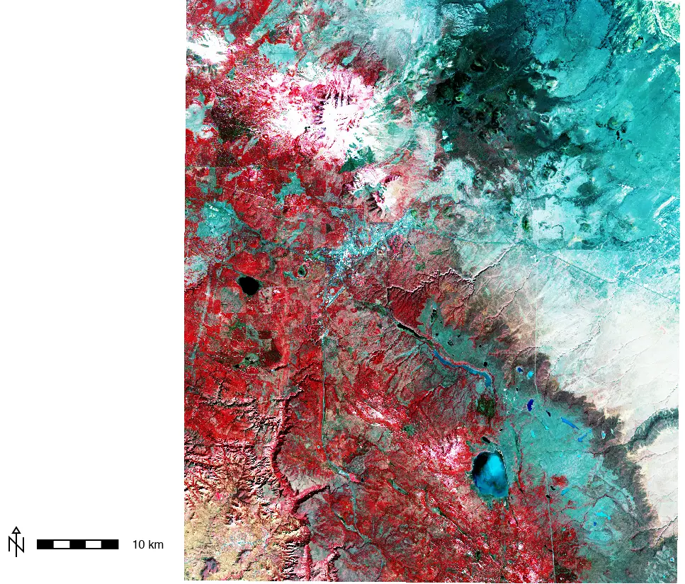
:::
:::::

::: {.callout-note title="Dataset"}
Este tutorial utiliza uno de los conjuntos de datos de muestra estándar de GRASS para Flagstaff, Arizona, EE. UU.: [flagstaff_arizona_usa](https://grass.osgeo.org/sampledata/flagstaff_az_usa_epsg6341.zip).
Nos referiremos a los topónimos de ese conjunto de datos, pero puede completarse con cualquiera de los [conjuntos de datos de muestra estándar](https://grass.osgeo.org/download/data/) para cualquier región, por ejemplo, la [Conjunto de datos de Carolina del Norte](https://grass.osgeo.org/sampledata/north_carolina/nc_spm_08_grass7.zip).

Utilizaremos un conjunto de imágenes del satélite **Landsat 8** y el mapa ráster DEM de *elevación* (elevation). Sin embargo, este tutorial también puede utilizarse con otras imágenes multibanda, como Sentinel o Terra/ASTER. Con imágenes satelitales distintas a las del Landsat 8, los números de banda pueden diferir de los descritos en este tutorial.
:::

::: {.callout-note title="GRASS environment"}
Este tutorial está diseñado para que puedas completarlo utilizando la **GUI de GRASS**, comandos de GRASS desde la **consola o terminal**, o utilizando comandos de GRASS en un entorno de **Jupyter Notebook**.
:::

::: {.callout-note title="Don't know how to get started?"}
Si no está seguro de cómo comenzar a utilizar GRASS utilizando su interfaz gráfica de usuario o utilizando Python, consulte los tutoriales [Get started with GRASS GUI](../get_started/fast_track.qmd) y [Get started with GRASS & Python in Jupyter Notebooks](../get_started/fast_track_grass_and_python.qmd).
:::

# Conceptos básicos de teledetección

## Diversas formas de teledetección

Existen diversas formas de teledetección. Este tutorial se centrará en las plataformas espaciales de teledetección.

:::::: grid
::: g-col-4
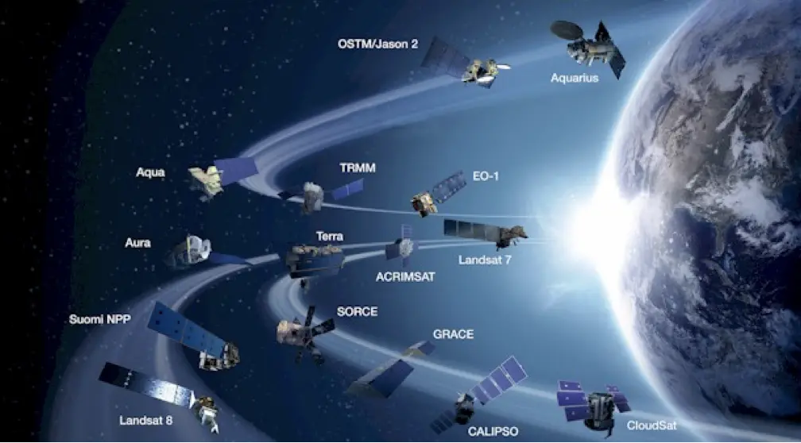{style="width: 100%"}
:::

::: g-col-4
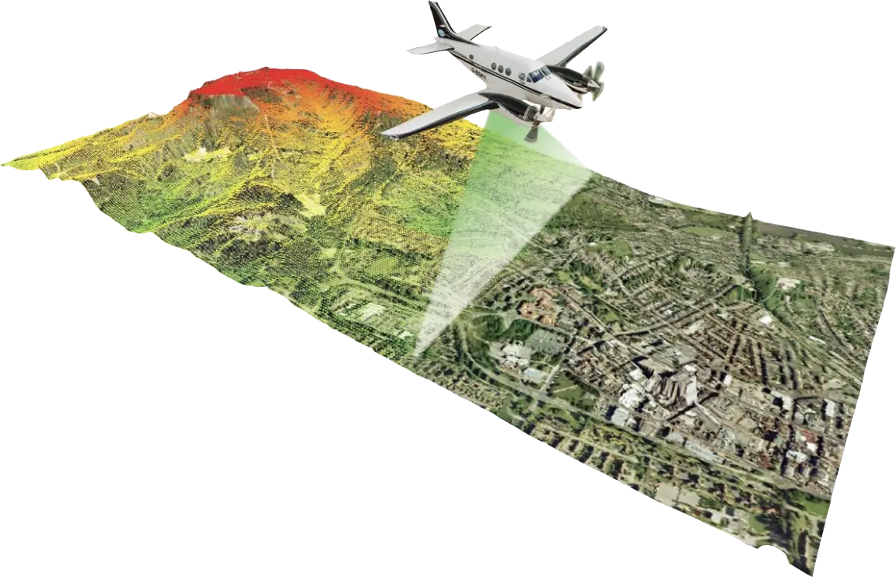{style="width: 100%"}
:::

::: g-col-4
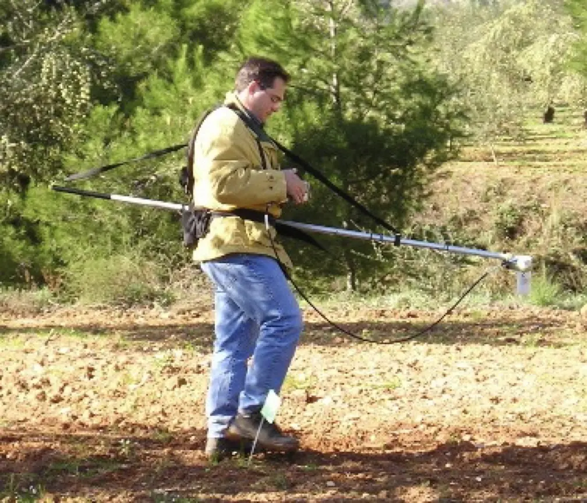{style="width: 100%"}
:::
::::::

## Plataformas espaciales

::::: grid
::: g-col-5
-   Estos satélites cuentan con sensores que capturan la reflectancia de **la radiación electromagnética (EM)** solar que llega a la Tierra, incluyendo la EM que percibimos como luz visible.

-   Diferentes materiales absorben, emiten y reflejan la radiación EM en diferentes frecuencias.

-   Los sensores espaciales capturan imágenes en múltiples frecuencias EM en diferentes «**bandas**» o «**canales**» para permitir la identificación de diferentes materiales o características.

-   Las imágenes de banda de sensores, como rásteres, se pueden combinar matemáticamente de diferentes maneras para permitir la visualización o identificación de características o materiales.
:::

::: g-col-7
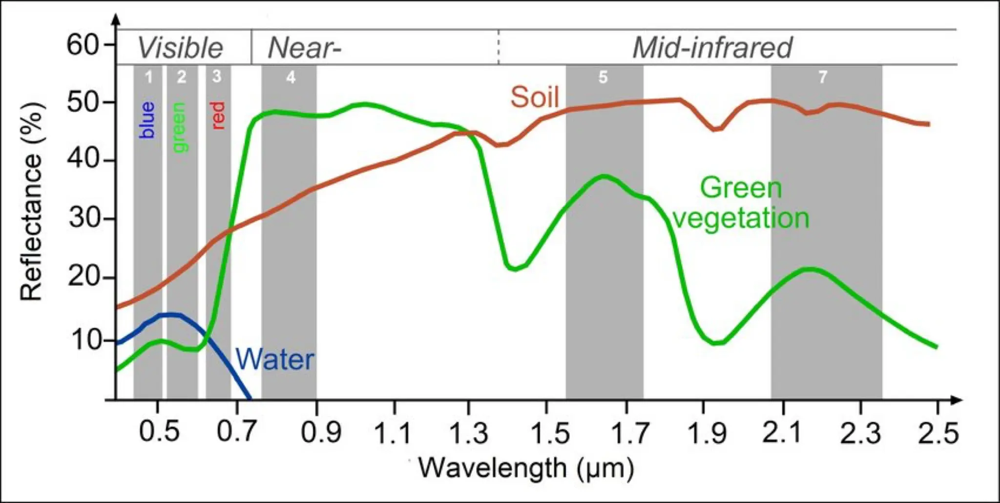

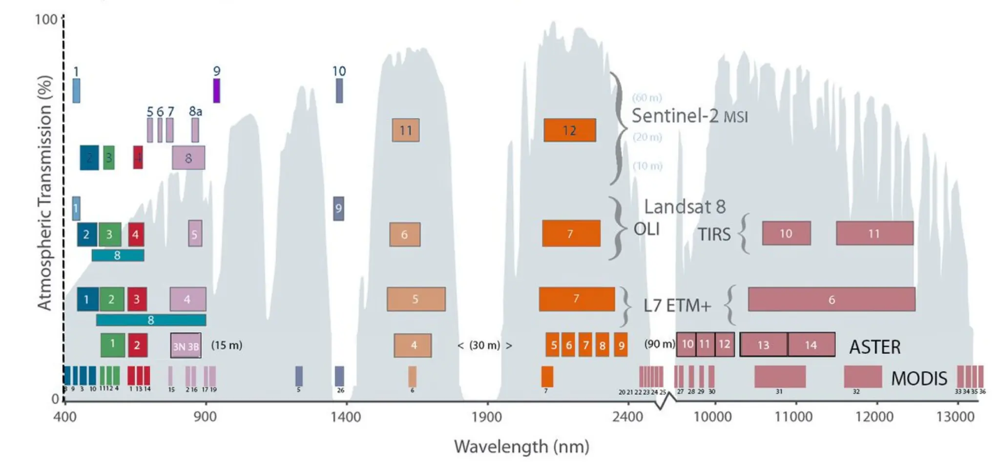
:::
:::::

# Visualización de imágenes de teledetección multibanda en GRASS

GRASS cuenta con numerosas herramientas para combinar y analizar imágenes monobanda y multibanda. En este tutorial, exploraremos algunas de estas herramientas analíticas utilizando imágenes de la región de Flagstaff del satélite **Landsat 8**.

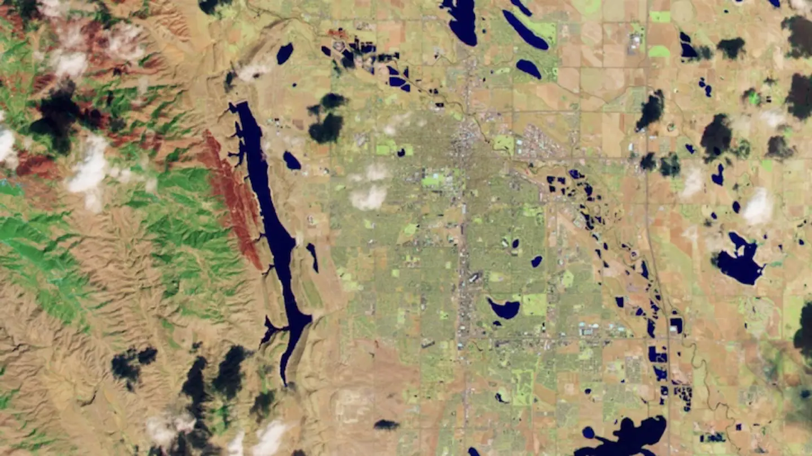{width="80%"}

## Bandas Landsat para analizar

Las siguientes bandas Landsat 8 se proporcionan con el conjunto de datos de Flagstaff:

-   *landsat8_2024_B1* : azul visible de alta frecuencia para nubes cirros\
-   *landsat8_2024_B2* : azul visible\
-   *landsat8_2024_B3* : verde visible\
-   *landsat8_2024_B4* : rojo visible\
-   *landsat8_2024_B5* : Infrarrojo cercano\
-   *landsat8_2024_B6* : infrarrojo medio (frecuencia más alta))\
-   *landsat8_2024_B7* : infrarrojo medio (frecuencia más baja)

En este tutorial, utilizaremos las bandas 2-7 del Landsat 8..

## Visualizar bandas individuales del Landsat

::::: grid
::: g-col-6
-   Cargue las **bandas 2 a 7** en el administrador de capas, pero no la banda 1 (*landsat8_2024_B1*).

-   Observe lo oscura que es cada imagen.

Esto se debe a que, aunque cada celda podría tener uno de 65,536 valores, casi todos se encuentran dentro de un rango muy estrecho.

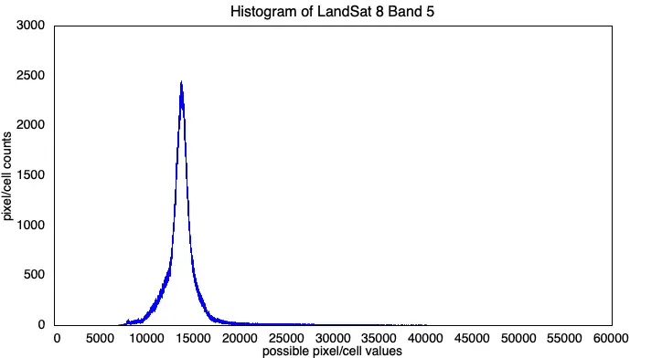
:::

::: g-col-6
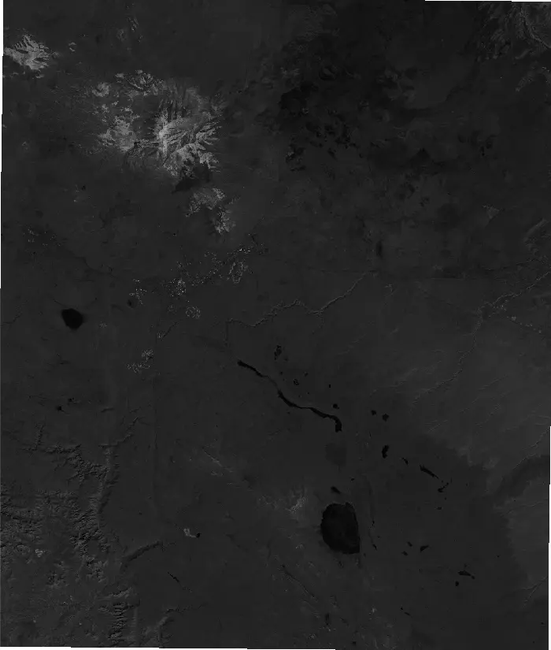
:::
:::::

## Ecualización de histograma

La gama de tonos de gris se puede reasignar a los valores de las celdas para que cubran completamente un continuo de negro a blanco. Esto se puede hacer en [r.colors](https://grass.osgeo.org/grass-stable/manuals/r.colors.html) "ecualizando" el histograma de color de las celdas.

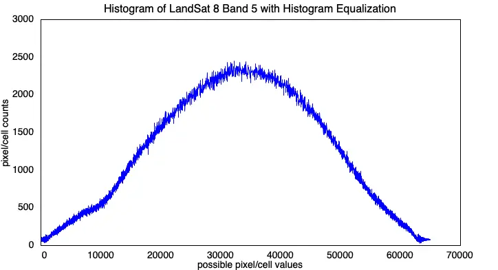{width="80%"}

### Ecualización de histograma en GRASS

El uso de [r.colors](https://grass.osgeo.org/grass-stable/manuals/r.colors.html) para la ecualización de histograma mejorará la visibilidad de la imagen, pero no modificará los valores de sus celdas.

::::::::: {.panel-tabset group="language"}
#### GUI

::::: grid
::: g-col-6
1.  Seleccione *r.colors* en el menú **Raster/Administrar colores** (Raster/Manage colors).

2.  Introduzca una imagen Landsat en el cuadro de texto **Nombre del mapa ráster** (Raster map name).
:::

::: g-col-6
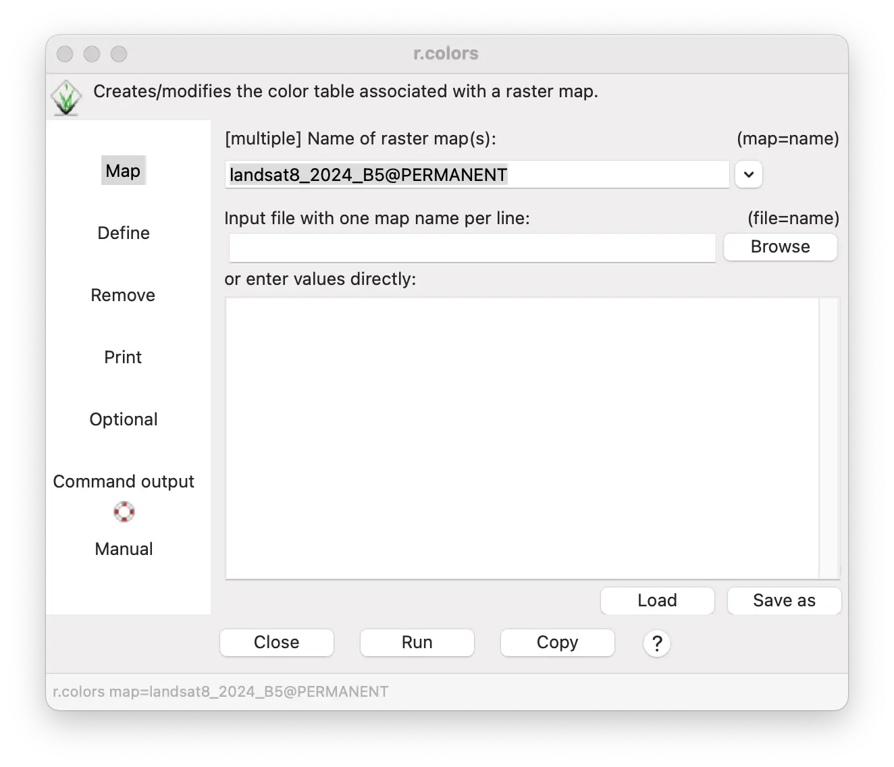
:::
:::::

::::: grid
::: g-col-6
3.  Marque la casilla **ecualización del histograma** (histogram equalization).

4.  Seleccione *gris* (grey) en el cuadro de texto **Nombre de la tabla de colores** (Name of the color chart).

5.  Pulse **Ejecutar** (Execute).

6.  Haga lo mismo para cada banda Landsat.\
:::

::: g-col-6
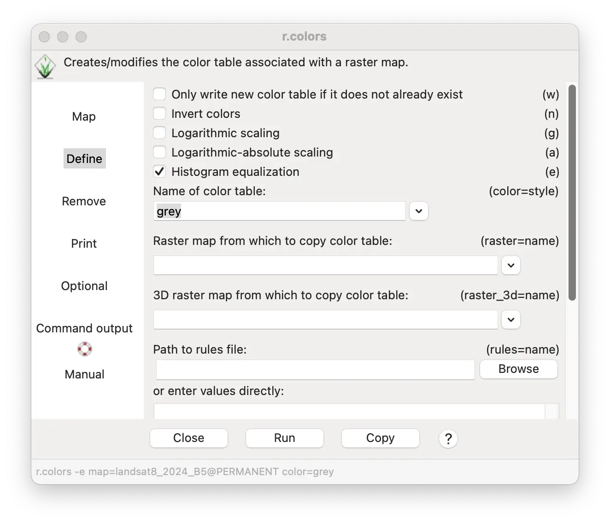
:::
:::::

#### línea de comando

```{bash}
r.colors -e map=landsat8_2024_B2 color=grey
r.colors -e map=landsat8_2024_B3 color=grey
r.colors -e map=landsat8_2024_B4 color=grey
r.colors -e map=landsat8_2024_B5 color=grey
r.colors -e map=landsat8_2024_B6 color=grey
r.colors -e map=landsat8_2024_B7 color=grey
```

#### Python

```{bash}
gs.run_command("r.colors",
               map=landsat8_2024_B2,
               color=grey,
               flags="e")
gs.run_command("r.colors",
               map=landsat8_2024_B3,
               color=grey,
               flags="e")
gs.run_command("r.colors",
               map=landsat8_2024_B4,
               color=grey,
               flags="e")
gs.run_command("r.colors",
               map=landsat8_2024_B5,
               color=grey,
               flags="e")
gs.run_command("r.colors",
               map=landsat8_2024_B6,
               color=grey,
               flags="e")
gs.run_command("r.colors",
               map=landsat8_2024_B7,
               color=grey,
               flags="e")
               
```
:::::::::

Todos los ejemplos descritos en el resto de este tutorial se realizan con imágenes estiradas mediante histograma.

::: {.callout-note title="Tip"}
Histograma cada imagen **por separado** en lugar de hacerlo todas juntas, ya que cada imagen tiene una distribución diferente de valores de píxeles/celdas que estirar.
:::

------------------------------------------------------------------------

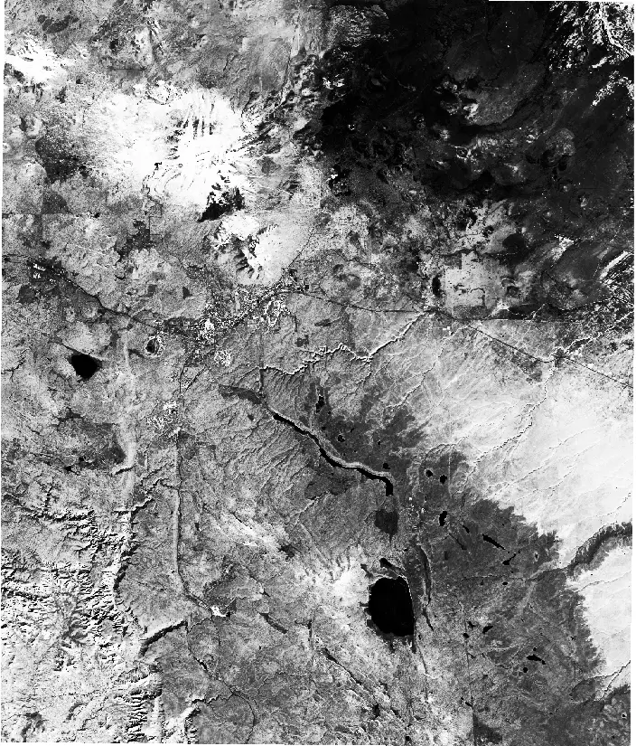{width="80%"}

# Fusión de imágenes

## Fusión de imágenes a color de bandas Landsat

Cada imagen Landsat tiene valores de celda que representan la intensidad de reflectancia en un rango específico de frecuencias EM (es decir, múltiples bandas de imagen). Al visualizarse como ráster, una sola banda Landsat aparece como un mapa variable de un solo color (p. ej., en escala de grises).

La **fusión de imágenes** se refiere a las formas de combinar múltiples bandas para visualizarlas como una imagen a todo color. En términos simples, esto implica definir tres bandas de imagen como los canales rojo, verde y azul de una **imagen RGB multicolor**. La visualización a color resultante muestra las áreas con combinaciones similares de reflectancia en las tres bandas seleccionadas (p. ej., vegetación, agua o carreteras) como si tuvieran el mismo color y se diferencian de las áreas con diferentes combinaciones de reflectancia.

Esto se puede hacer fácilmente en GRASS usando la herramienta [*d.rgb*](https://grass.osgeo.org/grass-stable/manuals/d.rgb.html) en el administrador de capas.

## Fusión de imágenes en el administrador de capas {#image-fusion-layermgr}

::::: grid
::: g-col-6
1.  Seleccione **Agregar capa de mapa RGB** (Add RGB map layer) de la herramienta **Agregar varias capas ráster** (Add multiple raster layers).
:::

::: g-col-6
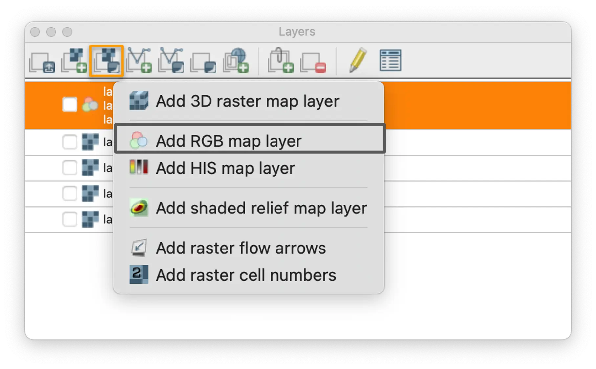
:::
:::::

::::: grid
::: g-col-6
2.  Seleccione las bandas Landsat para definirlas como los canales rojo, verde y azul de una imagen multicolor.

3.  Para una fusión de imágenes de "color natural", pruebe:

    -   Banda 4 (EM rojo visible) en rojo (red)
    -   Banda 3 (EM verde visible) en verde (green)
    -   Banda 2 (EM azul visible) en azul (blue)
:::

::: g-col-6
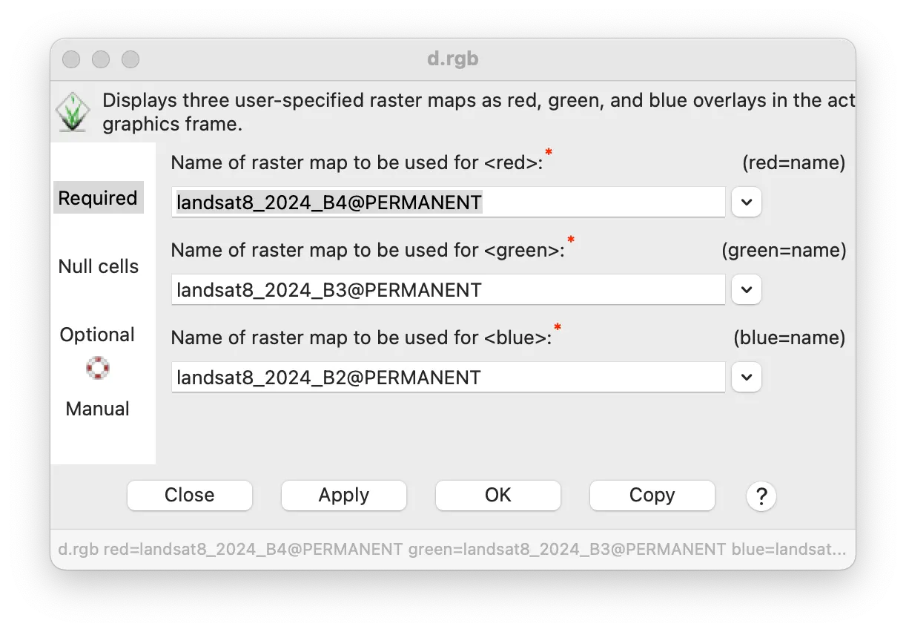

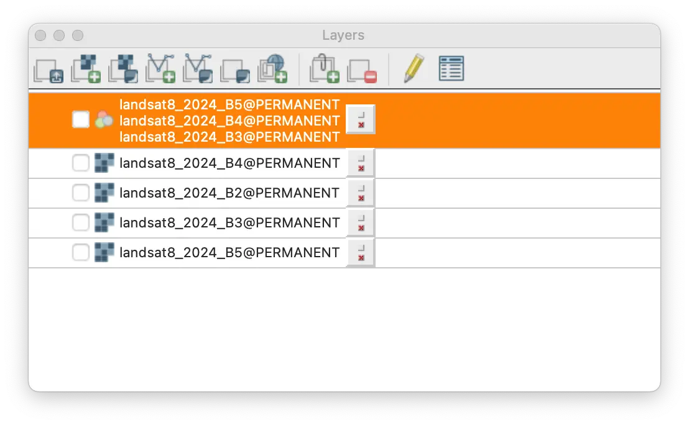
:::
:::::

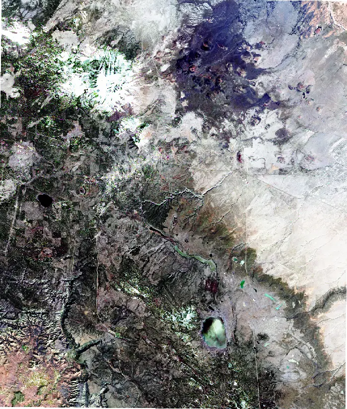{width="80%"}

## Fusión de imágenes: otras combinaciones de bandas

Prueba otras combinaciones para resaltar diferentes características.

::::: grid
::: g-col-6
-   Usando las bandas 5, 4 y 3 se resalta la clorofila (vegetación) en rojo.
:::

::: g-col-6
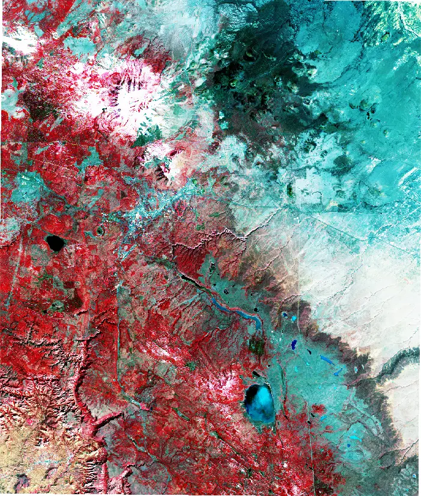
:::
:::::

::::: grid
::: g-col-6
-   La fusión de imágenes con las bandas 6, 5 y 3 utiliza EM infrarrojo para resaltar otras coberturas y usos del suelo de manera diferente.
:::

::: g-col-6
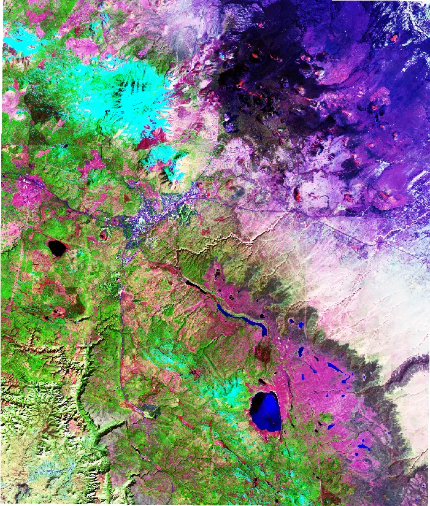
:::
:::::

# Índices ambientales

## Información ambiental a partir de combinaciones matemáticas de bandas de teledetección

Debido a que diferentes materiales (incluida distinta vegetación, suelos y agua) reflejan, absorben y emiten EM en diferentes frecuencias, se pueden derivar muchos tipos de información ambiental con diferentes combinaciones de bandas.

GRASS puede generar una gran cantidad de índices ambientales con su amplio conjunto de herramientas de imágenes (consulte el menú **Imágenes** (Images)), así como con la *calculadora de mapas* (map calculator) ráster. Existen herramientas adicionales para productos de imágenes de teledetección disponibles como extensiones de GRASS.

Un índice ambiental comúnmente utilizado es el **NDVI**: el índice de vegetación de diferencia normalizada. El NDVI es un índice del crecimiento y la salud de las plantas. Se calcula a partir de bandas que detectan el infrarrojo cercano (NIR) y la luz roja visible.

$$
NDVI = \frac{NIR - rojo}{NIR + rojo}
$$

Si bien puede crear un mapa de NDVI utilizando la *calculadora de mapas* (map calculator), también se puede generar automáticamente desde GRASS [i.vi](https://grass.osgeo.org/grass-stable/manuals/i.vi.html) módulo, junto con muchos otros índices de vegetación.

::: {.callout-note title="Tip"}
Al generar cualquier mapa nuevo, como NDVI, recuerde asegurarse primero de que la **región** (region) esté configurada para coincidir con las imágenes LandSat.
:::

### Ejemplo de NDVI: índice de vegetación de diferencia normalizada

::::::::: {.panel-tabset group="language"}
#### GUI

**Establezca la región para que coincida con las imágenes Landsat**

1.  Añade una de las imágenes ráster LandSat al Administrador de capas.

2.  Haz clic derecho en la imagen LandSat en el Administrador de capas.

3.  Selecciona Establecer región computacional del mapa seleccionado.

::::: grid
::: g-col-6
**Calcular ráster NDVI**

1.  Seleccione la herramienta [i.vi](https://grass.osgeo.org/grass-stable/manuals/i.vi.html) del menú **Imágenes/Productos de imágenes satelitales/Índices de vegetación** (Images/Satellite imagery products/Vegetation indices).

2.  Seleccione **NDVI** como índice a calcular.

3.  Ingrese el nombre del **mapa de salida** (output map) que desea crear.
:::

::: g-col-6
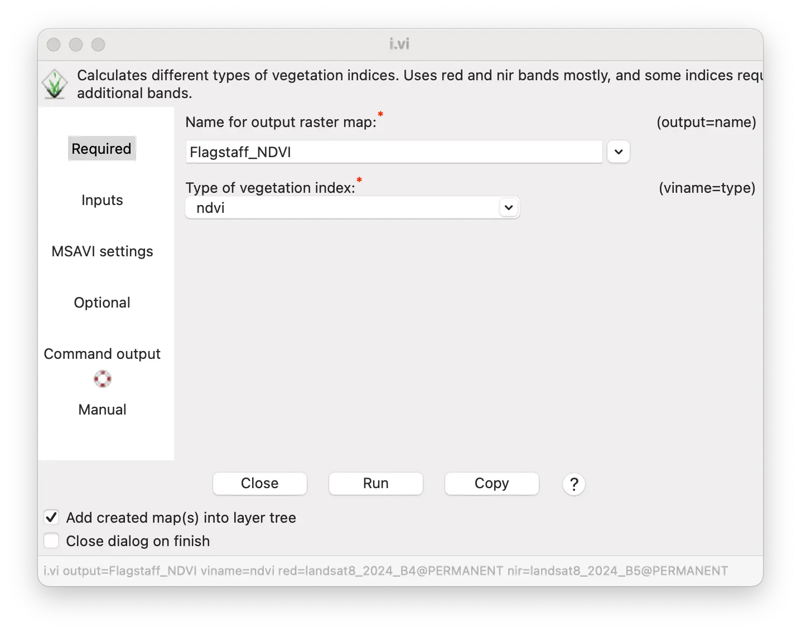
:::
:::::

::::: grid
::: g-col-6
4.  Introduzca la banda 4 para el **canal rojo** (red channel).

5.  Introduzca la banda 5 para el **canal NIR (infrarrojo cercano)** (NIR channel).
:::

::: g-col-6
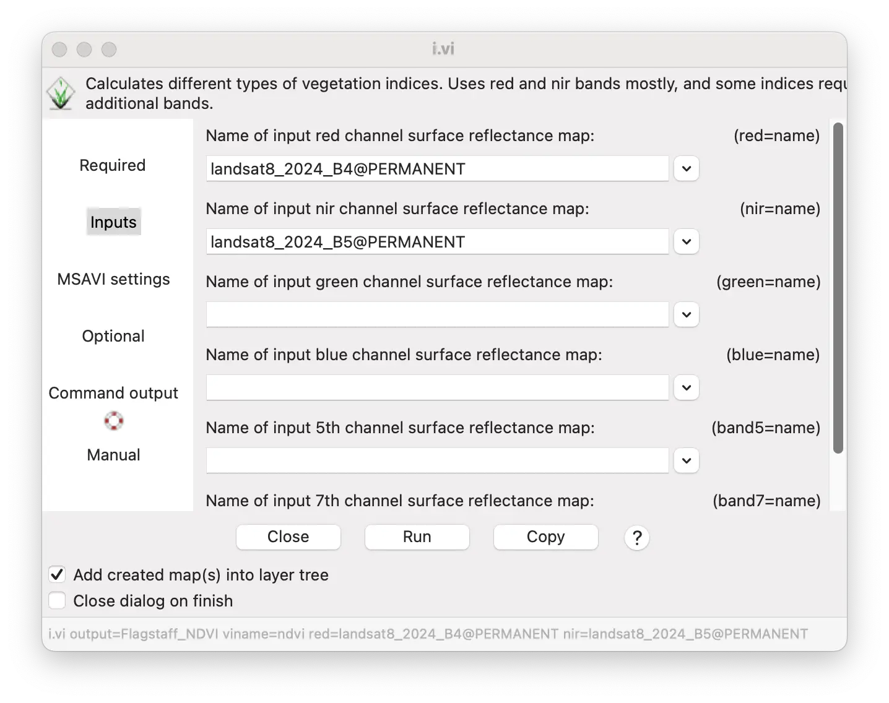
:::
:::::

#### línea de comando

1.  Establezca la región para que coincida con las imágenes Landsat.

2.  Utilice la herramienta [i.vi](https://grass.osgeo.org/grass-stable/manuals/i.vi.html) para crear un mapa de valores NDVI.

```{bash}
g.region raster=landsat8_2024_B2

i.vi output=Flagstaff_NDVI viname=ndvi red=landsat8_2024_B4 nir=landsat8_2024_B5
```

#### Python

1.  Establezca la región para que coincida con las imágenes Landsat.

2.  Utilice la herramienta [i.vi](https://grass.osgeo.org/grass-stable/manuals/i.vi.html) para crear un mapa de valores NDVI.

```{bash}
gs.run_command("g.region", raster="landsat8_2024_B2")

gs.run_command("i.vi", 
                output=Flagstaff_NDVI, 
                viname=ndvi, 
                red=landsat8_2024_B4, 
                nir=landsat8_2024_B5
  )
```
:::::::::

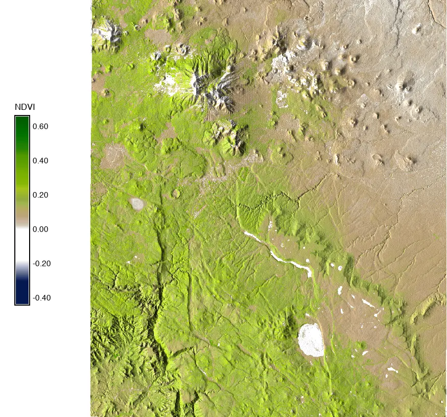{width="80%"}

# Combinando información de muchas bandas de imágenes

Podemos visualizar tres bandas simultáneamente con una imagen en color RGB. Pero ¿cómo podemos usar la información de las seis bandas Landsat simultáneamente? Esto requiere el uso de estadísticas multivariantes para la reducción de dimensionalidad. GRASS cuenta con múltiples herramientas analíticas para la reducción de dimensionalidad.

Aquí exploraremos el análisis de componentes principales (ACP). El ACP combina matemáticamente las variables originales (las bandas Landsat) para crear nuevas variables "componentes" que capturan la mayor parte de la variación en las bandas Landsat originales.

## PCA de imágenes multibanda con GRASS

:::::: {.panel-tabset group="language"}
#### GUI

::::: grid
::: g-col-6
1.  Abra el módulo de análisis de componentes principales (PCA), [*i.pca*](https://grass.osgeo.org/grass-stable/manuals/i.pca.html), que se encuentra en el menú **Imágenes/Transformar imágenes** (Images/Transform images).

2.  Introduzca **nombres de imágenes para las bandas Landsat 2-7** (names of images for Landsat bands 2-7).

3.  Proporcione un **nombre de base de salida** (output base name). A este nombre de base de salida se le añadirá un número que representa los mapas de componentes de PCA calculados.

4.  Hay otras opciones, pero la predeterminada es la correcta por ahora.

5.  Pulsa "Ejecutar".
:::

::: g-col-6
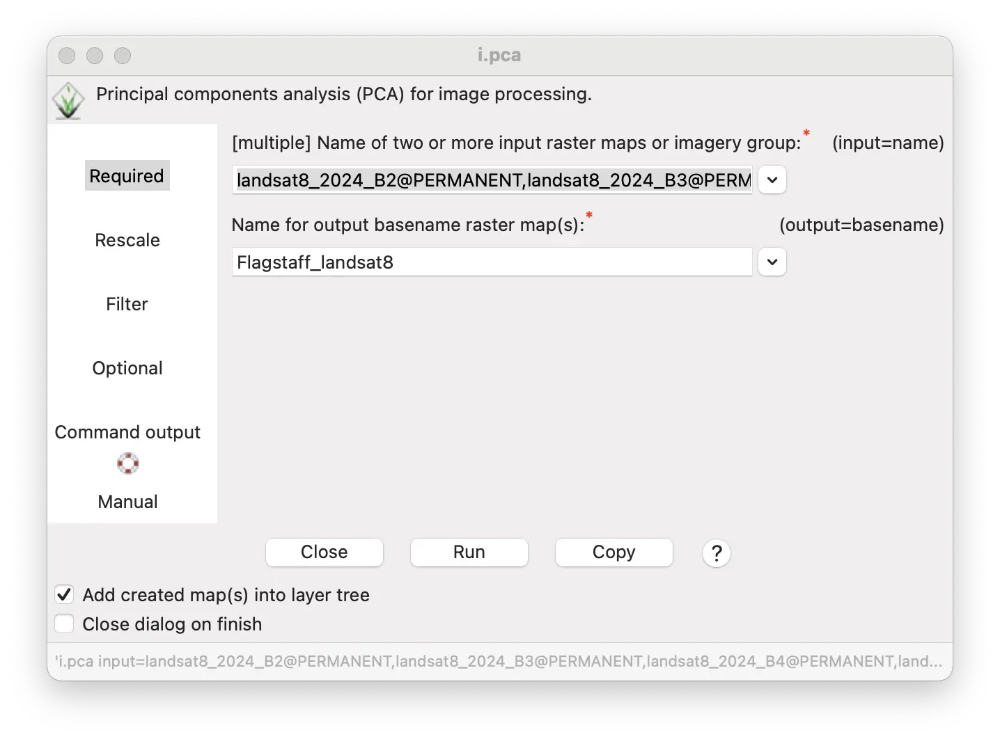
:::
:::::

#### Línea de comandos

Realiza un análisis de componentes de PCA y envía los resultados a la consola/terminal y como mapas de componentes de PCA.

```{bash}
i.pca input=landsat8_2024_B2,landsat8_2024_B3,landsat8_2024_B4, landsat8_2024_B5,landsat8_2024_B6,landsat8_2024_B7 output=Flagstaff_landsat8
```

#### Python

Realice un PCA y envíe los resultados a la consola/terminal y como mapas de componentes PCA.

```{bash}
gs.run_command("i.pca", 
                input="landsat8_2024_B2,landsat8_2024_B3,landsat8_2024_B4, landsat8_2024_B5,landsat8_2024_B6,landsat8_2024_B7", 
                output=Flagstaff_landsat8)
```
::::::

### Trabajo con resultados de PCA

Los detalles estadísticos de la salida de PCA aparecen en la consola o terminal, como se muestra a continuación. Cada línea de la salida representa un componente de PCA.

La lista de valores entre paréntesis muestra el vector propio de cada componente del PCA. Los 6 valores indican la contribución de cada una de las imágenes Landsat 2 a 7 al componente. Los números positivos o negativos más altos indican mayores contribuciones de una banda al componente. Por ejemplo, la banda 4 de Landsat tiene la mayor contribución al componente 1 del PCA, mientras que la banda 6 tiene la mayor contribución al componente 2.

El porcentaje entre paréntesis representa la cantidad de variación en las bandas originales Landsat 2 a 7 que captura dicho componente PCA. Por ejemplo, el componente PCA 1 captura el 58 % de la variación en las 6 bandas originales y el componente PCA 2, el 35 %.

```         
Eigen valores (vectores) [% importancia]

PC1 14640530.56 ( 0.4461, 0.4915, 0.5480, 0.4167, 0.1994, 0.2136) [58.03%]
PC2 8850161.06 ( 0.2240, 0.1951, 0.1050, 0.0543,-0.7001,-0.6385) [35.08%]
PC3 1502032.84 ( 0.2335, 0.1528, 0.2947,-0.8794,-0.1102, 0.2231) [ 5.95%]
PC4 108422.28 ( 0.4370,-0.8041, 0.3529, 0.0416, 0.1120,-0.1536) [ 0.43%]
PC5 94291.01 ( 0.4417, 0.2122,-0.4285,-0.1814, 0.5597,-0.4797) [ 0.37%]
PC6 34241.78 ( 0.5570,-0.0735,-0.5418, 0.1242,-0.3636, 0.4931) [ 0.14%]
```

::::: grid
::: g-col-6
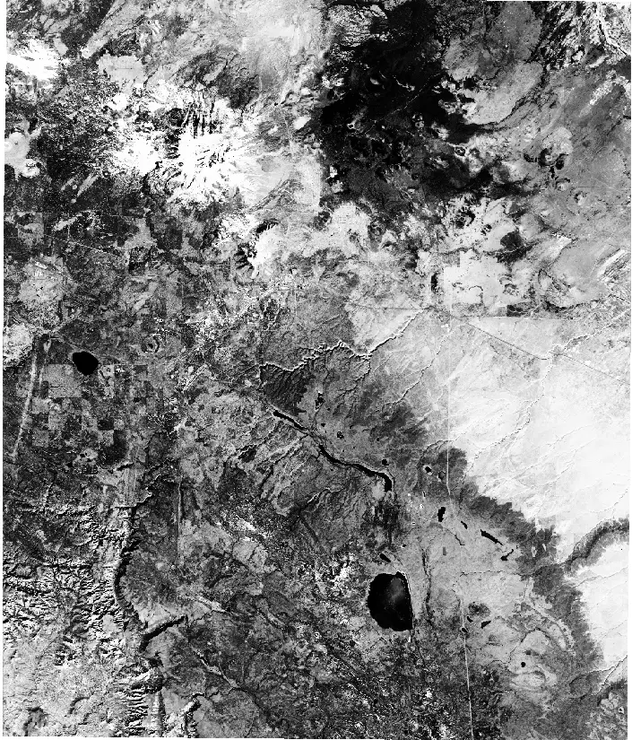
:::

::: g-col-6
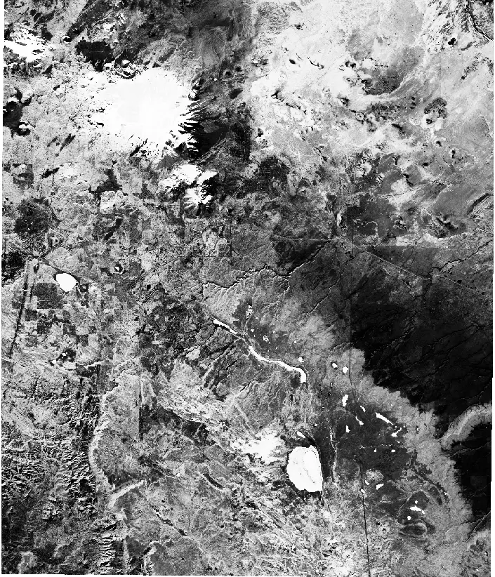
:::
:::::

### Visualización de los resultados de PCA

::::: grid
::: g-col-6
Para visualizar mejor la variación espacial en una imagen de componentes PCA, se puede asignar una tabla de colores diferente a la escala de grises estándar. Esto suele denominarse **"imagen de color falso"** (false color image).

Aquí se muestra el componente 1 de PCA coloreado con una tabla de colores **bcyr** (azul-cian-amarillo-rojo) con la **ecualización de histograma** (histogram equalization) activada.

Siga las instrucciones anteriores para la ecualización de histograma, pero seleccione `bcyr` en lugar de gris para la tabla de colores.

Observe cómo las áreas de diferente vegetación, suelo y agua se destacan con mayor claridad que con la escala de grises. Pruebe con otras tablas de colores.
:::

::: g-col-6
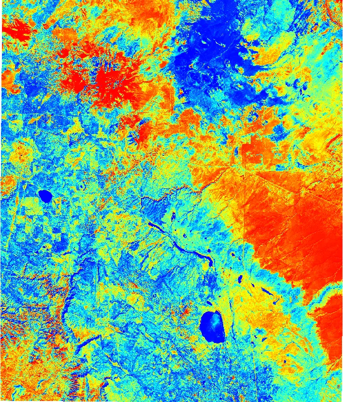{width="80%"}
:::
:::::

### Fusión de imágenes con resultados de PCA

::::: grid
::: g-col-6
Los métodos de fusión de imágenes descritos anteriormente para múltiples bandas Landsat también pueden utilizarse para los resultados de PCA.

El resultado de texto de PCA mostrado arriba indica que los tres primeros componentes de PCA capturan el 97 % de la variación en las seis bandas Landsat originales (2-7). Esto significa que podemos visualizar casi toda la información de las seis bandas Landsat originales creando una imagen en color RGB de los componentes de PCA 1, 2 y 3 utilizando [*d.rgb*](https://grass.osgeo.org/grass-stable/manuals/d.rgb.html) en el administrador de capas..

Siga los procedimientos descritos en la sección [Fusión de imágenes en el administrador de capas](#image-fusion-layermgr) utilizando los componentes PCA 1-3.

Las áreas con diferente vegetación, agua, construcciones urbanas y otras modificaciones del paisaje realizadas por el hombre se destacan con colores distintivos.
:::

::: g-col-6
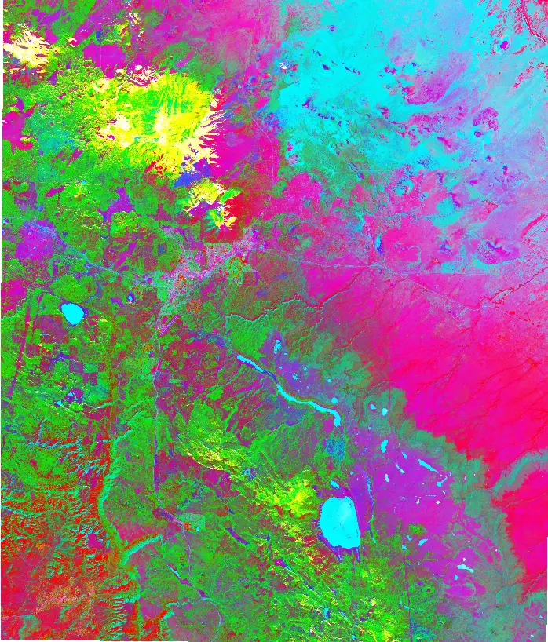
:::
:::::

::::: grid
::: g-col-6
A veces, los componentes PCA menos importantes también pueden ser informativos, aunque capturen un pequeño porcentaje de la variación general en las bandas Landsat.

Pruebe la fusión de imágenes RGB con los componentes PCA 4, 5 y 6. ¿En qué se diferencia esta imagen de una que utiliza los componentes PCA 1, 2 y 3?
:::

::: g-col-6
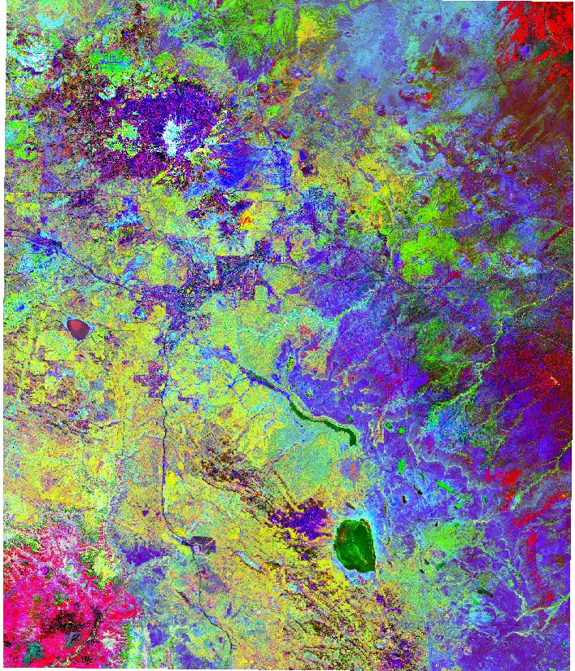
:::
:::::

## Combinación de imágenes de teledetección con otros datos SIG

En GRASS, las imágenes de teledetección son simplemente rásteres, como los mapas de elevación DEM o los mapas de uso del suelo. Esto significa que podemos combinar imágenes de teledetección con cualquier otro tipo de mapa disponible en su base de datos SIG.

Por ejemplo, un mapa vectorial de arroyos y lagos se puede superponer en el Administrador de Capas sobre la fusión de imágenes de los componentes PCA 1-3 creada anteriormente.

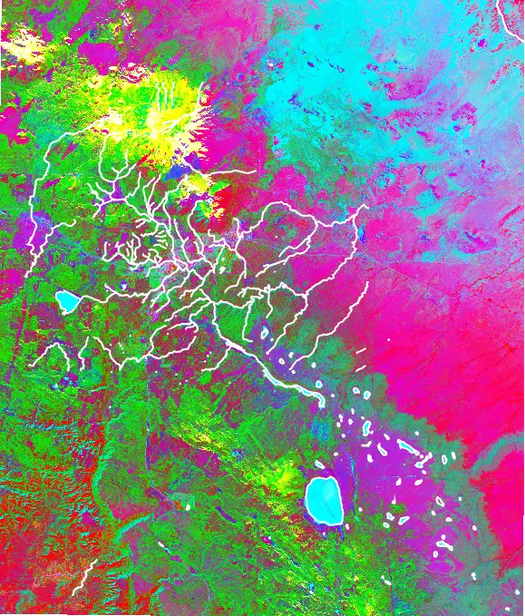{width="80%"}

# Visualización 3D de teledetección y SIG

La fusión de imágenes también permite añadir color a la topografía de múltiples maneras. Esto permite visualizar información de imágenes satelitales o productos derivados, como componentes PCA, junto con el relieve topográfico.

La fusión de imágenes con componentes PCA de imágenes Landsat, combinada con el relieve de un DEM, permite representar información en 6 bandas del espectro electromagnético (EM), elevación, pendiente y orientación en una única visualización de 9 dimensiones.

Estas visualizaciones complejas se pueden realizar fácilmente en GRASS creando un nuevo mapa de relieve sombreado en color en el administrador de capas. Esto requiere solo unos pasos.

1.  Cree un mapa de relieve topográfico a partir de un DEM.

2.  Combine bandas de satélite o componentes PCA en un nuevo mapa de color RGB.

3.  Use el mapa de color RGB para sombrear el mapa de relieve en un nuevo mapa de relieve sombreado en color en el Administrador de capas.

## Generación de un mapa de relieve topográfico en el Administrador de capas

Se puede generar un mapa de relieve a partir del MDE de elevación utilizando la herramienta [r.relief](https://grass.osgeo.org/grass-stable/manuals/r.relief.html) del menú **Ráster/Análisis del terreno/Calcular relieve sombreado**

:::::: {.panel-tabset group="language"}
#### GUI

::::: grid
::: g-col-6
1.  Abra *r.relief*.

2.  Seleccione la *elevación* (elevation) en el cuadro de texto **Ráster de entrada** (Input raster) .

3.  Introduzca *elevation_relief* en el cuadro de texto **Nombre para el mapa de relieve sombreado de salida** (Name for output shaded relief map).

4.  Introducir un número mayor que 1 (p. ej., 3) como **Factor de exageración del relieve** (Factor for exaggerating relief) hará que el relieve topográfico sea más visible.

5.  Pulse Ejecutar.
:::

::: g-col-6
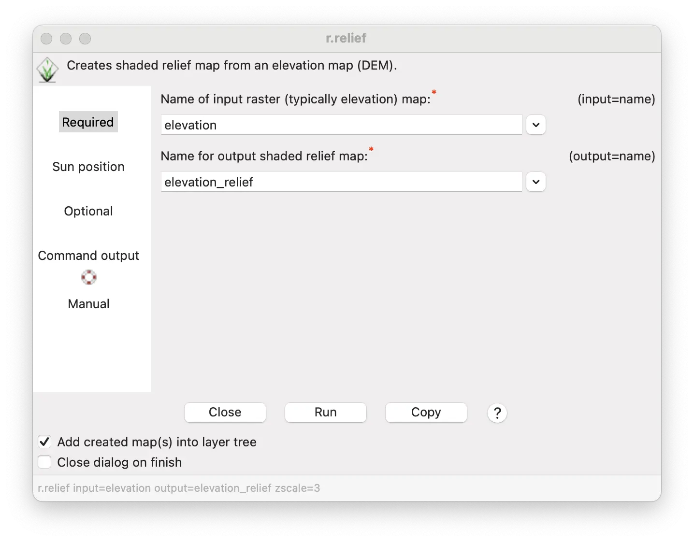

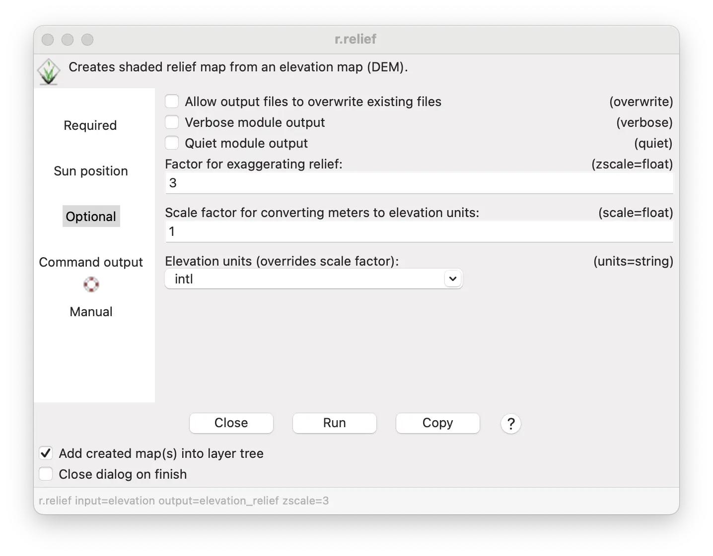
:::
:::::

#### línea de comando

```{bash}
r.relief input=elevation output=elevation_relief zscale=3
```

#### Python

```{bash}
gs.run_command("r.relief", 
                input="elevation", 
                output="elevation_relief", 
                zscale=3)
```
::::::

### Generación de un mapa de color RGB a partir de la fusión de imágenes

Utilice la herramienta [r.composite](https://grass.osgeo.org/grass-stable/manuals/r.composite.html) del menú **Raster/Administrar colores/Crear RGB** (Raster/Manage colors/Create RGB)para crear un nuevo mapa RGB a partir de la fusión de 3 mapas de componentes PCA.

:::::: {.panel-tabset group="language"}
#### GUI

::::: grid
::: g-col-6
1.  Abra *r.composite*.

2.  Introduzca los mapas de componentes PCA 1-3 en los **cuadros de texto rojo, verde y azul** (red, green, and blue text entry boxes).

3.  Introduzca Flagstaff_landsat8PCA_123_RGB como **mapa RGB de salida** (output RGB map).

4.  Pulse Ejecutar.\
:::

::: g-col-6
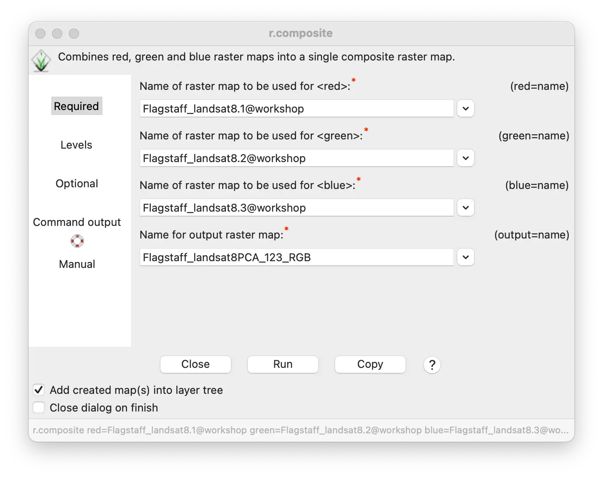
:::
:::::

#### línea de comando

```{bash}
r.composite red=Flagstaff_landsat8.1 green=Flagstaff_landsat8.2 blue=Flagstaff_landsat8.3 output=Flagstaff_landsat8PCA_123_RGB
```

#### Python

```{bash}
gs.run_command("r.composite", 
                red="Flagstaff_landsat8.1", 
                green="Flagstaff_landsat8.2", 
                blue="Flagstaff_landsat8.3", 
                output="Flagstaff_landsat8PCA_123_RGB")
```
::::::

## Combinación de relieve y un mapa de fusión de imágenes a color

Un mapa de relieve topográfico y un mapa de fusión de imágenes RGB se pueden combinar con la herramienta [d.shade](https://grass.osgeo.org/grass-stable/manuals/d.shade.html) del administrador de capas o con la herramienta [r.shade](https://grass.osgeo.org/grass-stable/manuals/r.shade.html) del menú **/Raster/Terrain analysis/Apply shade to raster**.

:::::: {.panel-tabset group="language"}
#### GUI

::::: grid
::: g-col-6
**Crear una visualización de mapa de relieve sombreado en el administrador de capas**

1.  En el administrador de capas, seleccione **Añadir capa de mapa de relieve sombreado** (Add shaded relief map layer) (herramienta *d.shade*) en el botón de menú **Añadir varias capas de mapa ráster** (Add various raster map layers).

2.  Introduzca el mapa *elevation_relief* en el cuadro de texto **Nombre del relieve sombreado** (Name of shaded relief).

3.  Introduzca *Flagstaff_landsat8PCA_123_RGB* en el cuadro de texto **Nombre del ráster que se aplicará sobre el relieve** (Name of raster to drape over relief).

4.  Si establece el **Porcentaje de brillo** (Percent to brighten) en 30 o 40, creará una visualización más atractiva.
:::

::: g-col-6
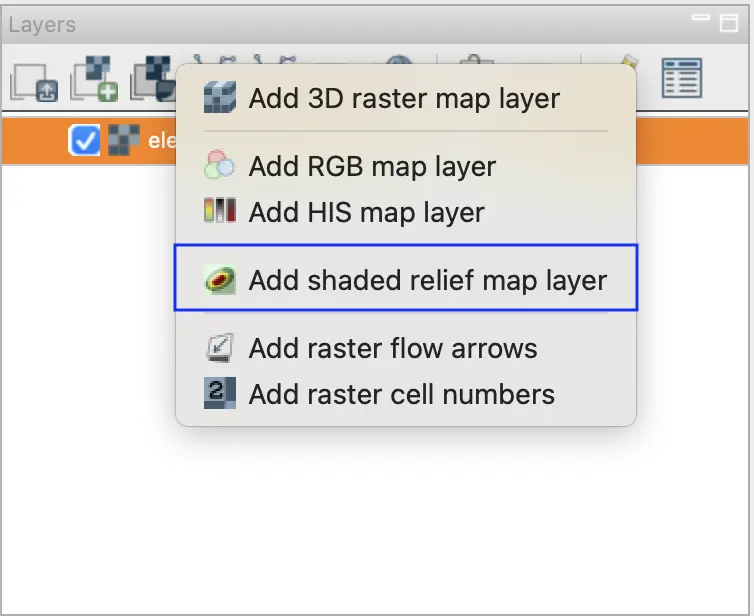

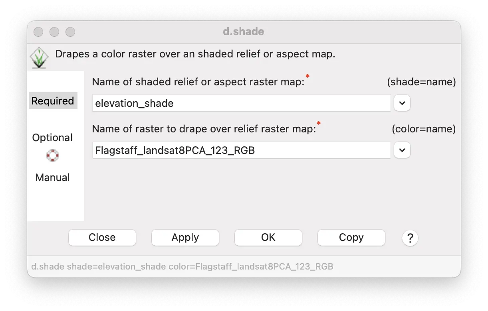
:::
:::::

**Crear un mapa ráster de relieve sombreado**

1.  Abra la herramienta *r.shade* desde el menú **/Ráster/Análisis del terreno/Aplicar sombreado al ráster** (/Raster/Terrain analysis/Apply shade to raster).

2.  Utilice las mismas entradas que las anteriores para el administrador de capas y asigne un nombre al mapa de salida que se creará (p. ej., *PCA_relief*).

#### Command line

```{bash}
r.shade shade=elevation_relief color=Flagstaff_landsat8PCA_123_RGB output=PCA_relief  brighten=40
```

#### Python

```{bash}
gs.run_command("r.shade", 
                shade="elevation_relief", 
                color="Flagstaff_landsat8PCA_123_RGB", 
                output="PCA_relief", 
                brighten=40)
```
::::::

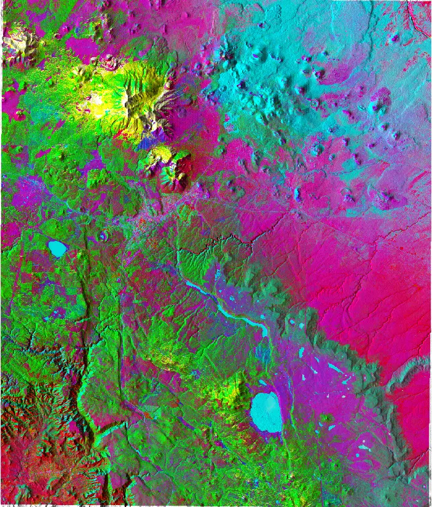{width="80%"}

### Visualización de la fusión de imágenes y topografía en NVIZ

Además, la fusión de imágenes PCA permite colorear una **visualización 3D** (3D view) de la topografía en la vista 3D de GRASS mediante el módulo NVIZ.

-   Comience abriendo el **MDE de elevación** (elevation DEM) en el administrador de capas. Asegúrese de que no se muestren otros mapas, excepto el de elevación.

-   Seleccione **Vista 3D** (3D view) en el menú desplegable de la parte superior de la ventana de visualización del mapa. Esto debería mostrar el mapa de elevación en 3D con el mismo sombreado que en la visualización 2D.

{width="80%"}

-   A continuación, seleccione la pestaña **datos** (data) en la ventana del administrador de visualización 3D (puede que sea más fácil gestionar la visualización 3D si la separa de la barra lateral en una ventana independiente). Asegúrese de que el mapa de elevación esté seleccionado en el cuadro **Mapa ráster** (Raster map) en la parte superior de la ventana de datos.

-   Desplácese hacia abajo hasta la sección **Color** y reemplace el mapa de elevación con el mapa ráster RGB de la fusión de imágenes PCA 1-3 (*Flagstaff_landsat8PCA_123_RGB*).

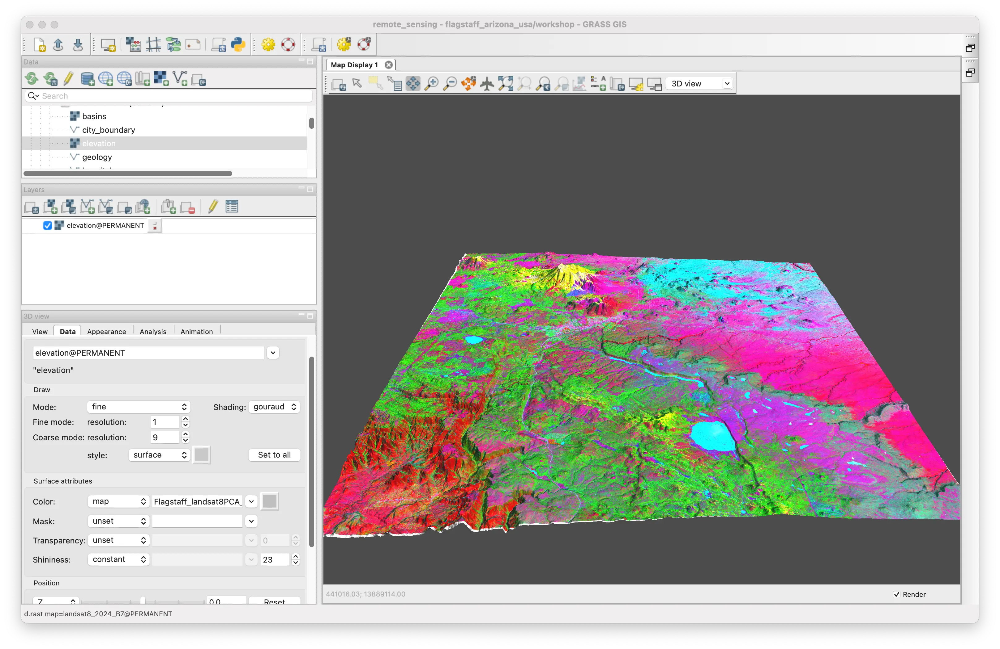{width="80%"}

# Teledetección avanzada con GRASS

GRASS tiene muchas más funciones y herramientas para trabajar con datos de teledetección. - Para las **imágenes satelitales** (satellite images), hay herramientas en el [menú Imágenes](https://grass.osgeo.org/grass-stable/manuals/imageryintro.html) y en los [complementos de GRASS](https://grass.osgeo.org/grass-stable/manuals/addons/)...

```         
-   Imagen [corrección y calibración](https://grass.osgeo.org/grass-stable/manuals/imageryintro.html#radiometric-corrections)  

-   Georectificación de imágenes (https://grass.osgeo.org/grass-stable/manuals/imageryintro.html#geocoding-of-imagery-data)

-   Algoritmos de aprendizaje automático para la clasificación de imágenes supervisada y no supervisada (https://grass.osgeo.org/grass-stable/manuals/imageryintro.html#image-classification) y la detección de características (https://grass.osgeo.org/grass-stable/manuals/addons/r.learn.ml2.html)

-   Análisis estadístico y visualización (https://grass.osgeo.org/grass-stable/manuals/rasterintro.html#raster-map-statistics) como se muestra en este tutorial
```

-   Las **series temporales** (time series) de satélite se pueden transformar en **cubos de tiempo** (time cubes) para su análisis con las herramientas exclusivas [GIS temporal](https://grass.osgeo.org/grass-stable/manuals/temporalintro.html) de GRASS.

-   Para la **fotografía aérea** (aerial photography), existen herramientas para....

    -   [Georectificación](https://grass.osgeo.org/grass-stable/manuals/imageryintro.html#geocoding-of-imagery-data)

    -   Rectificación 3D y distorsión de escaneo para corrección de [ortofotografía](https://grass.osgeo.org/grass-stable/manuals/i.ortho.photo.html)

    -   Mejora de imagen, incluidos filtros de [vecindario](https://grass.osgeo.org/grass-stable/manuals/r.neighbors.html), [convolución](https://grass.osgeo.org/grass-stable/manuals/r.mfilter.html), [detección de bordes](https://grass.osgeo.org/grass-stable/manuals/i.zc.html) y [transformada rápida de Fourier](https://grass.osgeo.org/grass-stable/manuals/i.fft.html).

-   GRASS cuenta con un amplio conjunto de herramientas raster y vectoriales para procesar y visualizar [datos LiDAR](https://grass.osgeo.org/grass-stable/manuals/vectorintro.html#lidar-data-processing), así como para la importación y procesamiento raster y vectorial de datos LiDAR.

-   Existen múltiples métodos para la [interpolación](https://grass.osgeo.org/grass-stable/manuals/rasterintro.html#raster-map-operations) de puntos de datos de **estudios geofísicos** (geophysical surveys).

-   Para la **geofísica 3D** (3D geophysics) (por ejemplo, tomografía eléctrica o radar de penetración terrestre), GRASS ofrece un conjunto único de verdaderas [herramientas de análisis de vóxeles 3D (3D voxel analysis tools)](https://grass.osgeo.org/grass-stable/manuals/raster3dintro.html) con visualización n-dimensional en [NVIZ](https://grass.osgeo.org/grass-stable/manuals/wxGUI.nviz.html).

Estas y otras herramientas hacen de GRASS un entorno de geoprocesamiento rico y poderoso para muchas aplicaciones de teledetección.

:::{.smaller}
El desarrollo de este tutorial fue financiado en parte por la Fundación Nacional de Ciencias de EE. UU. [NSF](https://www.nsf.gov/), premio [2303651](https://www.nsf.gov/awardsearch/showAward?AWD_ID=2303651)
:::

---

:::{.smaller}
*© Michael Barton y Eunice Villaseñor Iribe*
*El desarrollo de este tutorial fue financiado en parte por la Fundación Nacional de Ciencias de EE. UU. [NSF](https://www.nsf.gov/), premio [2303651](https://www.nsf.gov/awardsearch/showAward?AWD_ID=2303651)*
:::


