# Introduction

In this tutorial, we will estimate soil infiltration from USDA soil survey data
and use it to drive overland flow simulations with the SIMWE model at a 52 ha
research site in Raleigh, North Carolina.

[r.sim.water](https://grass.osgeo.org/grass-stable/manuals/r.sim.water.html)
represents infiltration with the `infil` parameter in mm/hr, which is often set
to a single value for an entire study area. Replacing that value with a raster
requires saturated hydraulic conductivity (Ksat) for every cell. Soil surveys do
not report Ksat in a form ready for modeling, they report texture, bulk density,
and horizon depths, so Ksat has to be estimated from those measurements with a
pedotransfer function.

We will:

1. Import USDA SSURGO soil texture with
   [r.in.ssurgo](https://grass.osgeo.org/grass-stable/manuals/addons/r.in.ssurgo.html)
2. Estimate Ksat with
   [r.soils.rosetta](https://grass.osgeo.org/grass-stable/manuals/addons/r.soils.rosetta.html),
   which implements the ROSETTA pedotransfer model
3. Run [r.sim.water](https://grass.osgeo.org/grass-stable/manuals/r.sim.water.html)
   three times, with a single infiltration value, with the estimated Ksat field,
   and with the Ksat SSURGO reports directly

Additional concepts covered in this tutorial:

* Downloading and initializing a published GRASS sample project
* Querying the Soil Data Access web service from the computational region
* Depth-weighted aggregation of soil horizon data
* Deriving Manning's n from land cover
* Comparing simulation runs that differ in one input

The study site is the North Carolina State University Sediment and Erosion
Control Research and Education Facility (SECREF). The data come from a GRASS
sample dataset assembled for SIMWE work [@petrasova_secref_2026].

::: {.callout-note title="How to run this tutorial?"}
This tutorial is prepared to be run in a Jupyter notebook locally or using
services such as Google Colab. You can
[download the notebook here](soil_informed_overland_flow.ipynb).

If you are not sure how to get started with GRASS, check out the tutorials
[Get started with GRASS & Python in Jupyter Notebooks](../get_started/fast_track_grass_and_python.qmd)
and [Get started with GRASS in Google Colab](../get_started/grass_gis_in_google_colab.qmd).
:::

For the empirical alternative to this workflow, the
[SIMWE parallelization tutorial](../parallelization/SIMWE_parallelization.qmd)
derives runoff from the SCS Curve Number method instead.

# Setup

Start with importing Python packages. To import the _grass_ package, you need to
tell Python where the GRASS Python package is (can be skipped for some
environments).

```{python}
import io
import os
import sys
import subprocess
from pathlib import Path

sys.path.append(
    subprocess.check_output(["grass", "--config", "python_path"], text=True).strip()
)

import grass.script as gs
import grass.jupyter as gj
from grass.tools import Tools
```

We will install the two addons used in this tutorial.

```{python}
tools = Tools()
tools.g_extension(extension="r.in.ssurgo")
tools.g_extension(extension="r.soils.rosetta")
```

`r.soils.rosetta` runs the offline
[rosetta-soil](https://pypi.org/project/rosetta-soil/) package when it is
installed and falls back to a web API when it is not. Install it to keep the run
reproducible and to enable the uncertainty outputs.

The plots later in the tutorial use pandas, seaborn, and matplotlib.

```{python}
# | eval: false
!pip install rosetta-soil pandas seaborn matplotlib
```

## Download the sample dataset

The SECREF project is a complete GRASS project in EPSG:6542 (NAD83(2011) /
North Carolina, meters) at 1 m resolution. We will download it from Zenodo and
unpack it into a directory of our choosing.

```{python}
import urllib.request
import zipfile

url = (
    "https://zenodo.org/api/records/23017720/files/"
    "secref_northcarolina_usa_epsg6542.zip/content"
)
grassdata = Path("grassdata")
grassdata.mkdir(exist_ok=True)

urllib.request.urlretrieve(url, "secref.zip")
with zipfile.ZipFile("secref.zip") as archive:
    archive.extractall(grassdata)
```

The download is about 24 MB. We will work in a new mapset so that the published
PERMANENT mapset stays as distributed.

```{python}
mapset_path = grassdata / "secref_northcarolina_usa_epsg6542" / "work"
gs.create_mapset(mapset_path)
session = gj.init(mapset_path)
tools = Tools(session=session)
```

The project contains six rasters and three vectors:

```{python}
print(tools.g_list(type="raster", mapset="PERMANENT", flags="m").text)
print(tools.g_list(type="vector", mapset="PERMANENT", flags="m").text)
```

```text
elevation@PERMANENT
landcover@PERMANENT
naip.1@PERMANENT
naip.2@PERMANENT
naip.3@PERMANENT
naip.4@PERMANENT

roads@PERMANENT
soils@PERMANENT
streams@PERMANENT
```

We set the computational region to the elevation map. Everything that follows
inherits this region, 700 by 750 cells at 1 m.

```{python}
tools.g_region(raster="elevation")
print(tools.g_region(flags="p").text)
```

```text
projection: 99 (NAD83(2011) / North Carolina)
zone:       0
datum:      nad83_2011
ellipsoid:  grs80
north:      220750
south:      220000
west:       638300
east:       639000
nsres:      1
ewres:      1
rows:       750
cols:       700
cells:      525000
```

# The study area

SECREF is on a low Piedmont ridge draining to two small streams. The 0.6 m USDA
National Agriculture Imagery Program (NAIP) imagery shows the research plots,
gravel access roads, and wooded margins.

```{python}
site = gj.Map(width=900, height=900)
site.d_rgb(red="naip.1", green="naip.2", blue="naip.3")
site.d_vect(map="streams", color="30:120:220", width=2)
site.d_barscale(at=(4, 6), flags="n")
site.show()
```

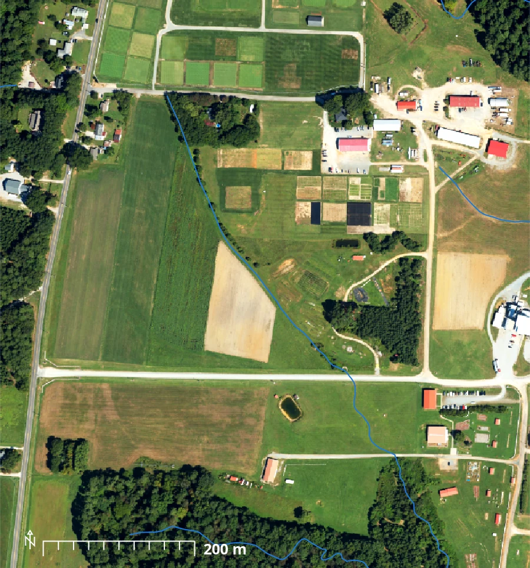

Relief across the site spans 29 m, from 102.6 m to 131.6 m. We create a shaded
relief map with
[r.relief](https://grass.osgeo.org/grass-stable/manuals/r.relief.html) and use it
as the base for the maps that follow.

```{python}
tools.r_relief(input="elevation", output="relief", zscale=2)

dem = gj.Map(width=900, height=900)
dem.d_shade(shade="relief", color="elevation", brighten=30)
dem.d_vect(map="streams", color="30:120:220", width=2)
dem.d_legend(raster="elevation", at=(5, 45, 3, 6), flags="b", title="m", fontsize=11)
dem.show()
```

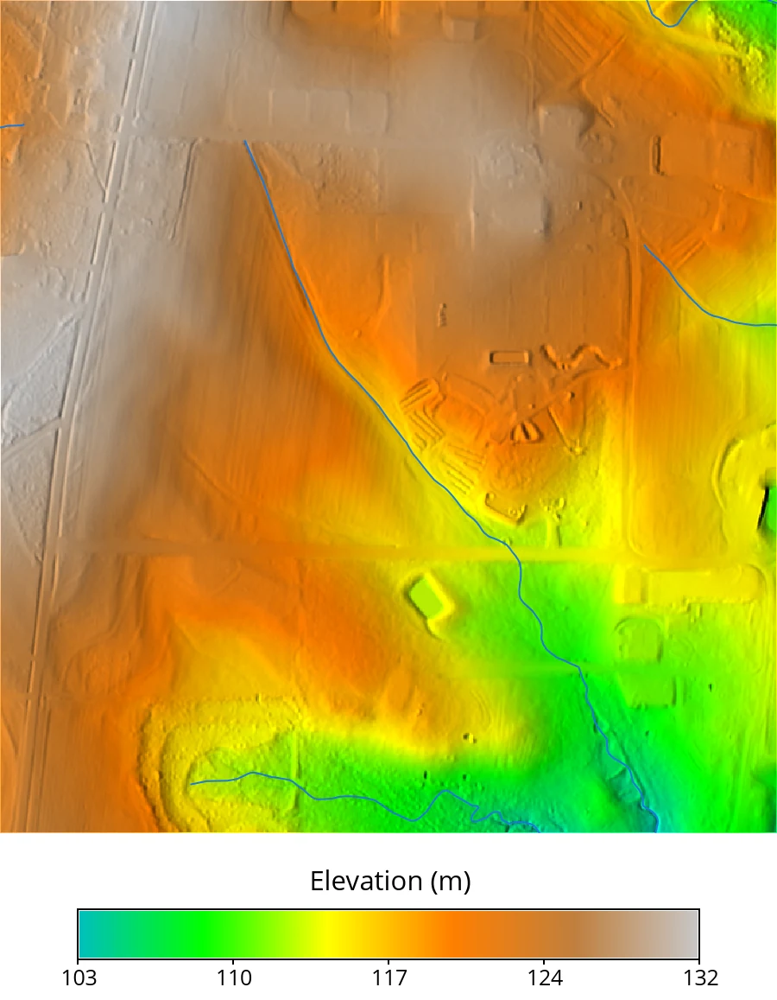

The packaged land cover raster was derived by combining lidar, NAIP imagery, and
OpenStreetMap roads. Its six classes (i.e., developed, paved road, compacted
road, herbaceous, forest, water) will supply the surface roughness values later.

```{python}
lc = gj.Map(width=900, height=900)
lc.d_rast(map="landcover")
lc.d_legend(raster="landcover", at=(4, 26, 3, 6), flags="cb", fontsize=12)
lc.show()
```

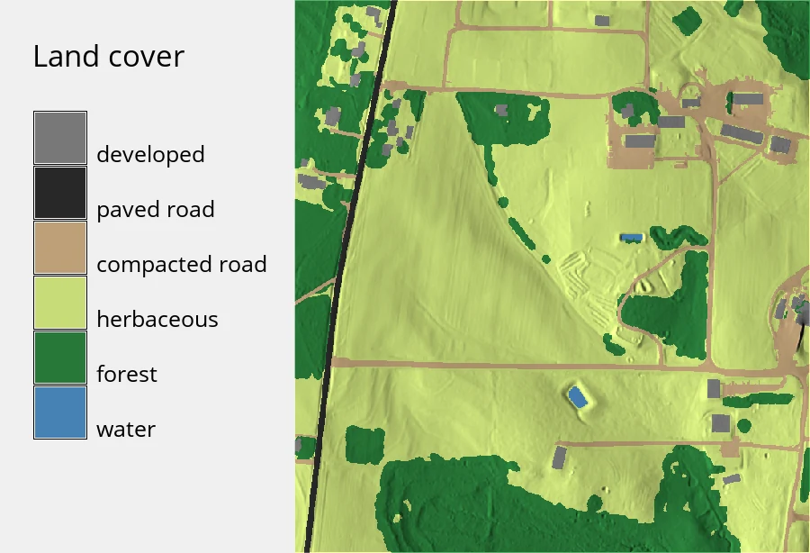

# Importing soil texture from SSURGO

The Soil Survey Geographic Database (SSURGO) is the USDA's detailed soil survey
[@ssurgo]. It is distributed as map unit polygons linked to tables of soil
components and horizons, so it needs aggregation before it can be used as raster
model input. `r.in.ssurgo` pulls the survey, aggregates the component and horizon
tables over a depth interval, and writes the result as rasters.

When `ssurgo_path` is left empty, the tool builds an area of interest from the
current computational region and queries the
[Soil Data Access](https://sdmdataaccess.nrcs.usda.gov/) (SDA) web service, so
for a 52 ha region no manual download is required.

```{python}
tools.r_in_ssurgo(
    soils="ssurgo_soils",
    sand="sand",
    silt="silt",
    clay="clay",
    bulk_density="bd",
    ksat_r="ssurgo_ksat_r",
    hydgrp="hydgrp",
    mukey="mukey",
    hzdept_r=0,
    hzdepb_r=25.4,
)
```

`hzdept_r=0` and `hzdepb_r=25.4` request a depth-weighted average over the top
25.4 cm (i.e., 10 inches), the layer that governs infiltration during a short
storm. The SDA query takes a couple of minutes.

::: {.callout-note title="SDA or a local archive?"}
`r.in.ssurgo` reads SSURGO two ways. Leaving `ssurgo_path` empty queries the SDA
web service for the current region, which is what we do here. Supplying a local
archive instead, either a Web Soil Survey area export or a state-wide gSSURGO
database, avoids the network and scales to large areas. The
[SIMWE parallelization tutorial](../parallelization/SIMWE_parallelization.qmd)
uses the local mode with a state-wide gSSURGO file. The local mode works best
with the `duckdb` Python package, and falls back to a SQLite backend without it.
:::

The three texture separates (i.e., sand, silt, and clay) are the required
ROSETTA inputs. Bulk density is optional and improves the estimate.

All three share one 0 to 70% color table, so the panels show their relative size
as well as their internal variation.

```{python}
rules = """0 241:230:218
12 222:200:177
23 202:171:138
35 177:140:99
47 149:109:64
58 118:80:36
70 84:53:15
nv 255:255:255
"""
for name in ["sand", "silt", "clay"]:
    tools.r_colors(map=name, rules="-", stdin=io.StringIO(rules))

texture = gj.Map(width=700, height=760)
texture.d_shade(shade="relief", color="sand", brighten=25)
texture.d_legend(
    raster="sand", at=(6, 10, 10, 90), flags="st",
    range=(0, 70), title="Fraction of mineral soil (%)",
)
texture.show()
```

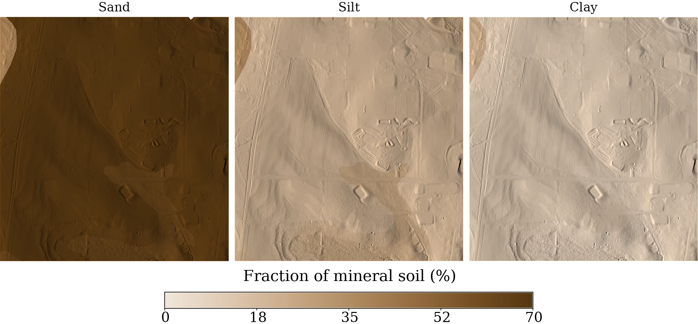

The site averages 67% sand and 12% clay. The texture rasters are piecewise
constant because SSURGO reports one value per map unit, and seven map units
cover the entire site (15 polygons, several of which share a map unit key).

```{python}
print(f"{'raster':<8}{'min':>8}{'max':>8}{'mean':>8}")
for name in ["sand", "silt", "clay", "bd"]:
    stats = tools.r_univar(map=name, format="json")
    print(f"{name:<8}{stats['min']:>8.2f}{stats['max']:>8.2f}{stats['mean']:>8.2f}")
```

```text
raster       min     max    mean
sand       40.00   68.00   67.20
silt       20.00   37.00   20.92
clay       10.00   23.00   11.89
bd          1.38    1.58    1.58
```

# Estimating hydraulic parameters with ROSETTA

ROSETTA is a hierarchical pedotransfer model that estimates the
Mualem-van Genuchten parameters from soil texture [@schaap_rosetta_2001;
@vangenuchten_closed_1980]. `r.soils.rosetta` applies it cell by cell using the
recalibrated Rosetta3 coefficients [@zhang_weighted_2017].

::: {.callout-note title="What is a pedotransfer function?"}
Measuring saturated hydraulic conductivity in the field is slow and expensive, so
it is rarely mapped over large areas, while texture is recorded everywhere a soil
survey goes. A pedotransfer function is a statistical model fit to soils where
both quantities were measured, and it estimates the expensive property from the
inexpensive one. ROSETTA was trained on roughly 2000 soil samples and estimates
five parameters: residual and saturated water content (`theta_r`, `theta_s`), the
van Genuchten shape parameters `alpha` and `n`, and saturated hydraulic
conductivity (`ksat`).
:::

The combination of inputs supplied selects the model version. Texture alone gives
model 2, adding bulk density gives model 3, and adding water content at 33 kPa
and 1500 kPa gives models 4 and 5. We have bulk density, so this is a model 3
run. Only the outputs that are named get computed.

```{python}
tools.r_soils_rosetta(
    sand="sand",
    silt="silt",
    clay="clay",
    bulk_density="bd",
    ksat="ksat_rosetta",
    theta_r="theta_r",
    theta_s="theta_s",
    alpha="vg_alpha",
    n="vg_n",
    version=3,
    ksat_units="mm_per_hour",
)
```

ROSETTA reports conductivity in cm/day and `r.sim.water` expects mm/hr, so
`ksat_units="mm_per_hour"` has the tool convert the output.

```{python}
ksat_map = gj.Map(width=900, height=900)
ksat_map.d_shade(shade="relief", color="ksat_rosetta", brighten=40)
ksat_map.d_legend(
    raster="ksat_rosetta", at=(5, 45, 3, 6), flags="b", title="mm/hr", fontsize=12
)
ksat_map.show()
```

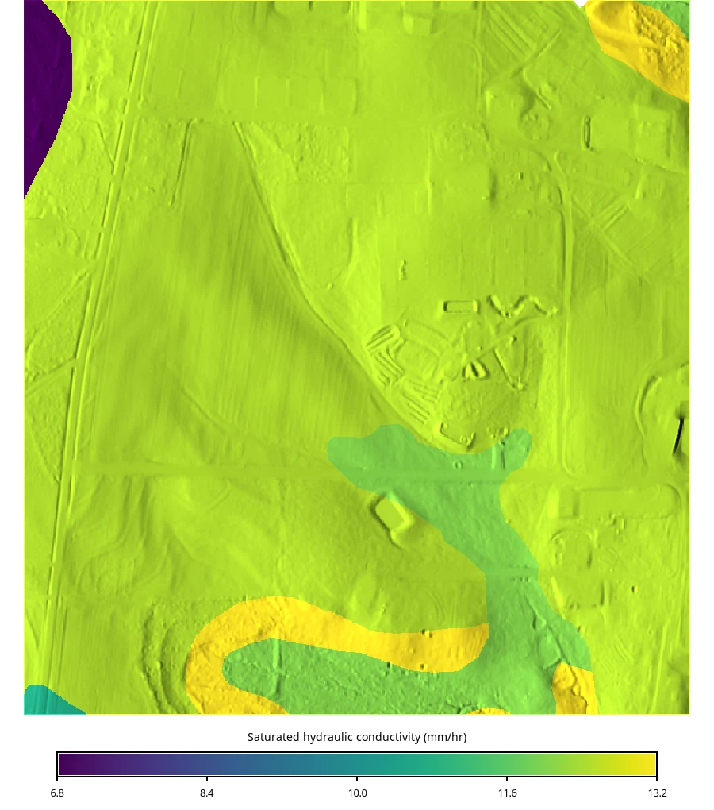

Estimated conductivity ranges from 6.8 to 13.2 mm/hr. The lowest values fall on
the map unit carrying 23% clay, which follows the drainage line through the
southern half of the site. Saturated water content (i.e., the pore space
available to hold water) ranges from 0.36 to 0.41 cm³/cm³.

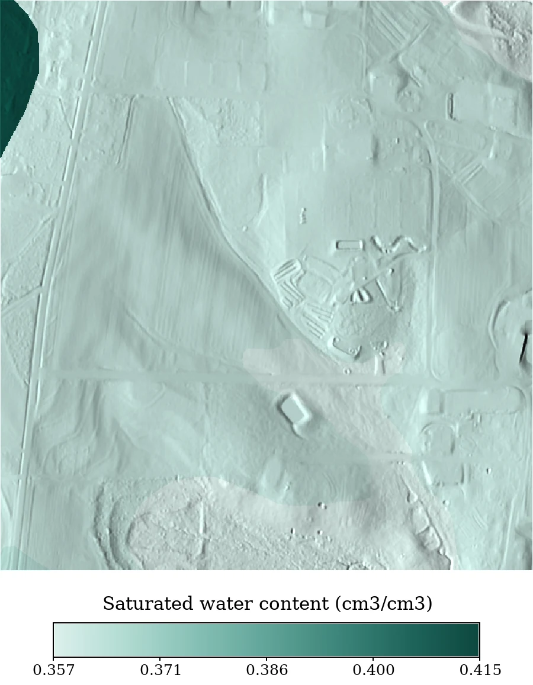

## Comparing against the Ksat reported by SSURGO

SSURGO reports a representative saturated hydraulic conductivity of its own,
imported above as `ssurgo_ksat_r`. We compare the two on a shared absolute color
scale.

```{python}
print(f"{'raster':<16}{'min':>8}{'max':>8}{'mean':>8}")
for name in ["ksat_rosetta", "ssurgo_ksat_r"]:
    stats = tools.r_univar(map=name, format="json")
    print(f"{name:<16}{stats['min']:>8.2f}{stats['max']:>8.2f}{stats['mean']:>8.2f}")
```

```text
raster               min     max    mean
ksat_rosetta        6.79   13.24   12.41
ssurgo_ksat_r      32.40  100.80   99.84
```

Both panels share one absolute color table, log-spaced over the NRCS class range.

```{python}
rules = """3 205:226:251
6 158:197:244
12 109:167:236
25 57:135:229
50 28:92:171
110 13:54:107
nv 255:255:255
"""
for name in ["ksat_rosetta", "ssurgo_ksat_r"]:
    tools.r_colors(map=name, rules="-", stdin=io.StringIO(rules))

ksat_cmp = gj.Map(width=700, height=760)
ksat_cmp.d_shade(shade="relief", color="ksat_rosetta", brighten=22)
ksat_cmp.d_legend(
    raster="ksat_rosetta", at=(6, 10, 10, 90), flags="stl",
    range=(3, 110), title="Saturated hydraulic conductivity (mm/hr)",
)
ksat_cmp.show()
```

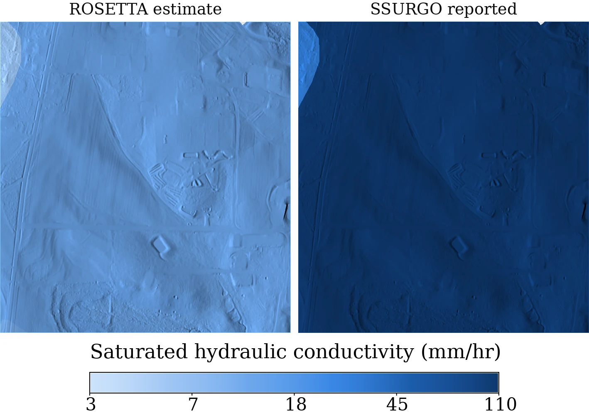

SSURGO's representative value averages about eight times higher than the ROSETTA
estimate. The two are produced differently: SSURGO's is a soil scientist's
estimate for the component, anchored to field observation and conductivity class
ranges, while ROSETTA's is a regression on texture and bulk density. Neither is a
measurement at this site. We will run the simulation with both.

::: {.callout-important title="Pedotransfer estimates carry uncertainty"}
Saturated hydraulic conductivity varies over orders of magnitude and is difficult
to constrain, so an eight-fold spread between two defensible estimates is not
unusual. Running `r.soils.rosetta` with the `-u` flag produces per-parameter
standard deviation maps.
:::

ROSETTA is also nonlinear, so applying it to depth-averaged texture does not give
the same result as applying it per horizon and averaging afterward. We requested
texture already averaged over the top 25.4 cm, so the estimate inherits that
approximation.

## A map unit table

Both maps are constant within each SSURGO map unit, so we can collapse them to
one row per map unit with
[r.univar](https://grass.osgeo.org/grass-stable/manuals/r.univar.html) using the
`mukey` raster as zones. The same table drives the two plots that follow.

```{python}
import pandas as pd

params = ["ksat_rosetta", "ssurgo_ksat_r", "theta_r", "theta_s", "vg_alpha", "vg_n", "clay"]
rows = {}
for p in params:
    for zone in tools.r_univar(map=p, zones="mukey", format="json").json:
        rows.setdefault(zone["zone"], {"cells": zone["n"]})[p] = zone["mean"]

units = pd.DataFrame.from_dict(rows, orient="index").rename_axis("mukey")
units = units[units["cells"] > 0]
units["share"] = units["cells"] / units["cells"].sum()
print(units[["ksat_rosetta", "ssurgo_ksat_r", "clay", "share"]].round(3))
```

```text
         ksat_rosetta  ssurgo_ksat_r  clay  share
mukey
2538507        12.070        100.800  10.0  0.087
2557360         6.793         32.400  23.0  0.014
2739852        13.238        100.800  10.0  0.048
3050232        10.702        100.800  13.0  0.003
3050241        12.497        100.800  12.0  0.433
3050242        12.497        100.800  12.0  0.414
```

Plotting the pairs against a 1:1 line shows the disagreement directly. The
reference lines are the NRCS standard Ksat classes [@soilsurveystaff_manual_2017],
converted from micrometers per second to mm/hr. This comparison follows the
SSURGO and ROSETTA evaluation in the ncss-tech ROSETTA API documentation
[@beaudette_rosetta_api], computed here from the SECREF data.

```{python}
import seaborn as sns
import matplotlib.pyplot as plt
import numpy as np

fig, ax = plt.subplots(figsize=(7.2, 6.4))
lims = (3, 400)
ax.plot(lims, lims, "--", color="#b3261e", linewidth=1.5)

# NRCS Ksat class limits, um/s converted to mm/hr
for edge in (0.036, 0.36, 3.6, 36.0, 360.0):
    ax.axhline(edge, color="#d8d7d3", linewidth=0.7)
    ax.axvline(edge, color="#d8d7d3", linewidth=0.7)

sns.scatterplot(
    data=units.sort_values("share", ascending=False),
    x="ksat_rosetta", y="ssurgo_ksat_r", size="share", sizes=(90, 900),
    color="#256abf", edgecolor="#fcfcfb", linewidth=1.2, legend=False, ax=ax,
)
ax.set(xscale="log", yscale="log", xlim=lims, ylim=lims)
ax.set_xlabel("ROSETTA estimated Ksat (mm/hr)")
ax.set_ylabel("SSURGO reported Ksat (mm/hr)")
plt.show()
```

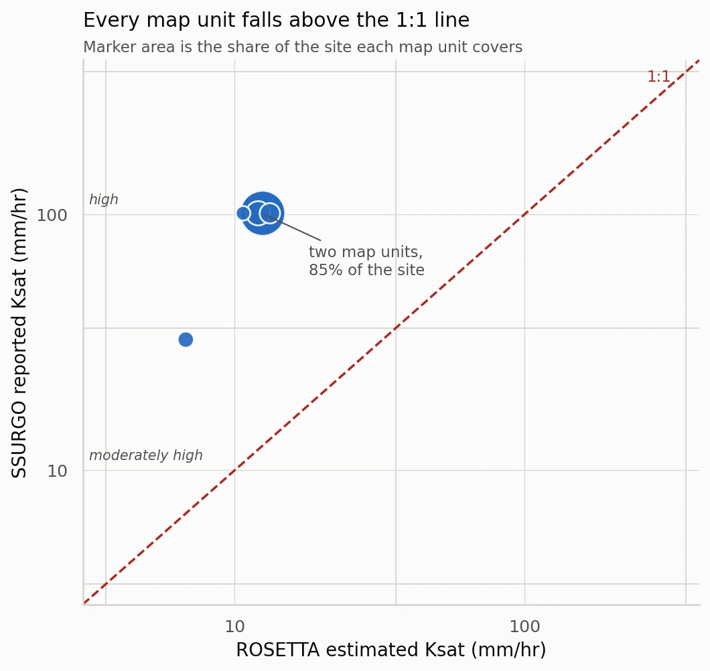

Every map unit sits above the 1:1 line. The two map units covering 85% of the
site place ROSETTA in the moderately high class and SSURGO in the high class,
one full class apart.

## Water retention curves

Ksat is only one of the five ROSETTA outputs. The other four describe how
tightly the soil holds water, through the van Genuchten retention function
[@vangenuchten_closed_1980]:

$$
\theta(h) = \theta_r + \frac{\theta_s - \theta_r}{\left[1 + (\alpha h)^n\right]^{1 - 1/n}}
$$

where $h$ is suction in cm of water. Plotting it for each map unit, after the
theoretical retention curves in the ncss-tech documentation
[@beaudette_rosetta_api], shows what the parameters mean.

```{python}
def theta(suction_kpa, theta_r, theta_s, alpha, n):
    """van Genuchten water retention. Suction in kPa, alpha in 1/cm."""
    h = np.maximum(suction_kpa, 1e-6) * 10.197  # kPa to cm of water
    return theta_r + (theta_s - theta_r) / (1 + (alpha * h) ** n) ** (1 - 1 / n)


suction = np.logspace(-1, 5, 400)
curves = pd.concat(
    [
        pd.DataFrame({
            "suction": suction,
            "theta": theta(suction, r.theta_r, r.theta_s, r.vg_alpha, r.vg_n),
            "unit": f"{r.clay:.0f}% clay ({r.share:.1%} of site)",
        })
        for r in units.sort_values("clay", ascending=False).itertuples()
    ]
)

fig, ax = plt.subplots(figsize=(7.2, 6.4))
sns.lineplot(data=curves, x="theta", y="suction", hue="unit", linewidth=2, ax=ax)
for value in (33, 1500):
    ax.axhline(value, color="#b3261e", linestyle="--", linewidth=1.2)
ax.set(yscale="log", ylim=(0.1, 1e5), xlim=(0, 0.42))
ax.set_xlabel("Volumetric water content (cm3/cm3)")
ax.set_ylabel("Suction (kPa)")
plt.show()
```

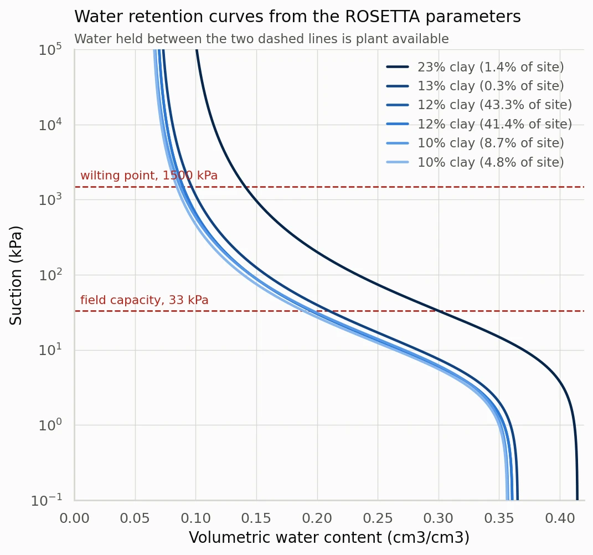

The dashed lines mark field capacity (33 kPa) and the wilting point (1500 kPa).
Water held between them is plant available, so the gap between the two
intersections is the available water capacity (AWC) [@schaap_comparison_2004].
The 23% clay unit holds 0.160 cm³/cm³, roughly half again as much as the sandier
units at 0.104 to 0.113 cm³/cm³, which is the same contrast that gives it the
lowest Ksat.

```{python}
for r in units.sort_values("clay", ascending=False).itertuples():
    awc = theta(33, r.theta_r, r.theta_s, r.vg_alpha, r.vg_n) - theta(
        1500, r.theta_r, r.theta_s, r.vg_alpha, r.vg_n
    )
    print(f"{r.clay:4.0f}% clay   AWC={awc:.3f} cm3/cm3   {r.share:6.1%} of site")
```

```text
  23% clay   AWC=0.160 cm3/cm3     1.4% of site
  13% clay   AWC=0.113 cm3/cm3     0.3% of site
  12% clay   AWC=0.106 cm3/cm3    43.3% of site
  12% clay   AWC=0.106 cm3/cm3    41.4% of site
  10% clay   AWC=0.109 cm3/cm3     8.7% of site
  10% clay   AWC=0.104 cm3/cm3     4.8% of site
```

# Preparing the SIMWE inputs

SIMWE solves the shallow water flow equation using a path sampling (i.e.,
walker-based) method [@mitas_distributed_1998; @mitasova_path_2004]. Besides
elevation it needs a surface roughness map, a rainfall rate, and an infiltration
rate. The partial derivatives of the surface are computed internally.

Manning's n comes from land cover, using standard overland flow roughness values
ranging from 0.011 for pavement to 0.20 for forest floor.

```{python}
rules = """
1:1:0.05:0.05
2:2:0.011:0.011
3:3:0.02:0.02
4:4:0.10:0.10
5:5:0.20:0.20
6:6:0.03:0.03
"""
tools.r_recode(input="landcover", output="manning", rules="-", stdin=io.StringIO(rules))
```

`manning` takes six values, so for display we reclass it to ordered classes
labelled with the n value and the cover type it came from.

```{python}
reclass = """2 = 1 0.011  paved road
3 = 2 0.020  compacted road
6 = 3 0.030  water
1 = 4 0.050  developed
4 = 5 0.100  herbaceous
5 = 6 0.200  forest
"""
tools.r_reclass(
    input="landcover", output="manning_class", rules="-", stdin=io.StringIO(reclass)
)
tools.r_colors(map="manning_class", color="greens")

manning_map = gj.Map(width=900, height=900)
manning_map.d_rast(map="manning_class")
manning_map.d_legend(raster="manning_class", at=(38, 62, 4, 8), flags="cn")
manning_map.show()
```

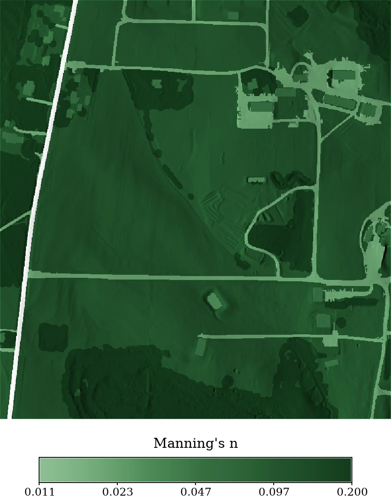

The SSURGO polygons leave 72 cells out of 525,000 without soil data.
`r.sim.water` applies no infiltration where the `infil` map is NULL, so those
cells would shed water as if they were paved. We fill them with the site mean.

```{python}
tools.r_mapcalc(expression="ksat_fill = if(isnull(ksat_rosetta), 12.4, ksat_rosetta)")
```

# Running the simulations

All three runs use a 54 mm/hr rainfall rate held for 60 minutes, approximately a
10-year, 1-hour storm for Raleigh. The infiltration input is the only thing that
changes between them.

::: {.callout-warning title="`rain` and `infil` act at different points"}
`rain` takes a rainfall excess rate, rainfall minus infiltration. You do that
subtraction yourself before the run, so the removed water never enters the flow
at all.

`infil` applies to water that is already moving across a cell, which drinks from
it at a fixed rate. That is what captures runoff generated on pavement losing
volume as it crosses a lawn downslope, and it is what we use here.

Neither rate responds to the soil filling up. Both stay constant for the whole
simulation.
:::

The first run uses a single infiltration value for the whole site. We set it to
12.4 mm/hr, the site mean of the ROSETTA field, so that spatial variation is the
only difference between this run and the next.

```{python}
tools.r_sim_water(
    elevation="elevation",
    rain_value=54,
    infil_value=12.4,
    man="manning",
    depth="depth_uniform",
    discharge="disch_uniform",
    duration=60,
    output_step=60,
    random_seed=7,
    nprocs=6,
)
```

The second run uses the ROSETTA field.

```{python}
tools.r_sim_water(
    elevation="elevation",
    rain_value=54,
    infil="ksat_fill",
    man="manning",
    depth="depth_rosetta",
    discharge="disch_rosetta",
    duration=60,
    output_step=60,
    random_seed=7,
    nprocs=6,
)
```


::: {.callout-tip title="Simulation run time"}
Each run covers 525,000 cells with roughly a million walkers, so expect several
minutes per simulation. Increase `nprocs` if more cores are available, and reduce
`duration` to 20 minutes while adjusting the workflow.
:::

The third run uses the Ksat reported by SSURGO.

```{python}
tools.r_mapcalc(
    expression="ssurgo_ksat_fill = if(isnull(ssurgo_ksat_r), 99.8, ssurgo_ksat_r)"
)
tools.r_sim_water(
    elevation="elevation",
    rain_value=54,
    infil="ssurgo_ksat_fill",
    man="manning",
    depth="depth_ssurgo",
    discharge="disch_ssurgo",
    duration=60,
    output_step=60,
    random_seed=7,
    nprocs=6,
)
```

# Results

The three runs share one color table, with breaks spaced logarithmically because
depth spans four orders of magnitude.

```{python}
rules = """0 226:197:164
0.002 191:172:131
0.008 127:154:132
0.03 77:128:131
0.12 39:99:120
0.45 10:70:103
1.8 3:42:76
nv 255:255:255
"""
for name in ["depth_uniform", "depth_rosetta", "depth_ssurgo"]:
    tools.r_colors(map=name, rules="-", stdin=io.StringIO(rules))

depth_map = gj.Map(width=700, height=760)
depth_map.d_shade(shade="relief", color="depth_rosetta", brighten=50)
depth_map.d_vect(map="streams", color="90:90:90", width=1)
depth_map.d_legend(
    raster="depth_rosetta", at=(6, 10, 10, 90), flags="stl",
    range=(0.001, 1.8), title="Water depth (m)",
)
depth_map.show()
```

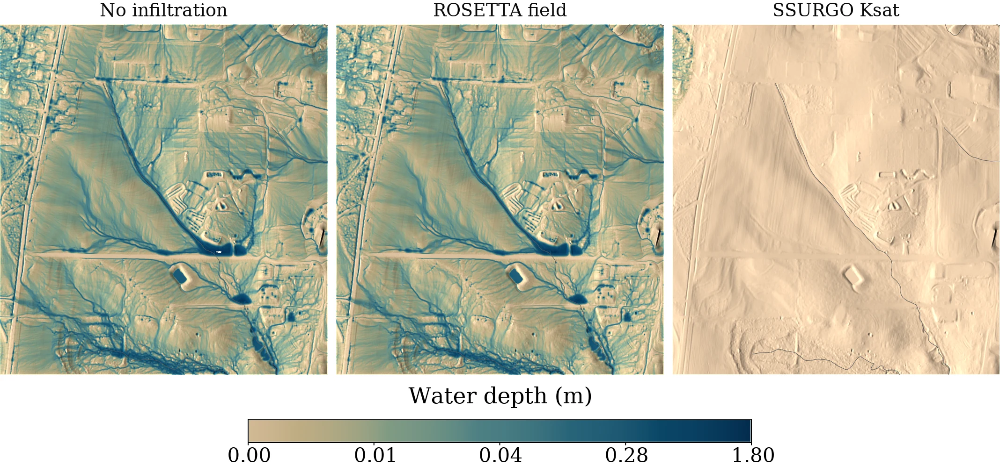

```{python}
for name in ["depth_uniform", "depth_rosetta", "depth_ssurgo"]:
    stats = tools.r_univar(map=name, format="json")
    print(f"{name:15s} mean={stats['mean'] * 1000:8.3f} mm   sum={stats['sum']:10.1f}")
```

```text
depth_uniform     mean=  18.527 mm   sum=    9726.4
depth_rosetta     mean=  18.509 mm   sum=    9717.0
depth_ssurgo      mean=   0.071 mm   sum=      37.3
```

## Uniform value compared to the ROSETTA field

Replacing 12.4 mm/hr everywhere with the ROSETTA field changed mean flow depth by
0.018 mm, about one tenth of one percent. We map the difference to see where the
change occurs.

```{python}
tools.r_mapcalc(expression="depth_diff = depth_rosetta - depth_uniform")
tools.r_colors(map="depth_diff", color="differences")

diff_map = gj.Map(width=900, height=900)
diff_map.d_shade(shade="relief", color="depth_diff", brighten=50)
diff_map.d_legend(
    raster="depth_diff", at=(5, 45, 3, 6), flags="b", title="m", fontsize=12
)
diff_map.show()
```

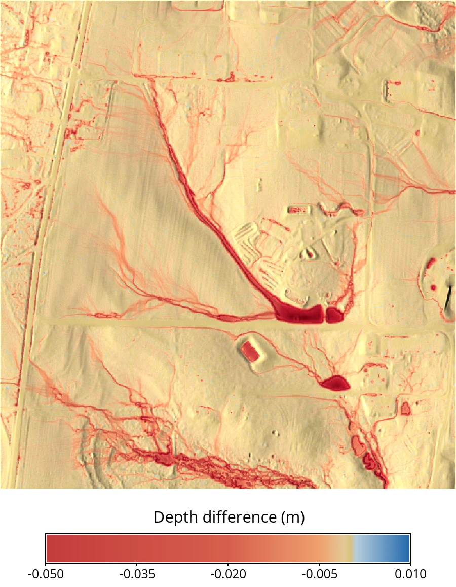

```{python}
stats = tools.r_univar(map="depth_diff", format="json")
print(f"min={stats['min']:.4f} max={stats['max']:.4f} stddev={stats['stddev']:.5f}")
```

```text
min=-0.0306 max=0.0274 stddev=0.00072
```

Local differences reach 3 cm in the concentrated flow paths. However, the
aggregate effect is small because the seven SSURGO map units at this site span
only 6.8 to 13.2 mm/hr, a standard deviation of 0.7 mm/hr. A site with contrasting
soils (e.g., sand against a clay pan) would produce a larger difference.

::: {.callout-note title="When does mapping infiltration pay off?"}
The benefit of a spatially varying infiltration field scales with how much the
soil varies across the model domain relative to the rainfall rate. Check the
spread of a conductivity map with
[r.univar](https://grass.osgeo.org/grass-stable/manuals/r.univar.html) first.
Where the standard deviation is small compared to the mean, a single
representative value gives nearly the same answer.
:::

## ROSETTA Ksat compared to SSURGO Ksat

The SSURGO-driven run left 37 units of water on the surface against the ROSETTA
run's 9717, a factor of 260. SSURGO's representative conductivity averages
99.8 mm/hr while the storm delivers 54 mm/hr, so infiltration keeps pace with
rainfall across most of the site and only the wettest corner generates any flow
depth.

The choice of conductivity estimate therefore changed the result by two orders of
magnitude, while the spatial pattern changed it by one tenth of one percent.
Deciding between the two estimates requires a field measurement of conductivity
at the site.

# Assumptions and limitations

* Depth averaging over the top 25.4 cm discards horizon structure, and because
  ROSETTA is nonlinear the estimate is not equivalent to a per-horizon
  calculation.
* Ksat is the conductivity of an already saturated soil, and `infil` holds it
  constant for the whole run. Dry soil takes water faster than that, so these
  runs understate infiltration and overstate runoff early in the storm.
* Manning's n values are assigned by land cover class from published tables
  rather than calibrated at this site.
* None of the runs are validated against observed discharge at SECREF, so the
  comparisons describe model sensitivity rather than model accuracy.

# Summary

We derived a spatially varying infiltration field from a soil survey and used it
to drive an overland flow simulation:

* `r.in.ssurgo` converts SSURGO map units into depth-weighted texture rasters,
  over the SDA web service for small areas or from a local archive for large
  ones.
* `r.soils.rosetta` applies the ROSETTA pedotransfer model to those rasters and
  writes saturated hydraulic conductivity in the units `r.sim.water` expects.
* `r.sim.water` takes that conductivity as its `infil` input.

At this site, exchanging a single infiltration value for a soil-derived map
changed mean flow depth by 0.1%, while exchanging one published conductivity
estimate for another changed total surface water by a factor of 260. Running
`r.univar` on a conductivity map and comparing its spread to its mean and to the
rainfall rate indicates which of those two effects matters at a given site.

Next steps:

* Add the `-u` flag to `r.soils.rosetta` for uncertainty maps, and run the
  simulation at the bounds to put an interval around these depths.
* Use the `-t` flag with `output_step` to produce a time series, register it with
  [t.register](https://grass.osgeo.org/grass-stable/manuals/t.register.html), and
  animate the evolving flow.
* Add sediment transport with
  [r.sim.sediment](https://grass.osgeo.org/grass-stable/manuals/r.sim.sediment.html),
  which reuses the depth and discharge maps produced here.
* Work through the same soil-informed workflow at catchment scale in the SIMWE
  Soils Project notebooks [@white_nrcs_simwe], which add curve number, time of
  concentration, NOAA Atlas 14 design storms, and walker velocity animation at
  [Coweeta, NC](https://ncsu-geoforall-lab.github.io/NRCS_SIMWE/notebooks/ssurgo.html)
  and [Clay Center, KS](https://ncsu-geoforall-lab.github.io/NRCS_SIMWE/notebooks/ssurgo_clay_center.html).

# See also

* [r.in.ssurgo](https://grass.osgeo.org/grass-stable/manuals/addons/r.in.ssurgo.html)
* [r.soils.rosetta](https://grass.osgeo.org/grass-stable/manuals/addons/r.soils.rosetta.html)
* [r.sim.water](https://grass.osgeo.org/grass-stable/manuals/r.sim.water.html)
* [Parallelization of overland flow and sediment transport simulation](../parallelization/SIMWE_parallelization.qmd)
* [SIMWE Soils Project](https://ncsu-geoforall-lab.github.io/NRCS_SIMWE/),
  the NRCS work this workflow comes out of
* [SECREF sample dataset on Zenodo](https://doi.org/10.5281/zenodo.23017720)

# References

::: {#refs}
:::
