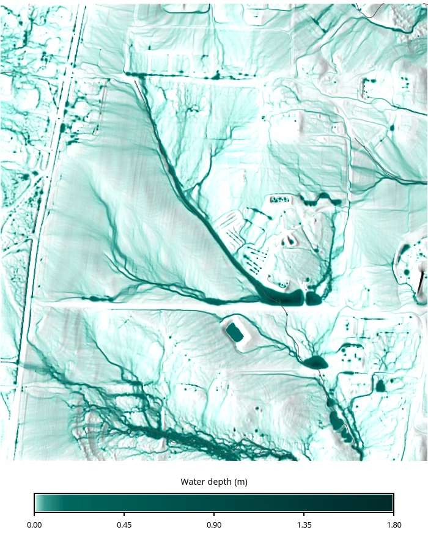

# Introduction

Every overland flow model has to decide how much rain becomes runoff. In
[r.sim.water](https://grass.osgeo.org/grass-stable/manuals/r.sim.water.html),
that decision lives in a single parameter: the infiltration rate. Leave it at a
constant and the whole landscape sheds water at the same rate. Give it a map and
the model starts to respond to the soil under each cell.

Getting that map is the hard part. Soil surveys report texture, not hydraulic
conductivity. This tutorial closes that gap with a *pedotransfer function*, an
empirical model that predicts hydraulic properties from the properties that
surveys actually measure. We will:

1. Import USDA SSURGO soil texture with
   [r.in.ssurgo](https://grass.osgeo.org/grass-stable/manuals/addons/r.in.ssurgo.html)
2. Predict saturated hydraulic conductivity with
   [r.soils.rosetta](https://grass.osgeo.org/grass-stable/manuals/addons/r.soils.rosetta.html)
3. Run [r.sim.water](https://grass.osgeo.org/grass-stable/manuals/r.sim.water.html)
   three times, with a single infiltration value, with the predicted field, and
   with the conductivity SSURGO reports directly, and compare the results

The study site is the North Carolina State University Sediment and Erosion
Control Research and Education Facility (SECREF) in south Raleigh, a 52 ha
research site with 1 m lidar elevation. Anna Petrasova published it as a GRASS
sample dataset built specifically for SIMWE work [@petrasova2026secref].

::: {.callout-note title="How to run this tutorial?"}
This tutorial is prepared to be run in a Jupyter notebook locally or using
services such as Google Colab. You can
[download the notebook here](soil_informed_overland_flow.ipynb).

If you are not sure how to get started with GRASS, check out the tutorials
[Get started with GRASS & Python in Jupyter Notebooks](../get_started/fast_track_grass_and_python.qmd)
and [Get started with GRASS in Google Colab](../get_started/grass_gis_in_google_colab.qmd).
:::

If you are looking for the empirical alternative to this workflow, the
[SIMWE parallelization tutorial](../parallelization/SIMWE_parallelization.qmd)
takes soil data to runoff through the SCS Curve Number method instead.

# Setup

Start by importing the Python packages. To import the _grass_ package, you need
to tell Python where the GRASS Python package is (this can be skipped in some
environments).

```{python}
import os
import sys
import subprocess
from pathlib import Path

sys.path.append(
    subprocess.check_output(["grass", "--config", "python_path"], text=True).strip()
)

import grass.script as gs
import grass.jupyter as gj
from grass.tools import Tools
```

This workflow needs two addons and one Python package. `r.soils.rosetta` uses
the offline [rosetta-soil](https://pypi.org/project/rosetta-soil/) package when
it is available and falls back to a web API when it is not. Installing it keeps
the run reproducible and enables the uncertainty outputs.

```{python}
tools = Tools()
tools.g_extension(extension="r.in.ssurgo")
tools.g_extension(extension="r.soils.rosetta")
```

```{python}
# | eval: false
!pip install rosetta-soil
```

## Download the sample dataset

The SECREF project is a ready-made GRASS project in EPSG:6542
(NAD83(2011) / North Carolina, meters) at 1 m resolution. Download it from
Zenodo and unpack it into a directory of your choosing.

```{python}
import urllib.request
import zipfile

url = (
    "https://zenodo.org/api/records/23017720/files/"
    "secref_northcarolina_usa_epsg6542.zip/content"
)
grassdata = Path("grassdata")
grassdata.mkdir(exist_ok=True)

urllib.request.urlretrieve(url, "secref.zip")
with zipfile.ZipFile("secref.zip") as archive:
    archive.extractall(grassdata)
```

The download is about 24 MB. We will work in a new mapset so that the downloaded
PERMANENT mapset stays as published.

```{python}
project = grassdata / "secref_northcarolina_usa_epsg6542"
session = gj.init(project, mapset="work", create=True)
tools = Tools(session=session)
```

The project ships six rasters and three vectors:

```{python}
print(tools.g_list(type="raster", mapset="PERMANENT", flags="m").text)
print(tools.g_list(type="vector", mapset="PERMANENT", flags="m").text)
```

```text
elevation@PERMANENT
landcover@PERMANENT
naip.1@PERMANENT
naip.2@PERMANENT
naip.3@PERMANENT
naip.4@PERMANENT

roads@PERMANENT
soils@PERMANENT
streams@PERMANENT
```

Set the computational region to the elevation map. Everything from here on
inherits this region, 700 by 750 cells at 1 m.

```{python}
tools.g_region(raster="elevation")
print(tools.g_region(flags="p").text)
```

```text
projection: 99 (NAD83(2011) / North Carolina)
zone:       0
datum:      nad83_2011
ellipsoid:  grs80
north:      220750
south:      220000
west:       638300
east:       639000
nsres:      1
ewres:      1
rows:       750
cols:       700
cells:      525000
```

# The study area

SECREF sits on a low Piedmont ridge draining to a pair of small streams. The
0.6 m NAIP imagery shows the research plots, the access roads, and the wooded
margins.

```{python}
site = gj.Map(width=900, height=900)
site.d_rgb(red="naip.1", green="naip.2", blue="naip.3")
site.d_vect(map="streams", color="30:120:220", width=2)
site.d_vect(map="roads", color="240:240:240", width=1)
site.d_barscale(at=(4, 6), flags="n")
site.show()
```


The terrain spans only 29 m of relief, from 102.6 m to 131.6 m. At 1 m
resolution that is enough to route water through the plot boundaries and road
ditches that dominate this site.

```{python}
tools.r_relief(input="elevation", output="relief", zscale=2)

dem = gj.Map(width=900, height=900)
dem.d_shade(shade="relief", color="elevation", brighten=30)
dem.d_vect(map="streams", color="30:120:220", width=2)
dem.d_legend(raster="elevation", at=(5, 45, 3, 6), flags="b", title="m", fontsize=11)
dem.show()
```


The packaged land cover raster was derived by combining lidar, NAIP, and
OpenStreetMap roads. Its six classes drive the surface roughness later on.

```{python}
lc = gj.Map(width=900, height=900)
lc.d_rast(map="landcover")
lc.d_legend(raster="landcover", at=(4, 26, 3, 6), flags="cb", fontsize=12)
lc.show()
```


# Soil texture from SSURGO

[SSURGO](https://www.nrcs.usda.gov/resources/data-and-reports/soil-survey-geographic-database-ssurgo)
is the USDA's detailed soil survey [@ssurgo]. It is delivered as map unit
polygons linked to tables of soil components and horizons, which makes it
awkward to use directly as raster model input. `r.in.ssurgo` does that
translation: it pulls the survey, aggregates the component and horizon tables
over a depth interval you choose, and writes the result as rasters.

With no `ssurgo_path` given, the tool builds an area of interest from the
current computational region and queries the
[Soil Data Access](https://sdmdataaccess.nrcs.usda.gov/) (SDA) web service. For
a 52 ha region that is a small query, so no manual download is needed.

```{python}
tools.r_in_ssurgo(
    soils="ssurgo_soils",
    sand="sand",
    silt="silt",
    clay="clay",
    bulk_density="bd",
    ksat_r="ssurgo_ksat_r",
    hydgrp="hydgrp",
    hzdept_r=0,
    hzdepb_r=25.4,
)
```

`hzdept_r=0` and `hzdepb_r=25.4` request a depth-weighted average over the top
25.4 cm (10 inches), the layer that governs infiltration during a short storm.
The SDA query takes a couple of minutes.

::: {.callout-note title="SDA or a local archive?"}
`r.in.ssurgo` reads SSURGO two ways. Leaving `ssurgo_path` empty queries the SDA
web service for the current region, which is what we do here. Passing a local
archive, either a Web Soil Survey area export or a state-wide gSSURGO database,
skips the network entirely and scales to large areas. The
[SIMWE parallelization tutorial](../parallelization/SIMWE_parallelization.qmd)
uses the local mode with a state-wide gSSURGO file. The local mode needs the
`duckdb` Python package.
:::

The three texture separates are what ROSETTA needs. Bulk density is optional but
improves the prediction.

```{python}
for name, label in [("sand", "Sand %"), ("clay", "Clay %")]:
    tools.r_colors(map=name, color="sepia", flags="e")
    texture = gj.Map(width=700, height=760)
    texture.d_shade(shade="relief", color=name, brighten=40)
    texture.d_legend(raster=name, at=(5, 45, 4, 8), flags="b", title=label, fontsize=12)
    texture.show()
```

::: {layout-ncol=2}


:::

The site is sandy: 67% sand and 12% clay on average, with a narrow spread. Note
how the texture is piecewise constant. SSURGO reports one value per map unit, and
there are only 15 map units across the whole site, so these rasters are step
functions rather than smooth surfaces.

```{python}
for name in ["sand", "silt", "clay", "bd"]:
    stats = tools.r_univar(map=name, format="json")
    print(f"{name:5s} min={stats['min']:7.2f} max={stats['max']:7.2f} mean={stats['mean']:7.2f}")
```

```text
sand  min=  40.00 max=  68.00 mean=  67.20
silt  min=  20.00 max=  37.00 mean=  20.92
clay  min=  10.00 max=  23.00 mean=  11.89
bd    min=   1.38 max=   1.58 mean=   1.58
```

# From texture to hydraulic parameters

ROSETTA is a hierarchical pedotransfer model that predicts the
Mualem-van Genuchten parameters from soil texture [@schaap2001rosetta;
@vangenuchten1980]. `r.soils.rosetta` applies it cell by cell, using the
recalibrated Rosetta3 coefficients [@zhang2017rosetta3].

::: {.callout-note title="What is a pedotransfer function?"}
Measuring saturated hydraulic conductivity in the field is slow and expensive,
so it is rarely mapped. Texture, on the other hand, is measured everywhere a soil
survey goes. A pedotransfer function is a statistical model fit to the soils
where both were measured, which then predicts the expensive property from the
cheap one. ROSETTA was trained on roughly 2000 soil samples and predicts five
parameters: residual and saturated water content (`theta_r`, `theta_s`), the van
Genuchten shape parameters `alpha` and `n`, and saturated hydraulic conductivity
`ksat`.
:::

Which inputs you supply selects the model. Texture alone gives model 2, adding
bulk density gives model 3, and water content at 33 kPa and 1500 kPa give models
4 and 5. We have bulk density, so this is a model 3 run. Only the outputs you
name are computed.

```{python}
tools.r_soils_rosetta(
    sand="sand",
    silt="silt",
    clay="clay",
    bulk_density="bd",
    ksat="ksat_rosetta",
    theta_s="theta_s",
    version=3,
    ksat_units="mm_per_hour",
)
```

`ksat_units="mm_per_hour"` matters. ROSETTA reports conductivity in cm/day, and
`r.sim.water` expects mm/hr, so the tool converts for you.

```{python}
ksat_map = gj.Map(width=900, height=900)
ksat_map.d_shade(shade="relief", color="ksat_rosetta", brighten=40)
ksat_map.d_legend(
    raster="ksat_rosetta", at=(5, 45, 3, 6), flags="b", title="mm/hr", fontsize=12
)
ksat_map.show()
```


The predicted conductivity runs from 6.8 to 13.2 mm/hr, with the lowest values
on the one map unit with 23% clay. Saturated water content, the pore space
available to hold water, ranges from 0.36 to 0.41 cm³/cm³.


## A reality check against SSURGO

SSURGO reports its own saturated hydraulic conductivity, so we can put the two
side by side on a shared color scale. They disagree, and by a lot.

```{python}
for name in ["ksat_rosetta", "ssurgo_ksat_r"]:
    stats = tools.r_univar(map=name, format="json")
    print(f"{name:15s} min={stats['min']:7.2f} max={stats['max']:7.2f} mean={stats['mean']:7.2f}")
```

```text
ksat_rosetta    min=   6.79 max=  13.24 mean=  12.41
ssurgo_ksat_r   min=  32.40 max= 100.80 mean=  99.84
```

::: {layout-ncol=2}


:::

SSURGO's representative value averages about eight times higher than the ROSETTA
prediction. Both are labeled saturated hydraulic conductivity, but they come from
different places: SSURGO's is a soil scientist's estimate for the component,
often anchored to field observation and class ranges, while ROSETTA's is a
regression on texture and bulk density. Neither is ground truth here.

::: {.callout-important title="Pedotransfer predictions carry real uncertainty"}
An eight-fold spread between two defensible estimates of the same quantity is
normal for hydraulic conductivity, which varies over orders of magnitude and is
notoriously hard to pin down. Run `r.soils.rosetta` with the `-u` flag to get
per-parameter standard deviation maps, and treat any single conductivity map as
one plausible scenario. If your conclusions flip between these two inputs, the
honest result is that your model cannot resolve the question with the data you
have.
:::

There is a second reason to be careful. ROSETTA is nonlinear, so applying it to
depth-averaged texture is not the same as applying it per horizon and averaging
the results afterward. We asked `r.in.ssurgo` for texture already averaged over
the top 25.4 cm, so the prediction inherits that approximation.

# Preparing the SIMWE inputs

SIMWE solves the shallow water flow equation with a path sampling (walker)
method [@mitas1998distributed; @mitasova2004simwe]. Besides elevation it needs
the partial derivatives of the surface, a surface roughness map, a rainfall rate,
and an infiltration rate.

```{python}
tools.r_slope_aspect(elevation="elevation", dx="dx", dy="dy")
```

Manning's n comes from land cover. These are standard overland flow roughness
values: pavement is smooth, forest floor is rough.

```{python}
rules = """
1:1:0.05:0.05
2:2:0.011:0.011
3:3:0.02:0.02
4:4:0.10:0.10
5:5:0.20:0.20
6:6:0.03:0.03
"""
tools.r_recode(input="landcover", output="manning", rules="-", stdin=rules)
```


One housekeeping step before the simulation. The SSURGO polygons leave a handful
of cells without soil data, 72 out of 525,000 here, and `r.sim.water` treats NULL
infiltration as no data rather than zero. Fill them with the site mean.

```{python}
tools.r_mapcalc(expression="ksat_fill = if(isnull(ksat_rosetta), 12.4, ksat_rosetta)")
```

# Three simulations

We drive every run with a 54 mm/hr rainfall rate held for 60 minutes, roughly a
10-year, 1-hour storm for Raleigh. The only thing that changes between them is
the infiltration input.

::: {.callout-warning title="Infiltration goes in once"}
Saturated conductivity can enter `r.sim.water` two ways. Either pass it as
`infil`, the infiltration loss applied to flowing water, or subtract it from the
rainfall rate with `r.mapcalc` and pass the result as `rain`. Both treat Ksat as
a steady-state infiltration rate. Using both at once counts infiltration twice.
We use `infil` throughout.
:::

The baseline is what you run without soil data: one representative infiltration
value for the whole site. We use 12.4 mm/hr, the site mean of the ROSETTA field,
so the only thing that changes between the runs is spatial variation.

```{python}
tools.r_sim_water(
    elevation="elevation",
    dx="dx",
    dy="dy",
    rain_value=54,
    infil_value=12.4,
    man="manning",
    depth="depth_uniform",
    discharge="disch_uniform",
    duration=60,
    output_step=60,
    random_seed=7,
    nprocs=6,
)
```

Then the same storm with the ROSETTA field:

```{python}
tools.r_sim_water(
    elevation="elevation",
    dx="dx",
    dy="dy",
    rain_value=54,
    infil="ksat_fill",
    man="manning",
    depth="depth_rosetta",
    discharge="disch_rosetta",
    duration=60,
    output_step=60,
    random_seed=7,
    nprocs=6,
)
```

::: {.callout-tip title="This takes a while"}
Each run is about 525,000 cells with roughly a million walkers. Expect several
minutes per simulation. Raise `nprocs` if you have the cores, and drop `duration`
to 20 minutes while you are still adjusting the workflow.
:::

`random_seed` is set so the runs use the same walker sampling. Without it the
Monte Carlo noise between runs would be mixed into the differences we are about
to compute.

Finally, the same storm driven by SSURGO's own reported conductivity, to see what
that eight-fold disagreement does to the answer.

```{python}
tools.r_mapcalc(
    expression="ssurgo_ksat_fill = if(isnull(ssurgo_ksat_r), 99.8, ssurgo_ksat_r)"
)
tools.r_sim_water(
    elevation="elevation",
    dx="dx",
    dy="dy",
    rain_value=54,
    infil="ssurgo_ksat_fill",
    man="manning",
    depth="depth_ssurgo",
    discharge="disch_ssurgo",
    duration=60,
    output_step=60,
    random_seed=7,
    nprocs=6,
)
```

# Comparing the runs

All three maps share one absolute color scale, so the panels are directly
comparable.

::: {layout-ncol=3}



:::

```{python}
for name in ["depth_uniform", "depth_rosetta", "depth_ssurgo"]:
    stats = tools.r_univar(map=name, format="json")
    print(f"{name:15s} mean={stats['mean'] * 1000:8.3f} mm   sum={stats['sum']:10.1f}")
```

```text
depth_uniform     mean=  18.528 mm   sum=    9673.6
depth_rosetta     mean=  18.510 mm   sum=    9664.1
depth_ssurgo      mean=   0.069 mm   sum=      36.0
```

Two findings, and the smaller one comes first.

## The spatial pattern barely moved the result

Replacing the single 12.4 mm/hr value with the full ROSETTA field changed mean
flow depth by 0.018 mm, about one tenth of one percent. The difference map shows
where it went.

```{python}
tools.r_mapcalc(expression="depth_diff = depth_rosetta - depth_uniform")
tools.r_colors(map="depth_diff", color="differences")

diff_map = gj.Map(width=900, height=900)
diff_map.d_shade(shade="relief", color="depth_diff", brighten=50)
diff_map.d_legend(
    raster="depth_diff", at=(5, 45, 3, 6), flags="b", title="m", fontsize=12
)
diff_map.show()
```


```{python}
stats = tools.r_univar(map="depth_diff", format="json")
print(f"min={stats['min']:.4f} max={stats['max']:.4f} stddev={stats['stddev']:.5f}")
```

```text
min=-0.0308 max=0.0226 stddev=0.00060
```

Local differences reach 3 cm in the concentrated flow paths, so the pattern is
not nothing. It is just small, and the reason is visible back in the texture
maps: SSURGO resolves this site into 15 map units whose predicted conductivity
spans 6.8 to 13.2 mm/hr, a standard deviation of 0.7 mm/hr. There is very little
spatial signal to transmit. A site with contrasting soils, say sand against a
clay pan, would behave differently.

::: {.callout-note title="When does mapping infiltration pay off?"}
The value of a spatially varying infiltration field scales with how much the
soil actually varies across the model domain, relative to the rainfall rate.
Check the spread of your conductivity map with `r.univar` before assuming the
detail matters. If the standard deviation is small compared to the mean, a
single representative value will give you nearly the same answer.
:::

## The level of Ksat changed everything

The SSURGO-driven run put 36 units of water on the surface against the ROSETTA
run's 9664, a factor of 268. The reason is simple arithmetic: SSURGO's
representative conductivity averages 99.8 mm/hr, the storm delivers 54 mm/hr,
and a soil that can absorb water faster than it arrives generates almost no
overland flow. Only the wettest corner of the site produces any depth at all.

So the same site, the same storm, the same model, and two published estimates of
the same soil property give either a fully developed drainage response or
essentially nothing. Which one is right is a question this workflow cannot
answer. It is a question for a field measurement.

# Summary

Starting from a published sample dataset and nothing else, we built a spatially
varying infiltration field out of a soil survey and ran an overland flow model
with it. The pieces:

* `r.in.ssurgo` turns SSURGO map units into depth-weighted texture rasters, over
  the SDA web service for small areas or from a local archive for large ones.
* `r.soils.rosetta` applies the ROSETTA pedotransfer model to those rasters and
  writes saturated hydraulic conductivity in the units `r.sim.water` expects.
* `r.sim.water` accepts that conductivity as its `infil` input.

The result worth carrying forward is the ranking. At this site, swapping a single
infiltration value for a full soil-derived map changed mean flow depth by 0.1%.
Swapping between two published estimates of that same soil property changed the
total water on the surface by a factor of 268. Getting the magnitude of
saturated conductivity right dominates everything else, and the spatial detail
only earns its keep once the soil itself varies.

That ordering is worth checking before investing in resolution. Run `r.univar` on
your conductivity map, compare its spread to its mean and to your rainfall rate,
and you will know which of the two problems you actually have.

Where to go next:

* Add the `-u` flag to `r.soils.rosetta` for uncertainty maps and run the
  simulation at the bounds.
* Use `r.sim.water` with the `-t` flag and `output_step` to get a time series,
  then register it with
  [t.register](https://grass.osgeo.org/grass-stable/manuals/t.register.html) and
  animate it.
* Add sediment transport with
  [r.sim.sediment](https://grass.osgeo.org/grass-stable/manuals/r.sim.sediment.html),
  which reuses the depth and discharge maps produced here.

# See also

* [r.in.ssurgo](https://grass.osgeo.org/grass-stable/manuals/addons/r.in.ssurgo.html)
* [r.soils.rosetta](https://grass.osgeo.org/grass-stable/manuals/addons/r.soils.rosetta.html)
* [r.sim.water](https://grass.osgeo.org/grass-stable/manuals/r.sim.water.html)
* [Parallelization of overland flow and sediment transport simulation](../parallelization/SIMWE_parallelization.qmd),
  the Curve Number route to the same input
* [SECREF sample dataset on Zenodo](https://doi.org/10.5281/zenodo.23017720)

# References

::: {#refs}
:::
