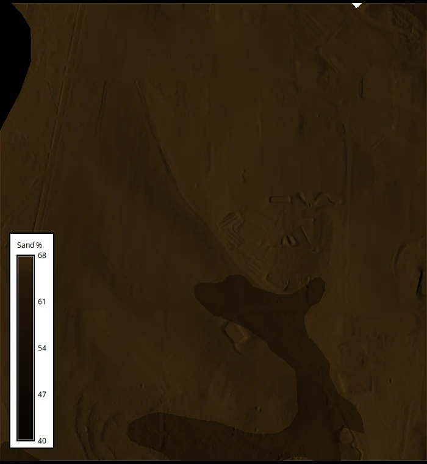
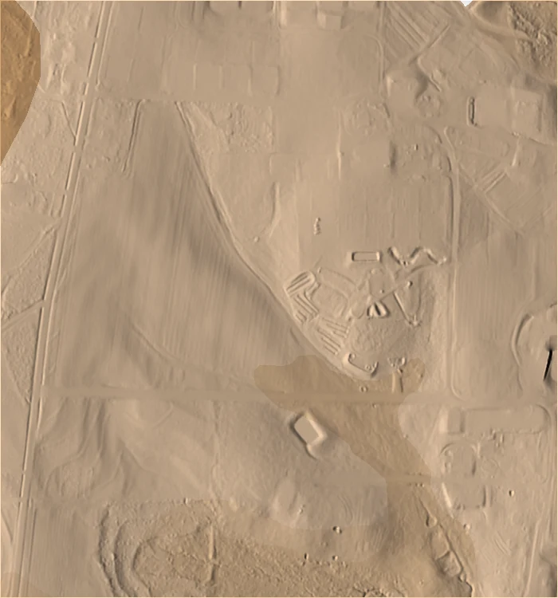
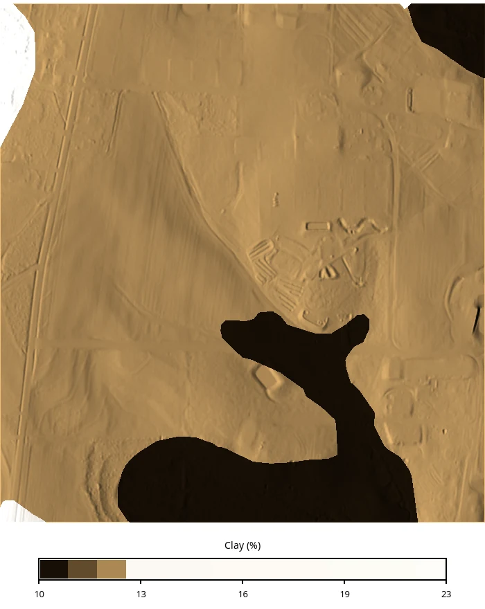
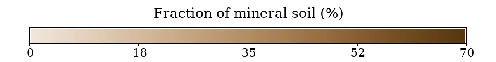
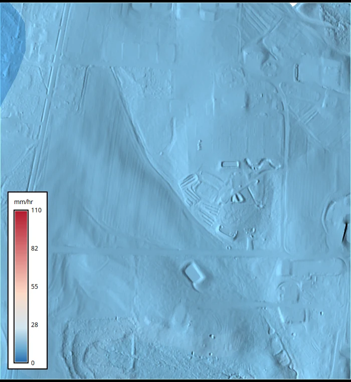
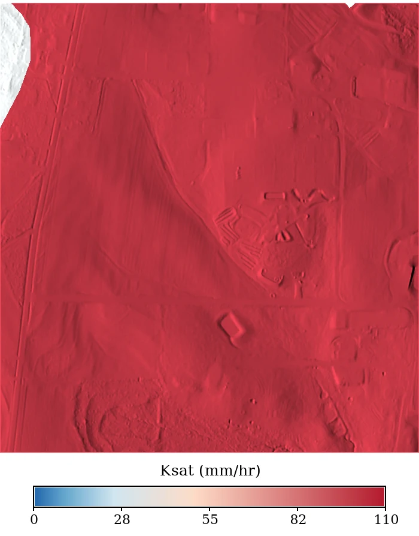
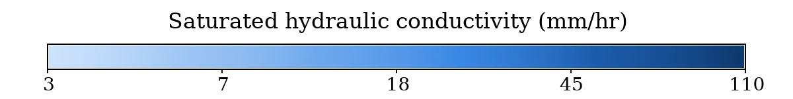
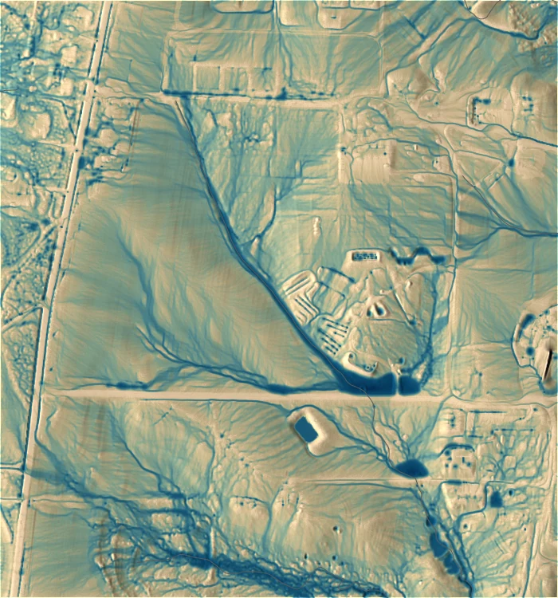
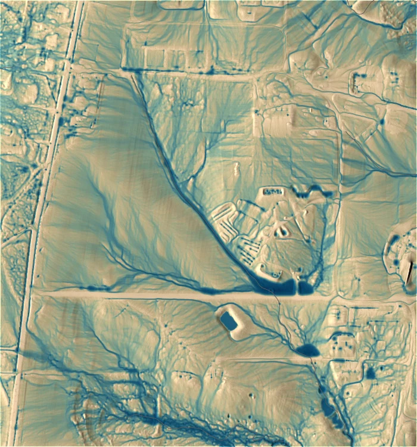
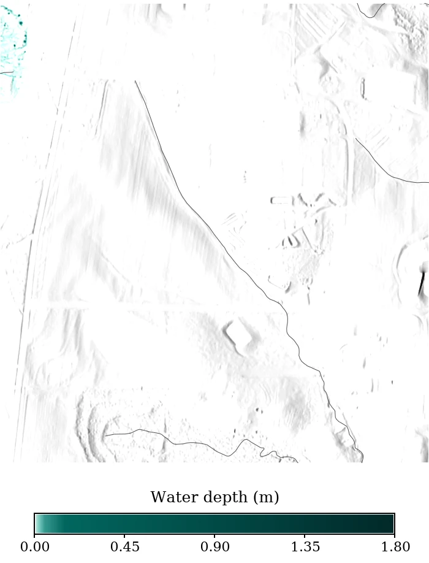

# Introduction

In this tutorial, we will estimate soil infiltration from USDA soil survey data
and use it to drive overland flow simulations with the SIMWE model at a 52 ha
research site in Raleigh, North Carolina.

[r.sim.water](https://grass.osgeo.org/grass-stable/manuals/r.sim.water.html)
accepts infiltration two ways: by setting the rainfall excess rate, where
**rainfall excess** is $\text{rainfall} - \text{infiltration}$, or by setting the
**infiltration rate** in mm/hr applied to water already crossing a cell. Both are
commonly set to a single value for an entire study area through the
`rain_value` and `infil_value` parameters, or defined by a spatially variable
raster through `rain` and `infil`.

During this tutorial we approximate the infiltration rate (`infil`) using the
USDA SSURGO soil survey dataset, which supplies texture, bulk density, and
horizon depths. From those measurements we estimate saturated hydraulic
conductivity (Ksat) with a pedotransfer function (ROSETTA). To do this we will
follow the steps outlined below.

1. Import USDA SSURGO soil texture with
   [r.in.ssurgo](https://grass.osgeo.org/grass-stable/manuals/addons/r.in.ssurgo.html)
2. Estimate Ksat with
   [r.soils.rosetta](https://grass.osgeo.org/grass-stable/manuals/addons/r.soils.rosetta.html),
   which implements the ROSETTA pedotransfer model
3. Run [r.sim.water](https://grass.osgeo.org/grass-stable/manuals/r.sim.water.html)
   three times, with a single infiltration value, with the estimated Ksat field,
   and with the Ksat SSURGO reports directly

Additional concepts covered in this tutorial:

* Downloading and initializing a published GRASS sample project
* Querying the Soil Data Access web service from the computational region
* Depth-weighted aggregation of soil horizon data
* Deriving Manning's n from land cover
* Comparing simulation runs that differ in one input

The study site is the North Carolina State University Sediment and Erosion
Control Research and Education Facility (SECREF). The data come from a GRASS
sample dataset assembled for SIMWE work [@petrasova_secref_2026].

::: {.callout-note title="How to run this tutorial?"}
This tutorial is prepared to be run in a Jupyter notebook locally or using
services such as Google Colab. You can
[download the notebook here](soil_informed_overland_flow.ipynb).

If you are not sure how to get started with GRASS, check out the tutorials
[Get started with GRASS & Python in Jupyter Notebooks](../get_started/fast_track_grass_and_python.qmd)
and [Get started with GRASS in Google Colab](../get_started/grass_gis_in_google_colab.qmd).
:::

For the empirical alternative to this workflow, the
[SIMWE parallelization tutorial](../parallelization/SIMWE_parallelization.qmd)
derives runoff from the SCS Curve Number method instead.

# Setup

Start with importing Python packages. To import the _grass_ package, you need to
tell Python where the GRASS Python package is (can be skipped for some
environments).

```{python}
import io
import os
import sys
import subprocess
from pathlib import Path

sys.path.append(
    subprocess.check_output(["grass", "--config", "python_path"], text=True).strip()
)

import pandas as pd

import grass.script as gs
import grass.jupyter as gj
from grass.tools import Tools
```

We will install the two addons used in this tutorial.

```{python}
tools = Tools()
tools.g_extension(extension="r.in.ssurgo")
tools.g_extension(extension="r.soils.rosetta")
```

`r.soils.rosetta` runs the offline
[rosetta-soil](https://pypi.org/project/rosetta-soil/) package when it is
installed and falls back to a web API when it is not. Install it to keep the run
reproducible and to enable the uncertainty outputs.

The plots later in the tutorial use pandas, seaborn, and matplotlib.

```{python}
# | eval: false
!pip install rosetta-soil pandas seaborn matplotlib
```

The maps below place their legend outside the map frame. `d.legend` draws
inside the frame, so each figure widens the computational region with
[RegionManager](https://grass.osgeo.org/grass-stable/manuals/libpython/grass.script.html#grass.script.RegionManager)
and draws the legend into the empty map that creates.

```{python}
#| code-fold: true
#| code-summary: "Show the figure settings"
FONT = "OpenSans-Regular"

# Adding 150 m to the south of the 750 m region puts the legend in the bottom
# 150 / 900 = 16.7% of the frame. Blank that strip so vectors do not run into it.
BLANK = """color white
polygon
 0 0
 100 0
 100 16.7
 0 16.7
"""
```

## Download the sample dataset

The SECREF project is a complete GRASS project in EPSG:6542 (NAD83(2011) /
North Carolina, meters) at 1 m resolution. We download it from Zenodo and
unpack it.

```{python}
import urllib.request
import zipfile

url = (
    "https://zenodo.org/api/records/23017720/files/"
    "secref_northcarolina_usa_epsg6542.zip/content"
)
grassdata = Path("grassdata")
grassdata.mkdir(exist_ok=True)

urllib.request.urlretrieve(url, "secref.zip")
with zipfile.ZipFile("secref.zip") as archive:
    archive.extractall(grassdata)
```

The download is about 24 MB. We will work in a new mapset so that the published
PERMANENT mapset stays as distributed.

```{python}
mapset_path = grassdata / "secref_northcarolina_usa_epsg6542" / "work"
gs.create_mapset(mapset_path)
session = gj.init(mapset_path)
tools = Tools(session=session)
```

The project contains six rasters and three vectors:

```{python}
#| code-fold: true
#| code-summary: "Show the table code"
pd.DataFrame(
    [
        {
            "type": kind,
            "maps": ", ".join(
                m["name"]
                for m in tools.g_list(
                    type=kind, mapset="PERMANENT", format="json"
                ).json
            ),
        }
        for kind in ["raster", "vector"]
    ]
)
```

| type   | maps                                                 |
|:-------|:-----------------------------------------------------|
| raster | elevation, landcover, naip.1, naip.2, naip.3, naip.4 |
| vector | roads, soils, streams                                |

We set the computational region to the elevation map. Everything that follows
inherits this region, 700 by 750 cells at 1 m.

```{python}
#| code-fold: true
#| code-summary: "Show the table code"
tools.g_region(raster="elevation")

region = tools.g_region(flags="p", format="json").json
pd.DataFrame(
    [{"setting": "CRS", "value": region["crs"]["name"]}]
    + [
        {"setting": key, "value": region[key]}
        for key in ["north", "south", "west", "east",
                    "nsres", "ewres", "rows", "cols", "cells"]
    ]
)
```

| setting | value                        |
|:--------|:-----------------------------|
| CRS     | NAD83(2011) / North Carolina |
| north   | 220750                       |
| south   | 220000                       |
| west    | 638300                       |
| east    | 639000                       |
| nsres   | 1                            |
| ewres   | 1                            |
| rows    | 750                          |
| cols    | 700                          |
| cells   | 525000                       |

# The study area

SECREF is on a low Piedmont ridge draining to two small streams. The 0.6 m USDA
National Agriculture Imagery Program (NAIP) imagery shows the research plots,
gravel access roads, and wooded margins.

```{python}
#| code-fold: true
#| code-summary: "Show the figure code"
site = gj.Map(width=900, height=900, font=FONT, use_region=True)
site.d_rgb(red="naip.1", green="naip.2", blue="naip.3")
site.d_vect(map="streams", color="30:120:220", width=2)
site.d_barscale(
    at=(4, 7),
    flags="n",
    fontsize=18,
    length=200, units="meters",
    style="down_ticks",
    color="white", bgcolor="none",
    width_scale=1.5, font="OpenSans-Bold"
)
site.show()
```


Relief across the site spans 29 m, from 102.6 m to 131.6 m. We create a shaded
relief map with
[r.relief](https://grass.osgeo.org/grass-stable/manuals/r.relief.html) and use it
as the base for the maps that follow.

```{python}
#| code-fold: true
#| code-summary: "Show the figure code"
tools.r_relief(input="elevation", output="relief", zscale=2)
tools.r_colors(map="elevation", color="elevation")

with gs.RegionManager(s="s-150"):
    dem = gj.Map(width=900, height=1157, font=FONT, use_region=True)
    dem.d_shade(shade="relief", color="elevation", brighten=30)
    dem.d_vect(map="streams", color="30:120:220", width=2)
    dem.d_graph(stdin=io.StringIO(BLANK))
    dem.d_legend(raster="elevation", title="Elevation (m)", at=(4, 9, 10, 90),
                 flags="st", fontsize=18, title_fontsize=22)
    dem.show()
```


The packaged land cover raster was derived by combining lidar, NAIP imagery, and
OpenStreetMap roads. Its six classes (i.e., developed, paved road, compacted
road, herbaceous, forest, water) will supply the surface roughness values later.

```{python}
#| code-fold: true
#| code-summary: "Show the figure code"
# Widen the region 500 m to the west so d.legend has empty map to sit in.
# The widened region is 1200 x 750 m, so the frame keeps that 1.6 aspect.
with gs.RegionManager(w="w-500"):
    lc = gj.Map(width=900, height=563, font=FONT, use_region=True)
    lc.d_shade(shade="relief", color="landcover", brighten=35)
    lc.d_legend(raster="landcover", title="Land cover",
        at=(3, 82, 5, 20), flags="nc",
        fontsize=18, title_fontsize=24
    )
    lc.show()
```


# Importing soil texture from SSURGO

The Soil Survey Geographic Database (SSURGO) is the USDA's detailed soil survey
[@ssurgo]. It is distributed as map unit polygons linked to tables of soil
components and horizons, so it needs aggregation before it can be used as raster
model input. `r.in.ssurgo` pulls the survey, aggregates the component and horizon
tables over a depth interval, and writes the result as rasters.

When `ssurgo_path` is left empty, the tool builds an area of interest from the
current computational region and queries the
[Soil Data Access](https://sdmdataaccess.nrcs.usda.gov/) (SDA) web service, so
for a 52 ha region no manual download is required.

```{python}
tools.r_in_ssurgo(
    soils="ssurgo_soils",
    sand="sand",
    silt="silt",
    clay="clay",
    bulk_density="bd",
    ksat_r="ssurgo_ksat_r",
    hydgrp="hydgrp",
    mukey="mukey",
    hzdept_r=0,
    hzdepb_r=25.4,
)
```

`hzdept_r=0` and `hzdepb_r=25.4` request a depth-weighted average over the top
25.4 cm (i.e., 10 inches), the layer that governs infiltration during a short
storm. The SDA query takes a couple of minutes.

::: {.callout-note title="SDA or a local archive?"}
`r.in.ssurgo` reads SSURGO two ways. Leaving `ssurgo_path` empty queries the SDA
web service for the current region, which is what we do here. Supplying a local
archive instead, either a Web Soil Survey area export or a state-wide gSSURGO
database, avoids the network and scales to large areas. The
[SIMWE parallelization tutorial](../parallelization/SIMWE_parallelization.qmd)
uses the local mode with a state-wide gSSURGO file. The local mode works best
with the `duckdb` Python package, and falls back to a SQLite backend without it.
:::

The three texture separates (i.e., sand, silt, and clay) are the required
ROSETTA inputs. Bulk density is optional and improves the estimate.

All three share one 0 to 70% color table, so the panels show their relative size
as well as their internal variation.

```{python}
#| code-fold: true
#| code-summary: "Show the figure code"
rules = """0 241:230:218
12 222:200:177
23 202:171:138
35 177:140:99
47 149:109:64
58 118:80:36
70 84:53:15
nv 255:255:255
"""
for name in ["sand", "silt", "clay"]:
    tools.r_colors(map=name, rules="-", stdin=io.StringIO(rules))
    m = gj.Map(width=700, height=750, font=FONT)
    m.d_shade(shade="relief", color=name, brighten=25)
    m.show()

# one legend for all three, on its own frame
leg = gj.Map(width=1200, height=150, font=FONT)
leg.d_legend(raster="sand", title="Fraction of mineral soil (%)", range=(0, 70),
             at=(30, 55, 6, 94), flags="st", fontsize=20, title_fontsize=24)
leg.show()
```

::: {layout-ncol=3}





:::



The site averages 67% sand and 12% clay. The texture rasters are piecewise
constant because SSURGO reports one value per map unit, and seven map units
cover the entire site (15 polygons, several of which share a map unit key).

```{python}
#| code-fold: true
#| code-summary: "Show the table code"
rows = []
for name in ["sand", "silt", "clay", "bd"]:
    s = tools.r_univar(map=name, format="json")
    rows.append({"raster": name, "min": s["min"], "max": s["max"], "mean": s["mean"]})

pd.DataFrame(rows).round(2)
```

| raster |   min |    max |  mean |
|:-------|------:|-------:|------:|
| sand   | 40.00 |  68.00 | 67.20 |
| silt   | 20.00 |  37.00 | 20.92 |
| clay   | 10.00 |  23.00 | 11.89 |
| bd     |  1.38 |   1.58 |  1.58 |

# Estimating hydraulic parameters with ROSETTA

ROSETTA is a hierarchical pedotransfer model that estimates the
Mualem-van Genuchten parameters from soil texture [@schaap_rosetta_2001;
@vangenuchten_closed_1980]. `r.soils.rosetta` applies it cell by cell using the
recalibrated Rosetta3 coefficients [@zhang_weighted_2017].

::: {.callout-note title="What is a pedotransfer function?"}
Measuring saturated hydraulic conductivity in the field is slow and expensive, so
it is rarely mapped over large areas, while texture is recorded everywhere a soil
survey goes. A pedotransfer function is a statistical model fit to soils where
both quantities were measured, and it estimates the expensive property from the
inexpensive one. ROSETTA was trained on roughly 2000 soil samples and estimates
five parameters: residual and saturated water content (`theta_r`, `theta_s`), the
van Genuchten shape parameters `alpha` and `n`, and saturated hydraulic
conductivity (`ksat`).
:::

The combination of inputs supplied selects the model version. Texture alone gives
model 2, adding bulk density gives model 3, and adding water content at 33 kPa
and 1500 kPa gives models 4 and 5. We have bulk density, so this is a model 3
run. Only the outputs that are named get computed.

```{python}
tools.r_soils_rosetta(
    sand="sand",
    silt="silt",
    clay="clay",
    bulk_density="bd",
    ksat="ksat_rosetta",
    theta_s="theta_s",
    version=3,
    ksat_units="mm_per_hour",
)
```

ROSETTA reports conductivity in cm/day and `r.sim.water` expects mm/hr, so
`ksat_units="mm_per_hour"` has the tool convert the output.

```{python}
#| code-fold: true
#| code-summary: "Show the figure code"
ksat_rules = """0% 205:226:251
20% 158:197:244
40% 109:167:236
60% 57:135:229
80% 28:92:171
100% 13:54:107
nv 255:255:255
"""
tools.r_colors(map="ksat_rosetta", rules="-", stdin=io.StringIO(ksat_rules))

with gs.RegionManager(s="s-150"):
    m = gj.Map(width=900, height=1157, font=FONT, use_region=True)
    m.d_shade(shade="relief", color="ksat_rosetta", brighten=25)
    m.d_graph(stdin=io.StringIO(BLANK))
    m.d_legend(raster="ksat_rosetta", at=(4, 9, 10, 90), flags="st",
               title="Saturated hydraulic conductivity (mm/hr)",
               fontsize=18, title_fontsize=22)
    m.show()
```


Estimated conductivity ranges from 6.8 to 13.2 mm/hr. The lowest values fall on
the map unit carrying 23% clay, which follows the drainage line through the
southern half of the site. Saturated water content (i.e., the pore space
available to hold water) ranges from 0.36 to 0.41 cm³/cm³.

```{python}
#| code-fold: true
#| code-summary: "Show the figure code"
theta_rules = """0% 220:240:236
17% 176:218:209
33% 134:192:181
50% 96:164:152
67% 60:132:121
83% 31:101:91
100% 12:70:62
nv 255:255:255
"""
tools.r_colors(map="theta_s", rules="-", stdin=io.StringIO(theta_rules))

with gs.RegionManager(s="s-150"):
    m = gj.Map(width=900, height=1157, font=FONT, use_region=True)
    m.d_shade(shade="relief", color="theta_s", brighten=25)
    m.d_graph(stdin=io.StringIO(BLANK))
    m.d_legend(raster="theta_s", title="Saturated water content (cm3/cm3)",
               at=(4, 9, 10, 90), flags="st", fontsize=18, title_fontsize=22)
    m.show()
```


## Comparing against the Ksat reported by SSURGO

SSURGO reports a representative saturated hydraulic conductivity of its own,
imported above as `ssurgo_ksat_r`. We compare the two on a shared absolute color
scale.

```{python}
#| code-fold: true
#| code-summary: "Show the table code"
rows = []
for name in ["ksat_rosetta", "ssurgo_ksat_r"]:
    s = tools.r_univar(map=name, format="json")
    rows.append({"raster": name, "min": s["min"], "max": s["max"], "mean": s["mean"]})

pd.DataFrame(rows).round(2)
```

| raster        |   min |    max |  mean |
|:--------------|------:|-------:|------:|
| ksat_rosetta  |  6.79 |  13.24 | 12.41 |
| ssurgo_ksat_r | 32.40 | 100.80 | 99.84 |

Both panels share one absolute color table, log-spaced over the NRCS class range.

```{python}
#| code-fold: true
#| code-summary: "Show the figure code"
rules = """3 205:226:251
6 158:197:244
12 109:167:236
25 57:135:229
50 28:92:171
110 13:54:107
nv 255:255:255
"""
for name in ["ksat_rosetta", "ssurgo_ksat_r"]:
    tools.r_colors(map=name, rules="-", stdin=io.StringIO(rules))
    m = gj.Map(width=700, height=750, font=FONT)
    m.d_shade(shade="relief", color=name, brighten=22)
    m.show()

leg = gj.Map(width=1200, height=150, font=FONT)
leg.d_legend(raster="ksat_rosetta", range=(3, 110), at=(30, 55, 6, 94), flags="stl",
             title="Saturated hydraulic conductivity (mm/hr)",
             fontsize=20, title_fontsize=24)
leg.show()
```

::: {layout-ncol=2}



:::



SSURGO's representative value averages about eight times higher than the ROSETTA
estimate. The two are produced differently: SSURGO's is a soil scientist's
estimate for the component, anchored to field observation and conductivity class
ranges, while ROSETTA's is a regression on texture and bulk density. Neither is a
measurement at this site. We will run the simulation with both.

::: {.callout-important title="Pedotransfer estimates carry uncertainty"}
Saturated hydraulic conductivity varies over orders of magnitude and is difficult
to constrain, so an eight-fold spread between two defensible estimates is not
unusual. Running `r.soils.rosetta` with the `-u` flag produces per-parameter
standard deviation maps.
:::

ROSETTA is also nonlinear, so applying it to depth-averaged texture does not give
the same result as applying it per horizon and averaging afterward. We requested
texture already averaged over the top 25.4 cm, so the estimate inherits that
approximation.

## A map unit table

Both maps are constant within each SSURGO map unit, so we can collapse them to
one row per map unit with
[r.univar](https://grass.osgeo.org/grass-stable/manuals/r.univar.html) using the
`mukey` raster as zones.

```{python}
#| code-fold: true
#| code-summary: "Show the table code"
params = ["ksat_rosetta", "ssurgo_ksat_r", "clay"]
rows = {}
for p in params:
    for zone in tools.r_univar(map=p, zones="mukey", format="json").json:
        rows.setdefault(zone["zone"], {"cells": zone["n"]})[p] = zone["mean"]

units = pd.DataFrame.from_dict(rows, orient="index").rename_axis("mukey")
units = units[units["cells"] > 0]
units["share"] = units["cells"] / units["cells"].sum()
units[["ksat_rosetta", "ssurgo_ksat_r", "clay", "share"]].round(3)
```

|   mukey | ksat_rosetta | ssurgo_ksat_r | clay | share |
|--------:|-------------:|--------------:|-----:|------:|
| 2538507 |       12.070 |         100.8 | 10.0 | 0.087 |
| 2557360 |        6.793 |          32.4 | 23.0 | 0.014 |
| 2739852 |       13.238 |         100.8 | 10.0 | 0.048 |
| 3050232 |       10.702 |         100.8 | 13.0 | 0.003 |
| 3050241 |       12.497 |         100.8 | 12.0 | 0.433 |
| 3050242 |       12.497 |         100.8 | 12.0 | 0.414 |

The reference lines are the NRCS standard Ksat classes [@soilsurveystaff_manual_2017],
converted from micrometers per second to mm/hr. This comparison follows the
SSURGO and ROSETTA evaluation in the ncss-tech ROSETTA API documentation
[@beaudette_rosetta_api], computed here from the SECREF data.

```{python}
#| code-fold: true
#| code-summary: "Show the figure code"
import matplotlib
import matplotlib.pyplot as plt
import numpy as np
import seaborn as sns

INK, INK2, SURFACE, ACCENT = "#0b0b0b", "#52514e", "#fcfcfb", "#b3261e"
sns.set_theme(style="whitegrid", rc={
    "figure.facecolor": SURFACE, "axes.facecolor": SURFACE,
    "axes.edgecolor": "#d8d7d3", "axes.labelcolor": INK,
    "grid.color": "#d8d7d3", "grid.linewidth": 0.6, "text.color": INK,
    "xtick.color": INK2, "ytick.color": INK2, "font.size": 11,
})

# NRCS standard Ksat classes, um/s converted to mm/hr
CLASSES = [("very low", 0.0, 0.036), ("low", 0.036, 0.36),
           ("moderately low", 0.36, 3.6), ("moderately high", 3.6, 36.0),
           ("high", 36.0, 360.0), ("very high", 360.0, 2538.0)]

fig, ax = plt.subplots(figsize=(7.2, 6.4))
lims = (3, 400)
ax.plot(lims, lims, "--", color=ACCENT, linewidth=1.5, zorder=2)
ax.annotate("1:1", xy=(320, 320), color=ACCENT, fontsize=10, ha="right", va="bottom")

for _, lo, hi in CLASSES:
    for edge in (lo, hi):
        if lims[0] < edge < lims[1]:
            ax.axhline(edge, color="#d8d7d3", linewidth=0.7, zorder=1)
            ax.axvline(edge, color="#d8d7d3", linewidth=0.7, zorder=1)
for label, lo, hi in CLASSES:
    mid = np.sqrt(max(lo, lims[0]) * hi)
    if lims[0] * 1.25 < mid < lims[1] / 1.25:
        ax.text(lims[0] * 1.05, mid, label, color=INK2, fontsize=9,
                va="center", style="italic")

sns.scatterplot(
    data=units.sort_values("share", ascending=False),
    x="ksat_rosetta", y="ssurgo_ksat_r", size="share", sizes=(90, 900),
    color="#256abf", edgecolor=SURFACE, linewidth=1.2, alpha=0.92,
    legend=False, ax=ax, zorder=3,
)
ax.annotate("two map units,\n85% of the site", xy=(12.48, 100.53),
            xytext=(30, -40), textcoords="offset points", color=INK2, fontsize=10,
            arrowprops=dict(arrowstyle="-", color=INK2, linewidth=0.9))

ax.set(xscale="log", yscale="log", xlim=lims, ylim=lims)
ax.set_xlabel("ROSETTA estimated Ksat (mm/hr)")
ax.set_ylabel("SSURGO reported Ksat (mm/hr)")
ax.set_title("Every map unit falls above the 1:1 line", fontsize=13, pad=22, loc="left")
ax.text(0, 1.015, "Marker area is the share of the site each map unit covers",
        transform=ax.transAxes, color=INK2, fontsize=10)
for axis in (ax.xaxis, ax.yaxis):
    axis.set_major_formatter(matplotlib.ticker.FuncFormatter(lambda v, _: f"{v:g}"))
    axis.set_minor_formatter(matplotlib.ticker.NullFormatter())
sns.despine(ax=ax)
plt.show()
```


Every map unit sits above the 1:1 line. The two map units covering 85% of the
site place ROSETTA in the moderately high class and SSURGO in the high class,
one full class apart.

# Preparing the SIMWE inputs

SIMWE solves the shallow water flow equation using a path sampling (i.e.,
walker-based) method [@mitas_distributed_1998; @mitasova_path_2004]. Besides
elevation it needs a surface roughness map, a rainfall rate, and an infiltration
rate. The partial derivatives of the surface are computed internally.

Manning's n comes from land cover through the
[r.manning](https://grass.osgeo.org/grass-stable/manuals/addons/r.manning.html)
addon, which ships coefficients for NLCD and ESA WorldCover and takes a
`code,n` rules file for anything else. The SECREF classes are custom, so we
supply our own, ranging from 0.011 for pavement to 0.20 for forest floor.

```{python}
tools.g_extension(extension="r.manning")

rules = """# code,n
1,0.05
2,0.011
3,0.02
4,0.10
5,0.20
6,0.03
"""
rules_file = Path("manning_rules.csv")
rules_file.write_text(rules)

tools.r_manning(
    input="landcover",
    output="manning",
    landcover="custom",
    rules=str(rules_file),
)
```

```{python}
#| code-fold: true
#| code-summary: "Show the figure code"
manning_colors = """0.011 142:191:148
0.02 107:165:115
0.03 77:138:87
0.05 54:110:64
0.10 34:83:44
0.2001 19:57:27
nv 255:255:255
"""
tools.r_colors(map="manning", rules="-", stdin=io.StringIO(manning_colors))

with gs.RegionManager(s="s-150"):
    m = gj.Map(width=900, height=1157, font=FONT, use_region=True)
    m.d_shade(shade="relief", color="manning", brighten=35)
    m.d_graph(stdin=io.StringIO(BLANK))
    m.d_legend(raster="manning", title="Manning's n", range=(0.011, 0.2),
               at=(4, 9, 10, 90), flags="stl", fontsize=18, title_fontsize=22)
    m.show()
```


The SSURGO polygons leave 72 cells out of 525,000 without soil data.
`r.sim.water` applies no infiltration where the `infil` map is NULL, so those
cells would shed water as if they were paved. We fill them with the site mean.

```{python}
tools.r_mapcalc(expression="ksat_fill = if(isnull(ksat_rosetta), 12.4, ksat_rosetta)")
```

# Running the simulations

All three runs use a 54 mm/hr rainfall rate held for 60 minutes, approximately a
10-year, 1-hour storm for Raleigh. The infiltration input is the only thing that
changes between them.

::: {.callout-warning title="`rain` and `infil` act at different points"}
`rain` takes a rainfall excess rate, rainfall minus infiltration. You do that
subtraction yourself before the run, so the removed water never enters the flow
at all.

`infil` applies to water that is already moving across a cell, which drinks from
it at a fixed rate. That is what captures runoff generated on pavement losing
volume as it crosses a lawn downslope, and it is what we use here.

Neither rate responds to the soil filling up. Both stay constant for the whole
simulation.
:::

The first run is the baseline a modeler gets with no soil data at all. Leaving
`infil` off defaults it to zero, so every millimeter of rain stays on the
surface.

```{python}
tools.r_sim_water(
    elevation="elevation",
    rain_value=54,
    man="manning",
    depth="depth_noinfil",
    discharge="disch_noinfil",
    duration=60,
    output_step=60,
    random_seed=7,
    nprocs=6,
)
```

The second run uses the ROSETTA field.

```{python}
tools.r_sim_water(
    elevation="elevation",
    rain_value=54,
    infil="ksat_fill",
    man="manning",
    depth="depth_rosetta",
    discharge="disch_rosetta",
    duration=60,
    output_step=60,
    random_seed=7,
    nprocs=6,
)
```


::: {.callout-tip title="Simulation run time"}
Each run covers 525,000 cells with roughly a million walkers, so expect several
minutes per simulation. Increase `nprocs` if more cores are available, and reduce
`duration` to 20 minutes while adjusting the workflow.
:::

The third run uses the Ksat reported by SSURGO.

```{python}
tools.r_mapcalc(
    expression="ssurgo_ksat_fill = if(isnull(ssurgo_ksat_r), 99.8, ssurgo_ksat_r)"
)
tools.r_sim_water(
    elevation="elevation",
    rain_value=54,
    infil="ssurgo_ksat_fill",
    man="manning",
    depth="depth_ssurgo",
    discharge="disch_ssurgo",
    duration=60,
    output_step=60,
    random_seed=7,
    nprocs=6,
)
```

# Results

The three runs share one color table, with breaks spaced logarithmically because
depth spans four orders of magnitude.

```{python}
#| code-fold: true
#| code-summary: "Show the figure code"
rules = """0 226:197:164
0.002 191:172:131
0.008 127:154:132
0.03 77:128:131
0.12 39:99:120
0.45 10:70:103
1.8 3:42:76
nv 255:255:255
"""
for name in ["depth_noinfil", "depth_rosetta", "depth_ssurgo"]:
    tools.r_colors(map=name, rules="-", stdin=io.StringIO(rules))
    m = gj.Map(width=700, height=750, font=FONT)
    m.d_shade(shade="relief", color=name, brighten=50)
    m.d_vect(map="streams", color="90:90:90", width=1)
    m.show()

leg = gj.Map(width=1200, height=150, font=FONT)
leg.d_legend(raster="depth_rosetta", title="Water depth (m)", range=(0.001, 1.8),
             at=(30, 55, 6, 94), flags="stl", fontsize=20, title_fontsize=24)
leg.show()
```

::: {layout-ncol=3}





:::


```{python}
#| code-fold: true
#| code-summary: "Show the table code"
rows = []
for name in ["depth_noinfil", "depth_rosetta", "depth_ssurgo"]:
    s = tools.r_univar(map=name, format="json")
    rows.append({"run": name, "mean depth (mm)": s["mean"] * 1000, "total": s["sum"]})

pd.DataFrame(rows).round(3)
```

| run           | mean depth (mm) |   total |
|:--------------|----------------:|--------:|
| depth_noinfil |          21.931 | 11513.7 |
| depth_rosetta |          18.509 |  9717.0 |
| depth_ssurgo  |           0.071 |    37.3 |

## ROSETTA infiltration against none

The ROSETTA field removed 15.6% of the surface water, dropping mean flow depth
from 21.9 mm to 18.5 mm. We map the difference to see where it went.

```{python}
#| code-fold: true
#| code-summary: "Show the figure code"
tools.r_mapcalc(expression="depth_diff = depth_rosetta - depth_noinfil")

# Red where infiltration removed water, blue where it added, tan at no change.
# Breaks are tight near zero because 95% of cells fall within a centimetre of it.
diff_rules = """-0.30 103:0:13
-0.08 178:24:43
-0.02 214:96:77
-0.005 240:160:110
-0.001 226:200:150
0 219:194:122
0.001 180:205:220
0.01 33:102:172
nv 255:255:255
"""
tools.r_colors(map="depth_diff", rules="-", stdin=io.StringIO(diff_rules))

with gs.RegionManager(s="s-150"):
    m = gj.Map(width=900, height=1157, font=FONT, use_region=True)
    m.d_shade(shade="relief", color="depth_diff", brighten=50)
    m.d_graph(stdin=io.StringIO(BLANK))
    m.d_legend(raster="depth_diff", title="Depth difference (m)",
               at=(4, 9, 10, 90), flags="st", fontsize=18, title_fontsize=22)
    m.show()
```


```{python}
#| code-fold: true
#| code-summary: "Show the table code"
stats = tools.r_univar(map="depth_diff", format="json")
pd.DataFrame(
    [{key: stats[key] for key in ["min", "max", "mean", "stddev"]}]
).round(4)
```

|     min |    max |    mean | stddev |
|--------:|-------:|--------:|-------:|
| -0.2984 | 0.0096 | -0.0034 | 0.0122 |

The loss is concentrated where water collects. Cells in the ponds and the main
drainage line drop by up to 30 cm, while the sheet flow over the plots loses
almost nothing, since a cell only infiltrates from the water crossing it.

::: {.callout-note title="The spatial pattern matters less than the level"}
The seven SSURGO map units at this site span only 6.8 to 13.2 mm/hr, a standard
deviation of 0.7 mm/hr. Swapping that field for its own site mean of 12.4 mm/hr
moves mean flow depth by about one tenth of one percent. Check the spread of a
conductivity map with
[r.univar](https://grass.osgeo.org/grass-stable/manuals/r.univar.html) before
mapping it at full resolution.
:::

## ROSETTA Ksat compared to SSURGO Ksat

The SSURGO-driven run left 37 units of water on the surface against the ROSETTA
run's 9717, a factor of 260. SSURGO's representative conductivity averages
99.8 mm/hr while the storm delivers 54 mm/hr, so infiltration keeps pace with
rainfall across most of the site and only the wettest corner generates any flow
depth.

Adding a soil-derived infiltration field to the model changed the result by 16%.
Choosing between two published estimates of that soil property changed it by two
orders of magnitude. Deciding between them requires a field measurement of
conductivity at the site.

# Assumptions and limitations

* Depth averaging over the top 25.4 cm discards horizon structure, and because
  ROSETTA is nonlinear the estimate is not equivalent to a per-horizon
  calculation.
* Ksat is the conductivity of an already saturated soil, and `infil` holds it
  constant for the whole run. Dry soil takes water faster than that, so these
  runs understate infiltration and overstate runoff early in the storm.
* Manning's n values are assigned by land cover class from published tables
  rather than calibrated at this site.
* None of the runs are validated against observed discharge at SECREF, so the
  comparisons describe model sensitivity rather than model accuracy.

# Summary

We derived a spatially varying infiltration field from a soil survey and used it
to drive an overland flow simulation:

* `r.in.ssurgo` converts SSURGO map units into depth-weighted texture rasters,
  over the SDA web service for small areas or from a local archive for large
  ones.
* `r.soils.rosetta` applies the ROSETTA pedotransfer model to those rasters and
  writes saturated hydraulic conductivity in the units `r.sim.water` expects.
* `r.sim.water` takes that conductivity as its `infil` input.

At this site, adding a soil-derived infiltration field removed 16% of the surface
water, while exchanging one published conductivity estimate for another changed
it by a factor of 260. The magnitude of Ksat matters more than its spatial
pattern, and `r.univar` will tell you that before you map it.

Next steps:

* Add the `-u` flag to `r.soils.rosetta` for uncertainty maps, and run the
  simulation at the bounds to put an interval around these depths.
* Use the `-t` flag with `output_step` to produce a time series, register it with
  [t.register](https://grass.osgeo.org/grass-stable/manuals/t.register.html), and
  animate the evolving flow.
* Add sediment transport with
  [r.sim.sediment](https://grass.osgeo.org/grass-stable/manuals/r.sim.sediment.html),
  which reuses the depth and discharge maps produced here.
* Work through the same soil-informed workflow at catchment scale in the SIMWE
  Soils Project notebooks [@white_nrcs_simwe], which add curve number, time of
  concentration, NOAA Atlas 14 design storms, and walker velocity animation at
  [Coweeta, NC](https://ncsu-geoforall-lab.github.io/NRCS_SIMWE/notebooks/ssurgo.html)
  and [Clay Center, KS](https://ncsu-geoforall-lab.github.io/NRCS_SIMWE/notebooks/ssurgo_clay_center.html).

# See also

* [r.in.ssurgo](https://grass.osgeo.org/grass-stable/manuals/addons/r.in.ssurgo.html)
* [r.soils.rosetta](https://grass.osgeo.org/grass-stable/manuals/addons/r.soils.rosetta.html)
* [r.sim.water](https://grass.osgeo.org/grass-stable/manuals/r.sim.water.html)
* [Parallelization of overland flow and sediment transport simulation](../parallelization/SIMWE_parallelization.qmd)
* [SIMWE Soils Project](https://ncsu-geoforall-lab.github.io/NRCS_SIMWE/),
  the NRCS work this workflow comes out of
* [SECREF sample dataset on Zenodo](https://doi.org/10.5281/zenodo.23017720)

# References

::: {#refs}
:::
