GRASS cuenta con numerosas herramientas que permiten visualizar y modelar el terreno a partir de mapas ráster de modelos digitales de elevación (MDE). Algunos ejemplos incluyen:  

-  [r.shade](https://grass.osgeo.org/grass-stable/manuals/r.shade.html) para visualización,  

-  [r.slope.aspect](https://grass.osgeo.org/grass-stable/manuals/r.slope.aspect.html) para modelar pendiente y aspecto,  

-  [r.geomorphon](https://grass.osgeo.org/grass-stable/manuals/r.geomorphon.html) para modelar características topográficas,  

-  [r.watershed](https://grass.osgeo.org/grass-stable/manuals/r.watershed.html) para modelar el flujo superficial y las cuencas hidrográficas, y

-  [r.stream.extract](https://grass.osgeo.org/grass-stable/manuals/r.stream.extract.html) para generar redes de corrientes.  

Este tutorial explorará estas herramientas, pero son solo algunos de los muchos módulos de GRASS para representar y analizar paisajes. 

::: {.callout-note title="Demo Dataset"}
Este tutorial utiliza uno de los conjuntos de datos de muestra estándar de GRASS para Flagstaff, Arizona, EE. UU.: [flagstaff_arizona_usa](https://grass.osgeo.org/sampledata/flagstaff_az_usa_epsg6341.zip).
Haremos referencia a los nombres de lugares en ese conjunto de datos, pero se puede completar con cualquiera de los [conjuntos de datos de muestra estándar](https://grass.osgeo.org/download/data/) para cualquier región, por ejemplo, la [North Carolina conjuntos de datos](https://grass.osgeo.org/sampledata/north_carolina/nc_spm_08_grass7.zip). Nosotras usaremos la *elevación*(elevation) DEM.
:::

::: {.callout-note title="GRASS interfaces"}
Este tutorial está diseñado para que puedas completarlo utilizando la **GUI de GRASS**, comandos de GRASS desde la **consola o terminal**, o utilizando comandos de GRASS en un entorno de **Jupyter Notebook**. 
:::

::: {.callout-note title="¿No sabes cómo empezar?"}
Si no está seguro de cómo comenzar a utilizar GRASS usando su interfaz gráfica de usuario o usando Python, consulte los tutoriales [Comience a utilizar GRASS GIS GUI](https://grass-tutorials.osgeo.org/content/tutorials/get_started/fast_track.html) y [Comience a usar GRASS y Python en Jupyter Notebooks](https://grass-tutorials.osgeo.org/content/tutorials/get_started/JupyterOnWindows_OSGeo4W_Tutorial.html).  
:::

# Terreno, DEM y SIG ráster 

:::: grid
::: g-col-4

-  Si bien muchos mapas representan entidades con puntos, líneas y áreas **vectoriales**, el paisaje espacialmente continuo del terreno a menudo se representa en SIG mediante rásteres.  
:::

::: g-col-8
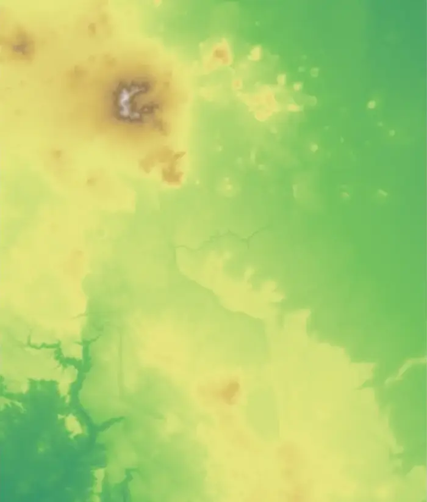  
:::
::::

:::: grid
::: g-col-4

-  Las imágenes ráster representan el terreno mediante una cuadrícula continua de celdas, muy similar a los píxeles de una fotografía digital.  
:::

::: g-col-8
 [CC4.0)](https://creativecommons.org/licenses/by-sa/4.0/deed.en))*](img_terrain/landscape.webp)  
:::
::::

:::: grid
::: g-col-4

-  Con un ráster de **modelo de elevación digital** (Digital Elevation Model), cada celda de la cuadrícula almacena la elevación sobre el nivel del mar del terreno cubierto por la celda de la cuadrícula.  
:::

::: g-col-8
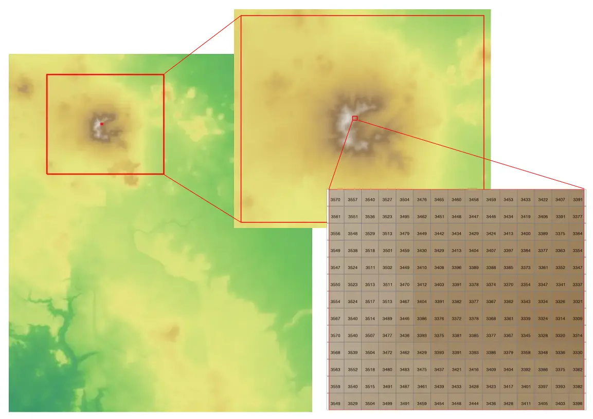

:::
::::

:::: grid
::: g-col-4

-  Al almacenar la elevación de un terreno en múltiples puntos, se puede utilizar un DEM para calcular la pendiente y la orientación en cada ubicación, para identificar características topográficas o para modelar en qué dirección fluirá el agua sobre un terreno.  

-  También se puede utilizar para producir visualizaciones impactantes que muestren las características del terreno, además de representar la topografía.  
:::

::: g-col-8
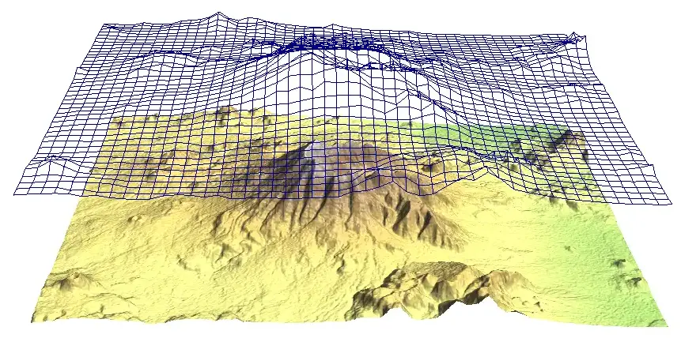
:::
::::

En este tutorial, utilizaremos el DEM denominado ***elevación*** (elevation). En el conjunto de datos de muestra de Flagstaff, este DEM tiene una resolución espacial de 30 m (las celdas de la cuadrícula representan áreas del terreno de 30 x 30 m) con elevación en metros sobre el nivel medio del mar.  

# Visualizando el terreno 

Hay varias formas de crear visualizaciones de terreno en GRASS.  

-  Se puede aplicar una tabla de colores a un DEM para que diferentes elevaciones se asignen a diferentes colores.

-  Se puede sombrear un DEM para crear la apariencia de relieve topográfico 3D. 

-  Se puede aplicar color a un mapa de relieve sombreado.

-  Es posible renderizar un DEM del terreno en 3D para visualizarlo desde diferentes perspectivas.  

## Aplicación de una tabla de colores a un DEM 

GRASS ofrece varias maneras de aplicar color a un DEM para visualizar el terreno en el menú Ráster/Administrar colores. La forma más sencilla es aplicar una tabla de colores mediante el módulo [r.colors](https://grass.osgeo.org/grass-stable/manuals/r.colors.html). 

Apliquemos la tabla de colores de *elevación* (elevation) al DEM de Flagstaff. Esta tabla asigna colores cálidos a las elevaciones más altas y fríos a las más bajas. 

::::::::: {.panel-tabset group="language"}

#### GUI

::::: grid
::: g-col-6

1.  Seleccione la herramienta [r.colors](https://grass.osgeo.org/grass-stable/manuals/r.colors.html) del menú Ráster/Administrar colores.  

2.  En la pestaña "Mapa", seleccione el mapa de *elevación* (elevation) en el cuadro de entrada "Nombre del mapa(s) ráster".
:::

::: g-col-6
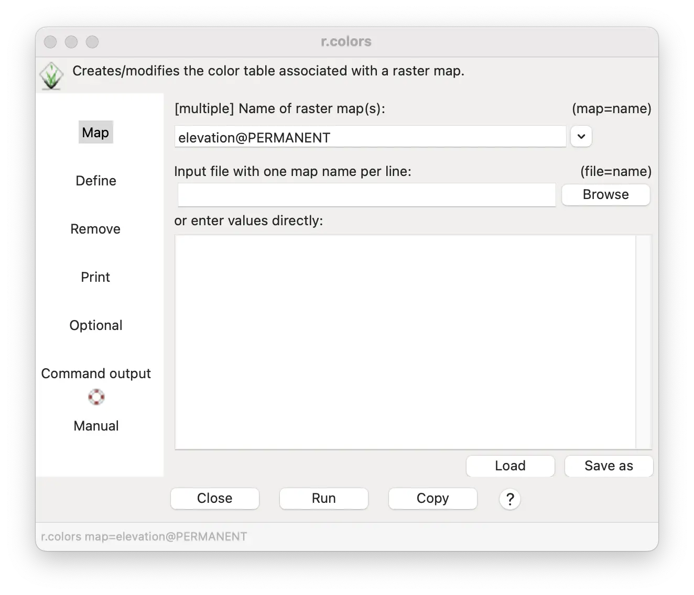  
:::
:::::

::::: grid
::: g-col-6
3.  En la pestaña Definir, seleccione *elevación* (elevation) como tabla de colores.  

4.  Haga clic en Ejecutar.  
:::

::: g-col-6
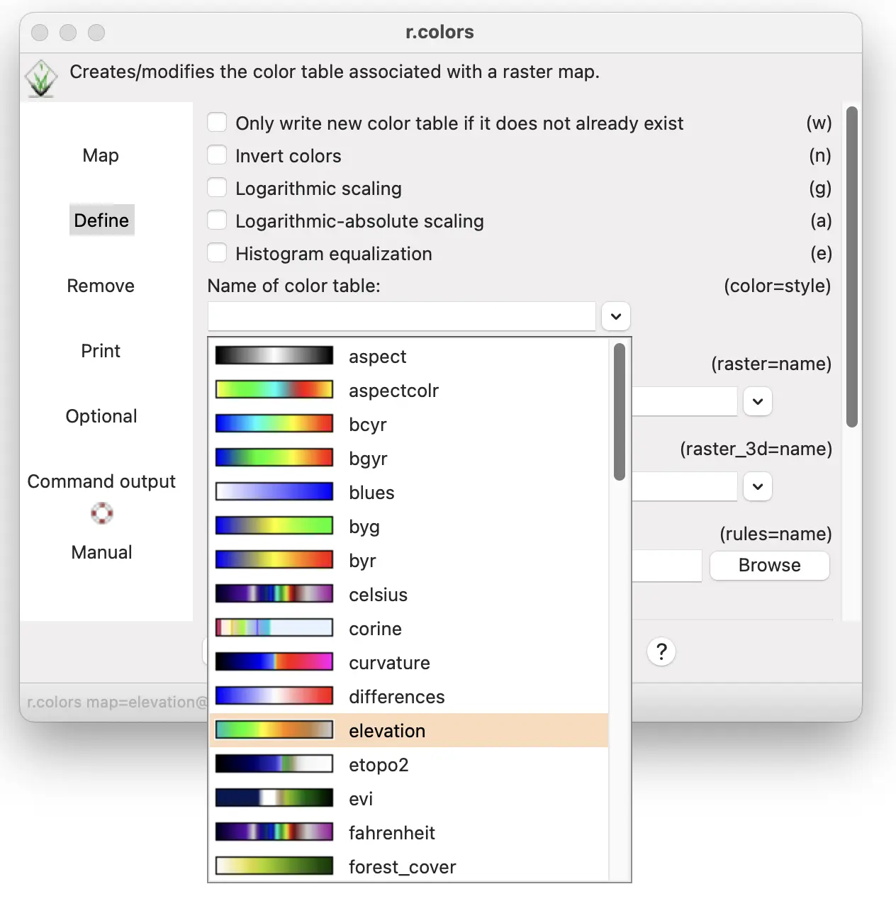
:::
:::::

Prueba otras tablas de colores. Las tablas de colores ETOPO2, de terreno y SRTM también son útiles para los colores de terreno. También puedes crear fácilmente una tabla de colores personalizada, como se describe en el manual de r.colors.  

#### Command line

```{bash}
r.colors -e map=elevation color=elevation
```

#### Python

```{python}
gs.run_command("r.colors", 
                map="elevation", 
                color="elevation", 
                flags="e")
```

:::::::::

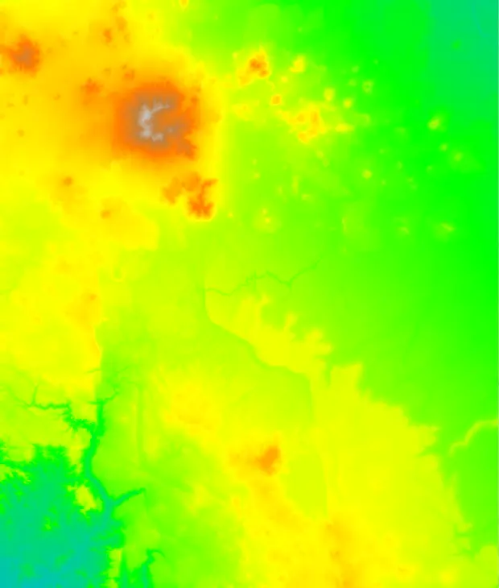  

## Relieve sombreado del terreno 

Un mapa de relieve sombreado añade sombras a un MDE según la dirección de la luz solar y la posición del sol sobre el horizonte especificadas por el usuario. El sombreado de relieve se puede generar porque, al almacenarse la elevación del terreno en cada celda de la cuadrícula, se conoce la altura y la orientación (dirección del terreno) de cada celda. Un mapa de relieve tiene la apariencia de una topografía 3D.

Nosotras podemos usar la [r.relief](https://grass.osgeo.org/grass-stable/manuals/r.relief.html) herramienta para visualizar el relieve topográfico del *elevación* (elevation) DEM para el área de Flagstaff. 


Mantendremos los valores predeterminados para la dirección y la altura del sol, pero aumentaremos la exageración vertical a 3 para que la topografía se destaque mejor.

::::::::: {.panel-tabset group="language"}

#### GUI

::::: grid
::: g-col-6
 Análisis ráster/terreno/Cálculo del relieve sombreado

1.  Seleccione el [r.relief](https://grass.osgeo.org/grass-stable/manuals/r.relief.html) herramienta del menú Análisis de terreno/Ráster/Calcular relieve sombreado.  

2.  Introduzca el DEM de *elevación* (elevation) como mapa de entrada.  

3.  Introduzca *relieve* (relief) como nombre para la salida.  
:::

::: g-col-6
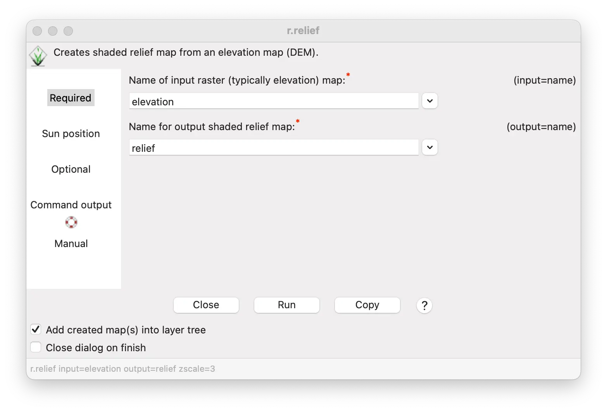
:::
:::::

::::: grid
::: g-col-6
4.  En la pestaña "Opcional", ingrese 3 para el "Factor para exagerar el alivio".  

5.  Haga clic en Ejecutar.  
:::

::: g-col-6
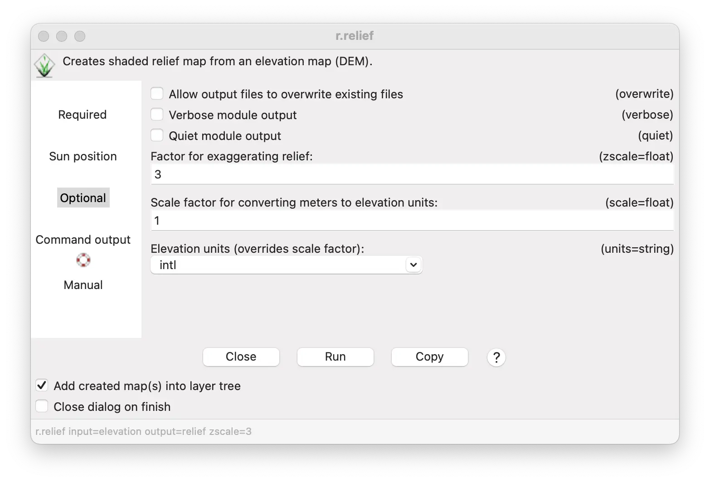  
:::
:::::

#### Command line

```{bash}
r.relief input=elevation output=relief zscale=3 
```

#### Python

```{python}
gs.run_command("r.relief",input="elevation", output="relief" zscale=3)
```

:::::::::

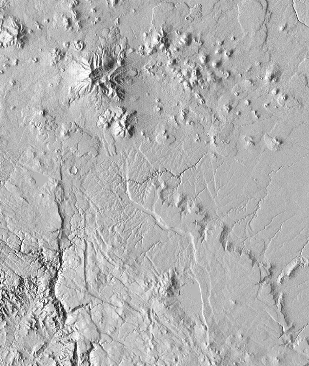

## Combinando color y relieve

Para visualizar mejor la diferencia en el terreno, puedes colocar la elevación de color sobre el mapa de relieve que acabas de crear. 

GRASS le permite fusionar fácilmente el color y el sombreado del relieve para visualizar la topografía, las características del terreno, la cobertura terrestre u otra información geográfica.

-  Esto se puede hacer creando un nuevo mapa, utilizando [r.shade](https://grass.osgeo.org/grass-stable/manuals/r.shade.html) herramienta o  

- superponiendo dinámicamente un mapa de color sobre un mapa de relieve en la GUI **administrador de capas** y ventana de visualización.  

Superpondremos el DEM con la tabla de colores asignada al principio de esta sección con el mapa de relieve que acaba de realizar utilizando ambos métodos.  

Este enfoque también se puede utilizar para visualizar otros análisis de terreno que se realizarán más adelante en este tutorial.  

:::::::::::: {.panel-tabset group="language"}

#### GUI

Comenzaremos creando un nuevo mapa de relieve sombreado en color utilizando [r.shade](https://grass.osgeo.org/grass-stable/manuals/r.shade.html).  

::::: grid
::: g-col-6

1.  Abra *r.shade* desde el menú Ráster/Análisis de terreno/Aplicar sombra al ráster. 

2.  Establezca el mapa "Nombre del relieve sombreado" en *relieve* (relief). 

3.  Establezca "Nombre del ráster que se superpondrá al ráster de relieve" en *elevación* (elevation). 

4.  Introduzca *topography_colored_relief* como "Nombre del mapa ráster sombreado". 
:::

::: g-col-6
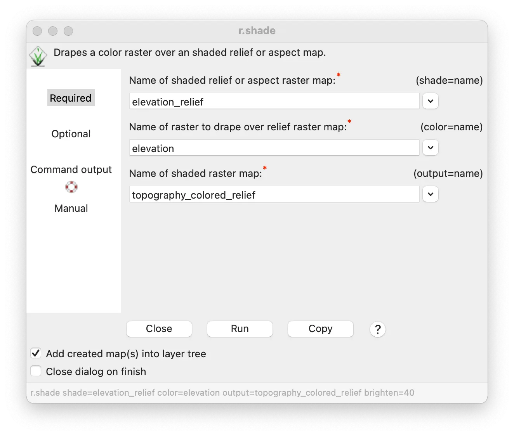
:::
:::::

::::: grid
::: g-col-6
5.  En la pestaña "Opcional", configure el Brillo al 40% para proporcionar un resultado más colorido.

6.  Haga clic en Ejecutar.
:::

::: g-col-6
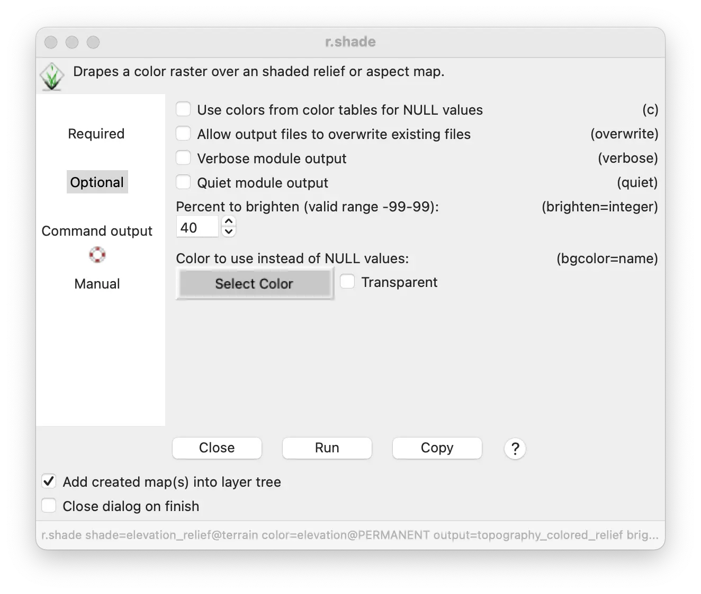  
:::
:::::

#### Command line  

```{bash}
r.shade shade=relief color=elevation output=topography_colored_relief brighten=40]
```

#### Python

```{python}
gs.run_command("r.shade", 
                shade="relief", 
                color="elevation", 
                output="topografía_relieve_coloreado", 
                brighten=40)
```

::::::::::::

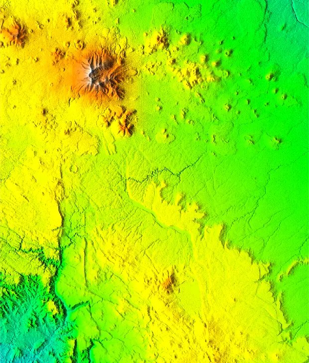  


También puede mostrar un mapa de relieve sombreado de color de forma dinámica en el **administrador de capas** de la GUI utilizando la herramienta d.shade. 

:::::: {.panel-tabset group="language"}

#### GUI  

::::: grid
::: g-col-6

1.  En el administrador de capas, seleccione **Agregar capa de mapa de relieve sombreado** (Add shaded relief map layer) (herramienta *d.shade*) en el botón de menú **Agregar varias capas de mapa raster** (Add multiple raster map layers). 

2.  Introduzca el mapa de *relieve* (relief) en el cuadro de texto "Nombre del relieve sombreado".  

3.  Ingrese el mapa de *elevación* (elevation) en el cuadro de texto "Nombre del ráster que se aplicará sobre el relieve". 

4.  Si establece el "Porcentaje de brillo" en 30 o 40, creará una pantalla visualmente más atractiva.  
:::

::: g-col-6
  
:::
:::::
::::::

## Rendering terrain in 3D  

Además, se puede generar una visualización 3D de la topografía en la **vista 3D** (3D view) de GRASS utilizando el módulo *NVIZ*. 

1.  Comience abriendo el DEM de *elevación* (elevation) en el administrador de capas. Asegúrese de que **No other maps will be displayed, except for the elevation map**.  

2.  Seleccione **Vista 3D** en el menú desplegable en la parte superior de la ventana de visualización del mapa.  

3.  Esto debería mostrar el mapa de elevación en 3D con el mismo sombreado que se ve en la pantalla 2D. 

4.  Utilice los controles en la pestaña "Ver" para cambiar la perspectiva, la exageración z y otras características. 

5.  Para obtener una vista más detallada del terreno, disminuya la resolución "fina" en la pestaña "Datos". 

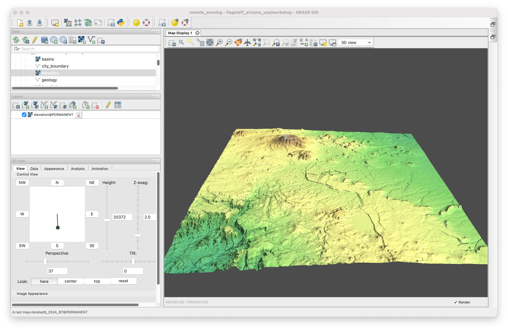  

# Análisis y modelado de las características del terreno  

GRASS facilita el modelado y análisis de una amplia gama de características del terreno mediante un DEM. La pendiente y la orientación del terreno, así como las características topográficas como picos, crestas y valles, son importantes para estudiar y modelar las características del suelo, la vegetación, los microclimas, el flujo de agua y el movimiento superficial. Modelar el flujo del agua sobre el terreno también es relevante para la ecología, las redes fluviales y el riesgo de inundaciones. En este tutorial, demostraremos cómo usar un DEM para realizar estos análisis.  

## Pendiente y aspecto 

::::: grid
::: g-col-6
La diferencia de elevación entre una celda ráster de un MDE y las celdas circundantes permite calcular la pendiente del terreno para dicha celda. También permite calcular la orientación de la celda (su orientación). 

Nosotros podemos usar la misma herramienta [r.slope.aspect](https://grass.osgeo.org/grass-stable/manuals/r.slope.aspect.html) para determinar la pendiente y la orientación, así como varias otras características del terreno.  

Crearemos nuevos mapas a partir del DEM de *elevación* (elevation) para la pendiente (cada celda almacenará la pendiente en grados) y el aspecto (cada celda almacenará el aspecto en grados desde el norte).  
:::

::: g-col-6
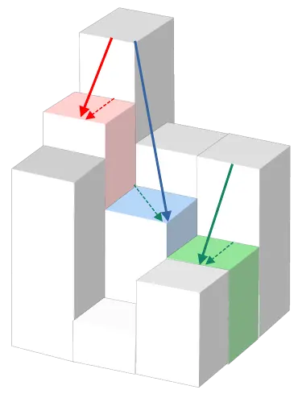  
:::
:::::

:::::::::::: {.panel-tabset group="language"}

#### GUI

::::: grid
::: g-col-6

1.  Abra la herramienta r.slope.aspect desde el menú Análisis de terreno/Ráster/Pendiente y orientación.  

2.  Establezca la capa ráster de elevación como "Nombre del mapa ráster de elevación de entrada".  
:::

::: g-col-6
  
:::
:::::

::::: grid
::: g-col-6
3.  Introduzca el nombre *pendiente* (slope) para "Nombre para el mapa ráster de pendiente de salida".  

4.  Introduzca el nombre *aspecto* (aspect) para "Nombre para el mapa ráster de aspecto de salida".  
:::

::: g-col-6
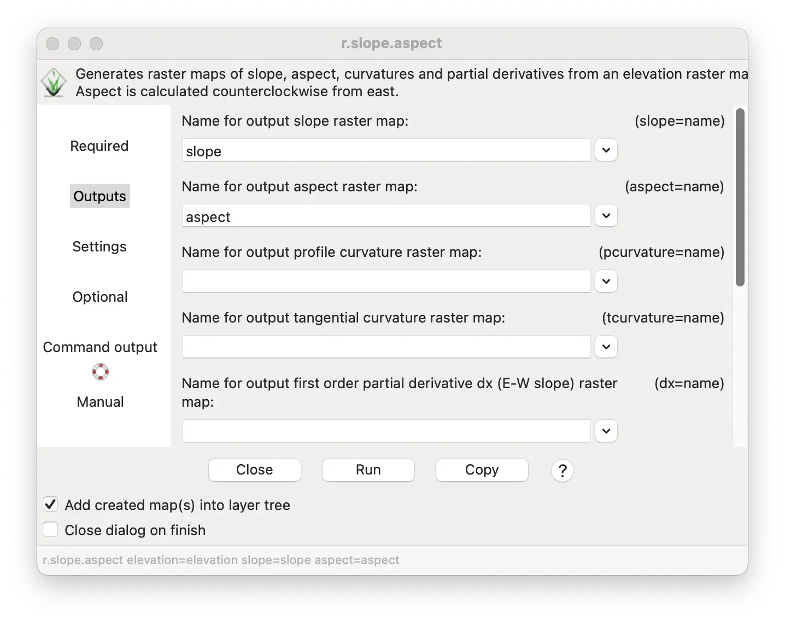  
:::
:::::

::::: grid
::: g-col-6
5.  En la pestaña Configuración, marque la casilla "Crear orientación en grados en sentido horario desde el norte". De lo contrario, la orientación se calculará en grados en sentido antihorario desde el este.  

6.  Haga clic en Ejecutar.  
:::

::: g-col-6
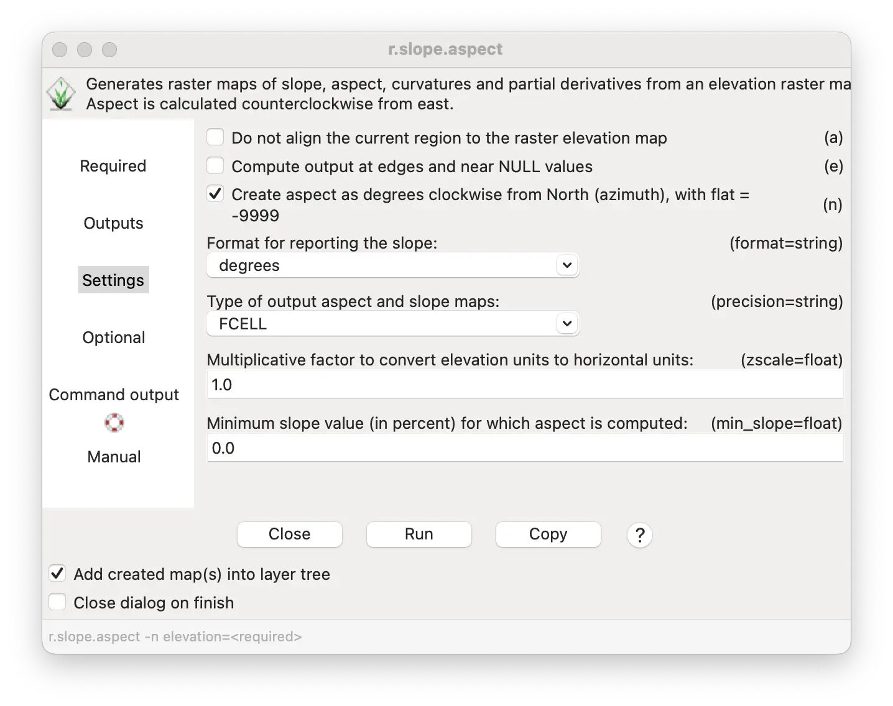  
:::
:::::

#### Command line

Agregue la opción "-n" para que la orientación se registre en grados en sentido horario desde el norte. De lo contrario, la orientación se calculará en grados en sentido antihorario desde el este. 

```{bash}
r.slope.aspect elevation=elevation slope=slope aspect=aspect -n
```

#### Python

Agregue la opción "-n" para que la orientación se registre en grados en sentido horario desde el norte. De lo contrario, la orientación se calculará en grados en sentido antihorario desde el este.
```{python}
gs.run_command("r.slope.aspect",  
                elevation="elevation", 
                slope="slope", 
                aspect="aspect", 
                flags="n")
```

::::::::::::

Aquí están los mapas de pendiente y orientación resultantes.

- Observe cómo la tabla de colores de orientación en escala de grises predeterminada le da al mapa una apariencia 3D, similar a la de un mapa en relieve. Esto se debe a que se sombrea de claro a oscuro según la orientación del terreno, de forma similar a las sombras del sol [r.relief](https://grass.osgeo.org/grass-stable/manuals/r.relief.html) La herramienta utiliza un algoritmo similar para generar un mapa de relieve.  

-  La [r.slope.aspect](https://grass.osgeo.org/grass-stable/manuals/r.slope.aspect.html) La herramienta puede producir otros mapas analíticos, incluidos mapas del **cambio de pendiente** (change of slope) tanto en dirección descendente como transversal, y la **tasa de cambio de pendiente** (rate of change of slope) en diferentes direcciones.  

::::: grid
::: g-col-6
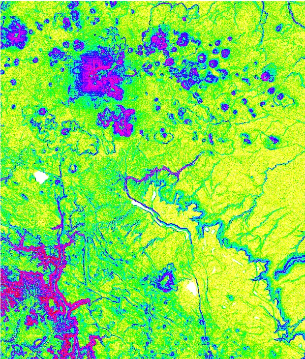  
:::

::: g-col-6
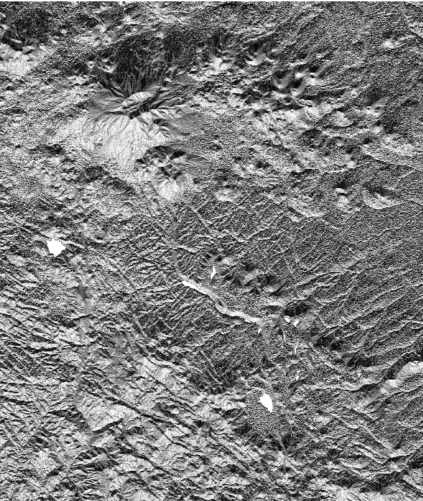  
:::
:::::

### Agregar una leyenda a la visualización de pendiente y topografía 

Puede colorear un mapa de relieve con pendiente utilizando el mismo procedimiento descrito anteriormente, pero utilizando el mapa de *pendiente* (slope) para el color en lugar del DEM de *elevación* (elevation). Esto le permitirá comparar el relieve topográfico y la pendiente. 

Si bien esto puede ayudarle a visualizar las diferencias entre áreas, usar una **leyenda** (legend) puede ayudarle a determinar el rango de valores presentes en el área ráster y cómo los colores corresponden a estos valores. Con GRASS, puede crear fácilmente una leyenda muy informativa para su mapa.  

:::::::::::: {.panel-tabset group="language"}

#### GUI  

::::: grid
::: g-col-6
Se puede acceder a la herramienta de leyenda ráster desde la barra de herramientas de la ventana de visualización. Esta herramienta ofrece numerosas opciones. Exploraremos varias de ellas.  
:::

::: g-col-6
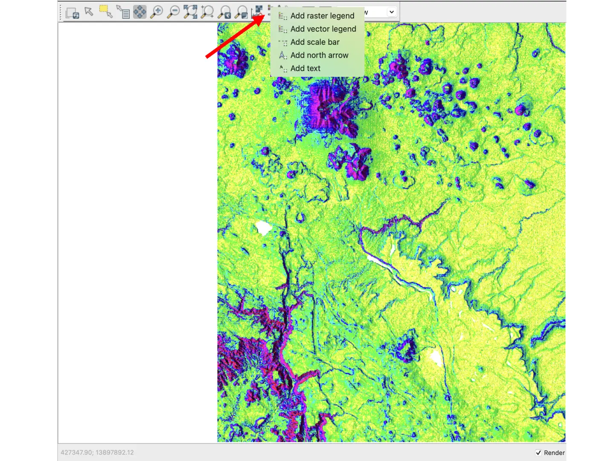  
:::
:::::

::::: grid
::: g-col-6

1.  En la pestaña Entrada, ingrese *pendiente* (slope) como "Nombre del mapa ráster".  
:::

::: g-col-6
  
:::
:::::

::::: grid
::: g-col-6
2.  En la pestaña Título, ingrese "Pendiente" como "Título de la leyenda" e ingrese 14 como "Tamaño de fuente del título". 
:::

::: g-col-6
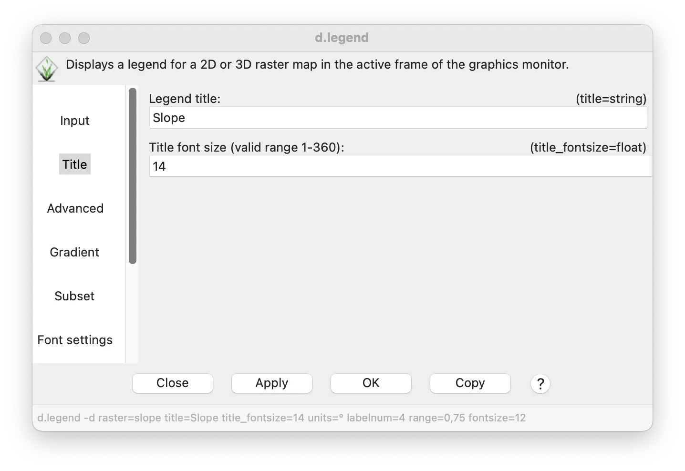  
:::
:::::

::::: grid
::: g-col-6
3.  En la pestaña Avanzada, ingrese el símbolo de grado (\°) o la palabra "deg" como "Unidades para mostrar" (Units to display). 
:::

::: g-col-6
  
:::
:::::

::::: grid
::: g-col-6
4.  En la pestaña Gradiente, marque la casilla "Agregar histograma a la leyenda suavizada" (Add histogram to smoothed legend).  
:::

::: g-col-6
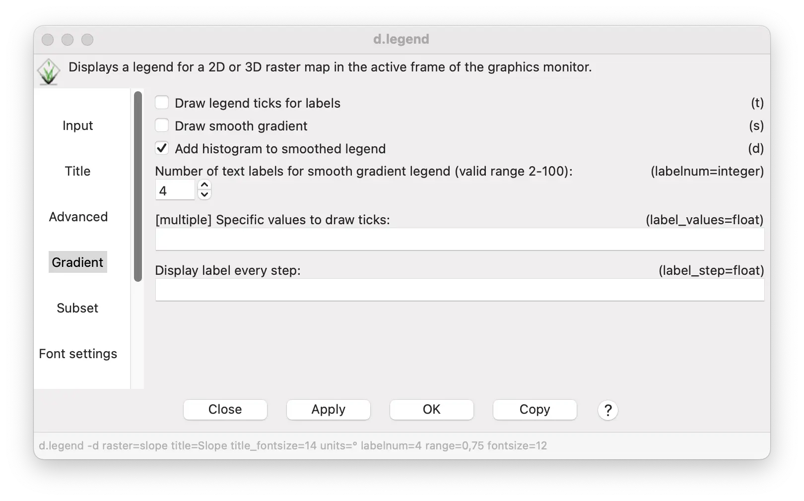  
:::
:::::

::::: grid
::: g-col-6
5.  La pendiente máxima del mapa es de 76 grados. Para una leyenda atractiva, podemos limitar la visualización a 0-75 grados. En la pestaña Subconjunto, introduzca "0,75" en el cuadro de subconjunto para los valores mínimo y máximo que se mostrarán. 
:::

::: g-col-6
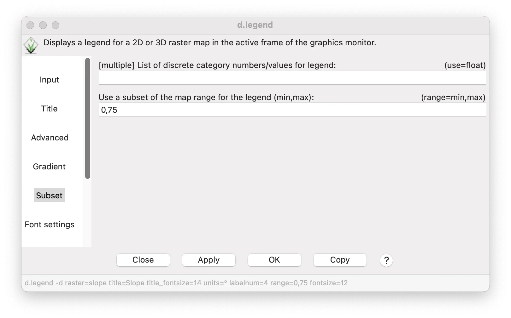  
:::
:::::

::::: grid
::: g-col-6
6.  Por último, en la pestaña Configuración de fuente, ingrese 12 como "Tamaño de fuente" para la leyenda.  

7. Haga clic en Aceptar para ver la leyenda. Puede reposicionarla y redimensionarla con el ratón o numéricamente en la pestaña Opciones.
:::

::: g-col-6
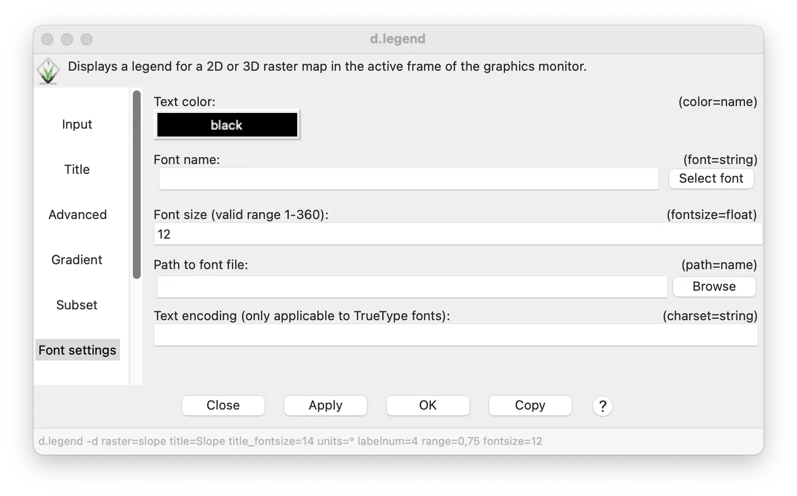  
:::
:::::

#### Command line  

Se puede generar una leyenda utilizando el [d.legend](https://grass.osgeo.org/grass-stable/manuals/d.legend.html) orden.

```{bash}
d.legend -d raster=slope title=Slope title_fontsize=14 units=° labelnum=4 range=0,75 fontsize=12
```

#### Python

Se puede generar una leyenda utilizando el [d.legend](https://grass.osgeo.org/grass-stable/manuals/d.legend.html) orden. 

```{python}
gs.run_command("d.legend", 
                map="slope", 
                color="slope", 
                title="Slope", 
                title_fontsize=14, 
                units="°", 
                labelnum=4, 
                range="0,75",
                fontsize=12)
```

::::::::::::

Aquí está el resultado.

-  No solo muestra el rango de valores de pendiente y los colores de los diferentes valores, sino que el histograma también muestra el número de celdas para cada valor de pendiente.

- También puede agregar una barra de escala y una flecha norte desde el mismo elemento de la barra de menú en la ventana de visualización donde seleccionó la herramienta de leyenda.  

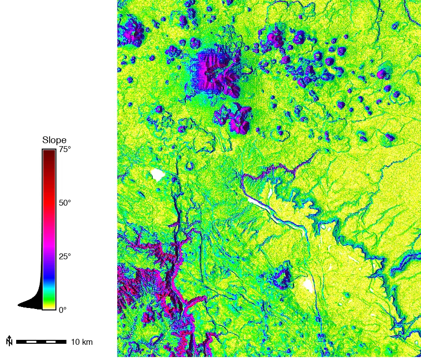

### Visualización de valores de pendiente específicos

En lugar de ver todas las pendientes u otras características del terreno, a veces resulta útil centrarse en un rango limitado de valores. Esto se puede hacer rápidamente en la herramienta de propiedades de visualización para mapas ráster.

:::::::::::: {.panel-tabset group="language"}

#### GUI

1.  Asegúrese de que los mapas de *pendiente* (slope) y *relieve* (relief) se muestren en el Administrador de capas (haga doble clic en un mapa en el Catálogo de datos para agregarlo al Administrador de capas). El mapa de *pendiente* (slope) debe estar encima del mapa de *relieve* (relief).  

2.  Haga doble clic en el mapa de *pendiente* (slope) para abrir su herramienta de propiedades de visualización. ([d.rast](https://grass.osgeo.org/grass-stable/manuals/d.rast.html))  

3.  En la pestaña Selección, ingrese 10-76 para mostrar solo pendientes de 10° o más y haga clic en Aplicar o Aceptar.  

4.  Puedes mostrar esto sobre el mapa de relieve configurando la **opacidad** (opacity) al 50%.  

#### Command line

Solo se pueden mostrar pendientes ≥ 10° utilizando el ([d.rast](https://grass.osgeo.org/grass-stable/manuals/d.rast.html)) herramienta.

```{bash}
d.rast map=slope values=10-76
```

#### Python

Solo se pueden mostrar pendientes ≥ 10° utilizando el ([d.rast](https://grass.osgeo.org/grass-stable/manuals/d.rast.html)) herramienta.

```{python}
gs.run_command("d.rast", 
                map="slope", 
                values="10-76")
```

::::::::::::

::::: grid
::: g-col-6
El filtrado por un rango limitado de valores de pendiente resalta importantes características del terreno de la región de Flagstaff.

- El terreno en esta zona está dominado por el campo volcánico de San Francisco, incluyendo el volcán estratificado San Francisco Peaks, y numerosos otros volcanes y conos de ceniza más pequeños. Los altos valores de pendiente acentúan estas características volcánicas en la parte superior del mapa.

- En la esquina suroeste del mapa se encuentra el comienzo del escarpe de la Meseta del Colorado, donde el terreno desciende rápidamente cientos de metros hacia el valle del Río Verde. El drenaje profundo de esta región delimita esta característica del terreno. 
:::

::: g-col-6
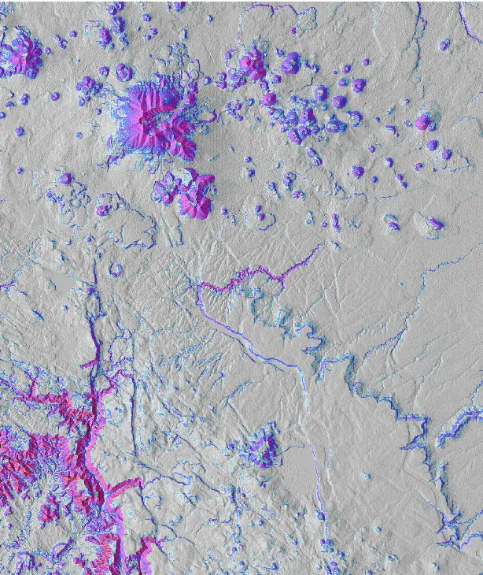  
:::
:::::

## Formas topográficas 

Los análisis de pendiente, orientación y otros análisis relacionados pueden ayudar a identificar características del terreno como volcanes y cañones. GRASS también ofrece herramientas para identificar características topográficas y clasificar el terreno en categorías de accidentes geográficos. En el conjunto estándar de herramientas de GRASS, estas incluyen: 

-  [r.geomorphon](https://grass.osgeo.org/grass-stable/manuals/r.geomorphon.html): Calcula geomorfos (formas del terreno) y geometría asociada utilizando el enfoque de visión artificial. 

-  [r.param.scale](https://grass.osgeo.org/grass-stable/manuals/r.param.scale.html): Extrae parámetros del terreno de un DEM.

Los complementos GRASS adicionales útiles para este tipo de análisis de terreno incluyen:

-  [r.local.relief](https://grass.osgeo.org/grass-stable/manuals/addons/r.local.relief.html)  

-  [r.shaded.pca](https://grass.osgeo.org/grass-stable/manuals/addons/r.shaded.pca.html)  

-  [r.skyview](https://grass.osgeo.org/grass-stable/manuals/addons/r.skyview.html)  

-  [r.terrain.texture](https://grass.osgeo.org/grass-stable/manuals/addons/r.terrain.texture.html)  

En este tutorial, exploraremos brevemente [r.geomorphon](https://grass.osgeo.org/grass-stable/manuals/r.geomorphon.html) Para clasificar el DEM en un conjunto de categorías de accidentes geográficos. Le recomendamos probar las otras herramientas para usar los conjuntos de datos de muestra estándar de GRASS o sus propios datos. 

-  La herramienta *r.geomorphon* identifica y clasifica una celda utilizando información sobre el relieve topográfico en ocho direcciones (ver la [r.geomorphon](https://grass.osgeo.org/grass-stable/manuals/r.geomorphon.html) Descripción para más detalles)). Hay varias opciones.

-  La opción más importante es el **Radio de búsqueda exterior** (Outdoor search radius), que es la distancia máxima que el algoritmo registrará en el relieve topográfico. Por defecto, esta distancia se mide en celdas del mapa, pero puede cambiarla a metros con la opción "-m".

-  Cuando el radio es pequeño, el terreno se clasifica en accidentes geográficos locales de pequeña escala: por ejemplo, pequeños montículos, barrancos y depresiones locales. Cuando el radio es grande, el terreno se clasifica en accidentes geográficos más grandes: por ejemplo, grandes colinas y montañas, valles y cuencas.

-  Se puede configurar un **radio de búsqueda interna** (indoor search radius) para que la herramienta ignore todo relieve menor cerca de una celda. 

:::::::::::: {.panel-tabset group="language"}

#### GUI

Comenzaremos con un amplio radio de búsqueda exterior de 200 celdas (6 km en el DEM de Flagstaff). Esto permitirá clasificar accidentes geográficos a mayor escala..  

::::: grid
::: g-col-6

1.  Seleccione el *r.geomorphon* herramienta del menú Raster/Análisis del terreno/Formas del terreno.  

2.  Introduzca 200 para "Radio de búsqueda exterior" y 10 para "Radio de búsqueda interior". 
:::

::: g-col-6
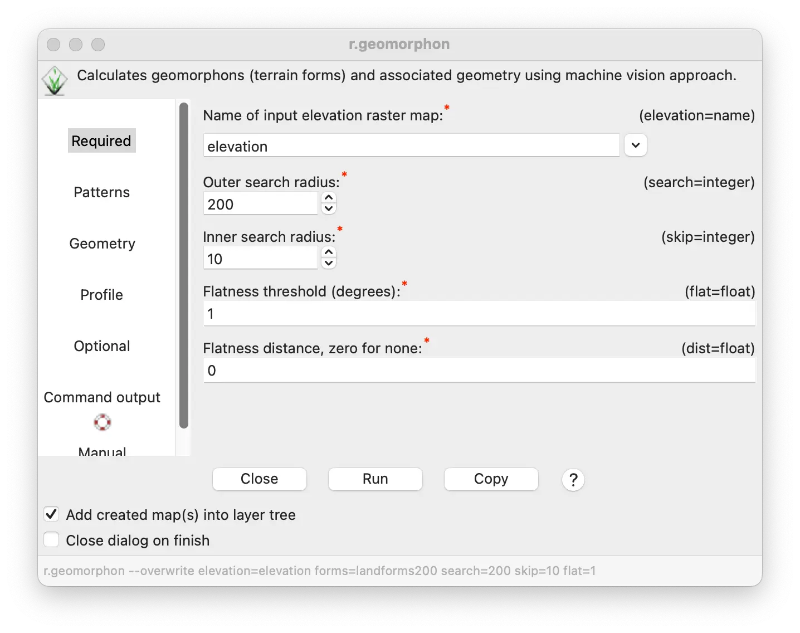
:::
:::::

::::: grid
::: g-col-6
3.  Ingrese landforms200 para el mapa de salida en el cuadro de texto "Formas geomórficas más comunes" (Most common geomorphic shapes). 
:::

::: g-col-6
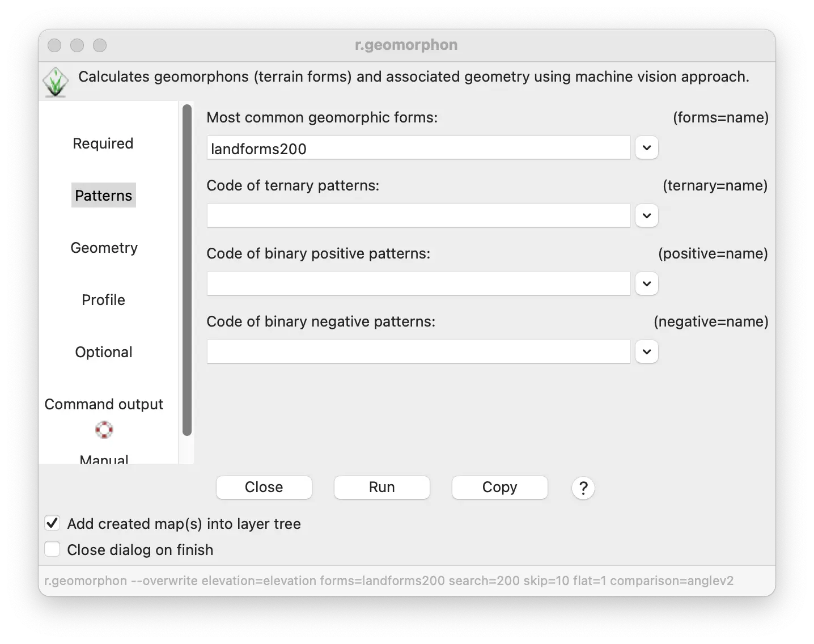  
:::
:::::

::::: grid
::: g-col-6
4.  En la pestaña Opcional, configure "Comparación" (comparison) en *anglev2_distance* para mejores resultados.

5.  Haz clic en Ejecutar. Este análisis puede tardar unos minutos dependiendo del procesador y la memoria RAM. 
:::

::: g-col-6
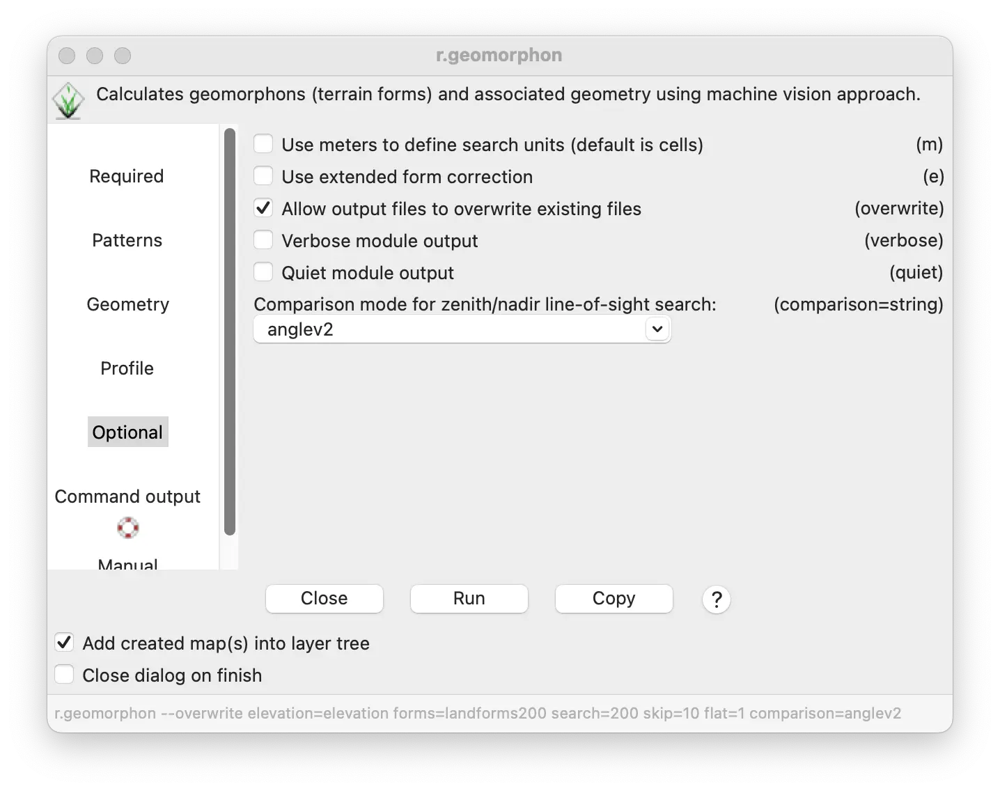  
:::
:::::

Ahora cree un análisis de accidentes geográficos muy pequeños utilizando un radio de búsqueda de solo 5 celdas (150 m).  

1.  Repita los mismos pasos para los accidentes geográficos grandes, pero con 5 para el radio de búsqueda exterior y 0 para el radio de búsqueda interior. El análisis se ejecutará mucho más rápido con esta configuración.  

#### Command line

Comenzaremos con un amplio radio de búsqueda exterior de 200 celdas (600 m en el DEM de Flagstaff). Esto permitirá clasificar accidentes geográficos de mayor escala.  

```{bash}
r.geomorphon elevation=elevation forms=landforms200 search=200 skip=10 flat=1 comparison=anglev2_distance
```

Repita con un radio de búsqueda mucho más pequeño para clasificar accidentes geográficos mucho más pequeños.  

```{python}
r.geomorphon elevation=elevation@terrain forms=landforms5 search=5 skip=0 flat=1 comparison=anglev2_distance
```

#### Python

Comenzaremos con un amplio radio de búsqueda exterior de 200 celdas (600 m en el DEM de Flagstaff). Esto permitirá clasificar accidentes geográficos de mayor escala.  

```{python}
gs.run_command("r.geomorphon", 
                elevation="elevation", 
                forms="landforms200", 
                search=200, 
                skip=10, 
                flat=1, 
                comparison="anglev2_distance")
```

Repita con un radio de búsqueda mucho más pequeño para clasificar accidentes geográficos mucho más pequeños.  

```{python}
gs.run_command("r.geomorphon", 
                elevation="elevation", 
                forms="landforms200", 
                search=5, 
                skip=0, 
                flat=1, 
                comparison="anglev2_distance")
```

::::::::::::

Las dos imágenes a continuación muestran accidentes geográficos clasificados por *r.geomorphon* a diferentes escalas en un primer plano del DEM de *elevación* (elevation) de Flagstaff, centrándose en una sección del campo volcánico de San Francisco. Los mapas de accidentes geográficos se muestran con sombreado de color sobre el mapa de relieve topográfico. 

-  A mayor escala (radio de búsqueda de 200 celdas), los picos y crestas marcan las cimas de todos los grandes volcanes y pequeños conos de ceniza. Están rodeados por zonas de estribaciones, laderas y hondonadas, divididas por valles que indican sus campos de lava.

-  A menor escala (radio de búsqueda de 5 celdas), los estrechos bordes de los cráteres volcánicos están marcados por crestas, con el interior de los cráteres a menudo delimitado por valles y fosas. Todas las características volcánicas se clasifican como laderas. 

::::: grid
::: g-col-6
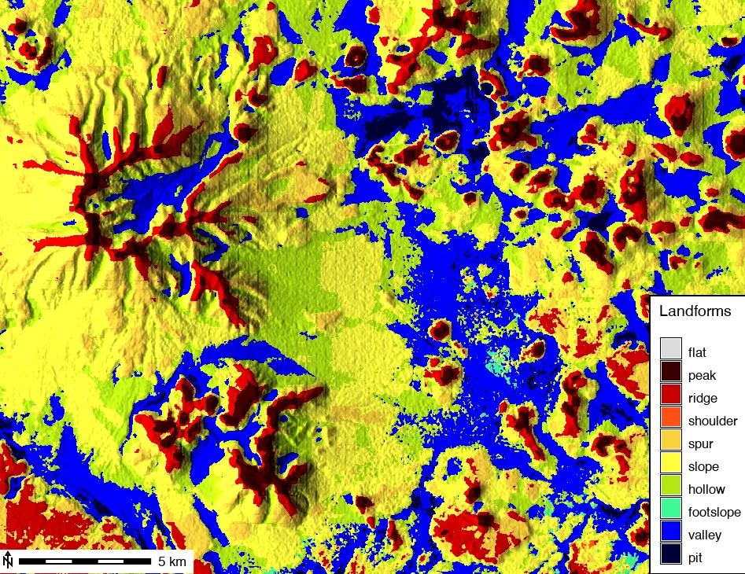  
:::

::: g-col-6
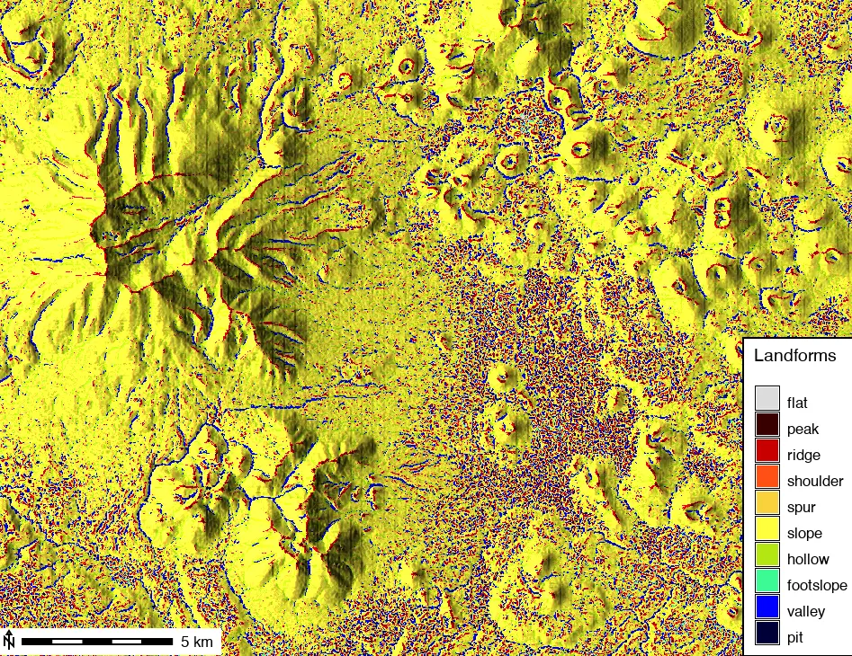  
:::
:::::

# Cuencas hidrográficas y modelado hidrológico  

Dado que los rásteres DEM permiten generar mapas de pendiente y orientación, esta información puede utilizarse para modelar el flujo de agua a través del relieve topográfico del terreno. Esto, a su vez, permite una amplia gama de análisis, a menudo descritos como modelado de **cuencas hidrográficas** (water basins) o **hidrológico** (hydrology). Algunos ejemplos de modelado de cuencas hidrográficas son:

-  Modelado de la **acumulación de caudal** (flow accumulation), que representa la cantidad de agua que pasa por cada celda a medida que fluye pendiente abajo sobre un terreno;

- Identificación de **cuencas hidrográficas** (water basins), la porción de terreno que drena hacia una red fluvial de un tamaño determinado;

- Modelado de una **red fluvial o de drenaje** (river or drainage network) considerando las ubicaciones de mayor acumulación de caudal dentro de una cuenca hidrográfica;

-  Modelar la **erosión potencial** (potential erosion) en función de la cantidad de agua que fluye a través de las celdas de un terreno, su pendiente (que afecta la velocidad del flujo de agua), la cobertura del suelo y el sustrato.

- Modelar el **potencial de inundaciones** (flood potential);

- Modelar la **infiltración potencial** (potential infiltration) de aguas superficiales y su impacto en la vegetación y las aguas subterráneas;

- Y muchos otros fenómenos ambientales.  

GRASS tiene muchos módulos para analizar y modelar [hydrology and watersheds](https://grass.osgeo.org/grass-stable/manuals/topic_hydrology.html), Mucho más de lo que se puede cubrir en este tutorial. El objetivo de este tutorial es darle una idea del potencial del modelado de cuencas hidrográficas en GRASS y animarle a explorar su amplia gama de herramientas por su cuenta. Para ello, este tutorial explorará algunas de las numerosas características de dos de estas herramientas. [r.watershed](https://grass.osgeo.org/grass-stable/manuals/r.watershed.html) y [r.stream.extract](https://grass.osgeo.org/grass-stable/manuals/r.stream.extract.html).  

## Cuencas hidrográficas

Las cuencas hidrográficas son porciones de terreno donde toda el agua superficial fluye por tierra hacia un único sistema de drenaje y sale de la cuenca por una única salida. Pueden ser tan pequeñas como unos pocos kilómetros o tan grandes como las cuencas que abarcan toda el agua que desemboca en los ríos Misisipi o Amazonas. 

-  Si bien hay muchas entradas posibles que pueden afectar la forma en que *r.watershed* modela diferentes características hidrológicas, aquí utilizaremos el ejemplo más simple. 

-  El mínimo requerido para modelar cuencas hidrográficas, acumulaciones de caudal y redes fluviales es un DEM (*elevación* (elevation)) y el tamaño mínimo de las cuencas a modelar (medido en número de celdas). Crearemos cuencas con un tamaño mínimo de **10,000** celdas (9 km²). Elegir un número menor generaría un mapa de muchas cuencas más pequeñas.  

-  Aunque comenzamos con el mapeo de cuencas hidrográficas, para ahorrar tiempo, *r.watershed* también generará resultados para la acumulación de flujo y segmentos de corriente al mismo tiempo que crea un mapa de cuenca.  

-  Para producir mapas de cuencas y arroyos con mejor apariencia, también seleccionaremos las opciones "Acumulación de flujo positivo" (Accumulation of positive flow) y "Embellecer áreas planas".  

::::::::::::::: {.panel-tabset group="language"}

#### GUI

::::: grid
::: g-col-6

1.  Abre el[r.watershed](https://grass.osgeo.org/grass-stable/manuals/r.watershed.html) módulo del menú Modelado ráster/hidrológico/Análisis de cuencas hidrográficas.  

2.  Establezca "Nombre del mapa ráster de elevación" (Elevation raster map name) en *elevación* (elevation). 

3.  Ingrese 10,000 para "Tamaño mínimo de la cuenca hidrográfica exterior" (Minimum size of the external watershed).  
:::

::: g-col-6
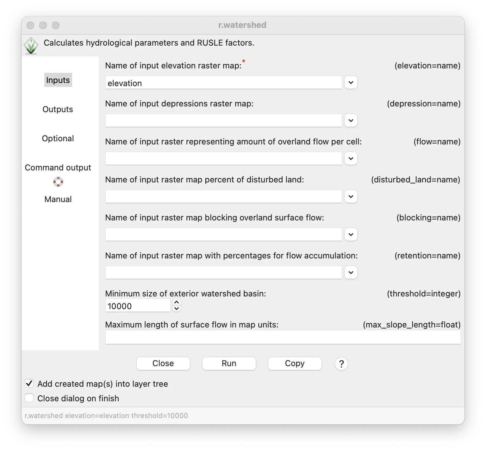  
:::
:::::

::::: grid
::: g-col-6
4.  En la pestaña "Salidas", introduzca:

- watershed_accumulation10000 para "acumulación" (accumulation),

- watershed_basin10000 para "cuencas" (basins) y

- watershed_streams10000 para "segmentos de corriente" (streams).
:::

::: g-col-6
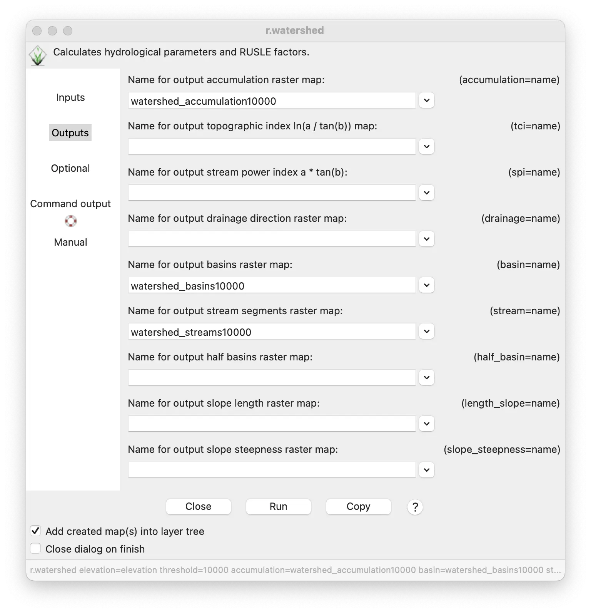
:::
:::::

::::: grid
::: g-col-6
5.  En la pestaña Opcional:

- Marque la casilla "Acumulación de flujo positiva" (Positive flow accumulation). De lo contrario, la acumulación de flujo será negativa para las cuencas en el borde del mapa, lo que indica que podrían subrepresentar la acumulación.

- Marque la casilla "Embellecer áreas planas" (Beautify flat areas) para obtener segmentos de corriente más precisos en las áreas planas.

6. Haga clic en Ejecutar. 
:::

::: g-col-6
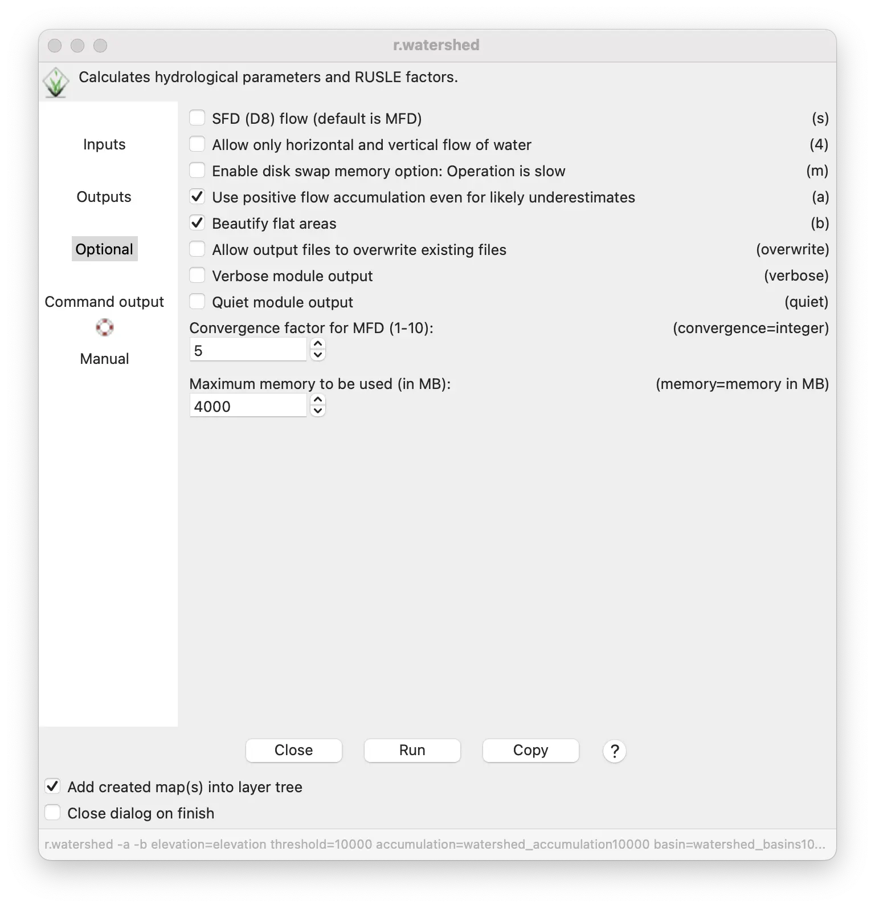  
:::
:::::

#### Command line

```{bash}
r.watershed -a -b elevation=elevation threshold=10000 accumulation=watershed_accumulation10000 basin=watershed_basins10000 stream=watershed_streams10000
```

#### Python

```{python}
gs.run_command("r.watershed", 
                elevation="elevation", 
                threshold=10000, 
                accumulation=watershed_accumulation10000, 
                basin="watershed_basin10000", 
                stream="watershed_streams10000", 
                flags="ab")

```

:::::::::::::::

Mapa resultante de cuencas hidrográficas.  

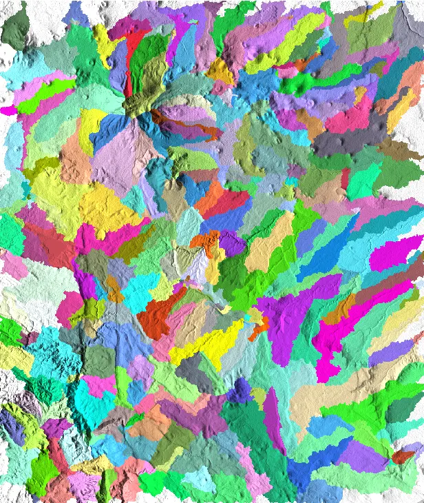  

## Acumulación de flujo 

Arriba, también elaboramos un mapa de acumulación de flujo. Un mapa de acumulación de flujo modela el flujo potencial de agua sobre un terreno:  

::::: grid
::: g-col-6

-  Suponiendo que cae un centímetro de lluvia en cada celda de un MDE, los valores de un mapa de acumulación de flujo mostrarán la profundidad del agua en centímetros que se acumula y fluye sobre cada celda a medida que el agua fluye hacia ella desde celdas adyacentes en pendiente ascendente.

El mapa que creamos asume que cayó la misma cantidad de lluvia en cada celda y que el relieve topográfico es el único factor que afecta el flujo superficial del agua. Por lo tanto, el modelo de acumulación de flujo generado representa valores máximos.  

-  Las configuraciones adicionales en *r.watershed* permiten modelar el flujo terrestre de manera más realista con diferentes cantidades de lluvia cayendo en la región, y la vegetación, las características del suelo o las barreras como represas o diques también afectan la acumulación.  

-  [r.watershed](https://grass.osgeo.org/grass-stable/manuals/r.watershed.html) utiliza un algoritmo de **dirección de flujo múltiple** (multiple flow direction) por defecto, en el que el agua que fluye desde una celda se distribuye entre todas las celdas adyacentes de ladera abajo. El mayor caudal se dirige a la celda adyacente de ladera abajo con mayor diferencia de elevación, y los caudales menores se asignan a las celdas de ladera abajo con menor diferencia de elevación.  

-  Si bien algunas herramientas de modelado hidrológico requieren que las depresiones o sumideros de un DEM se llenen primero para canalizar correctamente el agua a través del terreno, *r.watershed* no lo requiere. En su lugar, utiliza un algoritmo de ruta de menor costo para canalizar el agua a través de las depresiones.
:::

::: g-col-6
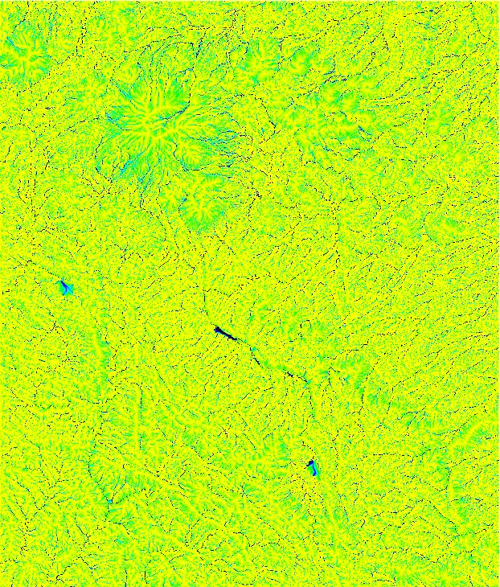  

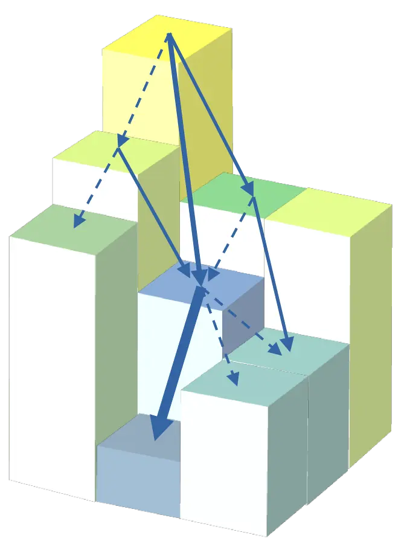
:::
:::::

Al igual que con la pendiente, una leyenda puede ayudar a transmitir la información de un mapa de acumulación de flujo con mayor claridad. Sin embargo, la distribución de los valores de acumulación no es lineal: muchas celdas en laderas presentan una acumulación mínima y algunas celdas en los fondos de los arroyos principales presentan valores mucho más altos. Por esta razón, una escala logarítmica comunica mejor las relaciones entre colores y valores. Cree una leyenda como se describió anteriormente, pero con opciones adicionales.

::::::::::::::: {.panel-tabset group="language"}

#### GUI

-  Nombre del mapa ráster: watershed_accumulation10000@terrain (pestaña Entrada).

- Título de la leyenda: "Acumulación de caudal" (pestaña Título).

- Tamaño de fuente del título: 14 (pestaña Título).

- Usar escala logarítmica: marca la casilla (pestaña Avanzado).

- Valores específicos para dibujar marcas: 1, 10, 100, 1000, 10000, 100000, 1000000 (pestaña Gradiente).

- Tamaño de fuente: 12 (pestaña Configuración de fuente).  

#### Command line

```{bash}
d.legend -l raster=watershed_accumulation100000 title="Flow Accumulation" title_fontsize=14 label_values=1,10,100,1000,10000,100000,1000000 fontsize=12
```

#### Python

```{python}
gs.run_command("d.legend", 
                raster="watershed_accumulation10000", 
                title="Flow Accumulation", 
                title_fontsize=14, 
                label_values="1,10,100,1000,10000,100000,1000000", 
                fontsize=12, 
                flags="l")
```

:::::::::::::::

Aquí se presenta un mapa de acumulación de flujo con una leyenda en escala logarítmica. Observe la mayor acumulación en las laderas de los picos de San Francisco, en los principales cauces fluviales y en las pequeñas depresiones lacustres poco profundas. 

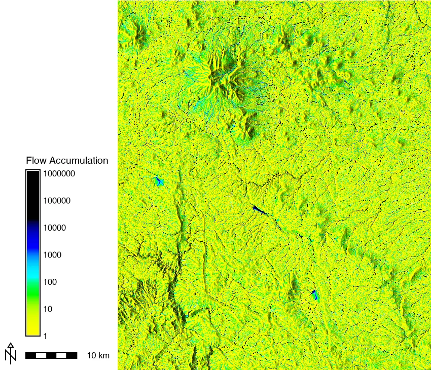

## Redes de transmisión

*r.watershed* También se produjeron mapas de arroyos que representan los drenajes primarios de cada cuenca hidrográfica de 10.000 celdas.  

::::: grid
::: g-col-6

-  Se trata de un mapa ráster de arroyos, con cada celda codificada y coloreada para coincidir con la cuenca que drena, como se ve en el mapa de la región de Flagstaff a la derecha.

- El fondo se configura en negro en las propiedades de visualización porque, de lo contrario, es muy difícil distinguir las celdas ráster de los arroyos.  
:::

::: g-col-6
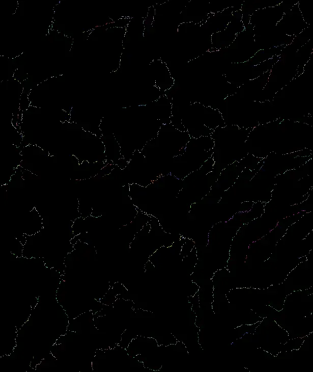  
:::
:::::

### Vectorización de una red de corrientes con *r.to.vect*  

Podemos hacer que los arroyos sean más visibles si convertimos el mapa ráster de arroyos en un mapa vectorial de líneas. Esto se puede hacer fácilmente con el [r.to.vect](https://grass.osgeo.org/grass-stable/manuals/r.to.vect.html) herramienta que convierte mapas raster en vectores. 

-  *r.to.vect* puede convertir puntos, líneas y áreas. En este caso, convertiremos los segmentos de corriente creados por *r.watershed* en líneas vectoriales.  

-  Los segmentos de corriente ráster se codifican con los valores de las cuencas hidrográficas que drenan. Estos valores pueden transferirse a los segmentos de línea vectoriales equivalentes.  

::::::::::::::: {.panel-tabset group="language"}

#### GUI

::::: grid
::: g-col-6

1.  Select the [r.to.vect](https://grass.osgeo.org/grass-stable/manuals/r.to.vect.html) herramienta desde el menú Conversiones de tipo ráster/mapa/ráster a vector **o** desde el menú Archivo/Conversiones de tipo mapa/ráster a vector.  

2.  Ingrese el mapa *watershed_streams10000* como "Nombre del mapa ráster de entrada" (Input raster map name). 

3.  Introduzca *watershed_streams10000* como "Nombre del mapa vectorial de salida" (Output raster map name).

4. Introduzca *línea* (line) como "Tipo de entidad de salida" (Output entity type).

5. En la pestaña "Opciones" (Options), marque la casilla "Usar valores ráster como categorías en lugar de secuencia única" (Use raster values as categories instead of a single sequence). Esto copiará el número de cuenca en el campo clave del índice *CAT* del nuevo mapa vectorial de líneas.

6. Haga clic en "Ejecutar". 
:::

::: g-col-6
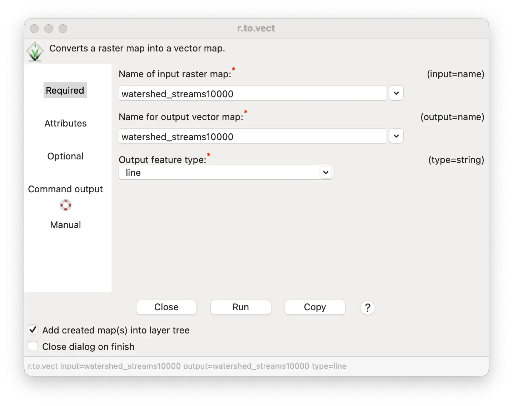  
:::
:::::

#### Command line

```{bash}
r.to.vect -v input=watershed_streams10000 output=watershed_streams10000 type=line
```

#### Python

```{python}
gs.run_command("r.to.vect", 
                input="watershed_streams10000", 
                output="watershed_streams10000", 
                type="line",
                flags="v")
```

:::::::::::::::

Los mapas a continuación muestran la red de corrientes vectoriales superpuestas a las cuencas hidrográficas a la izquierda y a un mapa de relieve sombreado en color a la derecha.  

::::: grid
::: g-col-6
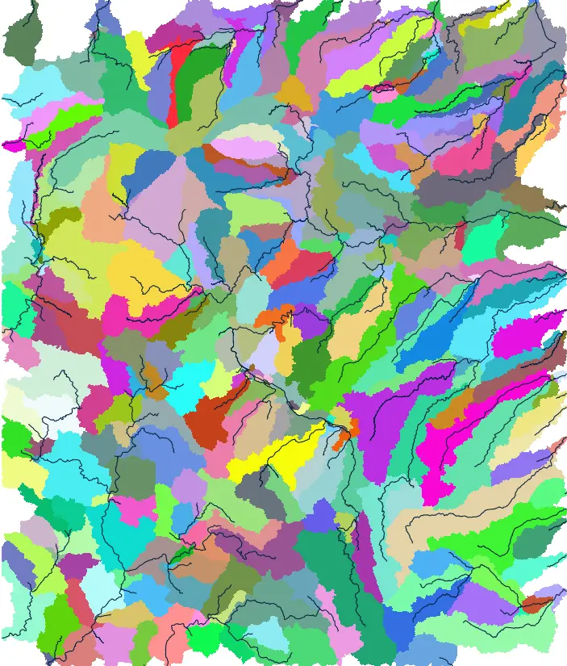  
:::

::: g-col-6
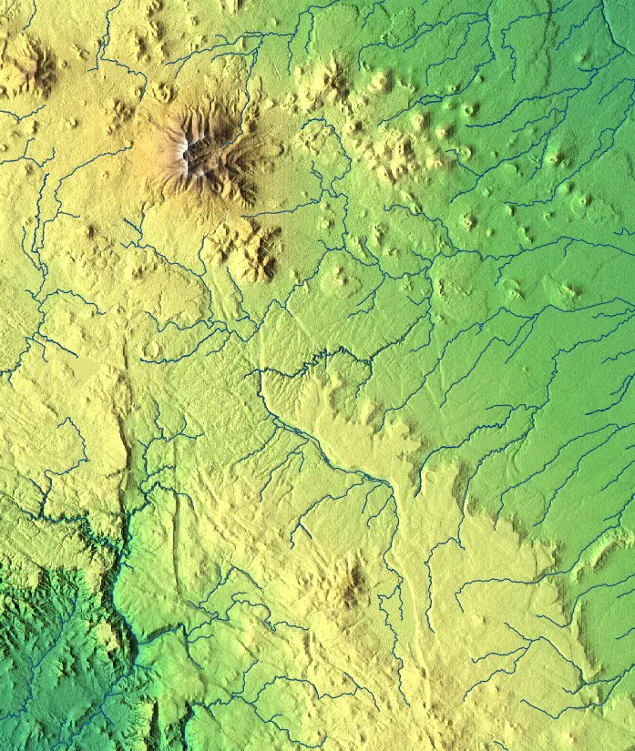  
:::
:::::

::: {.callout-note title="Tip"}
Para obtener una red de arroyos más detallada, ejecute *r.watershed* con un tamaño mínimo de cuenca inferior a las 10,000 celdas utilizadas anteriormente. Si elige un tamaño mínimo de cuenca muy pequeño para crear un mapa de arroyos muy detallado, es posible que se le solicite ejecutar [r.thin](https://grass.osgeo.org/grass-stable/manuals/r.thin.html) antes de ejecutar *r.to.vect* para asegurarse de que el mapa de flujo ráster consta solo de líneas de flujo de celdas de cuadrícula individuales. 
:::

### Vectorización de una red de flujo con *r.stream.extract*  

Una forma alternativa de generar una red de arroyos a partir de un análisis de cuencas hidrográficas es con el [r.stream.extract](https://grass.osgeo.org/grass-stable/manuals/r.stream.extract.html) herramienta.  

-  Esta herramienta utiliza un DEM y un mapa de acumulación de flujo para generar una red fluvial vectorial o ráster.

El detalle de la red fluvial se controla seleccionando la acumulación mínima de flujo. 

-  *r.stream.extract* no solo crea un mapa de líneas vectoriales de arroyos, sino que también genera puntos vectoriales en la cabecera de cada arroyo y en las uniones de un arroyo con todos los demás arroyos. 

::::::::::::::: {.panel-tabset group="language"}

#### GUI

::::: grid
::: g-col-6

1.  Seleccione el[r.stream.extract](https://grass.osgeo.org/grass-stable/manuals/r.to.vect.html) herramienta del menú Modelado ráster/hidrológico/Extracción de redes de corrientes.  

2.  Introduzca *elevación* (elevation) en el campo "Nombre del mapa ráster de elevación de entrada" (Input elevation raster map name).

3. Introduzca 5000 en "Acumulación mínima de caudal para arroyos" (Minimum flow accumulation for streams) (los números más bajos generarán una red de arroyos más detallada, mientras que los números más altos generarán una red menos detallada).
:::

::: g-col-6
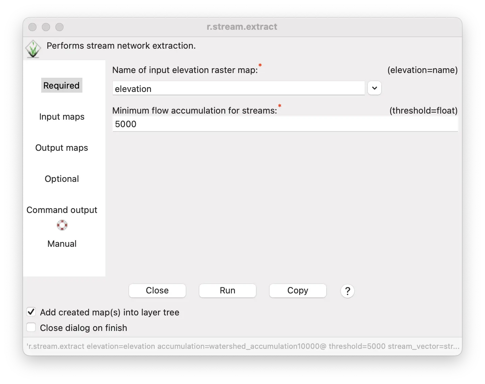  
:::
:::::

::::: grid
::: g-col-6
4.  Ingrese *watershed_accumulation10000* para el "Nombre del mapa ráster de acumulación de entrada" (Input Accumulation Raster Map Name).  
:::

::: g-col-6
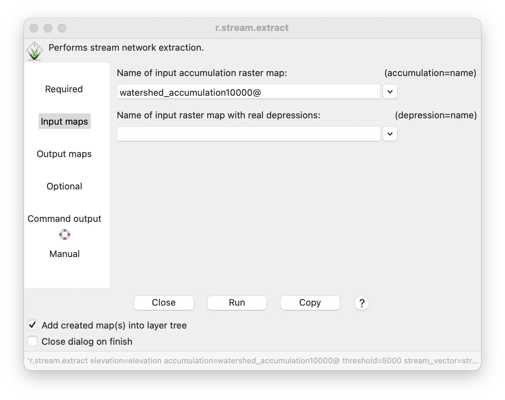  
:::
:::::

::::: grid
::: g-col-6
5.  Introduzca *streams5000accumulation* en "Nombre del mapa vectorial de salida con ID de flujo único" (Name of the output vector map with unique flow ID).

6. Haga clic en "Ejecutar".  
:::

::: g-col-6
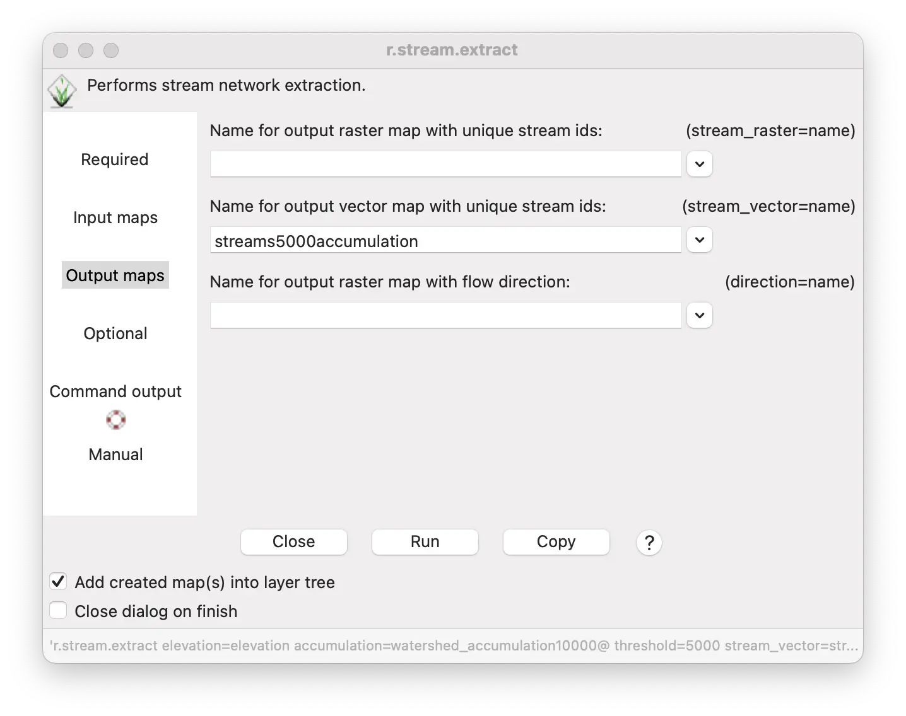  
:::
:::::

#### Command line

```{bash}
r.stream.extract elevation=elevation accumulation=watershed_accumulation10000@ threshold=5000 stream_vector=streams5000accumulation
```

#### Python

```{python}
gs.run_command("r.stream.extract", 
                elevation="elevation", 
                accumulation="watershed_accumulation10000@", 
                threshold=5000, 
                stream_vector="streams5000accumulation")
```

:::::::::::::::

Las 2 imágenes a continuación muestran la red de arroyos generada por *r.stream.extract* superponiendo un mapa de relieve sombreado en color (izquierda) y una comparación de esta red con la generada por r.watershed y luego vectorizada con *r.to.vect* (derecha). 

-  Observe las líneas de corriente (azules) y los puntos (rojos) que indican las cabeceras y las confluencias de los arroyos en la imagen izquierda. Las líneas o los puntos se pueden mostrar, ocultar o mostrar juntos en la herramienta de propiedades vectoriales. [d.vect](https://grass.osgeo.org/grass-stable/manuals/d.vect.html).  

-  En la imagen de la derecha, la red de arroyos más detallada generada por *r.stream.extract* se muestra en líneas azules angostas y la red de arroyos generada por *r.watershed* y *r.to.vect* se muestra como líneas amarillas más anchas. 

::::: grid
::: g-col-6
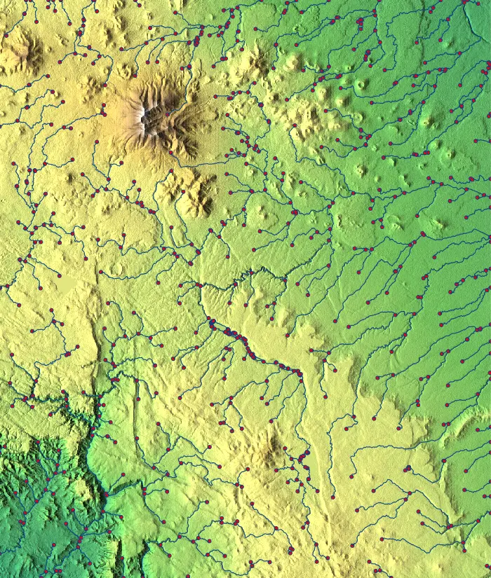  
:::

::: g-col-6
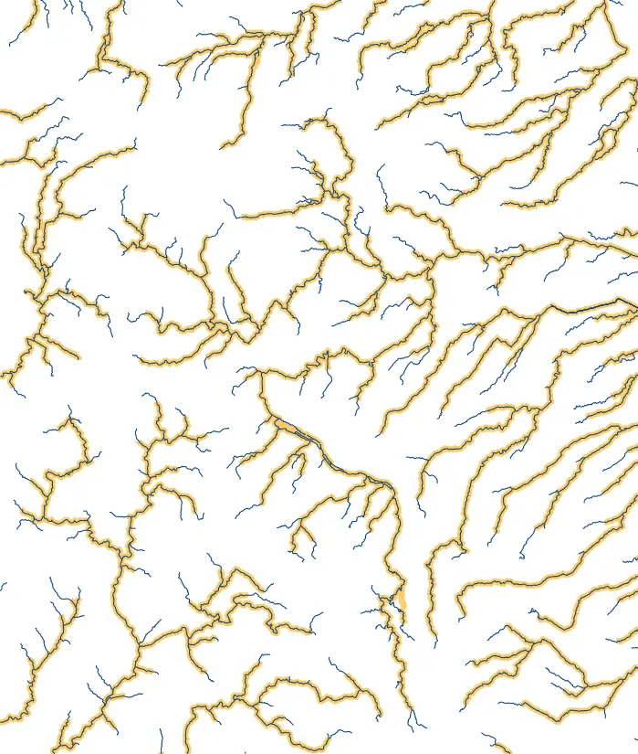  
:::
:::::

::: {.callout-note title="Tip"}
Para mostrar la red de corriente sin los nodos de unión, desmarque la casilla "punto" en la pestaña Selección de la herramienta de propiedades de visualización de vectores (command: *d.vect map=streams5000accumulation type=line*)
:::

# Resumen

En este tutorial, hemos repasado solo algunas de las muchas herramientas disponibles en GRASS para realizar análisis de terreno y cuencas hidrográficas. Utilizamos el conjunto de datos de ejemplo de Flagstaff para completar este análisis, pero también puede probar otros conjuntos de datos y mapas DEM. También puede usar los conjuntos de datos de ejemplo de GRASS para explorar las muchas otras herramientas disponibles en el área de análisis de terreno y [hydrology](https://grass.osgeo.org/grass-stable/manuals/topic_hydrology.html) Secciones de hidrología. Además de los módulos principales de GRASS, también hay muchos otros disponibles como [GRASS addons](https://grass.osgeo.org/grass-stable/manuals/addons/).

:::{.smaller}
El desarrollo de este tutorial fue financiado en parte por la Fundación Nacional de Ciencias de EE. UU. [NSF](https://www.nsf.gov/), premio [2303651](https://www.nsf.gov/awardsearch/showAward?AWD_ID=2303651)
:::

---

:::{.smaller}
*© Michael Barton y Eunice Villaseñor Iribe*
*El desarrollo de este tutorial fue financiado en parte por la Fundación Nacional de Ciencias de EE. UU. [NSF](https://www.nsf.gov/), premio [2303651](https://www.nsf.gov/awardsearch/showAward?AWD_ID=2303651)*
:::

