Los mapas temáticos son la forma más común de visualización analítica en software SIG. Un mapa temático utiliza el color, la forma o el tamaño de los objetos, para representar la variación geográfica de alguna propiedad, representada por valores categóricos o numéricos en datos espaciales.

La mayoría de los programas SIG permiten crear mapas temáticos a partir de objetos vectoriales (puntos, líneas y áreas). GRASS también permite crear mapas temáticos a partir de datos vectoriales. También permite crear mapas temáticos a partir de rásteres, que representan el espacio como una cuadrícula de celdas o píxeles.

En este tutorial, exploraremos la creación de mapas temáticos a partir de datos geoespaciales vectoriales y raster.

::: {.callout-note title="Dataset"}
Este tutorial utiliza uno de los conjuntos de datos de muestra estándar de GRASS: nc_basic_spm_grass7. Nos referiremos a los nombres de lugares en ese conjunto de datos, pero se puede completar con cualquiera de los [standard sample data sets](https://grass.osgeo.org/download/data/) Para cualquier región. Tenga en cuenta que las columnas de atributos de mapas vectoriales específicos podrían no estar disponibles para un mapa de otra ubicación, por lo que podría necesitar usar otras columnas de atributos. 

Este tutorial está diseñado para que puedas completarlo utilizando la **GUI de GRASS**, comandos de GRASS desde la **consola o terminal**, o utilizando comandos de GRASS en un entorno de **Jupyter Notebook**.
:::

::: {.callout-note title="Don't know how to get started?"}
Si no está seguro de cómo comenzar a utilizar GRASS utilizando su interfaz gráfica de usuario o utilizando Python, consulte los tutoriales. [Get started with GRASS GUI](../get_started/fast_track.qmd) and [Get started with GRASS & Python in Jupyter Notebooks](../get_started/fast_track_grass_and_python.qmd).
:::

# Mapas temáticos vectoriales

## Mapas temáticos en el Administrador de capas

### Diferentes colores y tamaños para representar el valor de una columna

Una de las maneras más sencillas de crear un mapa temático es con el administrador de capas. En este método, cada capa representa un tema diferente. Puedes controlar la información mostrada y las propiedades de los objetos vectoriales (por ejemplo, color o tamaño) para cada capa utilizando también las propiedades vectoriales, [d.vect](https://grass.osgeo.org/grass-stable/manuals/d.vect.html).

Por ejemplo, podemos mostrar el mapa de puntos vectoriales *escuelas* (schools) (superponiendo un mapa vectorial de calles para mostrar la ubicación de las escuelas) usando diferentes colores y tamaños para los distintos grados. Los grados se registran en la columna *GLEVEL* de la tabla de atributos *escuelas* (schools) con valores categóricos: **E** para escuelas primarias, **M** para escuelas secundarias y **H** para escuelas preparatorias. 

- Para ello, simplemente hay que mostrar el mapa de *calles* (streets) y luego el mapa de *escuelas* (schools) en tres capas adicionales. 

- Para cada capa, seleccione el nivel de grado que se mostrará, así como el color y el tamaño del símbolo.

- Para cada capa, también deberá especificar una etiqueta que aparecerá en la leyenda.  

::: {.panel-tabset group="language"}

#### GUI

**Capa de Calles**  

1. Visualice el mapa de *calles* (streets) en el administrador de capas. En las propiedades vectoriales, configure el color de la línea como **gris** (grey) para que sea más fácil ver los símbolos escolares. Haga clic en el botón de propiedades de capa (o haga clic derecho sobre la capa) para abrir el menú contextual y seleccione "Zoom a los mapas seleccionados".

2. En la pestaña Leyenda, configure "Etiqueta para mostrar después del símbolo..." en **Wake Forest streets**.  

**Capa de Secundaria**  

1. Muestra el mapa de *escuelas* (schools) de modo que quede encima del mapa de *calles* (streets) en el administrador de capas.

2. Abra la herramienta de propiedades vectoriales del mapa *escuelas* (schools). En la pestaña Selección, introduzca la siguiente consulta en el cuadro "Dónde": **GLEVEL='H'**. Esto hará que esta capa **solo** muestre las escuelas cuyo grado sea bachillerato. También puede generar una consulta interactiva con el botón del generador de consultas a la derecha del cuadro de entrada.

3. Haga clic en Aplicar (para mostrar las escuelas seleccionadas, pero no cerrar la herramienta de propiedades vectoriales). Ahora solo debería ver los puntos que representan las escuelas secundarias.

4. En la pestaña Colores de propiedades del vector, establezca el "Color de relleno del área" en **rojo** (red).

5. En la pestaña Símbolos de propiedades del vector, establezca el "Símbolo de punto y centroide" en **básico/círculo** (basic/circle) y el "Tamaño del símbolo" en **25**.  

6. En la pestaña Leyenda, configure la "Etiqueta para mostrar después del símbolo..." en **escuelas secundarias**. 

7. Haz clic en Aceptar. Verás las escuelas secundarias representadas con círculos rojos grandes.  

**capa de escuela secundaria**  

1. Muestra nuevamente el mapa de *escuelas* (schools) en una nueva capa encima de la capa de escuelas secundarias en el administrador de capas.

2. En las propiedades vectoriales de esta nueva capa *escuelas* (schools), ingrese **GLEVEL='M'** (para escuelas intermedias) en el cuadro Selección DONDE, configure el "Color de relleno del área" en **amarillo** (yellow), configure el "Tamaño del símbolo" (size of symbol) en **20** y la etiqueta de leyenda en **escuelas secundarias** (high schools).

3. Haz clic en Aceptar. Ahora, junto con las escuelas secundarias, verás las escuelas secundarias representadas por círculos amarillos ligeramente más pequeños.

**Capa de escuela primaria**  

1. Finalmente, muestra *escuelas* (schools) una tercera vez en una nueva capa encima de la capa de escuelas intermedias en el administrador de capas..  

2. En las propiedades vectoriales de esta capa, ingrese **GLEVEL='E'** (para escuelas primarias) en el cuadro Selección DONDE, configure el "Color de relleno del área" en **azul** (blue), configure el "Tamaño del símbolo" en **15** y la etiqueta de leyenda en **escuelas primaria**(elementary schools).  

3. Haga clic en Aceptar. Ahora, junto con las escuelas secundarias y preparatorias, también verá las escuelas primarias representadas por círculos azules aún más pequeños.  

#### Línea de comando

```{bash}
d.vect map=streets color=179:179:179:255 width=1 legend_label="Wake Forest streets"

d.vect map=schools where="GLEVEL='H'" color=0:29:57:255 fill_color=255:0:0:255 width=1 icon=basic/circle size=25 legend_label="high schools"

d.vect map=schools where="GLEVEL='M'" color=0:29:57:255 fill_color=255:255:0:255 width=1 icon=basic/circle size=20 legend_label="middle schools"  

d.vect map=schools where="GLEVEL='E'" color=0:29:57:255 fill_color=0:0:255:255 width=1 icon=basic/circle size=15 legend_label="elementary schools"
```

#### Python

```{python}
gs.run_command("d.vect", 
                map="streets", 
                color="179:179:179", 
                width=1)

gs.run_command("d.vect", 
                map="schools", 
                where="GLEVEL = 'H'", 
                color="0:29:57", 
                fill_color="255:0:0", 
                width=1, 
                icon="basic/circle",
                size=25, 
                legend_label="high schools")

gs.run_command("d.vect", 
                map="schools", 
                where="GLEVEL = 'M'", 
                color="0:29:57", 
                fill_color="255:255:0", 
                width=1, 
                icon="basic/circle",
                size=20, 
                legend_label="middle schools")

gs.run_command("d.vect", 
                map="schools", 
                where="GLEVEL = 'E'", 
                color="0:29:57", 
                fill_color="0:0:255", 
                width=1, 
                icon="basic/circle",
                size=15, 
                legend_label="elementary schools")
                
```

:::

El uso de diferentes tamaños (con símbolos más grandes debajo de símbolos más pequeños), junto con el color, hace que sea más fácil ver dónde están ubicadas conjuntamente las escuelas de diferentes niveles de grado.

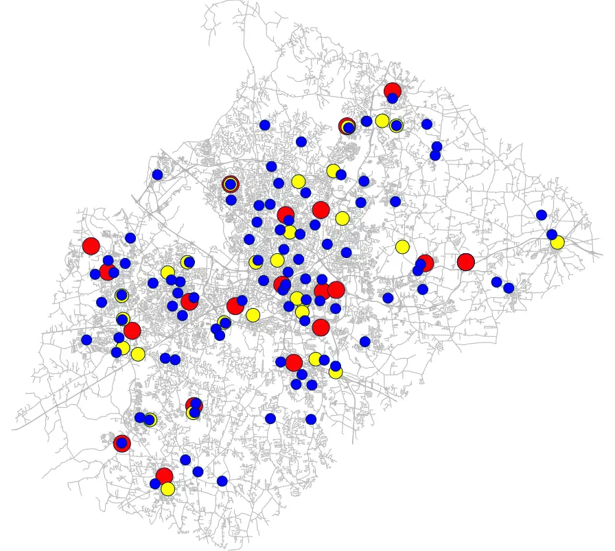

### Creando una leyenda

Una leyenda puede ayudarle a usted y a otros usuarios a interpretar mejor los círculos de colores del mapa. Puede crear una leyenda vectorial con la herramienta de leyenda vectorial, [d.legend.vect](https://grass.osgeo.org/grass-stable/manuals/d.legend.vect.html), a la que puede acceder desde la barra de botones en la parte superior de la ventana del mapa.

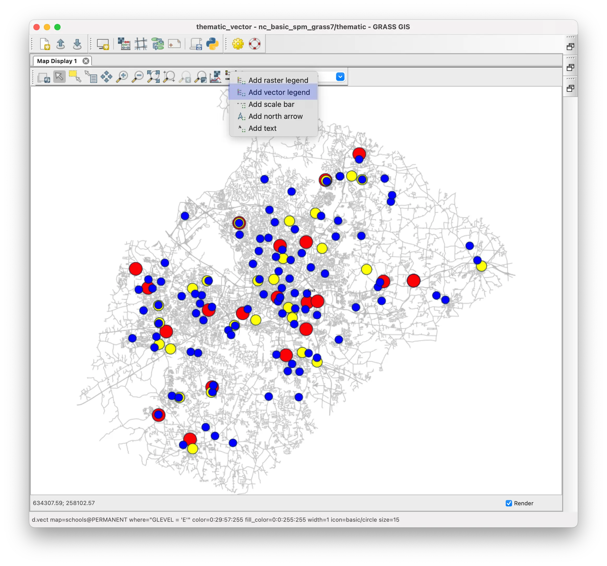

La herramienta de leyenda vectorial crea una leyenda con entradas para todas las capas visibles en la pantalla. Permite definir un título y una fuente, y controlar el fondo. Sin embargo, ofrece menos opciones que la herramienta de leyenda ráster, descrita en la sección siguiente para mapas temáticos ráster.

::: {.panel-tabset group="language"}

#### GUI

1. Abra la herramienta de leyenda vectorial.  

2. En la pestaña Título, configure el "Título de la leyenda" como "Escuelas por grado"  y el "Tamaño de fuente del título" como 14.

3. En la pestaña Fondo, marque la casilla "Mostrar fondo de la leyenda".

4. En la pestaña Configuración de fuente, configure el "Tamaño de fuente" como 12.

5. Haga clic en Aceptar para generar la leyenda.  

#### Línea de comando

```{bash}
d.legend.vect -b at=74.0,30 title="Schools by Grade Level" fontsize=12 title_fontsize=14

d.barscale -n at=70,10 length=10 units=kilometers segment=5 width_scale=2
```

#### Python

```{python}
gs.run_command("d.legend.vect", 
                at="74.0,30", 
                title="Schools by Grade Level", 
                fontsize=12, 
                title_fontsize=14, 
                flags="b")

gs.run_command("d.barscale", 
                at="70,10", 
                length=10, 
                units="kilometers",
                segment=5, 
                width_scale=2, 
                flags="n")
```

:::

Aquí está el mapa con una leyenda. Se ha añadido una barra de escala con la herramienta de barra de escala, [d.barscale](https://grass.osgeo.org/grass-stable/manuals/d.barscale.html), desde la misma barra de botones que la herramienta de leyenda vectorial.
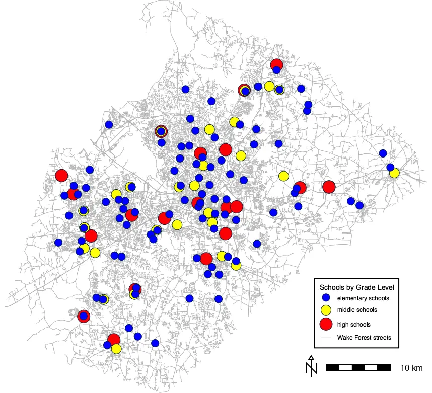

::: {.callout-note title="Tip"}
Si desea regenerar este mapa temático en el futuro, puede hacerlo rápidamente con los comandos de GRASS.

- Abra la herramienta de propiedades vectoriales para cada capa, haga clic en el botón Copiar y pegue el comando generado en un archivo de texto.

- Haga lo mismo con las herramientas de leyenda vectorial y de barra de escala.

- Esto creará un archivo con la siguiente secuencia de comandos (también puede verla haciendo clic en la pestaña "Línea de comandos" de este tutorial):

```
d.vect map=streets color=179:179:179 width=1 legend_label="Wake Forest streets"

d.vect map=schools where="GLEVEL='H'" color=0:29:57 fill_color=255:0:0 width=1 icon=basic/circle size=25 legend_label="high schools"

d.vect map=schools where="GLEVEL='M'" color=0:29:57 fill_color=255:255:0 width=1 icon=basic/circle size=20 legend_label="middle schools"  

d.vect map=schools where="GLEVEL='E'" color=0:29:57 fill_color=0:0:255 width=1 icon=basic/circle size=15 legend_label="high schools"

d.legend.vect -b at=74.0,30 title="Schools by Grade Level" fontsize=12 title_fontsize=14

d.barscale -n at=70,10 length=10 units=kilometers segment=5 width_scale=2
```

Puede pegar estos comandos en la consola GUI de GRASS uno a la vez, en este orden para recrear este mapa.
:::

Puedes usar este mismo enfoque para crear mapas de áreas temáticas y mapas vectoriales lineales. Aquí está el mapa *censal* (census) que muestra el tamaño de los hogares en cada sección censal.

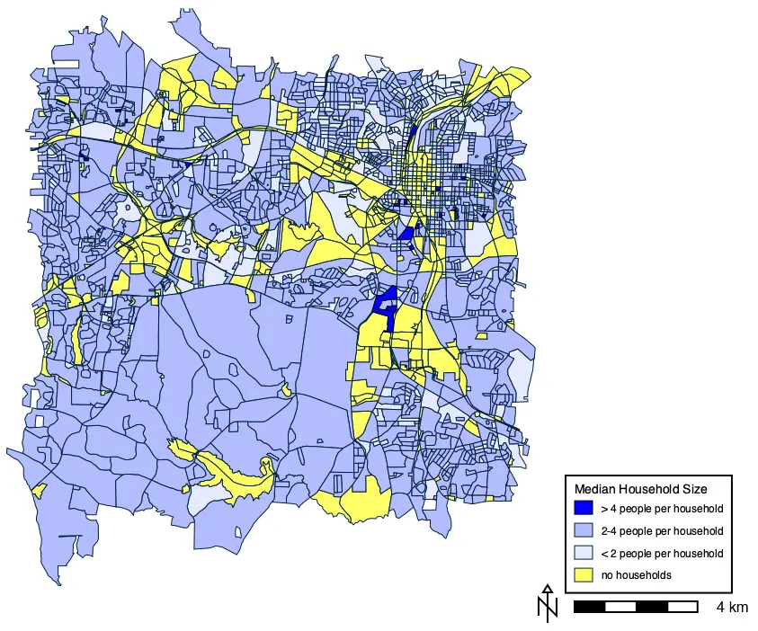

::: {.callout-note title="Commands with settings to generate map"}
d.vect map=census@PERMANENT where=HH_SIZE=0 color=0:29:57:255 fill_color=255:255:102:255 width=1 icon=basic/circle legend_label="no households"

d.vect map=census@PERMANENT where="HH_SIZE>0 AND HH_SIZE<2" color=0:29:57:255 fill_color=230:234:255:255 width=1 icon=basic/circle legend_label="< 2 people per household"

d.vect map=census@PERMANENT where="HH_SIZE>=2 AND HH_SIZE <= 4" color=0:29:57:255 fill_color=178:188:255:255 width=1 icon=basic/circle legend_label="2-4 people per household"

d.vect map=census@PERMANENT type=line,boundary,area,face where="HH_SIZE>4" color=0:0:0:255 fill_color=0:0:255:255 width=1 icon=basic/circle legend_label="> 4 people per household"

d.legend.vect -b at=75,25 title="Median Household Size" fontsize=12 title_fontsize=14

d.barscale -n at=70.5,10 length=4 units=kilometers segment=4 width_scale=2
:::

## Mapas temáticos derivados estadísticamente

### Herramienta de mapeo temático para mapas coropléticos

Puede ser útil agrupar los valores numéricos continuos de una columna en categorías utilizando diversas medidas estadísticas de variabilidad. La herramienta de mapeo temático, [d.vect.thematic](https://grass.osgeo.org/grass-stable/manuals/d.vect.html), puede lograr esto mediante diversos enfoques estadísticos, además de admitir divisiones personalizadas. Esta herramienta solo crea mapas coropléticos (es decir, utiliza colores en lugar del tamaño de los símbolos para visualizar valores numéricos).  

::::: grid
::: g-col-6

- Se puede acceder a la herramienta de mapeo temático desde el ícono de capa vectorial especial en el administrador de capas. 

- Creará una nueva capa vectorial temática.  
:::

::: g-col-6
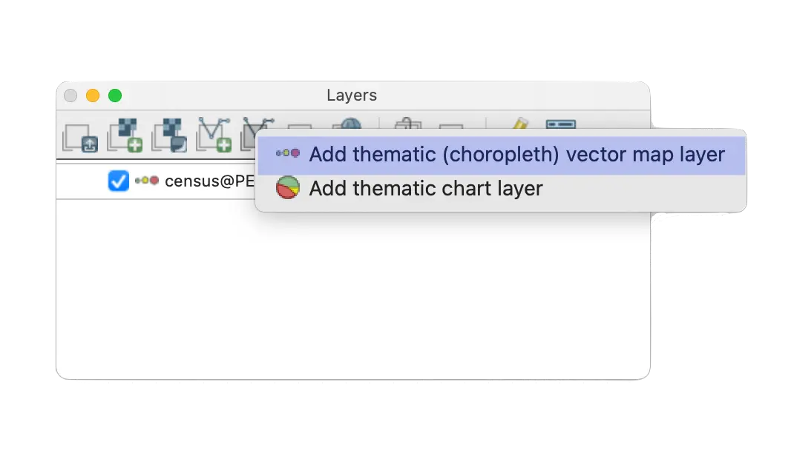{fig-align="top"}
:::
:::::

#### Algoritmos de clasificación utilizados en la herramienta de mapeo temático

| **Code** | \***Statistical grouping algorithm** |
|-:|:-------------------|
| int | Classes are grouped by equal divisions of the column values, the minimum to the maximum value. |
| std | Classes are divided by standard standard deviations below and above the mean. |
| qua | Classes are grouped into quantiles such that each group represents approximately an equal number of cases (rows of a column). |
| equ | Classes have equal probabilities of occurrence in a normal/Gaussian distribution. |
| dis | Classes are divided by natural breaks in the values of a column. The algorithm systematically searches for discontinuities in the slope of the cumulative frequencies curve of column values, by approximating this curve through straight line segments whose vertices define the class breaks. |

\**Ver el [v.class](https://grass.osgeo.org/grass-stable/manuals/v.class.html) manual para obtener información más detallada.*  

También puede seleccionar la cantidad de clases que se calcularán y especificar puntos de interrupción personalizados para las clases en lugar de utilizar los algoritmos enumerados anteriormente para interrupciones calculadas estadísticamente.

Podemos utilizar la herramienta de mapeo temático para generar un nuevo mapa del tamaño de los hogares a partir del mapa *censal* (census), donde las categorías están determinadas por unidades de desviación estándar en lugar de las arbitrarias utilizadas anteriormente.

::: {.panel-tabset group="language"}

#### GUI

:::: grid
::: g-col-6

1. Abra la herramienta de mapas temáticos para crear una nueva capa de mapa temático.

2. En la pestaña "Requerido", introduzca *censal* (census) como fuente de información para crear el mapa temático.

3. Seleccione **HH_SIZE** para la columna que se clasificará en el mapa temático.

4. Seleccione **4 colores** para visualizar las unidades de desviación estándar. El ejemplo mostrado utiliza el selector de colores interactivo (botón a la derecha del cuadro de entrada "Colores") para seleccionar.:

  - azul claro (RGB 193:202:255:255) para 2-SD por debajo de la media,
  - azul oscuro (RGB 0:0:255:255) para 1 DE por debajo de la media,
  - rojo oscuro (RGB 251:2:7:255) para 1-DE por encima de la media, y
  - rojo claro (RGB 254:201:193:255) para 2 DE por encima de la media.
:::

::: g-col-6
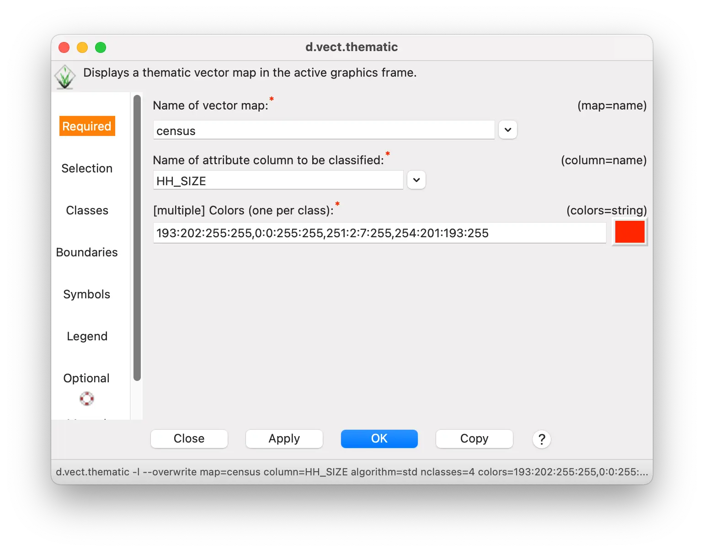{fig-align="right"}
:::
:::::

::::: grid
::: g-col-6
5.  En la pestaña Clases, seleccione **std** para la desviación estándar del "Algoritmo a utilizar para la clasificación" y **4** para el "Número de clases a definir".  
:::

::: g-col-6
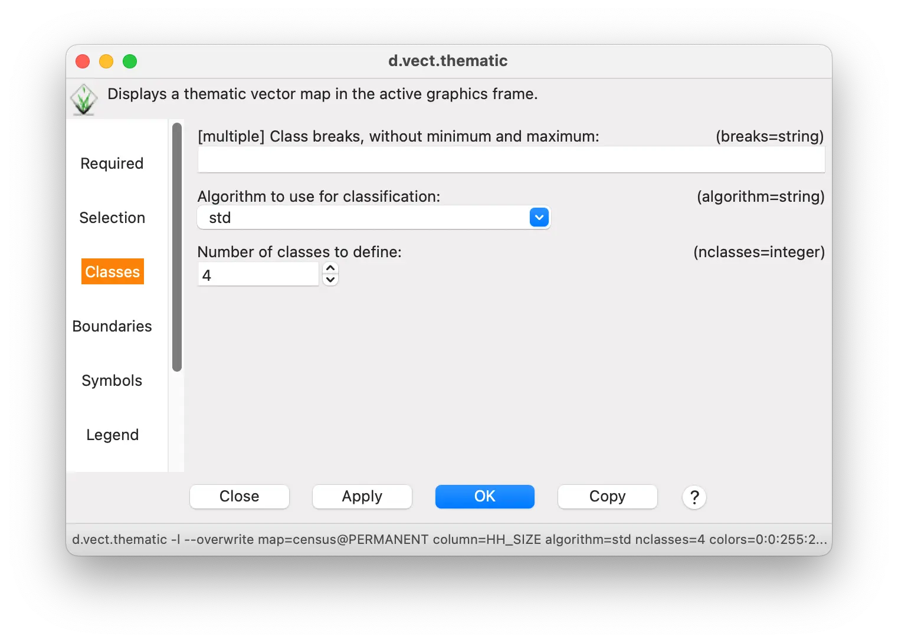{fig-align="right"}
:::
:::::

::::: grid
::: g-col-6
6.  En la pestaña Leyenda, marque la casilla "Crear información de leyenda y enviar a la salida estándar". Esto enviará las reglas de leyenda a la terminal (no a la consola gráfica) que usaremos más adelante.  

7. Introduzca **Unidades de desviación estándar** (Standard deviation units) en el cuadro "Título del mapa temático". Esto se convertirá en un subtítulo en la leyenda.

8. Haga clic en Aceptar.  
:::

::: g-col-6
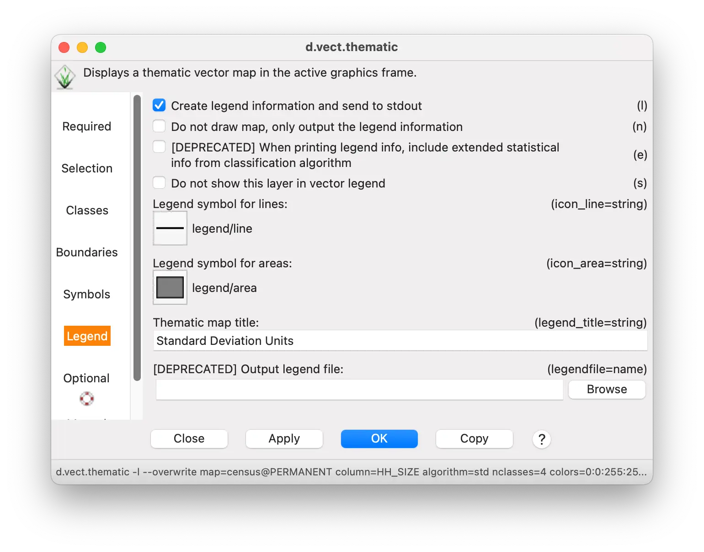{fig-align="right"}
:::
:::::

9. Introduzca los valores para crear la leyenda, tal como lo hizo con el mapa temático de hogares anterior, y también introduzca **13** para el tamaño de fuente del subtítulo.

10. Si lo desea, mantenga la barra de escala como la definió anteriormente.

#### Línea de comando

```{bash}
d.vect.thematic -l map=census column=HH_SIZE algorithm=std nclasses=4 colors="193:202:255:255,0:0:255:255,251:2:7:255,254:201:193:255" boundary_color=0:0:0:255 legend_title="Standard Deviation Units"

d.legend.vect -b at=76,40 title="Median Household Size" fontsize=12 title_fontsize=16 sub_fontsize=13

d.barscale -n at=72,21 length=4 units=kilometers segment=4 width_scale=2
```

#### Python

```{python}
gs.run_command("d.vect.thematic", 
                map="census", 
                column="HH_SIZE", 
                algorithm="std", 
                nclasses=4, 
                colors="193:202:255:255,0:0:255:255,251:2:7:255,254:201:193:255", 
                boundary_color="0:0:0:255", 
                legend_title="Standard Deviation Units", 
                flags="l")
                
gs.run_command("d.legend.vect", 
                at="76,40", 
                title="Median Household Size", 
                fontsize=12, 
                title_fontsize=14, 
                flags="b")

gs.run_command("d.barscale", 
                at="72,21", 
                length=10, 
                units="kilometers",
                segment=5, 
                width_scale=2, 
                flags="n")                
```

:::

Y aquí está el mapa de los tramos censales clasificados por unidades de desviación estándar del tamaño del hogar.

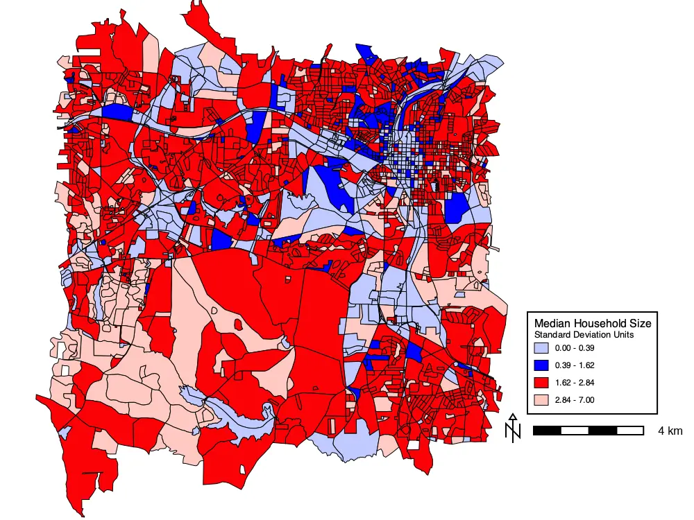

### Personalizando la leyenda

Si bien este mapa es útil tal como está, la leyenda podría mejorarse un poco. Los elementos de la leyenda podrían mostrarse con los valores por debajo de la media hacia abajo y por encima de la media hacia arriba. Además, sería útil indicar qué valores estaban 1 y 2 DE por encima y por debajo de la media.

No es posible hacerlo en la herramienta de mapeo temático. Sin embargo, se puede hacer editando las reglas de leyenda que genera automáticamente la herramienta y que utiliza la herramienta de leyenda vectorial. Esta es la información que aparecía en la terminal de GRASS al ejecutar la herramienta de mapeo temático. Debería verse así:

```
||||||Standard Deviation Units
0.00 - 0.39|legend/area|5|ps|193:202:255|0:0:0|1|area|803
0.39 - 1.62|legend/area|5|ps|0:0:255|0:0:0|1|area|185
1.62 - 2.84|legend/area|5|ps|251:2:7|0:0:0|1|area|1189
2.84 - 7.00|legend/area|5|ps|254:201:193|0:0:0|1|area|360
```

Se trata de una secuencia de campos de datos separados por una barra vertical **\|**. Cada línea de la leyenda está representada por una línea de campos de reglas de leyenda.

#### Clave para las reglas de leyenda

| **position**|    **field** | **Explanation** |
|:-:|-:|:--------------------|
| 1 |       label  | Text that appears next to each color swatch in the legend. |
| 2 |  symbol_name | Symbol used for the color swatch in the legend. |
| 3 |         size | Size of the color swatch in the legend. |
| 4 |   color_type | Order of the next two fields (positions 5 & 6) for the colors used for the color swatch. If the value of this field is **ps** (primary & secondary colors), the first field is for the fill and the second field is for the line/outline. If this field is **lf** (line & fill colors), the first field is the line/outline color and the second field is the fill color.  Legends created by the thematic mapping tool use **ps** order, while legends created in other ways (e.g., as with the layer manager map) use **lf** order. Because this legend is created by the thematic mapping tool, these fields are fill color (position 5), followed by line color (position 6). |
| 5/6 |    fill_color | Fill color of the color swatch. |
| 5/6 | feature_color | Line/outline color of the color swatch. |
| 7 |    line_width |  Width of the line/outline of the color swatch. |
| 8 | geometry_type | Vector object type being mapped. |
| 9 | feature_count | Count of cases (rows) in each category. |

Puedes editar estas reglas para cambiar la apariencia de tu leyenda. Para demostrarlo, modificaremos la leyenda como se propuso anteriormente.

::: {.panel-tabset group="language"}

#### GUI

::::: grid
::: g-col-6

1. Haga doble clic en la leyenda vectorial para abrir la herramienta de leyenda.

2. En la pestaña Entrada/Salida, pegue las reglas de leyenda copiadas desde la terminal. 
:::

::: g-col-6
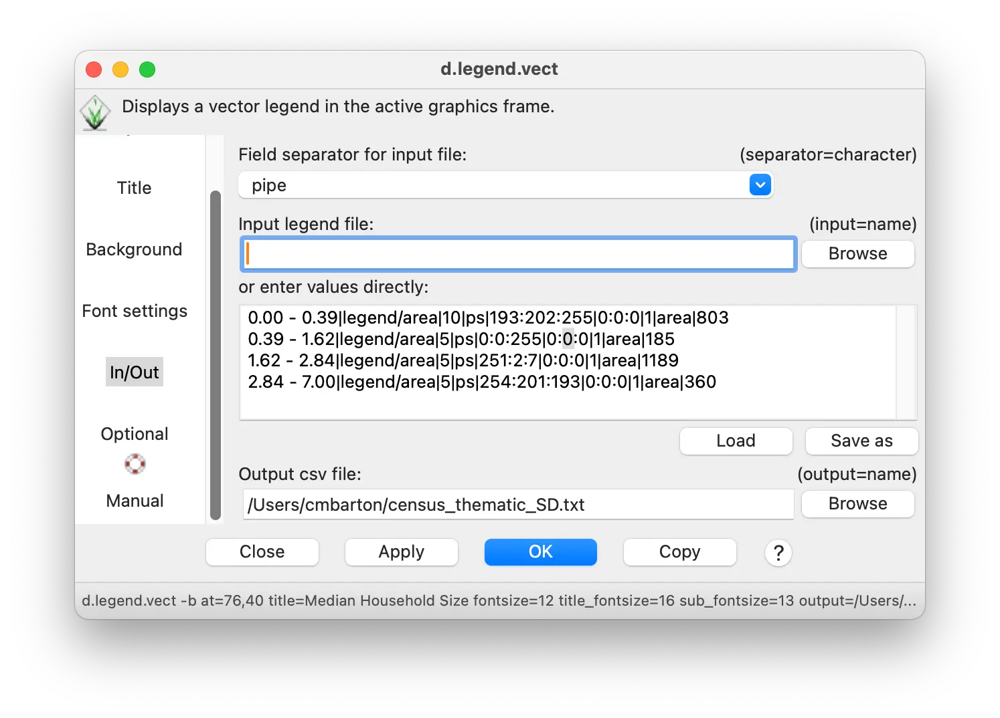{fig-align="right"}
:::
:::::

3. Edite las reglas para que se vean así:

```
||||||Unidades de desviación estándar
1SD to 2SD (2.84-7.00)|legend/area|5|ps|254:201:193|0:0:0|1|área|360
mean to 1SD (1.62-2.84)|legend/area|5|ps|251:2:7|0:0:0|1|área|1189
-1SD to mean (0.39-1.62)|legend/area|5|ps|0:0:255|0:0:0|1|área|185
-2SD to -1SD (0.00-0.39)|legend/area|5|ps|193:202:255|0:0:0|1|área|803
```

4. Opcionalmente, puede guardar las reglas de leyenda en un archivo de texto introduciendo la ruta y el nombre en el cuadro "Archivo CSV de salida". De esta forma, podrá cargarlas para usarlas de nuevo seleccionándolas en el cuadro "Archivo de leyenda de entrada".

5. Haga clic en Aceptar.  

#### línea de comando

Guarde la salida de texto en la terminal en un archivo de texto (p. ej., llamado census_legend.txt). Edítelo en el archivo de texto y luego cárguelo para usarlo en la leyenda.

```{bash}
d.legend.vect -b at=76,40 title="Median Household Size" fontsize=12 title_fontsize=16 sub_fontsize=13 input="[your path]/census_legend.txt"
```

#### Python

Guarde la salida de texto en la terminal en un archivo de texto (p. ej., llamado census_legend.txt). Edítelo en el archivo de texto y luego cárguelo para usarlo en la leyenda.

```{python}
gs.run_command("d.legend.vect", 
                at="76,40", 
                title="Median Household Size", 
                fontsize=12, 
                title_fontsize=14, 
                sub_fontsize=13, 
                input="[your path]/census_legend.txt", 
                flags="b")

```

:::

Aquí está el mapa temático con la leyenda personalizada.

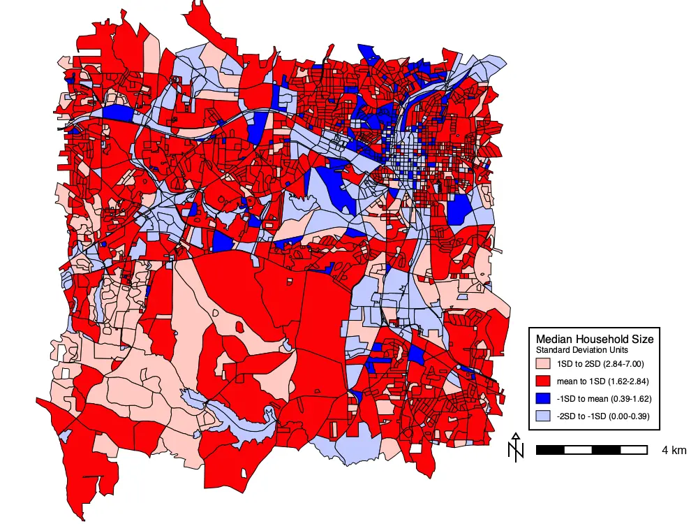

La herramienta de mapeo temático también permite crear mapas coropléticos de puntos vectoriales. Por ejemplo, podemos crear un mapa temático coroplético de la capacidad de las escuelas primarias (mapa de puntos vectoriales *escuelas* (schools) agrupado por unidades de desviación estándar, como el tamaño del hogar para los datos del censo. Solo necesitamos modificar algunos ajustes.
::: {.panel-tabset group="language"}

#### GUI

1. En la pestaña Obligatorio, cambie el "Nombre del mapa vectorial" a ***escuelas*** (schools) y cambie el "Nombre de la columna de atributos" a **CORECAPCI**.  

2. En la pestaña Selección, ingrese **GLEVEL='E'** en el cuadro "DÓNDE" para seleccionar escuelas primarias. 

3. En la pestaña Símbolos, cambie el "Símbolo de punto y centroide" a **básico/círculo** (basic/circle) y configure el tamaño en **15** puntos. 

4. En la pestaña Leyenda, cambie el "Símbolo de leyenda para áreas" a **básico/círculo** (basic/circle) para que coincida con el símbolo de visualización.

5. Haga clic en Aceptar.

6. Agregue una leyenda y una barra de escala como lo hizo para los demás mapas. Puede editar la leyenda como hicimos para el mapa de hogares censados si lo desea.

#### línea de comando

```{bash}
d.vect.thematic -l map=schools column=CORECAPACI algorithm=std nclasses=4 colors="193:202:255:255,0:0:255:255,251:2:7:255,254:201:193:255" where=GLEVEL='E' boundary_color=0:0:0:255 icon=basic/circle size=15 icon_area=basic/circle legend_title="Standard Deviation Units"

d.legend.vect -b at=73,40 title="Elementary School Capacity" fontsize=12 title_fontsize=16 sub_font=14

d.barscale -n at=73,10 length=10 units=kilometers segment=5 width_scale=2
```

#### Python

```{python}
gs.run_command("d.vect.thematic", 
                map="schools", 
                column="CORECAPACI", 
                algorithm="std", 
                nclasses=4, 
                colors="193:202:255:255,0:0:255:255,251:2:7:255,254:201:193:255", 
                where="GLEVEL='E'", 
                boundary_color="0:0:0:255", 
                icon="basic/circle", 
                size=15, 
                icon_area="basic/circle", 
                legend_title="Standard Deviation Units", 
                flags="l")
                
gs.run_command("d.legend.vect", 
                at="73,40", 
                title="Elementary School Capacity", 
                fontsize=12, 
                title_fontsize=14, 
                flags="b")

gs.run_command("d.barscale", 
                at="73,10", 
                length=10, 
                units="kilometers",
                segment=5, 
                width_scale=2, 
                flags="n")    
```

:::

Mapa temático coroplético de las capacidades de la escuela primaria

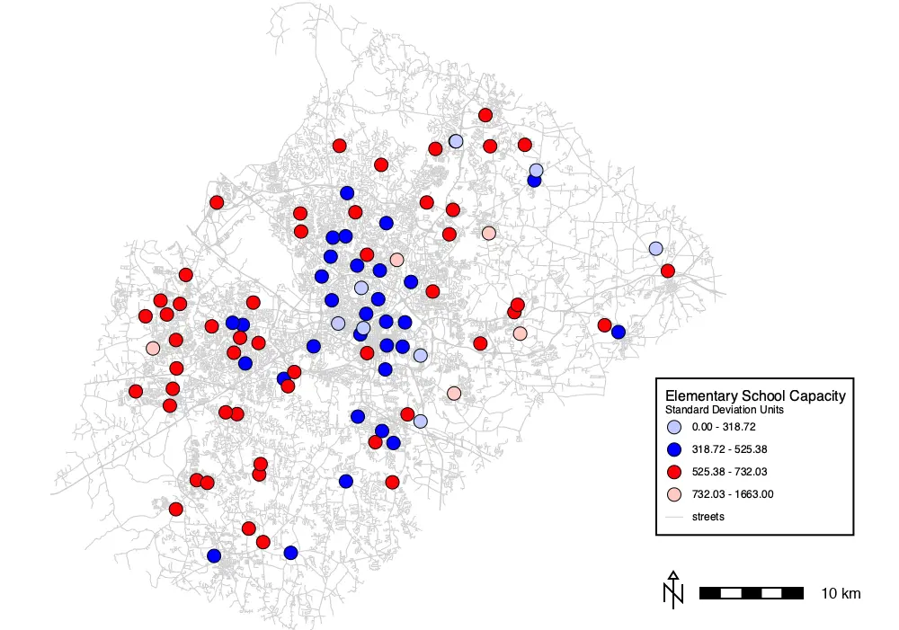

## Cuadros temáticos

### Mapa de gráficos temáticos

Una forma alternativa de visualizar información geoespacial cuantitativa en GRASS es mediante gráficos temáticos para puntos vectoriales. La herramienta de gráficos temáticos... [d.vect.chart](https://grass.osgeo.org/grass-stable/manuals/d.vect.chart.html), Puede mostrar gráficos circulares o de barras en ubicaciones puntuales.

- Cada segmento circular o barra representa el valor de una columna para ese punto. 

- El tamaño de un gráfico circular también puede representar el valor de una columna.  

- De esta manera, se pueden visualizar y comparar los valores de múltiples columnas a lo largo del espacio geográfico. 

Podemos utilizar gráficos temáticos para mostrar el equipamiento disponible en las estaciones de bomberos utilizando el mapa vectorial *estaciones de bomberos* (firestations).

- Las estaciones de bomberos pueden tener varios tipos diferentes de equipos, enumerados en diferentes columnas de la tabla de atributos *estaciones de bomberos* (firestations): autobombas (*PUMPERS*), camiones cisterna (*TANKER*), autobombas-cisterna (*PUMPER_TAN*) y minibombas (*MINI_PUMPE*).

- Podemos utilizar los valores de estas columnas para representar la proporción de cada tipo de equipo contra incendios en un mapa gráfico temático.

- La **suma** (sum) de estas columnas se puede utilizar para el tamaño de un gráfico circular, que refleja el inventario total de equipos.

::: {.panel-tabset group="language"}

#### GUI

::::: grid
::: g-col-6

1. Abra la herramienta de gráficos temáticos desde el ícono de capa vectorial especial en el administrador de capas. 
:::

::: g-col-6
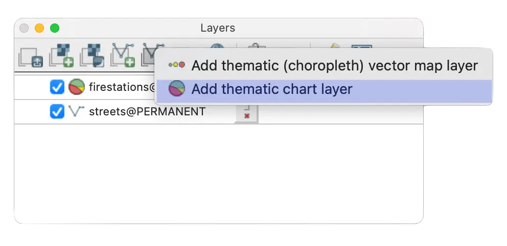{fig-align="right"}  
:::
:::::

::::: grid
::: g-col-6
2.  En la pestaña Obligatorio, ingrese *estaciones de bomberos* (firestations) para "Nombre del mapa vectorial" (Vector map name) .  
:::

::: g-col-6
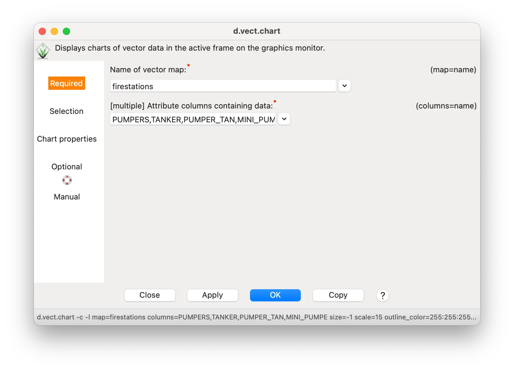{fig-align="right"}
:::
:::::
3.  Introduzca los nombres de las columnas **PUMPERS,TANKER,PUMPER_TAN,MINI_PUMPE** (separados por comas, sin espacios) en el cuadro de entrada "Columnas de atributos que contienen datos" (Attribute columns containing data).  

::::: grid
::: g-col-6
4.  En la pestaña Propiedades del gráfico, ingreseEn la pestaña Propiedades del gráfico, ingrese **pie** para el "Tipo de gráfico"(Chart type).

5. Introduzca la ecuación **BOMBAS + CISTERNA + BOMBA_TANQUERA + MINI_BOMBA** para utilizar el número total de camiones de bomberos para el tamaño de los gráficos circulares.

6. Ingrese **15** en "Escala de tamaño" (Scale for size) para obtener tamaños de puntos de gráfico visualmente agradables (15 X la suma de todos los camiones de bomberos).

7. Introduzca **blanco** (white) para el "Color del contorno" (255:255:255:255 ​​como RGB y alfa/transparencia).

8. Introduzca **4 colores** (4 colors) para representar las 4 columnas que se muestran en el gráfico.

  - Puede utilizar el botón selector de color a la derecha del cuadro de entrada.
  
  - También puede introducirlos manualmente como valores de color RGB o uno de los colores GRASS (*rojo, naranja, amarillo, verde, azul, índigo, violeta, blanco, negro, gris, marrón, magenta, aguamarina, cian, morado*). Los colores deben separarse por comas y sin espacios.
  
  - Los 4 colores utilizados en este tutorial son:  **255:0:0:255,0:0:255:255,204:102:255:255,254:204:102:255**.  

9. Por último, asegúrese de que la casilla “Crear información de leyenda” esté marcada en la pestaña Opcional.  

10. Haga clic en Aceptar.  
:::

::: g-col-6
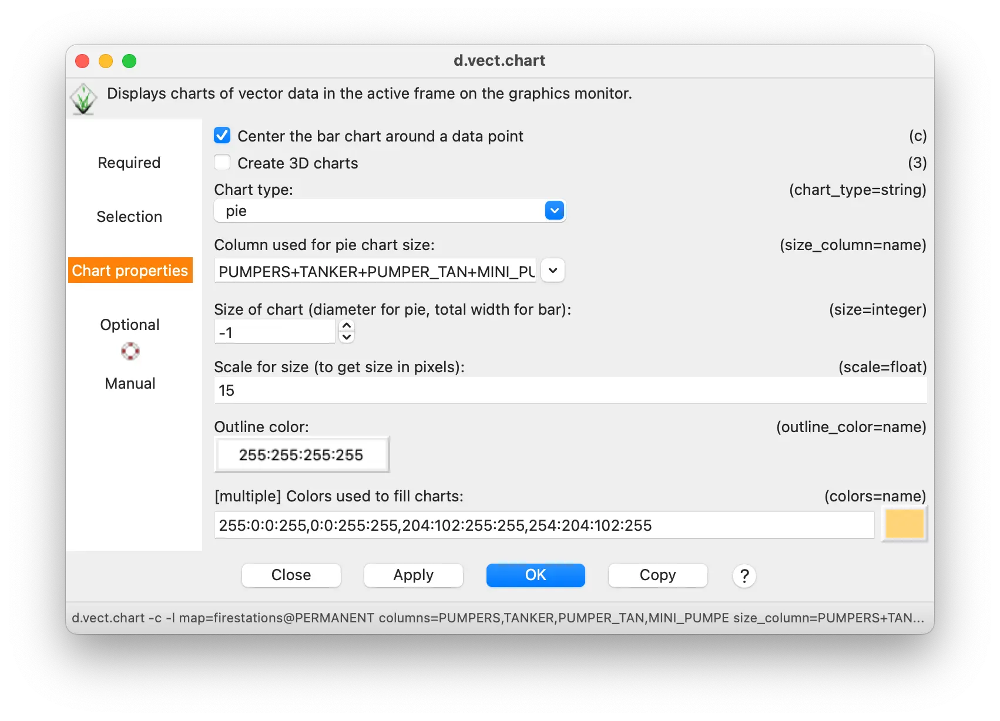{fig-align="right"}
:::
:::::

#### línea de comando

```{bash}
d.vect.chart -c -l map=firestations columns=PUMPERS,TANKER,PUMPER_TAN,MINI_PUMPE size_column=PUMPERS+TANKER+PUMPER_TAN+MINI_PUMPE size=-1 scale=15 outline_color=255:255:255:255 colors=255:0:0:255,0:0:255:255,204:102:255:255,254:204:102:255
```

#### Python

```{python}
gs.run_command("d.vect.chart", 
                map="firestations", 
                columns="PUMPERS,TANKER,PUMPER_TAN,MINI_PUMPE", 
                size_column="PUMPERS+TANKER+PUMPER_TAN+MINI_PUMPE", 
                size=-1, 
                scale=15, 
                outline_color="255:255:255:255", 
                colors="255:0:0:255,0:0:255:255,204:102:255:255,254:204:102:255", 
                flags="cl")
```

:::

Aquí está el mapa temático de las capacidades de las estaciones de bomberos. Está respaldado por un mapa de calles para mostrar las localidades de las estaciones, como hicimos con las escuelas. Es evidente que las estaciones de bomberos más pequeñas suelen tener el mismo tipo de equipo. Las ligeramente más grandes tienen el mismo tipo de equipo diferente. Y las estaciones más grandes tienen la mayor diversidad de equipo. Pero ¿qué tipo de equipo? Necesitamos una leyenda.

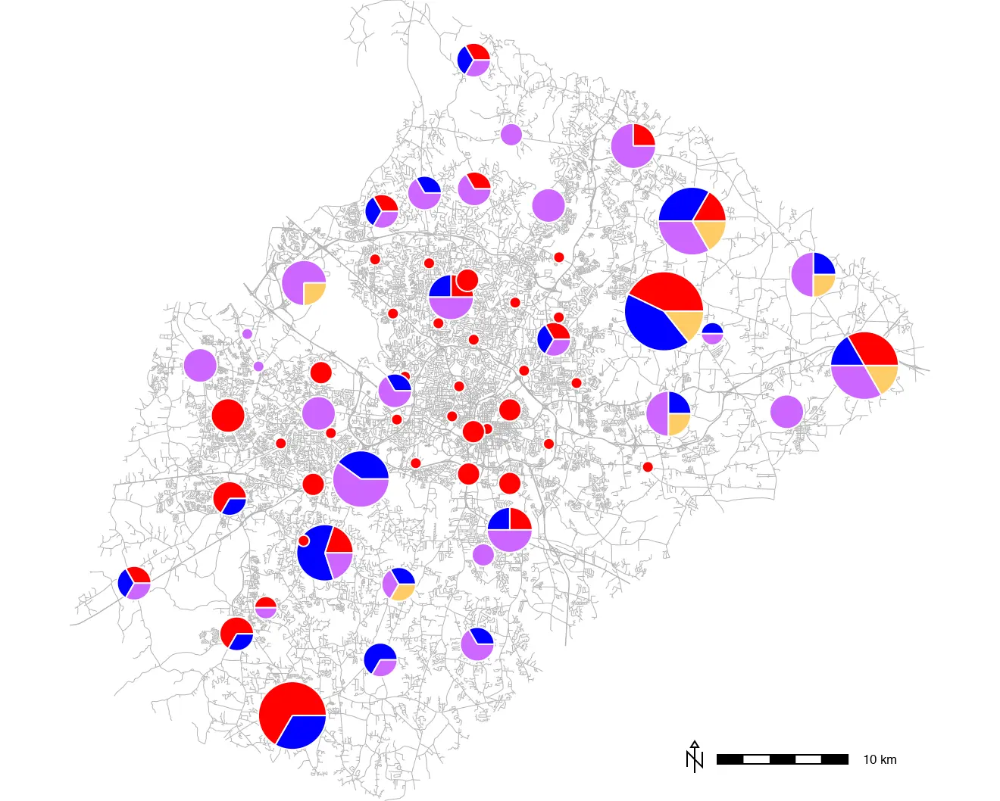

### Creación de una leyenda para un mapa de gráficos temáticos

La herramienta de gráficos temáticos puede enviar información de leyenda a la terminal (no a la consola gráfica), al igual que la herramienta de mapas temáticos. Sin embargo, no está en el formato correcto para su uso inmediato en leyendas vectoriales.

Aquí se muestra la información de la leyenda generada por la herramienta de gráficos temáticos para este mapa:

```
1|PUMPERS|255:0:0
2|TANKER|0:0:255
3|PUMPER_TAN|204:102:255
4|MINI_PUMPE|254:204:102
```

Podemos usar los procedimientos descritos anteriormente para crear una leyenda de mapa temático personalizado. Estas son las reglas de leyenda que usamos anteriormente:

```
||||||Standard deviation units
1SD to 2SD (2.84-7.00)|legend/area|5|ps|254:201:193|0:0:0|1|area|360
mean to 1SD (1.62-2.84)|legend/area|5|ps|251:2:7|0:0:0|1|area|1189
-1SD to mean (0.39-1.62)|legend/area|5|ps|0:0:255|0:0:0|1|area|185
-2SD to -1SD (0.00-0.39)|legend/area|5|ps|193:202:255|0:0:0|1|area|803
```

Podemos editarlos para:

- cambiar el texto de la leyenda,

- cambiar el objeto de la leyenda a un círculo para los colores,

- cambiar los colores de relleno para que coincidan con los generados por la herramienta de gráficos temáticos,

- referenciar los objetos representados como puntos en lugar de áreas, y

- eliminar el número de casos.

Así se ven las nuevas reglas de la leyenda:

```
||||||Tipos de camiones de bomberos
pumpers|basic/circle|5|ps|255:0:0|0:0:0|1|area|
tankers|basic/circle|5|ps|0:0:255|0:0:0|1|area|
pumper-tankers|basic/circle|5|ps|204:102:255|0:0:0|1|area|
mini-pumpers|basic/circle|5|ps|254:204:102|0:0:0|1|area|
||||||(Chart sizes proportional to the total number of fire trucks)
streets|legend/area|5|lf|179:179:179:255|0:103:204|1|line|
```

Tenga en cuenta que también hemos agregado una línea para las calles.

::: {.panel-tabset group="language"}

#### GUI

1. Como hicimos anteriormente, puede abrir la herramienta de leyenda vectorial, agregar un título principal (Estaciones de bomberos), configurar el tamaño de fuente (16 para el título, 14 para el subtítulo, 12 para la leyenda) y, opcionalmente, activar el fondo.

2. Pegue las nuevas reglas de leyenda en el cuadro de texto, debajo de la pestaña Entrada/Salida.

3. Opcionalmente, puede asignar una ruta para guardar estas reglas en un archivo y reutilizarlas en el futuro.

4. Haga clic en Aplicar o en Aceptar. 

#### línea de comando

Guarde las reglas de la leyenda en un archivo de texto (por ejemplo, llamado firestations_legend.txt) y luego cárguelo para usarlo en la leyenda.

```{bash}
d.legend.vect -b at=68,30 title="Fire Stations" border_width=1 fontsize=12 title_fontsize=16 sub_fontsize=13 input="[your path]/firestations_legend.txt"

d.barscale -n at=70.0,8.0 length=10 units=kilometers segment=5 width_scale=2
```

#### Python

Save the legend rules to a text file (e.g., named firestations_legend.txt) and then load it to use in the legend.

```{python}
gs.run_command("d.legend.vect", 
                at="68,30", 
                title="Fire Stations", 
                fontsize=12, 
                title_fontsize=16, 
                sub_fontsize=14, 
                input="[your path]/firestations_legend.txt", 
                flags="b")
                
gs.run_command("d.barscale", 
                 at="70.0,8.0",  
                 length=10, 
                 units="kilometers", 
                 segment=5, 
                 width_scale=2, 
                 flags="n")

```

:::

El mapa de gráficos temáticos con una leyenda personalizada:

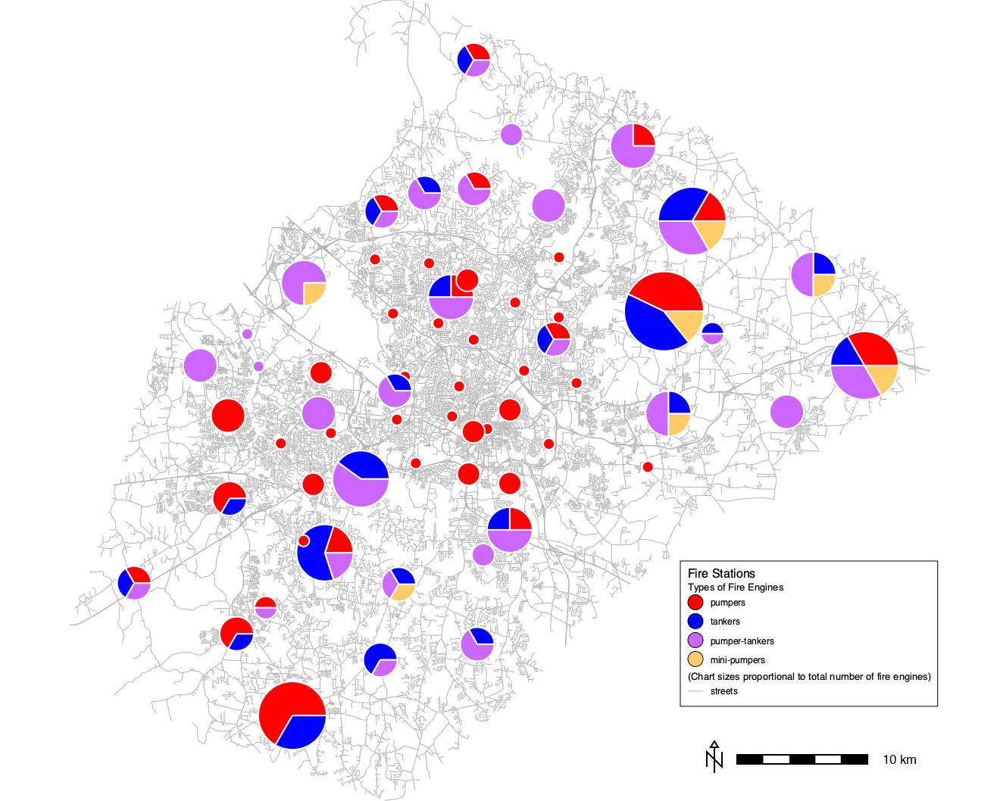

::: {.callout-note title="Más personalización de leyendas"}
¿Cómo podría agregar más líneas a la leyenda personalizada para indicar la relación entre el tamaño del círculo y el inventario de equipos contra incendios?

Recuerda que escalamos el tamaño del círculo a 15x[equipo total]. Los totales van de 0 a 7. Por lo tanto, puedes crear nuevas líneas de leyenda para los totales de 2, 4 y 6 equipos. Para calcular el tamaño en puntos de cada uno, simplemente multiplica por 15: 2 motores = 30 puntos, 4 motores = 60 puntos y 6 motores = 90 puntos.

Luego puedes agregar 3 líneas más a tu leyenda personalizada como esta:

```
2 motores|basic/circle|30|ps|255:255:255|0:0:0|1|area|
```

También podrías comenzar esta nueva sección con un subtítulo.:

```
||||||Total number of fire trucks at each station
```

:::

La herramienta de gráficos temáticos puede representar datos como gráficos de barras en lugar de gráficos circulares. Aquí se muestra el mismo mapa de gráficos temáticos en forma de gráfico de barras. El tamaño del gráfico se configuró en **30**, el color del contorno en **negro** (black) y el nombre del símbolo en el archivo de leyenda se restableció a **leyenda/área** (legend/area) para este mapa.

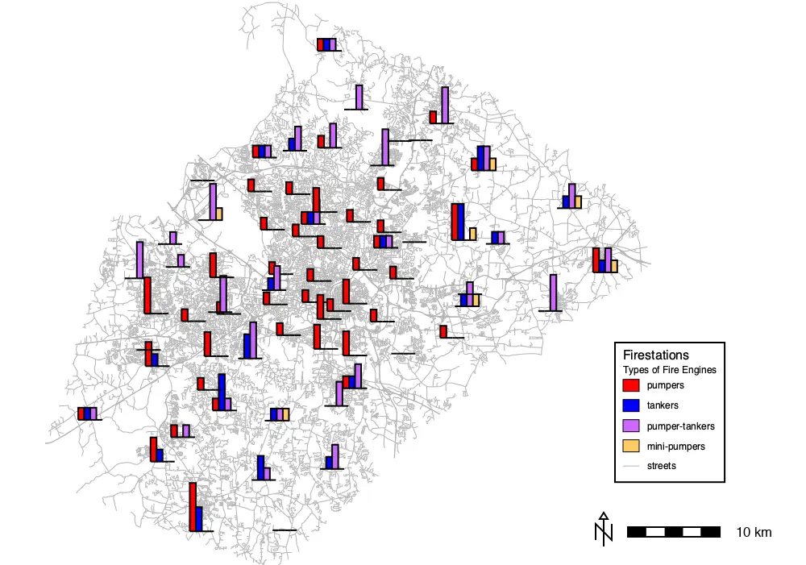

# Mapas temáticos raster

Los mapas temáticos ráster utilizan el color para representar la variación de la cobertura terrestre, el uso del suelo o las características del terreno en un mapa. Estas pueden ser características como la pendiente, representada en grados y que varía continuamente, o la cobertura terrestre, representada por áreas del mapa codificadas con distintas categorías.

## Rásteres con variación continua: pendiente del terreno

La pendiente del terreno es un ejemplo de una característica representada por valores numéricos (en grados) que varían continuamente a lo largo del paisaje. Se puede crear un mapa de pendiente a partir de un mapa de elevación utilizando [r.slope.aspect](https://grass.osgeo.org/grass-stable/manuals/r.slope.aspect.html) tool.

Esto generará un mapa con pendiente que varía continuamente a lo largo de todo el mapa. Se pueden asignar colores a las celdas ráster según sus valores de pendiente para visualizar áreas con pendiente alta y baja. La pendiente que representa cada color se puede mostrar en una leyenda para facilitar la interpretación del mapa.

::: {.callout-note title="Modeling terrain in GRASS"}
Para obtener más información sobre cómo modelar y visualizar pendientes y otras características del terreno en GRASS, consulte [Visualización y modelado de terrenos desde DEM en GRASS].(.../terrain_and_DEMs/GRASS_terrain.qmd) tutorial. Para obtener más información sobre los rásteres en GRASS, consulte [Procesamiento de datos raster en GRASS](https://grass.osgeo.org/grass-stable/manuals/rasterintro.html#raster-map-operations).
:::

Primero, cree un mapa de pendiente a partir del mapa DEM de *elevación* (elevation).

::::::::: {.panel-tabset group="language"}

#### GUI

::::: grid
::: g-col-6

1. Abra la herramienta r.slope.aspect desde el menú Ráster/Análisis del terreno/Pendiente y orientación.

2. Configure la capa ráster de elevación como "Nombre del mapa ráster de elevación de entrada" (Name of input elevation raster map).  
:::

::: g-col-6
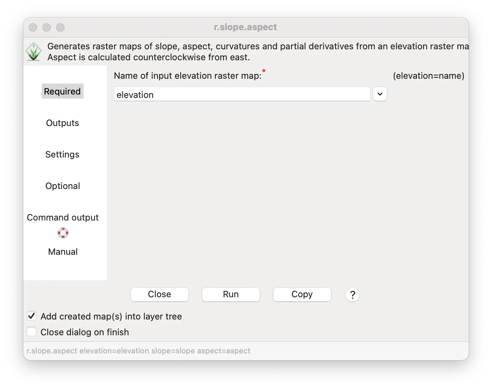{fig-align="right"}
:::
:::::

::::: grid
::: g-col-6
3.  Introduzca el nombre *pendiente* (slope) en "Nombre para el mapa ráster de pendiente de salida" (Name for output slope raster map).

4. Haga clic en Ejecutar.
:::

::: g-col-6
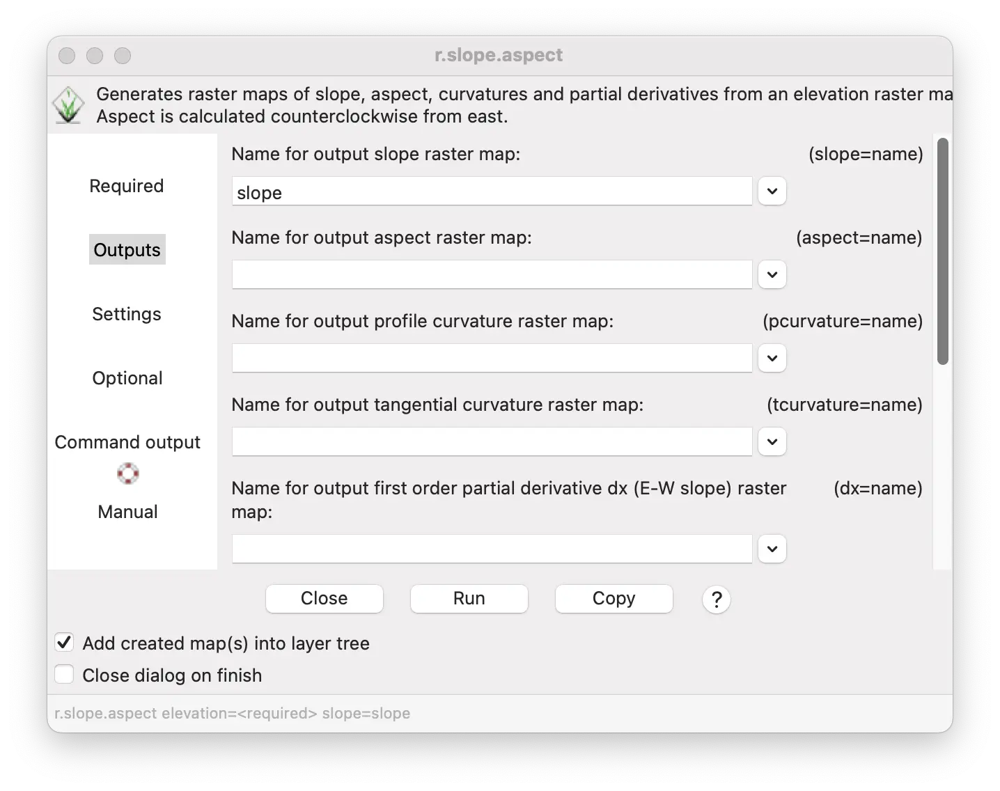{fig-align="right"}
:::
:::::

#### línea de comando

```{bash}
r.slope.aspect elevation=elevation slope=slope
```

#### Python

```{python}
gs.run_command("r.slope.aspect",  
                elevation="elevation", 
                slope="slope")
```

:::::::::

Aquí está el mapa de pendiente resultante.

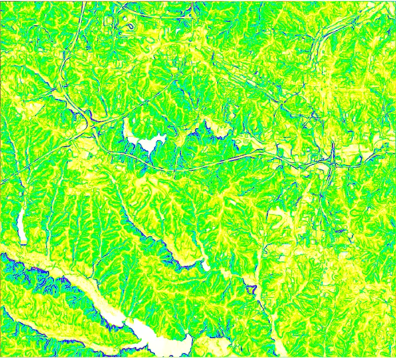

### Seleccionar una tabla de colores

Los colores predeterminados del mapa de pendientes que creamos varían del amarillo pálido al violeta a medida que la pendiente cambia de plana a pronunciada. Podemos asignar diferentes *tablas de colores* (color charts) para representar la variación de la pendiente con diferentes colores.

- Por ejemplo, podríamos cambiar la **intensidad** (intensity) de un color para representar la pendiente: color pálido para pendientes bajas y color intenso para pendientes pronunciadas.

- Se pueden asignar tablas de colores y definir tablas de colores personalizadas mediante el módulo [r.colors](https://grass.osgeo.org/grass-stable/manuals/r.colors.html).

- Apliquemos la tabla de colores *rojos* (red) al mapa de pendiente para que la pendiente esté representada por la intensidad del color rojo.

::::::::: {.panel-tabset group="language"}

#### GUI

::::: grid
::: g-col-6

1. Seleccione la herramienta [r.colors](https://grass.osgeo.org/grass-stable/manuals/r.colors.html) del menú Ráster/Administrar colores.

2. En la pestaña "Mapa", seleccione el mapa de *pendiente* (slope) en el cuadro de entrada "Nombre del mapa(s) ráster".  
:::

::: g-col-6
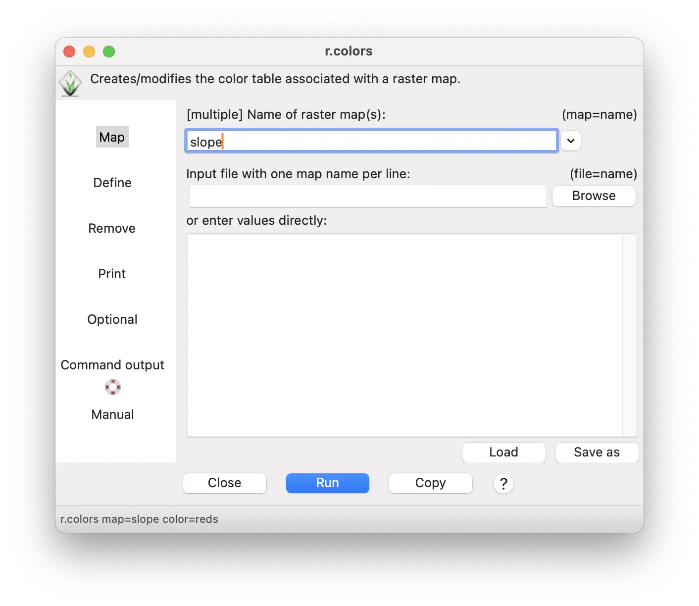{fig-align="right"}
:::
:::::

3. En la pestaña Definir, seleccione *rojos* (red) como tabla de colores.

::::: grid
::: g-col-6
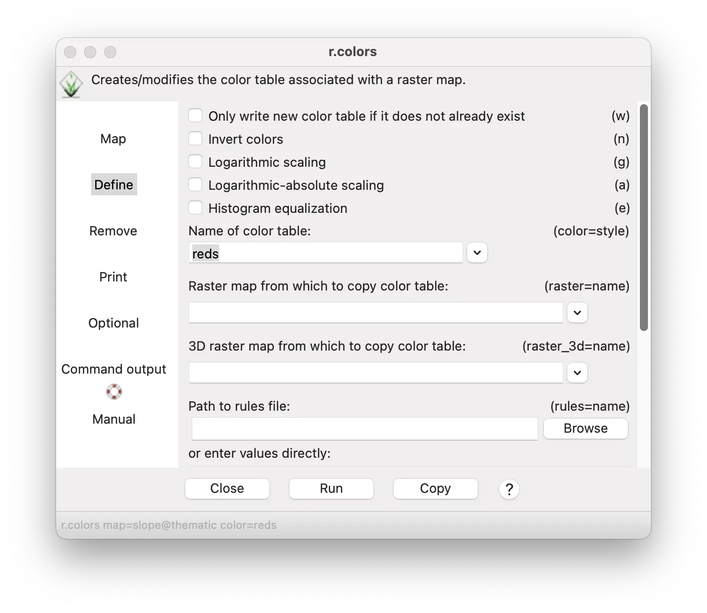{fig-align="right"}
:::

::: g-col-6
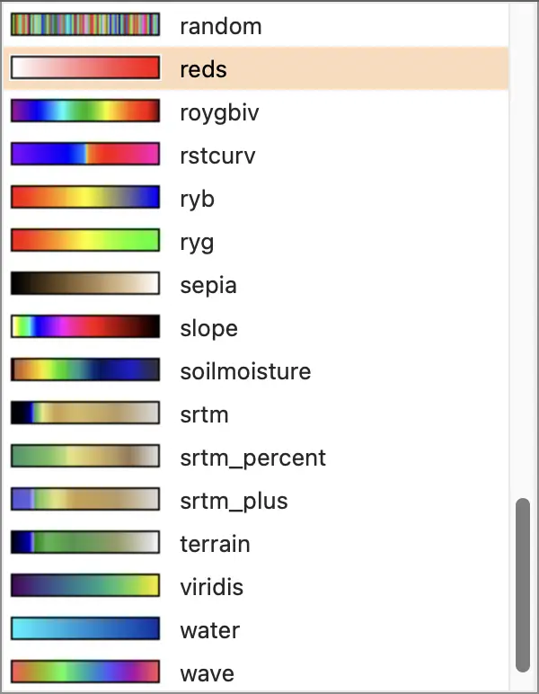{fig-align="left" width="60%"}
:::
:::::

4. Haga clic en Ejecutar.

#### línea de comando

```{bash}
r.colors map=slope color=reds
```

#### Python

```{python}
gs.run_command("r.colors", 
                map="slope", 
                color="reds")
```

:::::::::

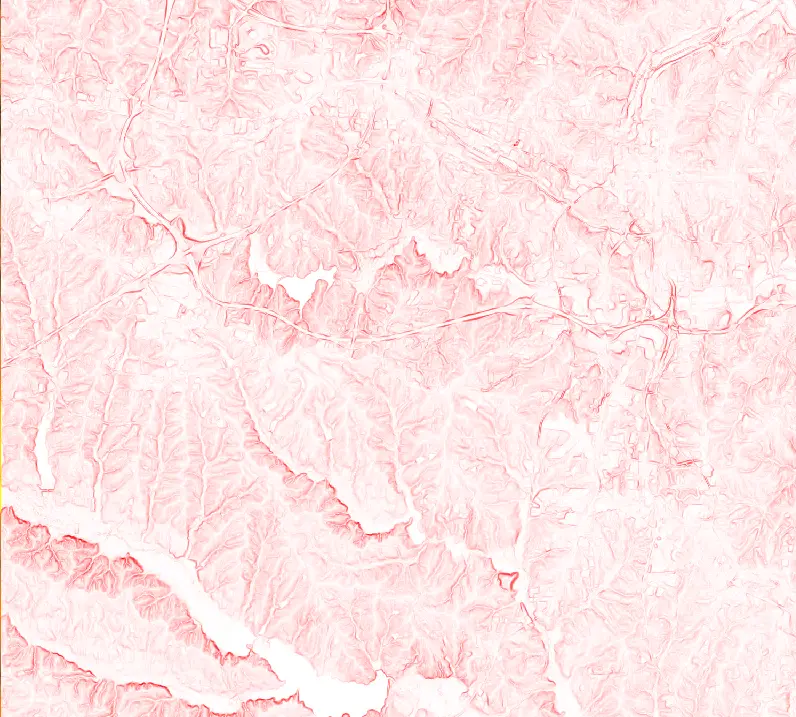

Prueba otras tablas de colores. El color predeterminado original es la tabla de colores *pendiente* (slope). Prueba la tabla de colores *gyr* (de verde a amarillo a rojo) con la *ecualización de histograma* (histogram equalization) activada. También puedes crear una tabla de colores personalizada, como se describe más adelante en este tutorial.  

### Creando una leyenda

Una **leyenda** (legend) puede ayudarle a determinar el rango de valores presentes en su mapa y cómo se corresponden los colores con estos valores. La herramienta ráster [d.legend](https://grass.osgeo.org/grass-stable/manuals/d.legend.html) le permite crear fácilmente una leyenda muy informativa para este mapa.

:::::::::::::::::::::::: {.panel-tabset group="language"}

#### GUI

::::: grid
::: g-col-6
Se puede acceder a la herramienta ráster *d.legend* desde la barra de herramientas de la ventana de visualización. Esta herramienta ofrece numerosas opciones. Exploraremos varias de ellas.  
:::

::: g-col-6
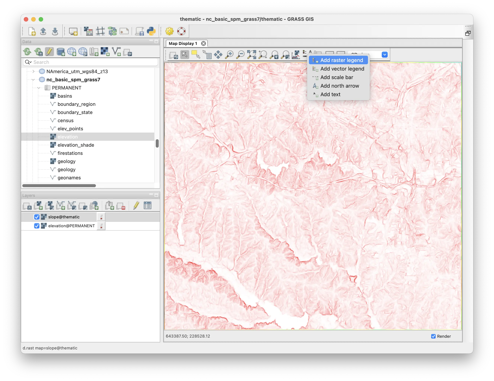{fig-align="right"}
:::
:::::

::::: grid
::: g-col-6

1. En la pestaña Entrada, ingrese *pendiente* (slope) como "Nombre del mapa ráster".  
:::

::: g-col-6
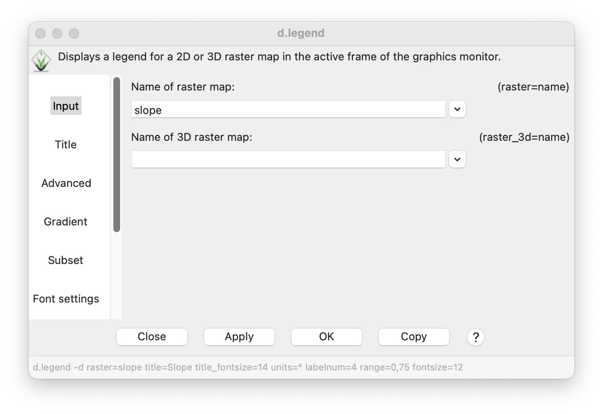{fig-align="right"}
:::
:::::

::::: grid
::: g-col-6
2.  En la pestaña Título, ingrese "Pendiente" como "Título de la leyenda" e ingrese 14 como "Tamaño de fuente del título". 
:::

::: g-col-6
{fig-align="right"}
:::
:::::

::::: grid
::: g-col-6
3.  En la pestaña Avanzada, ingrese el símbolo de grado (°) o la palabra "deg" como "Unidades para mostrar". 
:::

::: g-col-6
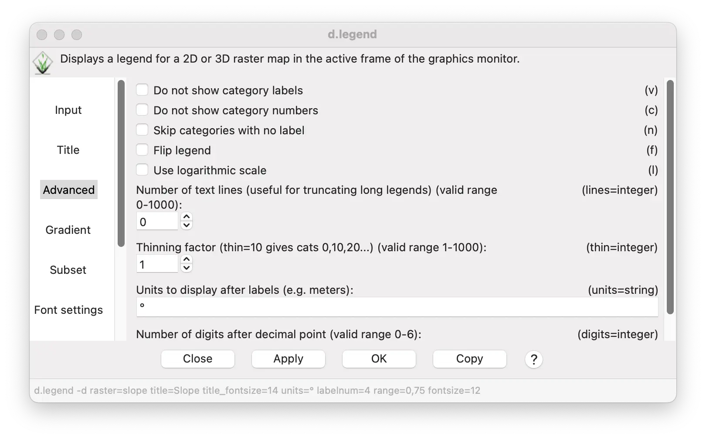{fig-align="right"}
:::
:::::

::::: grid
::: g-col-6
4.  En la pestaña Degradado, marque la casilla "Añadir histograma a la leyenda suavizada". Introduzca también *0,10,20,30* en "Valores específicos para dibujar marcas" para mostrar estos valores uniformemente espaciados como marcas de la leyenda.  
:::

::: g-col-6
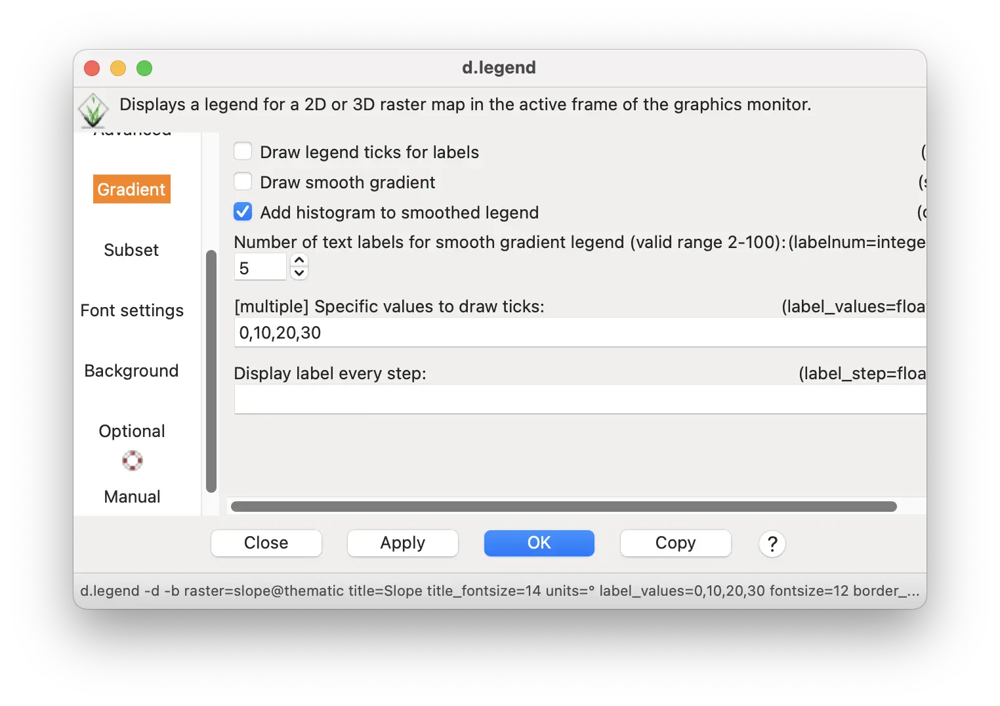{fig-align="right"}
:::
:::::

::::: grid
::: g-col-6
6.  En la pestaña Configuración de fuente, ingrese 12 como "Tamaño de fuente" para la leyenda. 
:::

::: g-col-6
{fig-align="right"}
:::
:::::

::::: grid
::: g-col-6
6.  Por último, en la pestaña Fondo, marca la casilla para mostrar el fondo.

7. Haga clic en Aceptar para ver la leyenda. Puede reposicionarla y redimensionarla con el ratón o numéricamente en la pestaña Opciones. 
:::

::: g-col-6
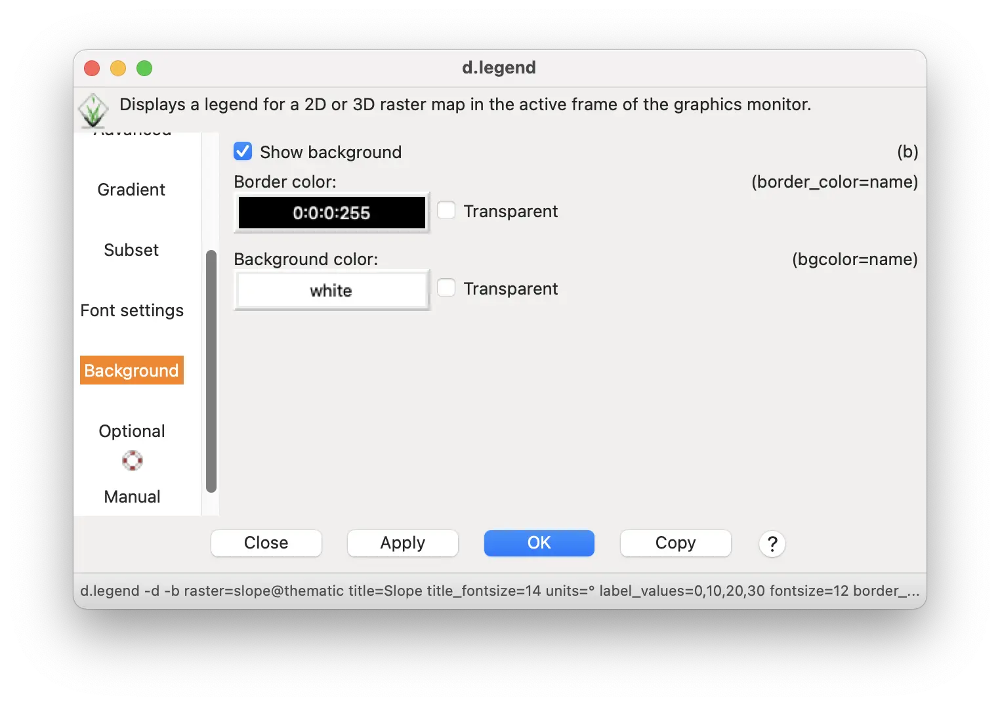{fig-align="right"}
:::
:::::

#### línea de comando

- Se puede generar una leyenda utilizando el comando [d.legend](https://grass.osgeo.org/grass-stable/manuals/d.legend.html).

- Se puede generar una barra de escala y una flecha norte usando el comando [d.barscale](https://grass.osgeo.org/grass-stable/manuals/d.barscale.html).

```{bash}
d.legend -d -b raster=slope title=Slope title_fontsize=14 units=° label_values=0,10,20,30 fontsize=12 border_color=0:0:0:255

d.barscale -n length=2 units=kilometers segment=5 bgcolor=none width_scale=2
```

#### Python

- Se puede generar una leyenda utilizando el comando [d.legend](https://grass.osgeo.org/grass-stable/manuals/d.legend.html).

- Se puede generar una barra de escala y una flecha norte usando el comando [d.barscale](https://grass.osgeo.org/grass-stable/manuals/d.barscale.html).

```{python}
gs.run_command("d.legend", 
                map="slope", 
                title="Slope", 
                title_fontsize=14, 
                units="°", 
                label_values="0,10,20,30", 
                fontsize=12, 
                border_color="0:0:0:255", 
                flags="db")
                
gs.run_command("d.barscale",
                length=2, 
                units="kilometers", 
                segment=5, 
                bgcolor="none", 
                width_scale=2, 
                flags="n")
```

::::::::::::::::::::::::

Aquí está el resultado.

- No solo muestra el rango de valores de pendiente y los colores de los diferentes valores, sino que el histograma también muestra el número de celdas para cada valor de pendiente.

- También puede agregar una barra de escala y una flecha norte desde el mismo elemento de la barra de menú en la ventana de visualización donde seleccionó la herramienta de leyenda.  

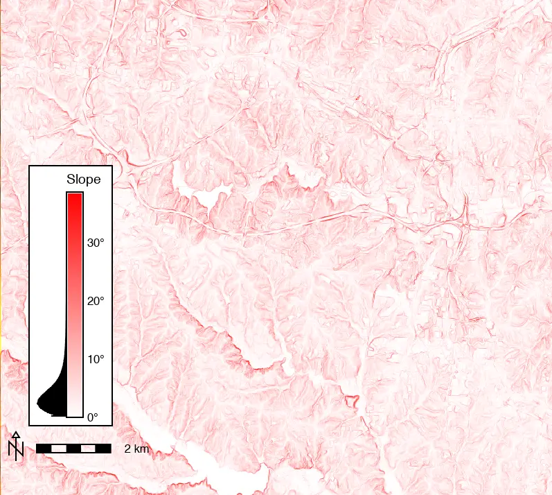  

## Categorización de la variación continua

A veces resulta útil dividir la variación continua en un conjunto de categorías distintas para su análisis o comunicación. Por ejemplo, el mapa de pendientes que creamos anteriormente podría mostrarse como áreas de pendiente baja y pendiente alta, en lugar de un continuo de valores de pendiente. Para los mapas ráster, esto se realiza en GRASS mediante la *reclasificación* (reclassification) de los valores de las celdas. Si bien existen varias maneras de hacerlo, la más sencilla es con la herramienta [r.reclass](https://grass.osgeo.org/grass-stable/manuals/r.reclass.html), disponible en el menú Ráster/Cambiar categoría. A continuación, utilizaremos *r.reclass* para crear un mapa de categorías de pendientes distintas a partir del mapa de pendientes que producimos anteriormente.  

### Estadísticas para categorías

¿Cómo debemos agrupar la pendiente en categorías? Una forma es usar el análisis estadístico para dividir la pendiente estadísticamente en cuartiles, cada uno de los cuales representa el mismo número de celdas ráster. GRASS cuenta con numerosas herramientas para [análisis estadísticos](https://grass.osgeo.org/grass-stable/manuals/topic_statistics.html) de mapas raster y vectoriales.

- Esta [r.univar](https://grass.osgeo.org/grass-stable/manuals/r.univar.html)  herramienta se puede utilizar para encontrar los valores de corte para los cuartiles 1, 2, 3, y 4.  

- Podríamos definir el primer cuartil (25% de celdas raster con las pendientes más bajas) como 'pendiente baja', el cuarto cuartil (25% de celdas con las pendientes más altas) como 'pendiente alta', y las celdas restantes como 'pendiente intermedia' (segundo y tercer cuartiles, que representan el 50% de celdas con pendientes intermedias).  

::: {.panel-tabset group="language"}

#### GUI

1. Abra *r.univar* ("Estadísticas ráster univariadas") desde el menú Ráster/Informes y estadísticas. 

2. Ingrese *pendiente* (slope) como "Nombre del(de los) mapa(s) ráster" (Name of the raster map(s)) en la pestaña Obligatorio. 

3. En la pestaña Extendida, ingrese **25,50,75** para "Percentil a calcular" (Percentile to calculate). 

4. Haga clic en ejecutar.  

#### Línea de comando

```{bash}
r.univar map=slope percentile=25,50,75
```

#### Python

```{python}
gs.run_command("r.univar", 
               map="slope",
               percentile="25,50,75")
```

:::

::::: grid
::: g-col-5
Aquí está el resultado: 

```
n: 2019304
Mínimo: 0
Máximo: 38,6894
Rango: 38,6894
Media: 3,86452
Media de valores absolutos: 3,86452
Desviación estándar: 3,00791
Varianza: 9,04755
Coeficiente de variación: 77,834
Suma porcentual: 7803645,55388512
1.er cuartil: 1,85464
Mediana (número par de celdas): 3,21512
3.er cuartil: 5,02421
```

:::

::: g-col-7
Para dividir la pendiente en cuartiles, necesitamos crear los siguientes grupos de pendientes:  

|   slope   |   quartile   | slope category |
|:---------:|:------------:|:------------:|
|  0-1.85464 | 1st quartile | low slope |
| 1.85465-5.02421 | 2nd & 3rd quartiles | intermediate slope |
| 5.02422-38.6894 | 4th quartile | high slope |
:::
:::::

### Reclasificación

Ahora podemos utilizar los resultados del análisis estadístico anterior para reclasificar la pendiente en tres categorías. Dos de estas categorías representan cada una el 25% de las celdas con las pendientes más altas y más bajas; la tercera categoría intermedia representa el 50% del total de celdas.  

:::::: {.panel-tabset group="language"}

## GUI

La herramienta [r.reclass](https://grass.osgeo.org/grass-stable/manuals/r.reclass.html) se encuentra en el menú de categoría Ráster/Cambiar. 

::::: grid
::: g-col-6

1.Introduzca *pendiente* (slope) para el ráster que se va a reclasificar.

2. Introduzca *slope_quartiles* para el mapa reclasificado de salida.

3. Introduzca las reglas de reclasificación directamente en el cuadro de texto o desde un archivo de texto guardado. Utilice el símbolo y \* para representar todo lo que no esté cubierto por las reglas de reclasificación específicas.

4. Haga clic en "Ejecutar".  

```
0 thru 1.85464 = 1 pendiente baja (low slope)
1.85465 thru 5.02421 = 2 pendiente intermedia (intermediate slope )
5.02422 thru 38.6894 = 3 pendiente alta (high slope)
```

:::

::: g-col-6
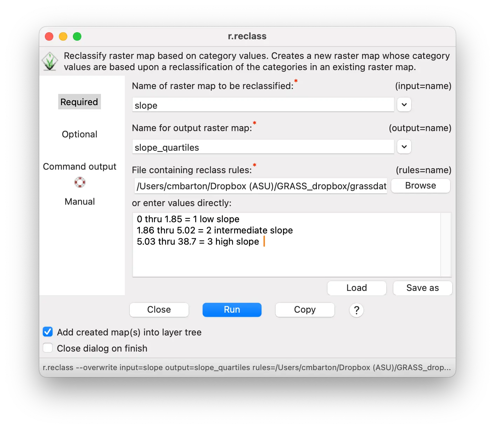{fig-align="right"}
:::
:::::

## línea de comando

```{bash}
r.reclass input=slope output=slope_quartiles rules=- << EOF
0 thru 1.85464 = 1 low slope 
1.85465 thru 5.02421 = 2 intermediate slope  
5.02422 thru 38.6894 = 3 high slope  
EOF
```

## Python

```{python}
rules = """\
0 thru 1.85464 = 1 low slope 
1.85465 thru 5.02421 = 2 intermediate slope  
5.02422 thru 38.6894 = 3 high slope  
"""
gs.write_command("r.reclass",
                 input="slope",
                 output="slope_quartiles",
                 rules="-",
                 stdin=rules)
```

::::::

Esto crea un nuevo mapa llamado *slope_quartiles* con la pendiente dividida en tres categorías.

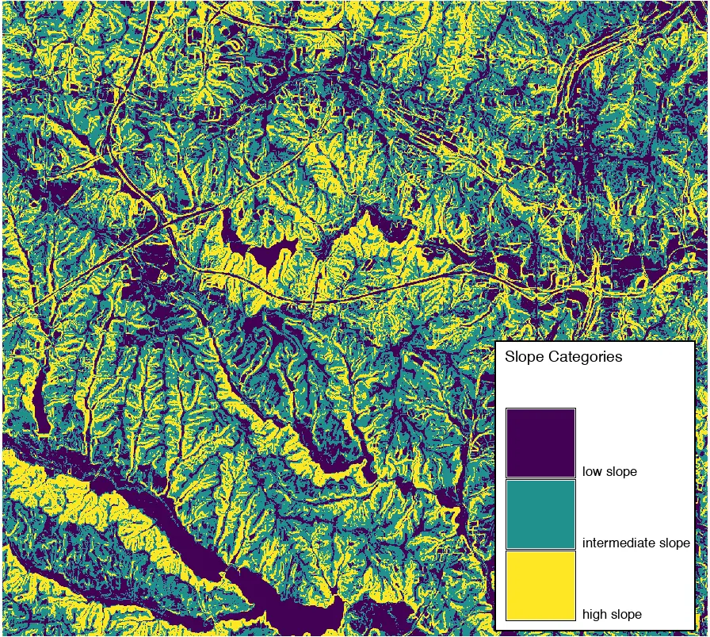

### Asignación de una tabla de colores personalizada

Este mapa es útil para mostrar áreas con diferentes categorías de pendiente. Sin embargo, podría ser más fácil de interpretar con un conjunto de colores diferente. Podríamos seleccionar una tabla de colores predefinida diferente con la herramienta *r.colors* mostrada anteriormente. También podemos definir una tabla de colores personalizada con la misma herramienta.

Crear una tabla de colores personalizada es tan sencillo como especificar un número de categoría seguido de un color.  

- El color puede ser uno de los colores con nombre que reconoce GRASS (*rojo, naranja, amarillo, verde, azul, índigo, violeta, blanco, negro, gris, marrón, magenta, aguamarina, gris, cian, morado*) o

- El color puede especificarse como valores RGB (0-255 para rojo:verde:azul) o como un número hexadecimal.

- Por ejemplo, para crear una tabla de colores con aguamarina, amarillo y rojo para las categorías 1-3 en el mapa *slope_quartiles*, simplemente debe listarlos como:  

```
1 aguamarina
2 amarillos
3 rojos
```

- Para especificar los mismos colores que RGB, escribirías las reglas de la siguiente manera:

```
1 100:128:255
2 255:255:0
3 255:0:0
```

- Como valores de color hexadecimales, escribirías las reglas así:

```
1 #6480ff
2 #ffff00
3 #ff0000
```

Puede guardar esto en un archivo de reglas de texto simple y cargarlo en *r.colors* o puede especificarlo directamente dentro de la herramienta *r.colors*.

:::::::::::: {.panel-tabset group="language"}

#### GUI

::::: grid
::: g-col-6

1. Especifique *slope_quartiles* como el mapa al que desea asignar la tabla de colores
:::

::: g-col-6
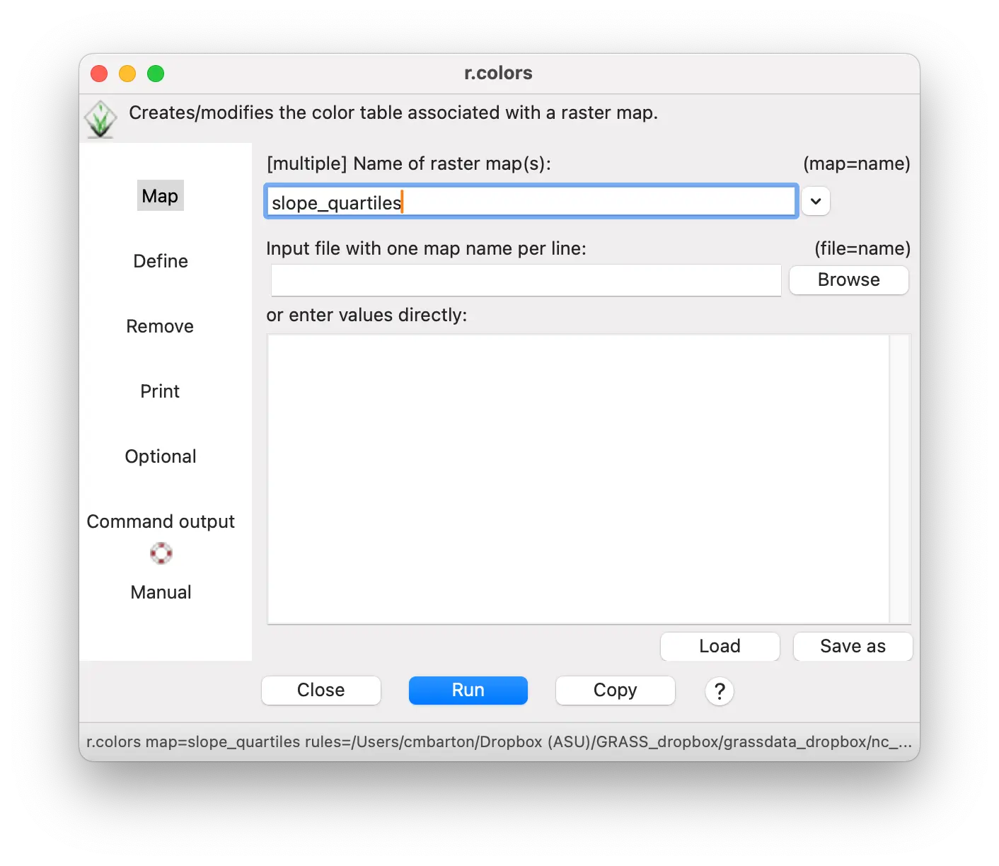{fig-align="right"}
:::
:::::

::::: grid
::: g-col-6
2.  Introduzca las reglas de color en la casilla "Introducir valores directamente".

3. Pulse Ejecutar.
:::

::: g-col-6
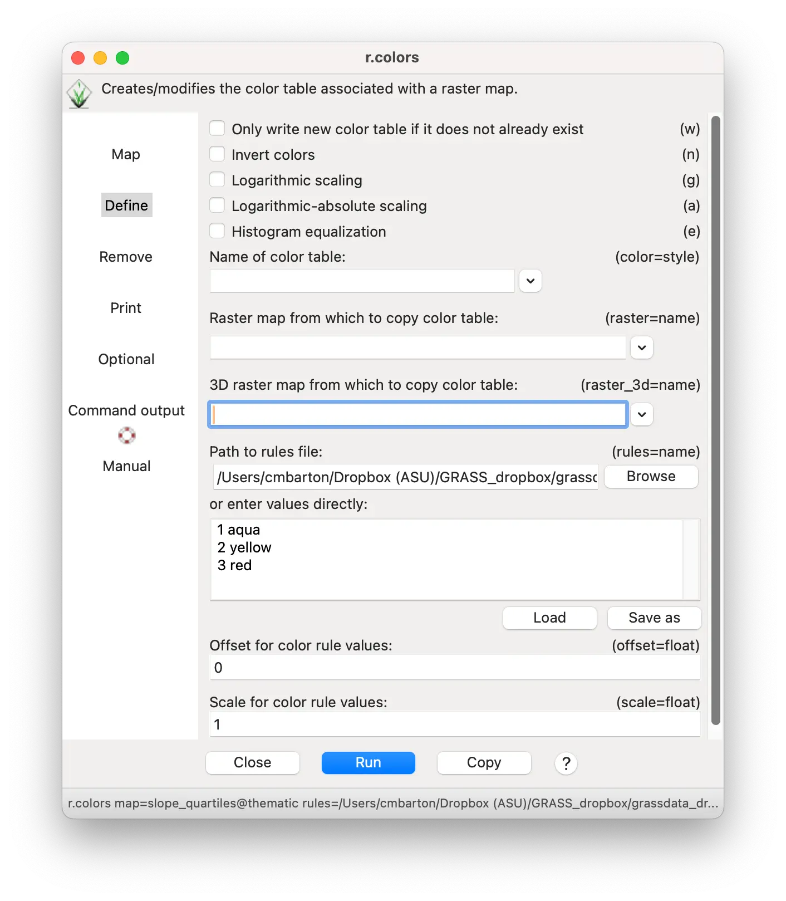
:::
:::::

::::: grid
::: g-col-6
También puede especificar reglas de color de forma interactiva seleccionando Ráster/Administrar colores/Administrar reglas de color de forma interactiva.
:::

::: g-col-6
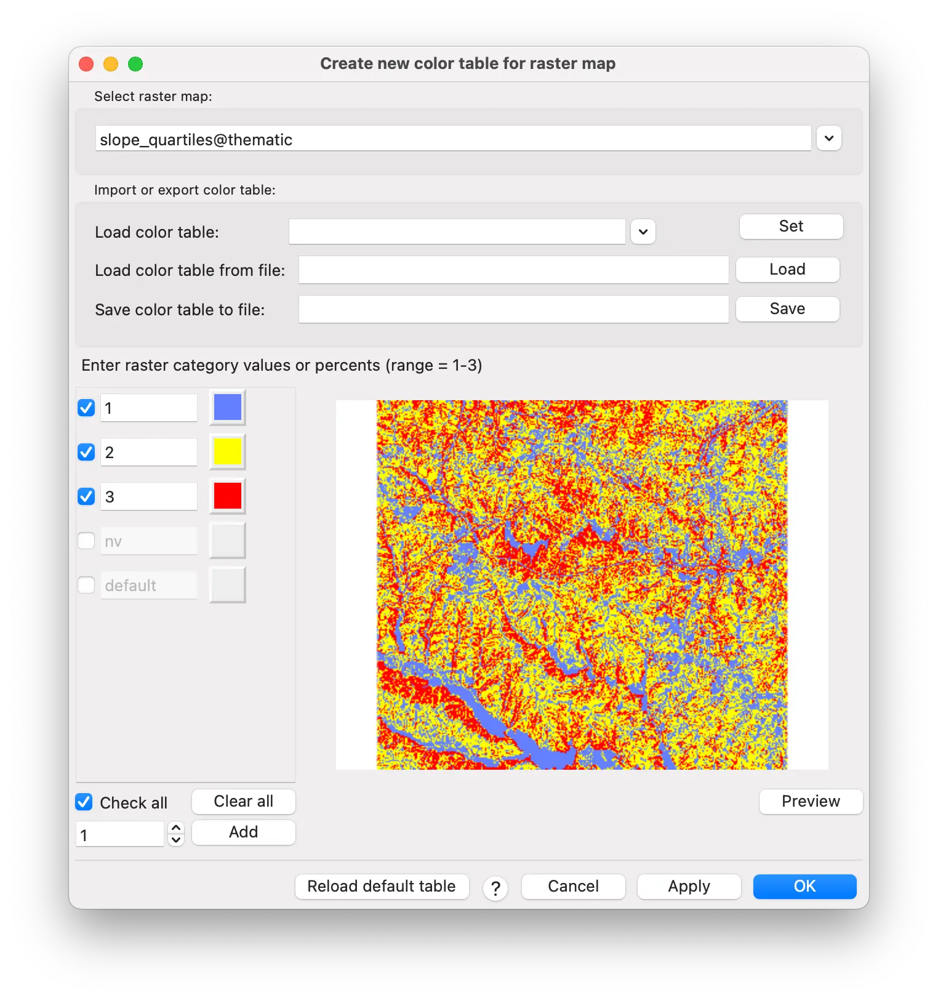{fig-align="right"}
:::
:::::

#### línea de comando

```{bash}
r.colors -e map=slope_quartiles rules=- << EOF
1 aqua
2 yellow
3 red
EOF
```

#### Python

```{python}
rules = """\
1 aqua
2 yellow
3 red
"""
gs.write_command("r.colors",
                 map="slope_quartiles",
                 rules="-",
                 stdin=rules)
```

::::::::::::

Aquí se muestra el mapa de categorías de cuartiles de pendiente resultante con una tabla de colores personalizada.

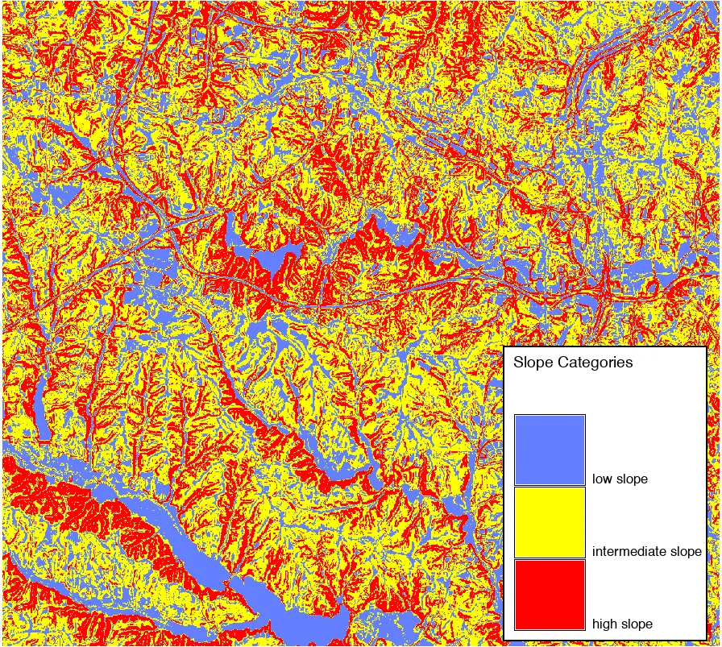


## Rásteres con categorías diferenciadas: cobertura terrestre

Además de valores continuos, las celdas ráster pueden representar categorías diferenciadas, codificadas con un valor entero y una etiqueta de texto. Cuando a estas categorías se les asignan diferentes colores, este tipo de mapa temático también se denomina mapa *coroplético* (choropleth).

- El mapa *landuse96_28m* es un ejemplo de este tipo de mapa ráster. Cargue el mapa *landuse96_28m* en el administrador de capas.

- Dado que los colores varían según la categoría, ya se puede considerar un mapa ráster temático. Solo falta una leyenda interpretativa.

- Puede crear una leyenda para el mapa *landuse96_28m* de la misma manera que creamos una leyenda para el mapa de pendientes, con algunas pequeñas diferencias.  

::: {.panel-tabset group="language"}

#### GUI

1. En la herramienta *d.legend*, seleccione *landuse96_28m* para crear la leyenda del mapa.

2. Escriba "Uso del suelo" en el título y configure el tamaño de fuente del título en 14.

3. En la pestaña "Avanzado", marque la casilla "No mostrar el número de categorías" (aunque podría querer mostrar los números de otro mapa).

4. Configure el tamaño de fuente en 12.

5. Marque la casilla "Mostrar fondo".

6. Haga clic en "Aceptar".  

#### línea de comando

```{bash}
d.legend -c -b raster=landuse title="Land Use" title_fontsize=14 fontsize=12 border_color=0:0:0:255
```

#### Python

```{python}
gs.run_command("d.legend",
               raster="landuse", 
               title="Land Use", 
               title_fontsize=14, 
               fontsize=12, 
               border_color="0:0:0:255", 
               flags="cb")
```

:::

Aquí está el mapa temático de uso del suelo. 

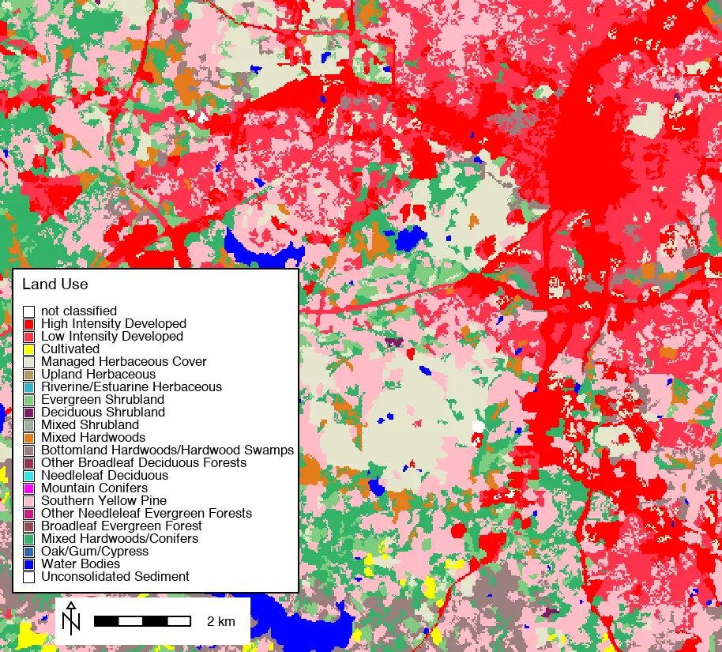

::: {.callout-note title="Tip"}
Si tiene un mapa de categorías con muchas categorías, es posible que no sean legibles o que ni siquiera se muestren como categorías distintas. Si tiene un mapa con demasiadas categorías para crear una leyenda legible, puede combinar algunas categorías o centrarse en un área geográfica más pequeña para crear un mapa temático útil.
:::

### Agregación de categorías con reclasificación

Este mapa temático podría ser más informativo si las diversas categorías de uso y cobertura del suelo se pudieran condensar en menos. Al igual que con el mapa de pendientes, esto se puede lograr mediante la reclasificación para asignar nuevos valores y etiquetas a las categorías de uso del suelo existentes.

Podemos crear un nuevo mapa de reclasificación con categorías agregadas, denominado *cobertura del suelo*. Utilizando [*r.reclass*](https://grass.osgeo.org/grass-stable/manuals/r.reclass.html) Como se describió anteriormente, podemos reducir las 21 categorías originales a 7 combinando toda la tierra desarrollada en una sola categoría, toda la vegetación herbácea, toda la vegetación arbustiva y toda la cobertura arbórea.

:::::: {.panel-tabset group="language"}

## GUI

1. Introduzca *landuse96_28m* para el ráster que se reclasificará.

2. Introduzca *landcover* para el mapa reclasificado resultante.

3. Introduzca las reglas de reclasificación directamente en el cuadro de texto o desde un archivo de texto guardado.

```
1 2 = 1 desarrollado
3 = 2 agricultura
4 6 = 3 herbáceo
7 a 9 = 4 matorrales
10 a 18 = 5 bosque
20 = 6 agua
21 = 7 sedimentos
```

## Command line

```{bash}
r.reclass input=landuse output=landcover rules=- << EOF
1 2 = 1 developed
3 = 2 agriculture      
4 6 = 3 herbaceous
7 thru 9 = 4 shrubland
10 thru 18 = 5 forest
20 = 6 water
21 = 7 sediment
EOF
```

## Python

```{python}
rules = """\
1 2 = 1 developed
3 = 2 agriculture      
4 6 = 3 herbaceous
7 thru 9 = 4 shrubland
10 thru 18 = 5 forest
20 = 6 water
21 = 7 sediment
"""
gs.write_command("r.reclass",
                 input="landuse",
                 output="landcover",
                 rules="-",
                 stdin=rules)
```

::::::

Aquí está el resultado con una leyenda.

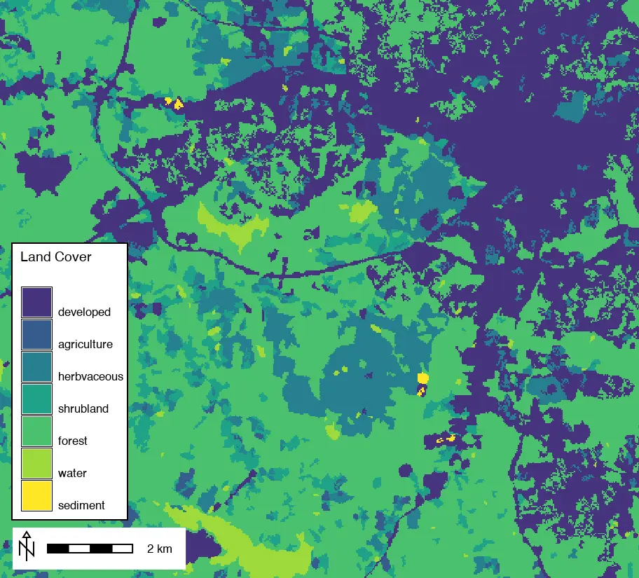  

### Colores personalizados para el mapa temático reclasificado

Finalmente, podríamos cambiar los colores de la tabla de colores predeterminada *viridis* a una que muestre mejor las categorías de cobertura terrestre. Esto se puede hacer usando el [r.colors](https://grass.osgeo.org/grass-stable/manuals/r.colors.html) descrito anteriormente para el mapa de pendientes reclasificadas.

A continuación, se muestran algunas posibles asignaciones de colores: el terreno urbanizado (1) es naranja, el terreno agrícola (2) es amarillo, la vegetación restante (3-5) se colorea en tonos de verde, el agua (6) es azul y el sedimento (7) es marrón. Asigne estos colores usando *r.colors* como se hizo anteriormente para la pendiente reclasificada. 

:::::::::::: {.panel-tabset group="language"}

#### GUI

1. Especifique *cobertura terrestre* como el mapa al que desea asignar la tabla de colores.

2. Introduzca las reglas de color en el cuadro "Introducir valores directamente".

```
1 255:127:0
2 255:255:0
3 200:255:0
4 0:255:0
5 20:130:70
6 0:191:191
7 191:127:63
```

3. Ejecución de prensa

#### línea de comando

```{bash}
r.colors map=landcover rules=- << EOF
1 255:127:0
2 255:255:0
3 200:255:0
4 0:255:0
5 20:130:70
6 0:191:191
7 191:127:63
EOF
```

#### Python

```{python}
rules = """\
1 255:127:0
2 255:255:0
3 200:255:0
4 0:255:0
5 20:130:70
6 0:191:191
7 191:127:63
"""
gs.write_command("r.colors",
                 map="landcover",
                 rules="-",
                 stdin=rules)
```

::::::::::::

Aquí está el mapa de cobertura terrestre resultante reclasificado y recoloreado.

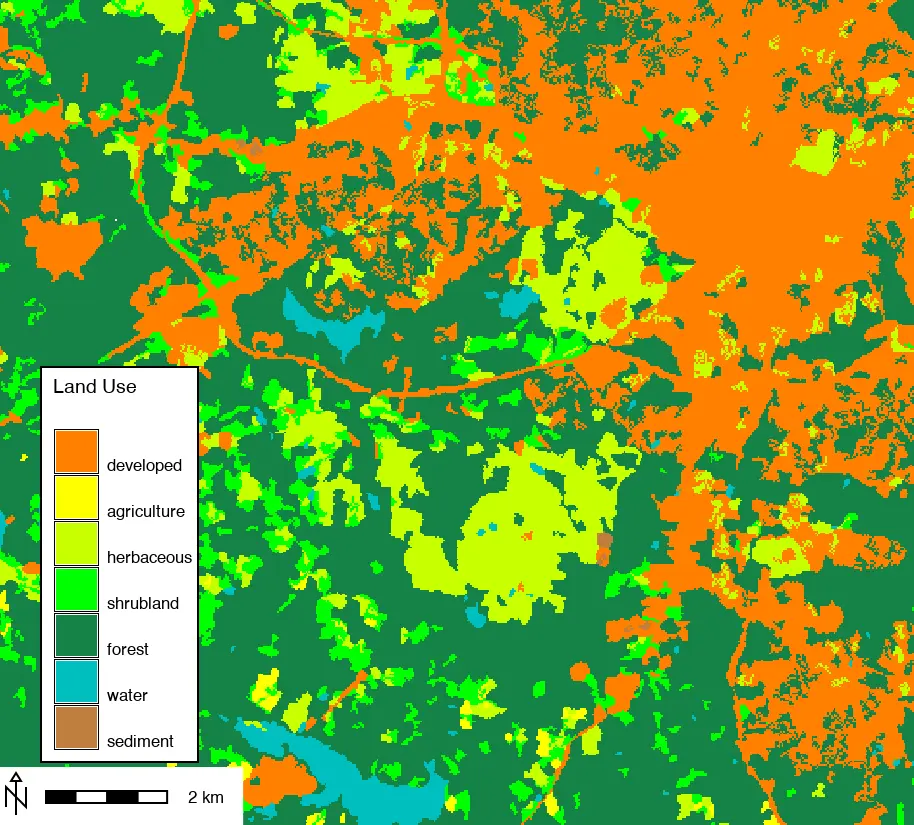

# Resumen

Además de los enfoques presentados aquí, existen otras maneras de crear mapas temáticos en GRASS. Para mapas vectoriales, se pueden crear puntos y líneas graduados, con tamaño de punto y ancho de línea proporcional a una variable numérica, en la herramienta de propiedades vectoriales (d.vect). Se pueden asignar tablas de colores a una columna vectorial numérica de la misma manera que se asignan tablas de colores a mapas ráster. En ambos casos, será necesario crear leyendas personalizadas para estos mapas temáticos vectoriales siguiendo los procedimientos descritos anteriormente. Lo importante es que GRASS permite crear mapas temáticos sofisticados y de alta calidad a partir de datos geoespaciales ráster y vectoriales.


---

:::{.smaller}
*© Michael Barton y Eunice Villaseñor Iribe*
*El desarrollo de este tutorial fue financiado en parte por la Fundación Nacional de Ciencias de EE. UU. [NSF](https://www.nsf.gov/), premio [2303651](https://www.nsf.gov/awardsearch/showAward?AWD_ID=2303651)*
:::
