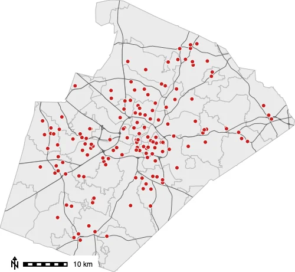
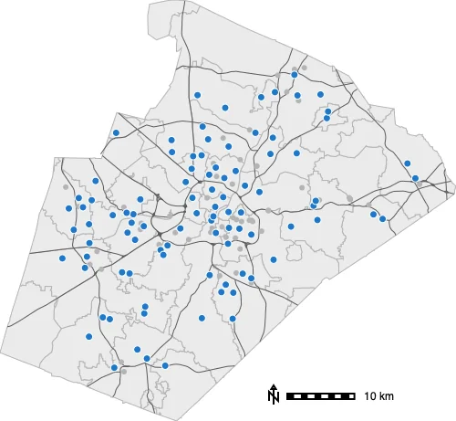
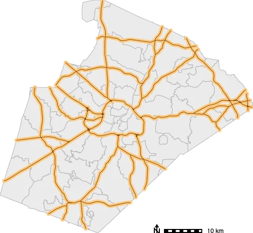
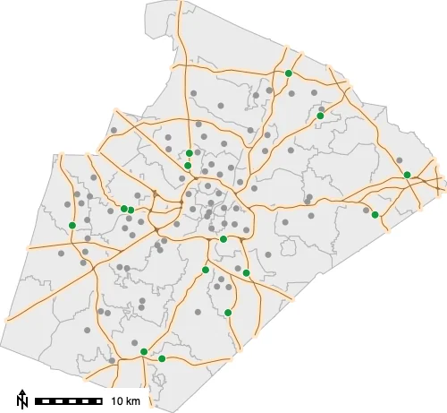
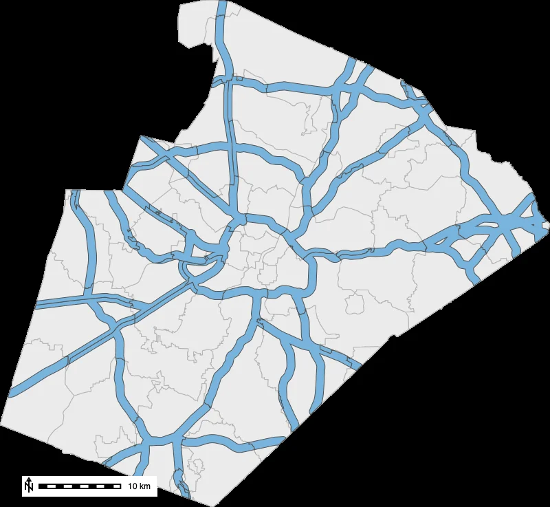
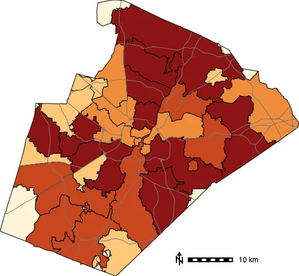

# Introduction

Vector data represents geographic features as **points**, **lines**, and **areas**,
each linked to a table of **attributes**. GRASS has a large family of `v.*` tools for
working with them. This tutorial introduces the operations you will reach for most
often, using a single worked example: analyzing how schools in Wake County, North
Carolina relate to major roads and administrative areas.

Along the way we will:

- explore a vector map and its attribute table,
- **select by attribute** with [v.extract](https://grass.osgeo.org/grass-stable/manuals/v.extract.html),
- **buffer** features with [v.buffer](https://grass.osgeo.org/grass-stable/manuals/v.buffer.html),
- **select by location** with [v.select](https://grass.osgeo.org/grass-stable/manuals/v.select.html),
- perform spatial operations with [v.overlay](https://grass.osgeo.org/grass-stable/manuals/v.overlay.html), and
- count features per area with [v.vect.stats](https://grass.osgeo.org/grass-stable/manuals/v.vect.stats.html).

::: {.callout-note title="Demo dataset"}
This tutorial uses the standard GRASS
[North Carolina sample dataset](https://grass.osgeo.org/sampledata/north_carolina/nc_spm_08_grass7.zip)
(`nc_spm_08_grass7`), which includes `schools_wake` (points), `roadsmajor` (lines),
and `zipcodes_wake` (areas).
:::

::: {.callout-note title="How to run this tutorial"}
The code uses the GRASS Python API in a Jupyter notebook. If you are new to running
GRASS from Python, see the
[Get started with GRASS & Python](https://grass-tutorials.osgeo.org/content/tutorials/get_started/fast_track_grass_and_python.html)
tutorial. Every step also works from the GRASS GUI or command line — just use the
tool name (for example `v.buffer`) with the same parameters.
:::

# Setup and exploration

Start a GRASS session and set the
[computational region](https://grass.osgeo.org/grass-stable/manuals/g.region.html) to
the extent of the ZIP code areas, which cover the whole county. For vector-only work
the region mainly controls what the maps display.

```{python}
import sys
import subprocess

sys.path.append(
    subprocess.check_output(["grass", "--config", "python_path"], text=True).strip()
)

import grass.script as gs
import grass.jupyter as gj
from grass.tools import Tools

session = gj.init("~/grassdata", "nc_spm_08_grass7", "PERMANENT")
tools = Tools()

tools.g_region(vector="zipcodes_wake")
```

::: {.callout-note title="GRASS version"}
The examples use the [grass.tools API](https://grass.osgeo.org/grass-stable/manuals/python_intro.html)
(the `Tools` class), introduced in GRASS 8.5. On earlier versions you can run the
same tools with `gs.run_command("v.buffer", ...)`.
:::

Before analyzing a layer, it helps to know what it contains.
[v.info](https://grass.osgeo.org/grass-stable/manuals/v.info.html) reports the feature
types and counts, and its `-c` flag lists the attribute columns.

```{python}
# Feature summary (points, lines, areas ...)
print(tools.v_info(map="schools_wake", flags="t").stdout)

# Attribute columns
print(tools.v_info(map="schools_wake", flags="c").stdout)
```

`schools_wake` has 167 point features. Let's look at the attribute table itself.
[v.db.select](https://grass.osgeo.org/grass-stable/manuals/v.db.select.html) can
return the table as JSON, which [pandas](https://pandas.pydata.org/) turns into a tidy
table:

```{python}
import json
import pandas as pd

records = json.loads(
    tools.v_db_select(
        map="schools_wake",
        columns="NAMESHORT,GLEVEL,ADDRCITY,CORECAPACI",
        format="json",
    ).stdout
)["records"]

pd.DataFrame(records).head()
```

The `GLEVEL` column records each school's level (`E` for elementary, `M` for
middle, `H` for high, and so on) — we will use it in a moment to select schools by
attribute. Let's first draw an overview map: the ZIP code areas, the major roads, and
the schools. In [grass.jupyter](https://grass.osgeo.org/grass-stable/manuals/libpython/grass.jupyter.html),
a `Map` object collects display layers and renders them together.

```{python}
overview = gj.Map(width=500)
overview.d_vect(map="zipcodes_wake", type="area",
                fill_color="235:235:235", color="180:180:180")
overview.d_vect(map="roadsmajor", color="90:90:90", width=1)
overview.d_vect(map="schools_wake", icon="basic/circle", size=7,
                fill_color="200:30:30", color="white")
overview.d_barscale(flags="n", at=(3, 6), bgcolor="white")
overview.show()
```



# Selecting by attribute

To keep just the **95 elementary schools** (`GLEVEL='E'`), use
[v.extract](https://grass.osgeo.org/grass-stable/manuals/v.extract.html) with a SQL
`where` clause.

```{python}
tools.v_extract(input="schools_wake", output="elementary", where="GLEVEL='E'")
print(tools.v_info(map="elementary", flags="t").stdout)  # points=95
```

```{python}
attr_map = gj.Map(width=500)
attr_map.d_vect(map="zipcodes_wake", type="area",
                fill_color="235:235:235", color="180:180:180")
attr_map.d_vect(map="roadsmajor", color="90:90:90", width=1)
attr_map.d_vect(map="schools_wake", icon="basic/circle", size=6,
                fill_color="180:180:180", color="none")
attr_map.d_vect(map="elementary", icon="basic/circle", size=8,
                fill_color="30:120:200", color="white")
attr_map.d_barscale(flags="n", at=(3, 6), bgcolor="white")
attr_map.show()
```



# Buffering

A **buffer** is a zone of a given distance around features. Here we buffer the major
roads by 500 m with [v.buffer](https://grass.osgeo.org/grass-stable/manuals/v.buffer.html)
to represent an "along a major road" corridor. The result is an area map.

```{python}
tools.v_buffer(input="roadsmajor", output="road_buffer", distance=500)
```

```{python}
buffer_map = gj.Map(width=500)
buffer_map.d_vect(map="zipcodes_wake", type="area",
                  fill_color="235:235:235", color="180:180:180")
buffer_map.d_vect(map="road_buffer", type="area", fill_color="255:200:120", color="none")
buffer_map.d_vect(map="roadsmajor", color="120:70:20", width=1)
buffer_map.d_barscale(flags="n", at=(3, 6), bgcolor="white")
buffer_map.show()
```



# Selecting by location

Now we combine two layers spatially:
[v.select](https://grass.osgeo.org/grass-stable/manuals/v.select.html) keeps features
of one map based on their spatial relationship to another. With `operator=overlap`,
we keep the elementary schools that fall inside the road buffer.

```{python}
tools.v_select(ainput="elementary", binput="road_buffer",
               output="schools_near", operator="overlap")
print(tools.v_info(map="schools_near", flags="t").stdout)  # points=15
```

Only **15 of the 95 elementary schools** lie within 500 m of a major road — a
reminder that major roads here are highways, while most schools sit on local streets.

```{python}
near_map = gj.Map(width=500)
near_map.d_vect(map="zipcodes_wake", type="area",
                fill_color="235:235:235", color="180:180:180")
near_map.d_vect(map="road_buffer", type="area", fill_color="255:230:200", color="none")
near_map.d_vect(map="roadsmajor", color="150:110:60", width=1)
near_map.d_vect(map="elementary", icon="basic/circle", size=7,
                fill_color="150:150:150", color="none")
near_map.d_vect(map="schools_near", icon="basic/circle", size=9,
                fill_color="20:150:60", color="white")
near_map.d_barscale(flags="n", at=(3, 6), bgcolor="white")
near_map.show()
```



# Overlaying layers

[v.overlay](https://grass.osgeo.org/grass-stable/manuals/v.overlay.html) combines two
area maps with set operations. With `operator=and` we get the **intersection** — the
part of the road corridor that falls within each ZIP code area. The output keeps the
attributes of both inputs (prefixed `a_` and `b_`).

```{python}
tools.v_overlay(ainput="road_buffer", binput="zipcodes_wake",
                operator="and", output="buffer_by_zip")
```

```{python}
overlay_map = gj.Map(width=500)
overlay_map.d_vect(map="zipcodes_wake", type="area",
                   fill_color="235:235:235", color="180:180:180")
overlay_map.d_vect(map="buffer_by_zip", type="area",
                   fill_color="120:180:220", color="80:80:80", width=1)
overlay_map.d_barscale(flags="n", at=(3, 6), bgcolor="white")
overlay_map.show()
```



Because each piece now carries its ZIP code, we can measure how much of each ZIP code
is within reach of a major road.
[v.to.db](https://grass.osgeo.org/grass-stable/manuals/v.to.db.html) computes the area
of every polygon, and a grouped SQL query with
[db.select](https://grass.osgeo.org/grass-stable/manuals/db.select.html) sums it per
ZIP code:

```{python}
tools.v_to_db(map="buffer_by_zip", option="area", columns="reach_area", units="kilometers")

print(tools.db_select(
    sql="SELECT b_ZIPNAME, ROUND(SUM(reach_area), 1) AS reach_km2 "
        "FROM buffer_by_zip GROUP BY b_ZIPNAME ORDER BY reach_km2 DESC"
).stdout)
```

# Counting features per area

A common summary is "how many points fall in each area?"
[v.vect.stats](https://grass.osgeo.org/grass-stable/manuals/v.vect.stats.html) counts
the points of one map within the areas of another and writes the result to the area
map's attribute table. We first create a copy of the ZIP codes map with
[g.copy](https://grass.osgeo.org/grass-stable/manuals/g.copy.html) so the original is
untouched.

```{python}
tools.g_copy(vector=("zipcodes_wake", "zip_counts"))
tools.v_vect_stats(points="schools_wake", areas="zip_counts", count_column="n_schools")
```

Each ZIP code now has an `n_schools` value (ranging from 0 to 17 here). We map it as a
choropleth with
[d.vect.thematic](https://grass.osgeo.org/grass-stable/manuals/d.vect.thematic.html),
using quantile classes so each color holds a similar number of areas.

```{python}
choropleth = gj.Map(width=500)
choropleth.d_vect_thematic(
    map="zip_counts", column="n_schools", algorithm="qua", nclasses=5,
    colors="255:245:215,255:200:120,240:140:60,200:70:30,140:20:20",
)
choropleth.d_vect(map="roadsmajor", color="120:120:120", width=1)
choropleth.d_barscale(flags="n", at=(3, 6), bgcolor="white")
choropleth.show()
```



# Summary

Using the North Carolina schools, roads, and ZIP codes, you have worked through the
core vector toolkit in GRASS:

- exploring features and attributes with `v.info` and `v.db.select`,
- **selecting by attribute** (`v.extract`) and **by location** (`v.select`),
- **buffering** (`v.buffer`) and **overlaying** (`v.overlay`) layers, and
- **counting** points per area (`v.vect.stats`) for a thematic map.

The operations described here are common in most vector workflows. To turn results
like the choropleth into a finished, annotated map, continue with
[Making Thematic Maps](../thematic_maps/thematic_maps.qmd).
