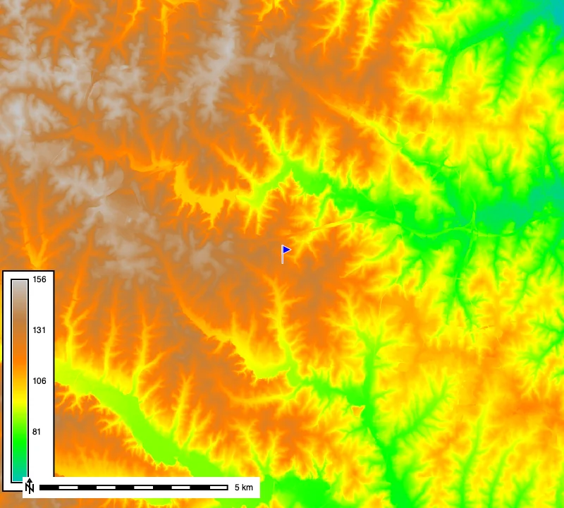
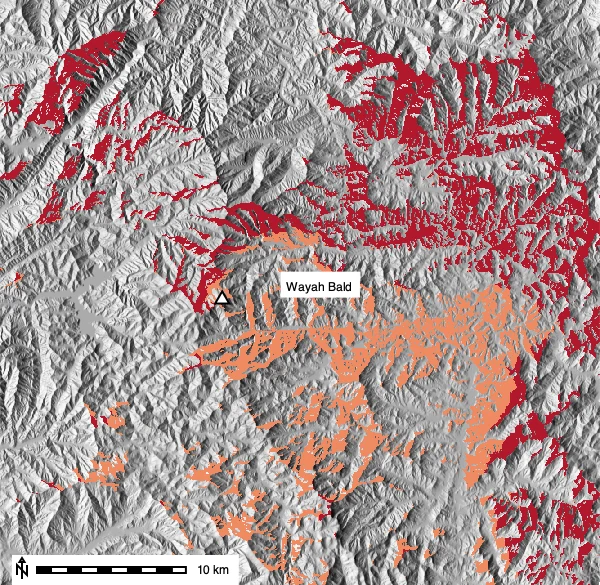
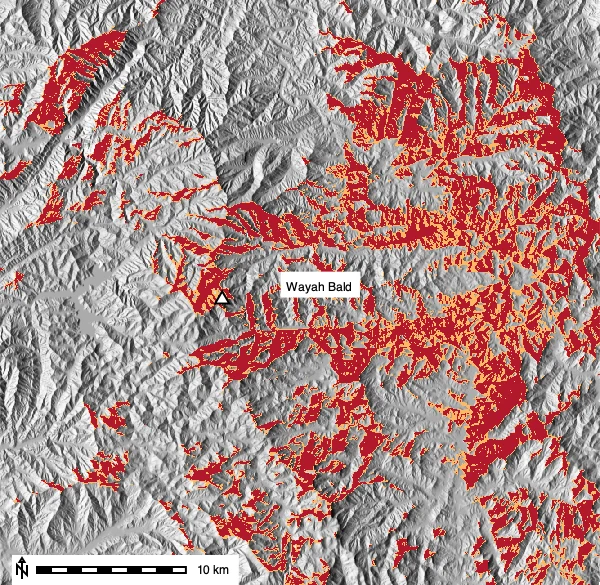
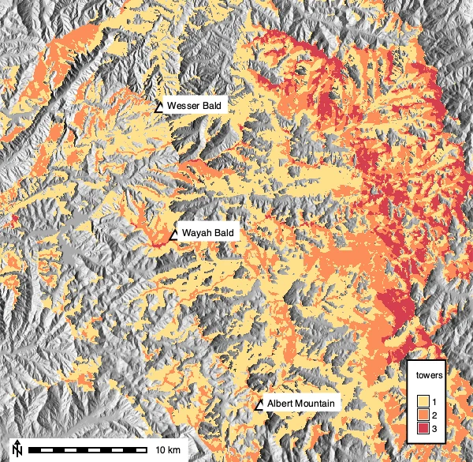
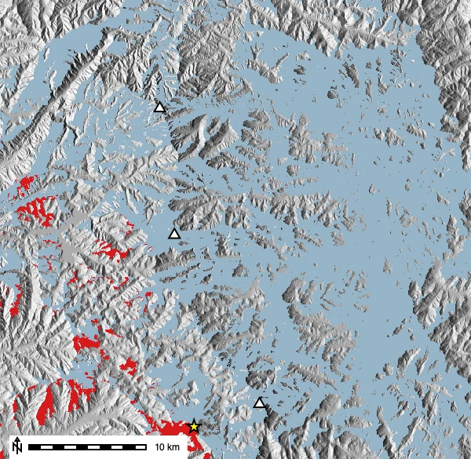

# Introduction

For much of the twentieth century, wildfires in the United States were spotted by
people. Lookouts climbed towers on high summits and scanned the horizon for smoke,
because the earlier a fire is spotted, the easier it is to contain. Siting those
towers was a visibility problem: where should a tower go so it can see as much of the
forest as possible?

We can reconstruct that reasoning with GRASS. A viewshed is the area of terrain
visible from an observation point, computed by
[r.viewshed](https://grass.osgeo.org/grass-stable/manuals/r.viewshed.html) by tracing
lines of sight across a digital elevation model. Our study area is the Nantahala
National Forest in western North Carolina, where three historic lookout towers still
stand along the Appalachian Trail near the town of Franklin: Wayah Bald, Wesser Bald,
and Albert Mountain. Using them, we will answer four questions:

1. Why put the lookout on a tower instead of standing on the summit?
2. Does the curvature of the Earth matter at these distances?
3. How does a rising smoke column change what a tower can detect?
4. How much of the forest does the three-tower network cover, and where should a fourth tower go?



::: {.callout-note title="How to run this tutorial"}
The code uses the GRASS Python API in a Jupyter notebook. If you are new to running
GRASS from Python, see the
[Get started with GRASS & Python](https://grass-tutorials.osgeo.org/content/tutorials/get_started/fast_track_grass_and_python.html)
tutorial. Every step also works from the GRASS GUI or command line; use the tool name
(for example `r.viewshed`) with the same parameters.
:::

# Getting the elevation data

The towers are real places, so rather than use a prepackaged sample dataset we
download the terrain around them from the USGS. We create a new GRASS project in UTM
zone 17N (EPSG:32617) with
[create_project](https://grass.osgeo.org/grass-stable/manuals/libpython/script.html#script.core.create_project),
then fetch 1 arc-second (about 30 m) elevation from the USGS National Map with
[r.in.usgs](https://grass.osgeo.org/grass-stable/manuals/addons/r.in.usgs.html), an
add-on installed with
[g.extension](https://grass.osgeo.org/grass-stable/manuals/g.extension.html).

```{python}
import sys
import subprocess
from pathlib import Path

sys.path.append(
    subprocess.check_output(["grass", "--config", "python_path"], text=True).strip()
)

import grass.script as gs
import grass.jupyter as gj
from grass.tools import Tools

# Create the project once, then start a session in it
project = Path.home() / "nantahala"
if not project.exists():
    gs.create_project(project, epsg="32617")

session = gj.init(project)
tools = Tools()

tools.g_extension(extension="r.in.usgs")   # install the add-on (only needed once)
```

```{python}
# A ~40 x 39 km window over the Nantahala Mountains, at 30 m resolution
tools.g_region(n=3916000, s=3877000, w=252000, e=292000, res=30)

# Download and import the current National Elevation Dataset for this region
tools.r_in_usgs(product="ned", ned_dataset="ned1sec", output_name="elevation",
                memory=1000, nprocs=2)
tools.g_region(raster="elevation")
```

::: {.callout-note title="About the download"}
This downloads the current 1 arc-second NED tile for the area (about 58 MB) and takes
a couple of minutes, so the cell is not instant. Add `flags="i"` first to preview the
tiles and total size without downloading. USGS occasionally republishes its elevation
data, so the exact areas reported below may shift a little over time.
:::

::: {.callout-note title="GRASS version"}
The examples use the [grass.tools API](https://grass.osgeo.org/grass-stable/manuals/python_intro.html)
(the `Tools` class), introduced in GRASS 8.5. On earlier versions you can run the same
tools with `gs.run_command("r.viewshed", ...)`.
:::

# The study area

Let's place the three towers and look at the terrain they watch over. We enter their
coordinates (converted from the published latitude and longitude to UTM 17N) with
[v.in.ascii](https://grass.osgeo.org/grass-stable/manuals/v.in.ascii.html), reading
them straight from a text buffer with `StringIO`. We also record the height of each
tower's cab above the ground, then read the summit elevation from the DEM with
[v.what.rast](https://grass.osgeo.org/grass-stable/manuals/v.what.rast.html).

```{python}
import io

towers_csv = """266819,3896041,Wayah Bald,16
265577,3906808,Wesser Bald,9
274053,3881661,Albert Mountain,12"""

tools.v_in_ascii(
    input=io.StringIO(towers_csv), output="towers", separator="comma",
    columns="x double precision, y double precision, name varchar(20), tower_m integer",
    x=1, y=2,
)
tools.v_what_rast(map="towers", raster="elevation", column="base_elev")
print(tools.v_db_select(map="towers").text)
```

The summits stand well above the surrounding valleys, from about 1400 m at Wesser Bald
to 1630 m at Wayah Bald. We render a shaded-relief base with
[r.relief](https://grass.osgeo.org/grass-stable/manuals/r.relief.html), drape the
elevation colors over it with
[r.shade](https://grass.osgeo.org/grass-stable/manuals/r.shade.html), and add the
towers. A small helper labels each tower with
[d.text](https://grass.osgeo.org/grass-stable/manuals/d.text.html) just to the right of
its position in the current region.

```{python}
tools.r_relief(input="elevation", output="relief", zscale=1.5)
tools.r_colors(map="elevation", color="elevation")
tools.r_shade(shade="relief", color="elevation", output="shaded_elev", brighten=30)

def label_towers(m, only=None):
    """Write each tower's name on map m, offset to the right of its marker."""
    r = tools.g_region(flags="g").keyval
    w, e, s, n = float(r["w"]), float(r["e"]), float(r["s"]), float(r["n"])
    for rec in tools.v_db_select(map="towers", format="json")["records"]:
        if only and rec["name"] not in only:
            continue
        x_pct = (rec["x"] - w) / (e - w) * 100
        y_pct = (rec["y"] - s) / (n - s) * 100
        m.d_text(text=rec["name"], at=(x_pct + 2.2, y_pct - 0.9), color="black",
                 size=2.8, bgcolor="white")

study = gj.Map(width=600)
study.d_rast(map="shaded_elev")
study.d_vect(map="towers", icon="basic/triangle", size=12,
             fill_color="white", color="black", width=2)
label_towers(study)
study.d_legend(raster="elevation", at=(5, 35, 90, 93), flags="b", fontsize=14, title="m")
study.d_barscale(flags="n", at=(2, 6), bgcolor="white", fontsize=13)
study.show()
```

# Why build a tower? Observer height

A lookout standing on Wayah Bald sees a certain area; the same lookout in the tower
cab sees more, because height clears the nearest ridges. The `observer_elevation`
parameter sets the eye height above the ground, and the `-b` flag returns a boolean
map where 1 means visible. Historic lookouts were expected to watch a radius of
roughly 20 miles, so we cap the search at `max_distance=32000` (32 km) and, at that
range, apply Earth-curvature correction with `-c` (see the note below).

```{python}
WAYAH = (266819, 3896041)

# A person standing on the summit (eye height 1.75 m)
tools.r_viewshed(input="elevation", output="wayah_ground", coordinates=WAYAH,
                 observer_elevation=1.75, max_distance=32000, flags="cb", memory=2000)

# The same lookout in the 16 m tower cab
tools.r_viewshed(input="elevation", output="wayah_tower", coordinates=WAYAH,
                 observer_elevation=16, max_distance=32000, flags="cb", memory=2000)
```

[r.report](https://grass.osgeo.org/grass-stable/manuals/r.report.html) gives the area
of each class in a viewshed. Category 1 is the visible area; here it grows from about
165 km² at ground level to 277 km² from the tower.

```{python}
print(tools.r_report(map="wayah_ground", units="k", flags="n").text)
print(tools.r_report(map="wayah_tower", units="k", flags="n").text)
```

That is nearly 70% more visible area for 16 m of extra height, which is what made the
towers worth building. We draw the ground-level viewshed in dark red and the extra
area the tower adds in orange, zooming in around Wayah Bald.

```{python}
tools.r_mapcalc(expression="ground_vis = if(wayah_ground == 1, 1, null())")
tools.r_mapcalc(expression="tower_gain = if(wayah_tower == 1 && wayah_ground == 0, 1, null())")
tools.r_colors(map="ground_vis", rules=io.StringIO("1 178:24:43"))
tools.r_colors(map="tower_gain", rules=io.StringIO("1 239:138:98"))

# Save a closer view around Wayah Bald for this and the next map
tools.g_region(n=3908000, s=3884000, w=252000, e=284000, res=30, save="wayah_zoom")
tools.g_region(raster="elevation")   # keep the full region for analysis

height_map = gj.Map(width=600, saved_region="wayah_zoom")
height_map.d_rast(map="relief")
height_map.d_rast(map="tower_gain")
height_map.d_rast(map="ground_vis")
height_map.d_vect(map="towers", where="name='Wayah Bald'", icon="basic/triangle",
                  size=12, fill_color="white", color="black", width=2)
label_towers(height_map, only=["Wayah Bald"])
height_map.d_barscale(flags="n", at=(2, 6), bgcolor="white", fontsize=13)
height_map.show()
```



::: {.callout-tip title="Does Earth curvature matter here?"}
Over tens of kilometers, the curve of the Earth drops distant terrain below the line
of sight. `r.viewshed` corrects for this with the `-c` flag. Rerunning the tower
viewshed without `-c` reports about 282 km² instead of 277 km², an overestimate of
roughly 2%. The effect is small here because visibility in these steep mountains is
limited by intervening ridges rather than by the horizon; over flat land or water at
the same range the correction matters much more. Atmospheric refraction, which bends
light back down slightly, is a separate effect enabled by the `-r` flag with
`refraction_coeff`; we leave it off.
:::

# Seeing smoke, not ground

A lookout watches for smoke rising above the canopy, not for the forest floor. A
column of smoke a few meters tall can clear a ridge that hides the ground behind it.
`r.viewshed` models this with `target_elevation`, the height of the target above the
ground. We set it to 15 m, a modest smoke column.

```{python}
tools.r_viewshed(input="elevation", output="wayah_smoke", coordinates=WAYAH,
                 observer_elevation=16, target_elevation=15, max_distance=32000,
                 flags="cb", memory=2000)

print(tools.r_report(map="wayah_smoke", units="k", flags="n").text)
```

Allowing for a 15 m smoke column raises the detectable area from 277 km² to about
412 km², nearly 50% more. In the map below the dark red is the tower's full terrain
view (the 277 km² baseline) and orange is the extra area where the ground is hidden
but a 15 m smoke column would still be visible.

```{python}
tools.r_mapcalc(expression="terrain_vis = if(wayah_tower == 1, 1, null())")
tools.r_mapcalc(expression="smoke_gain = if(wayah_smoke == 1 && wayah_tower == 0, 1, null())")
tools.r_colors(map="terrain_vis", rules=io.StringIO("1 178:24:43"))
tools.r_colors(map="smoke_gain", rules=io.StringIO("1 253:184:99"))

smoke_map = gj.Map(width=600, saved_region="wayah_zoom")
smoke_map.d_rast(map="relief")
smoke_map.d_rast(map="smoke_gain")
smoke_map.d_rast(map="terrain_vis")
smoke_map.d_vect(map="towers", where="name='Wayah Bald'", icon="basic/triangle",
                 size=12, fill_color="white", color="black", width=2)
label_towers(smoke_map, only=["Wayah Bald"])
smoke_map.d_barscale(flags="n", at=(2, 6), bgcolor="white", fontsize=13)
smoke_map.show()
```



# The tower network

One tower leaves gaps. Towers with overlapping views fill in each other's blind spots.
We loop over the three towers, compute a smoke-detection viewshed for each using its
own cab height, and add the boolean maps with
[r.series](https://grass.osgeo.org/grass-stable/manuals/r.series.html). The sum tells
us how many towers can detect a fire at each cell.

```{python}
towers = tools.v_db_select(map="towers", format="json")["records"]

detection_maps = []
for t in towers:
    name = t["name"].split()[0].lower()   # wayah, wesser, albert
    out = f"detect_{name}"
    tools.r_viewshed(input="elevation", output=out, coordinates=(t["x"], t["y"]),
                     observer_elevation=t["tower_m"], target_elevation=15,
                     max_distance=32000, flags="cb", memory=2000)
    detection_maps.append(out)

# r.series sums to a floating-point map; make it integer so the classes are 1, 2, 3
tools.r_series(input=detection_maps, output="coverage_sum", method="sum")
tools.r_mapcalc(expression="coverage = int(coverage_sum)")
tools.r_null(map="coverage", setnull=0)   # drop cells that are not seen by any tower
```

How much of the forest does the network cover?
[r.report](https://grass.osgeo.org/grass-stable/manuals/r.report.html) returns
per-class areas, and its JSON output turns into a tidy table with pandas.

```{python}
import pandas as pd

report = tools.r_report(map="coverage", units=["k", "p"], format="json")
rows = []
for cat in report["categories"]:
    if cat["category"] not in (1, 2, 3):   # skip any no-data class
        continue
    area = next(u["value"] for u in cat["units"] if "kilo" in u["unit"])
    pct = next(u["value"] for u in cat["units"] if u["unit"] == "percent")
    rows.append({"seen by (towers)": cat["category"],
                 "area (km²)": round(area, 1), "share of region": f"{pct:.1f}%"})
pd.DataFrame(rows)
```

| seen by (towers) | area (km²) | share of region |
|---|---|---|
| 1 | 416.4 | 26.7% |
| 2 | 214.8 | 13.7% |
| 3 | 61.1 | 3.9% |

The three towers together watch about 692 km², or 44% of this 1,562 km² region. Only
4% is covered by all three at once, along the central ridges where their circles
overlap. We map the coverage with one color per level.

```{python}
tools.r_colors(map="coverage", rules=io.StringIO("1 254:224:139\n2 252:141:89\n3 213:62:79"))

coverage_map = gj.Map(width=600)
coverage_map.d_rast(map="relief")
coverage_map.d_rast(map="coverage")
coverage_map.d_vect(map="towers", icon="basic/triangle", size=12,
                    fill_color="white", color="black", width=2)
label_towers(coverage_map)
coverage_map.d_legend(raster="coverage", at=(5, 20, 90, 93), flags="b",
                      use=[1, 2, 3], fontsize=14, title="towers")
coverage_map.d_barscale(flags="n", at=(2, 6), bgcolor="white", fontsize=13)
coverage_map.show()
```



# Where should a fourth tower go?

The gap map turns "where should a new tower go?" into a computation. A natural
candidate is the highest summit that no current tower can see, since high ground has
the best chance of a long view. We isolate the blind area, find its highest cell with
[r.stats](https://grass.osgeo.org/grass-stable/manuals/r.stats.html), and test a tower
there.

```{python}
# cells no tower currently see, and their elevation
tools.r_mapcalc(expression="blind = if(isnull(coverage), 1, null())")
tools.r_mapcalc(expression="blind_elev = if(isnull(coverage), elevation, null())")

# coordinates of the highest blind cell
cells = tools.r_stats(input="blind_elev", flags="gn", format="json").json
peak = max(cells, key=lambda c: c["categories"][0]["category"])
cx, cy, cz = peak["east"], peak["north"], peak["categories"][0]["category"]
print(f"highest blind summit: ({cx:.0f}, {cy:.0f}), {cz:.0f} m")

# what a 12 m tower there would detect, and how much of the blind area it recovers
tools.r_viewshed(input="elevation", output="detect_new", coordinates=(cx, cy),
                 observer_elevation=12, target_elevation=15, max_distance=32000,
                 flags="cb", memory=2000)
tools.r_mapcalc(expression="recovered = if(isnull(coverage) && detect_new == 1, 1, null())")

print(tools.r_report(map="blind", units="k", flags="n").text)
print(tools.r_report(map="recovered", units="k", flags="n").text)
```

The best-placed new tower recovers only about 28 km² of the 870 km² blind area, less
than 4% of it. The gap map shows why: what remains unseen is mostly the valley bottoms
between the ridges, and no ridgetop tower can see down into a ravine. Beyond a handful
of well-sited towers, adding more brings sharply diminishing returns. Fire agencies
eventually turned to aircraft patrols and, later, camera and satellite detection for
exactly this reason.

```{python}
tools.r_mapcalc(expression="covered_now = if(!isnull(coverage), 1, null())")
tools.r_colors(map="covered_now", rules=io.StringIO("1 150:180:200"))
tools.r_colors(map="recovered", rules=io.StringIO("1 215:25:28"))
tools.v_in_ascii(input=io.StringIO(f"{cx:.0f},{cy:.0f}"), output="candidate",
                 separator="comma", columns="x double precision, y double precision",
                 x=1, y=2)

site_map = gj.Map(width=600)
site_map.d_rast(map="relief")
site_map.d_rast(map="covered_now")
site_map.d_rast(map="recovered")
site_map.d_vect(map="towers", icon="basic/triangle", size=12,
                fill_color="white", color="black", width=2)
site_map.d_vect(map="candidate", icon="basic/star", size=18,
                fill_color="yellow", color="black", width=2)
site_map.d_barscale(flags="n", at=(2, 6), bgcolor="white", fontsize=13)
site_map.show()
```



# Summary

We have used
[r.viewshed](https://grass.osgeo.org/grass-stable/manuals/r.viewshed.html) on USGS
elevation data to answer the four questions from the introduction:

- A 16 m tower sees nearly 70% more terrain than a person standing on the same summit
  (`observer_elevation`).
- Earth curvature (`-c`) is a small correction in this rugged terrain, where ridges
  rather than the horizon limit the view.
- A rising smoke column (`target_elevation`) can be detected over far more ground than
  is directly visible.
- Three towers cover 44% of the forest, and the gaps that remain are valleys where
  even a well-placed fourth tower gains little.

To combine visibility with routes across the terrain, see
[Modeling Movement in GRASS](../modeling_movement/GRASS_movement.qmd).
