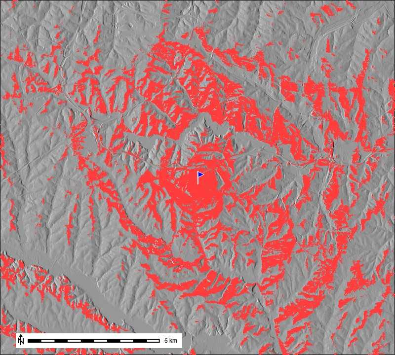
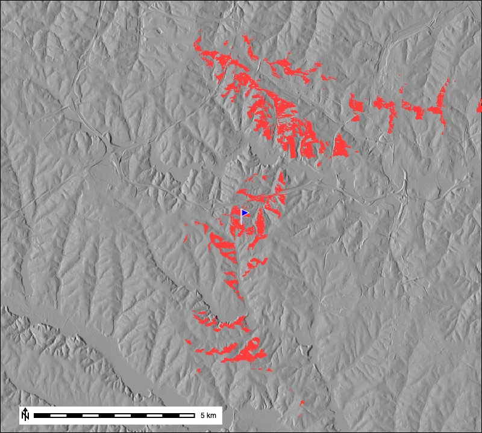
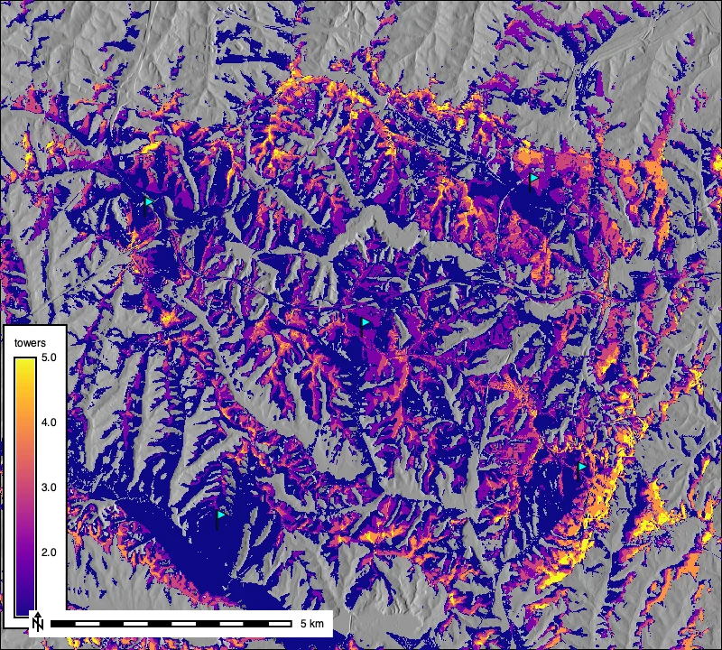

# Introduction

A **viewshed** is the area of terrain that is visible from one or more observation
points. Answering "what can I see from here?" — or, equivalently, "from where can
this be seen?" — is a classic terrain analysis with many practical uses:

- siting communication or observation towers so they cover the most ground,
- planning fire lookouts and surveillance,
- assessing the visual impact of wind turbines, buildings, or quarries,
- modeling line-of-sight for radio links, and
- reconstructing what was visible from archaeological sites.

In this tutorial we use [r.viewshed](https://grass.osgeo.org/grass-stable/manuals/r.viewshed.html)
to compute visibility from a digital elevation model (DEM). We start with a single
observer, see how **observer height** and **maximum distance** change the result,
and finish by combining several viewsheds into a **cumulative visibility** map.



::: {.callout-note title="Demo dataset"}
This tutorial uses the standard GRASS
[North Carolina sample dataset](https://grass.osgeo.org/sampledata/north_carolina/nc_spm_08_grass7.zip)
(`nc_spm_08_grass7`) and its 10 m `elevation` DEM. You can follow along with any
DEM by substituting your own raster.
:::

::: {.callout-note title="How to run this tutorial"}
The code below uses the GRASS Python API in a Jupyter notebook. If you are new to
running GRASS from Python, see the
[Get started](https://grass-tutorials.osgeo.org/content/tutorials/get_started/fast_track.html)
tutorials to set up an environment. Every step also works from the GRASS GUI or
command line — just use the tool name (for example `r.viewshed`) with the same
parameters.
:::

::: {.callout-note title="GRASS version"}
The examples use the [grass.tools API](https://grass.osgeo.org/grass-stable/manuals/python_intro.html)
(the `Tools` class), introduced in GRASS 8.5. On earlier versions you can run the
same tools with `gs.run_command("r.viewshed", ...)`.
:::

# Setup

Start a GRASS session in the North Carolina project and set the
[computational region](https://grass.osgeo.org/grass-stable/manuals/g.region.html)
to match the `elevation` DEM. The region controls the extent and resolution of every
raster operation that follows.

```{python}
import sys
import subprocess

# Make the GRASS Python packages importable
sys.path.append(
    subprocess.check_output(["grass", "--config", "python_path"], text=True).strip()
)

import grass.script as gs
import grass.jupyter as gj
from grass.tools import Tools

# Point this at your GRASS database
session = gj.init("~/grassdata", "nc_spm_08_grass7", "PERMANENT")
tools = Tools()

# Work at the resolution and extent of the elevation DEM
tools.g_region(raster="elevation")
```

Let's look at the study area. We apply the `elevation` color table and mark the
observation point we will use — a small rise near the middle of the DEM at
easting 637500, northing 221500.

```{python}
tools.r_colors(map="elevation", color="elevation")

# Create a vector point for the observer
gs.write_command(
    "v.in.ascii", input="-", output="observer", separator="comma",
    stdin="637500,221500",
)

elevation_map = gj.Map(width=800)
elevation_map.d_rast(map="elevation")
elevation_map.d_vect(map="observer", icon="basic/marker", size=26,
                     fill_color="blue", color="white")
elevation_map.d_legend(raster="elevation", at=(5, 45, 2, 5), flags="b")
elevation_map.d_barscale(flags="n", at=(4, 6))
elevation_map.show()
```


# A first viewshed

[r.viewshed](https://grass.osgeo.org/grass-stable/manuals/r.viewshed.html) computes,
for a single observer, which cells of the DEM are visible. We pass the DEM, the
observer `coordinates`, and an `observer_elevation` — the height of the viewer's eye
above the ground (1.75 m is a standing person). The `-b` flag returns a simple
**boolean** result: `1` where the cell is visible and `0` where it is not.

```{python}
tools.r_viewshed(
    input="elevation",
    output="viewshed",
    coordinates=(637500, 221500),
    observer_elevation=1.75,
    flags="b",
)
```

To display only the visible area, we set the non-visible cells to null and drape the
result over a shaded relief map made with
[r.relief](https://grass.osgeo.org/grass-stable/manuals/r.relief.html).

```{python}
tools.r_relief(input="elevation", output="relief")

# Keep visible cells (value 1), drop the rest
tools.r_mapcalc(expression="visible = if(viewshed == 1, 1, null())")
gs.write_command("r.colors", map="visible", rules="-", stdin="1 red")

viewshed_map = gj.Map(width=800)
viewshed_map.d_rast(map="relief")
viewshed_map.d_rast(map="visible")
viewshed_map.d_vect(map="observer", icon="basic/marker", size=26,
                    fill_color="blue", color="white")
viewshed_map.d_barscale(flags="n", at=(4, 6))
viewshed_map.show()
```



From ground level the observer can see roughly **6.4 km²**. Notice how visibility
follows the terrain: ridge crests that share a line of sight light up, while the
valleys between them are blocked. You can quantify the visible area with
[r.stats](https://grass.osgeo.org/grass-stable/manuals/r.stats.html):

```{python}
# Cell counts for each value (each cell is 10 x 10 m = 100 m²)
print(tools.r_stats(input="viewshed", flags="c").stdout)
```

# The effect of observer height

Raising the observer dramatically increases what can be seen — this is exactly why
lookout towers exist. Let's put the observer on a 40 m tower by changing
`observer_elevation`.

```{python}
tools.r_viewshed(
    input="elevation",
    output="viewshed_tower",
    coordinates=(637500, 221500),
    observer_elevation=40,
    flags="b",
)
tools.r_mapcalc(expression="visible_tower = if(viewshed_tower == 1, 1, null())")
gs.write_command("r.colors", map="visible_tower", rules="-", stdin="1 red")

tower_map = gj.Map(width=800)
tower_map.d_rast(map="relief")
tower_map.d_rast(map="visible_tower")
tower_map.d_vect(map="observer", icon="basic/marker", size=26,
                 fill_color="blue", color="white")
tower_map.d_barscale(flags="n", at=(4, 6))
tower_map.show()
```


The same location now sees about **46.6 km²** — a sevenfold increase — because the
extra height clears many of the low ridges that blocked the ground-level view. If
you are modeling visibility *of* a target of known height (say, whether a 30 m
turbine is visible), use the `target_elevation` parameter instead of, or in addition
to, `observer_elevation`.

# Limiting the search distance

By default `r.viewshed` searches the entire region. Real observers, however, have a
practical range — the reach of a radio, the resolution of the eye, or a study area
boundary. The `max_distance` parameter (in map units, here meters) restricts the
analysis to a radius around the observer, which also speeds up the computation.

```{python}
tools.r_viewshed(
    input="elevation",
    output="viewshed_3km",
    coordinates=(637500, 221500),
    observer_elevation=40,
    max_distance=3000,
    flags="b",
)
tools.r_mapcalc(expression="visible_3km = if(viewshed_3km == 1, 1, null())")
gs.write_command("r.colors", map="visible_3km", rules="-", stdin="1 red")

dist_map = gj.Map(width=800)
dist_map.d_rast(map="relief")
dist_map.d_rast(map="visible_3km")
dist_map.d_vect(map="observer", icon="basic/marker", size=26,
                fill_color="blue", color="white")
dist_map.d_barscale(flags="n", at=(4, 6))
dist_map.show()
```


Within 3 km, about **11.4 km²** is visible. The crisp circular edge is the distance
limit; everything beyond it is excluded even where the terrain would otherwise be in
view.

::: {.callout-tip title="Long-distance viewsheds"}
For viewsheds spanning many kilometers, add the `-c` flag to account for the
curvature of the Earth (and atmospheric `refraction_coeff` for the bending of
light). Ignoring curvature overestimates what is visible at long range.
:::

# Cumulative visibility from several sites

A common planning question is not "what can one site see?" but "how well does a
*network* of sites cover the landscape?" We can answer this by computing a viewshed
for each candidate site and adding them together. The result — a **cumulative
viewshed** — counts how many sites can see each cell.

Here we place five towers across the area and loop over them.

```{python}
towers = [
    (633000, 224000),
    (641000, 224500),
    (634500, 217500),
    (642000, 218500),
    (637500, 221500),
]

viewshed_maps = []
for i, (x, y) in enumerate(towers, start=1):
    name = f"tower_{i}"
    tools.r_viewshed(
        input="elevation",
        output=name,
        coordinates=(x, y),
        observer_elevation=40,
        flags="b",
    )
    viewshed_maps.append(name)
```

Each boolean viewshed contributes a `1` where it is visible, so summing them with
[r.series](https://grass.osgeo.org/grass-stable/manuals/r.series.html) gives the
number of towers that see each cell. We drop cells seen by no tower.

```{python}
tools.r_series(input=viewshed_maps, output="cumulative", method="sum")
tools.r_mapcalc(expression="cumulative = if(cumulative == 0, null(), cumulative)")
tools.r_colors(map="cumulative", color="plasma")
```

To show the towers on the map, load them as a single vector layer.

```{python}
towers_csv = "\n".join(f"{x},{y}" for x, y in towers)
gs.write_command("v.in.ascii", input="-", output="towers",
                 separator="comma", stdin=towers_csv)

cumulative_map = gj.Map(width=800)
cumulative_map.d_rast(map="relief")
cumulative_map.d_rast(map="cumulative")
cumulative_map.d_vect(map="towers", icon="basic/marker", size=22,
                      fill_color="cyan", color="black")
cumulative_map.d_legend(raster="cumulative", at=(5, 45, 2, 5), flags="b",
                        title="towers")
cumulative_map.d_barscale(flags="n", at=(4, 6))
cumulative_map.show()
```



Cells range from being seen by a single tower (dark purple) up to all five (bright
yellow). This kind of map is the starting point for **site optimization**: you can
compare tower layouts, spot redundant coverage, and find the gaps that no site can
see.

# Summary

You have used [r.viewshed](https://grass.osgeo.org/grass-stable/manuals/r.viewshed.html) to:

- compute a single-observer viewshed and measure the visible area,
- see how **observer height** and **maximum distance** reshape visibility,
- combine several viewsheds into a **cumulative visibility** map.

From here you might explore the exact-angle output of `r.viewshed` (omit the `-b`
flag to get the vertical angle to each visible cell), correct for Earth curvature on
larger DEMs, or combine visibility with the
[Modeling Movement in GRASS](../modeling_movement/GRASS_movement.qmd) tutorial to
weight routes by how exposed they are. To learn more about working with terrain, see
[Visualizing and Modeling Terrain from DEMs in GRASS](../terrain_and_DEMs/GRASS_terrain.qmd).
